# HTML 常见的元素

## 完整的 HTML 结构

- **一个完整的 HTML 解构包括哪几个部分呢?**
- ==文档声明==
- ==html 元素==
  - head 元素
  - body 元素

## 文档声明

- HTML 最上方的一段文本我们称之为**文档类型声明,**用于声明**文档类型**

- ==\< !DOCTYPE html>==
  - HTML 文档声明,告诉浏览器当前页面时==HTML5 页面==
  - 让浏览器用==HTML5 的标准去解析识别==内容
  - 必须==放在 HTML 文档的最前面,不能省略==,省略了会出现兼容性问题
- HTML5 的文档声明比 HTML4.01、XHTML 1.0 简洁非常多(了解即可)

## html 元素

- < html>元素表示一个 HTML 文档的**根**(顶级元素),所以它也被称为**根元素**
  - 所有其他元素必须是==此元素的后代==

- W3C 标准建议为 html 增加一个**lang 属性**,作用是
  - 帮助==语音合成工具==确定要使用的发音
  - 帮助==翻译工具==确定要使用的翻译规则
- **比如常用的规则:**
  - ==lang= "en"==表示这个 HTML 文档的语言是英文
  - ==lang= "zh-CN"== 表示这个 HTML 文档的语言是中文

## head 元素

- **HTML head 元素**规定文档相关的 **配置信息** **(也称之为元数据),** 包括==文档的标题==,==引用的文档样式==和==脚本==等
  - 什么是元数据( meta data ),是描述数据的数据
  - 这里我们可以理解成对==整个页面的配置:==

- **常见的设置有哪些呢?一般会至少包含如下 2 个设置**
- 网页的标题:==title 元素==

- 网页的编码:==meta 元素==
  - 可以用于设置网页的==字符编码==,让浏览器精准地显示每一个文字,==不设置或者设置错误会导致乱码==
  - 一般都使用==utf-8 编码==,涵盖了世界上几乎所有的文字

## body 元素

- body 元素里面的内容将是**浏览器窗口中看到的东西,**也就是**网页的具体内容和结构**
  - 之后学习的==大部分 HTML 元素都是在 body 中编写==呈现的

## HTML 元素

- HTML 元素本身很多,但是**常用的元素就是那么几个**
  - [HTML 元素参考 - HTML（超文本标记语言） | MDN (mozilla.org)](https://developer.mozilla.org/zh-CN/docs/Web/HTML/Element)
  - 我们只需要记住==常用的==,不常用的学会查看文档即可
- **常用的元素**(暂时掌握下面几个就够了,90%的时间都写这几个)
  - p 元素、h 元素
  - img 元素、a 元素、iframe 元素
  - div 元素、span 元素
- **下阶段学习的元素**
  - ul、ol、li 元素
  - button 元素、input 元素
  - table、thead、tbody、thead、th、tr、td
- **HTML5 新增元素(后续学习)**

## 案例分析-使用什么元素

## 常见的元素-h 元素

- 在一个页面中通常会有一些**比较==重要的文字==作为标题**,这个时候我们可以使用==h 元素==
- \< h1>-\< h6>标题(Heading)元素呈现了六个不同的级别的标题
- Heading 是头部的意思,通常会用来做标题
- \< h1>级别最高,而\< h6>级别最低

- 注意:**h 元素通常和 SEO 优化有关系**(什么是 SE0,后续再介绍)

## 常见元素-p 元素

- 如果我们想**表示一个==段落==**,这个时候可以使用==p 元素==
- **HTML**\< p>元素(或者说 HTML 段落元素) 表示**文本的一个段落**
  - ==p 元素==是 paragraph 单词的缩写,是==段落、分段==的意思
  - ==p 元素==多个段落之间会有一定的间距

## 案例练习

## 常见元素-img 元素

- 我们应该告诉浏览器来**显示一张图片**呢?使用==img 元素==
- **HTML\< img>元素**将==一份图像嵌入文档==
  - img 是 image 单词的缩写,是==图像==的意思
  - 事实上 img 是一个==可替换元素== ==( replaced element )==
- **img 有两个常见的属性:**
  - ==src 属性==:source 单词缩写,表示源
    - 是**必须的**,它包含了你像嵌入的图片的文件路径
  - ==alt 属性==:不是强制性的,有两个作用
    - 作用一:当图片加载不成功 (错误的地址或者图片资源不存在),那么会显示这段文本
    - 作用二:屏幕阅读器会将这些描述读给需要使用阅读器的读者听,让他们知道图像的含义

## img 元素-图片的路径

- **设置 img 的 src 时,需要给图片设置路径:**
  - **==网络图片==**:一个 URL 地址 (后续会专门讲 URL)
    - 网络图片的设置非常简单,给一个地址即可
  - **==本地图片==**:本地电脑上的图片,后续会和 html 一起部署到服务
- **本地图片的路径有两种方式:**
  - 方式一:==绝对路径== (几乎不用)
    - 从电脑的根目录开始一直找到资源的路径

- 方式二:==相对路径==(常用)
  - 相当于当前文件的一个路径
  - ==.==代表当前文件(1 个==.==),可以省略
  - ==..==代表上级文件夹(2 个==.==)
- 对于网页来说,不管什么操作系统( Windows、Mac、Linux ),路径分隔符都是==/==,而不是==\\==

## img 元素 - 图片格式

- **img 元素支持的图片格式非常多**

## 常见元素- a 元素

- 在网页中我们经常需要**跳转到另外一个链接,**这个时候我们使用**a 元素**
- **HTML\< a>元素**(或称锚(anchor)元素)
  - 定义==超链接==,用于==打开新的 URL==
- **a 元素有两个常见的属性:**
  - ==href==:Hypertext Reference 的简称
    - 指定要打开的 URL 地址
    - 也可以是一个本地地址
  - ==target==:该属性指定在何处显示链接的资源
    - \_self:默认值,在当前窗口打开 URL
    - \_blank:在一个新的窗口中打开 URL
    - 其他不常用,后面 iframe 可以讲一下

## a 元素- 锚点链接

- 锚点链接可以实现:跳转到**网页中的具体位置**
- **锚点链接有两个重要步骤:**
  - 在要跳转到的元素上==定义一个 id 属性==
  - 定义==a 元素==,并且 a 元素的==href 指向对应的 id==

## a 元素-图片链接

- 在很多网站我们会发现==图片==也是可以点击==进行跳转==的
  - ==img 元素跟 a 元素==一起使用,可以实现==图片链接==

- **实现思路:**
  - a 元素中不存放文字,而是==存放一个 img 元素==
  - 也就是 img 元素是 a 元素的内容

## a 元素-其他 URL 地址

- **a 元素一定是用来跳转到新网页的么?**

## iframe 元素

- 利用 iframe 元素可以实现:在一个 HTML 文档中嵌入其他 HTML 文档
- frameborder 属性
  - 用于规定是否显示边框
  - 1:显示
  - 0:不显示
- a 元素 target 的其他值:
  - \_parent:在父窗口中打开 URL
  - \_top:在顶层窗口中打开 URL

## div 元素、span 元素的历史

- 在 HTML 中**有两个特殊的元素 div 元素、span 元素**
  - ==div 元素==:divsion,分开、分配的意思
  - ==span 元素==:跨域、涵盖的意思
- **这两个元素有什么作用呢?**==无所用、无所不用==
- **产生的历史:**
  - 网页的发展早期时==没有 css==,这个时候我们必须通过==语义化元素==来告知浏览器一段文字如何显示
  - 后来==出现了 css==,==结构和样式需要分离==,这个时候==html 只需要负责结构==即可
  - 比如 h1 元素可以是一段==普通的文本+CSS 修改样式==
  - 这个时候就出现了==div、span 来编写 HTML 结构所有的结构,样式都交给 css 来处理==
- **所以,理论上来说:**
  - 我们的页面可以==没有 div、span==
  - 我们的页面也可以==全部都是 div、span==

## div 元素、span 元素的区别

- 这个时候有一个问题:**我出现一个不就可以了吗?**
- div 元素和 span 都是 **"纯粹的"容器**,也可以把他们理解成 **"盒子"**,它们都是用来**包裹内容**
  - **div 元素:**多个 div 元素包裹的内容会在==不同的行==显示
    - 一般作为其他元素的父容器,把其他元素包住,代表一个整体
    - 用于把网页分割为多个独立的部分
  - **span 元素:**多个 span 元素包裹的内容会==在同一行==显示
    - 默认情况下,跟普通的文本几乎没差别
    - 用于区分特殊文本和普通文本,比如用来显示一些关键字

## 不常用元素

- **strong 元素:**内容加粗、强调;
  - 通常加粗会使用 css 样式来完成
  - 开发中偶尔会使用一下
- **i 元素:内容倾斜**
  - 通常斜体会使用 css 样式来完成
  - 开发中偶尔会用它来做字体图标 ( 因为看起来像是 icon 的缩写 )
- **code 元素:**用于显示代码
  - 偶尔会使用用来显示等宽字体
- **br 元素**:换行元素

  - 开发中已经不使用

- 更多元素详解,查看 MDN 文档
  - [HTML 元素参考 - HTML（超文本标记语言） | MDN (mozilla.org)](https://developer.mozilla.org/zh-CN/docs/Web/HTML/Element)

## HTML 全局属性

- 我们发现**某些属性只能设置在特定的元素**中
  - 比如 img 元素的 src、a 元素的 href
- **也有一些属性是所有 HTML 都可以设置和拥有的**,这样的属性我们称之为 **全局属性( Global Attributes )**

  - 全局属性有很多[全局属性 - HTML（超文本标记语言） | MDN (mozilla.org)](https://developer.mozilla.org/zh-CN/docs/Web/HTML/Global_attributes)

- **常见的全局属性如下:**
  - ==id==:定义唯一标识符(ID),该标识符在整个文档中必须是唯一的。其目的是在链接(使用片段标识符),脚本或样式(使用 css)时标识元素
  - ==class==:一个以空格分隔的元素的类名(classes)列表,它允许 CSS 和 javaScript 通过类选择器或者 DOM 方法来选择和访问特定的元素
  - ==style==:给元素添加内联样式
  - ==title==:包含表示与其所属元素相关信息的文本。这些信息通常可以作为提示呈现给用户,但不是必须的

# 额外知识补充

## 字符实体

- 思考: **我们编写的 HTML 代码会被浏览器解析**
- 如下代码**如何被解析**的呢?
  - 如果你使用小于号(< ),浏览器会将其后的文本解析为一个 tag
  - 但是某些情况下,我们确实需要编写一个小于号(< )
  - 这个时候我们就可以使用==字符实体==

- HTML 字符实体是一段以**连字号(&)开头、以分号(;)结尾的文本**(字符串)
  - 实体常常用于显示==保留字符== ( 这些字符会被解析为 HTML 代码 )和==不可见的字符== (如 "不换行空格 ")
  - 你也可以用实体来代替==其他难以标准键盘键入的字符==

## 常见的字符实体

## 认识 URL

- **URL 代表着是统一资源定位符( Uniform Resource Locator )**
- **通俗点说:**URL 无非就是一个给定的独特资源在 Web 上的地址
  - 理论上说,每个有效的 URL 都指向一个唯一的资源
  - 这个资源可以是一个 HTML 页面,一个 CSS 文档,一副图像,等等

## URL 的格式

- URL 的标准格式如下:

## 和 URI 的区别

- **和 URI 的区别:**
  - URI = Uniform Resource Identifier 统一资源**标识符**,用于标识==Web 技术使用的逻辑或物理资源==
  - URL = Uniform Resource Locator 统一资源**定位符**,俗称==网络地址==,相当于==网络中的门牌号==
- **URI 在某一个规则下能把一个资源独一无二的识别出来**

  - URL 作为一个网络 Web 资源的地址,可以唯一将一个资源识别出来,所以 URL 是一个 URI
  - 所以 URL 是 URI 的一个子集
  - 但是 URI 并不一定是 URL

- **ocators are also identifiers**,so every URL is also a URI, but there are URIs which are not URLs

## 元素的语义化

- 元素的语义化:用正确的元素做正确的事情
- 理论上来说,所有的 HTML 元素,我们都能实现相同的事情

- 标签语义化的好处
  - 方便代码维护
  - 减少让开发者之间的沟通成本
  - 能让语音合成工具正确识别网页元素的用途,以便作出正确的反应
  - 有利于 SEO
  - .....

## 什么是 SEO?

- 搜索引擎优化 (英语:search engine optimization,缩写为 SEO)是通过了解搜索引擎的运作规则来调整网站,以及提高网站在有关搜索引擎内排名的方式
- 蛋糕网站为例

- 在后续我们还会讲解 SPA 以及 SSR 相关的概念
  - 它们也有 SEO、首屏渲染速度有关
  - 到时候会具体补充

## 认识字符编码

- **计算机是干什么的?**
  - 计算机一开始发明出来时是用来==解决数字计算==问题,后来人们发现,计算机还可以做更多的事,列如==文本处理==
  - 但计算机其实挺笨的,它只"认识"0101010011011000...这样由==0 和 1 两个数字组成的二进制==数字
  - 这是因为==计算机的底层硬件实现就是用电路的开和闭==两种状态表示 0 和 1 两个数字的
- 为了在计算机上也能**表示、存储和处理像文字、符号等等之类的字符**,就必须将这些**字符转换成二进制**数字
  - 当然,肯定不是我们想怎么转换就怎么转换,否则就会造成同一段二进制数字在不同计算机上显示出来的字符不一样的情况,因此必须得定一个统一的、标准的转换规则

- https://www.jianshu.com/p/899e749be47c

## 课题总结

- 必须掌握的知识:

  - 字符实体的作用和常见的三个字符实体
  - 掌握 URL 的概念以及 URL 的常见规则 ( 开发是离不开的 )

- 理解的知识:
  - 元素语义化的含义
  - SE0 优化的基本原理
  - 字符编码的含义

# 邂逅 CSS

## 认识 CSS

- CSS 表示层叠样式表(Cascading Style Sheet,简称:CSS,又称为**串联式列表、级联样式表、阶层式样式表**)是为网页添加==样式的代码==

- **CSS 是一种语言吗?(知道即可)**
  - MDN 解释:CSS 也不是真正的编程语言,甚至不是标记语言。它是一门样式表语言
  - 维基百科解释:是一种计算机语言,但是不算是一种编程语言

## CSS 的历史

- 早期的网页都是**通过 HTML 来编写**的,但是我们希望**HTML 页面可以更加丰富:**
  - 这个时候就增加了很多==具备特殊样式的元素==:比如 i、strong、del 等等
  - 后来也有不同的浏览器==实现各自的样式语言==,但是没有统一的规划
  - 1994 年,哈肯·维姆·莱和伯特·波斯==合作设计 CSS==,在 1996 年的时候发布了==CSS1==
  - 在 2006~2009 非常流行=="DIV+CSS"布局==的方式来替代所有的 html 标签
  - 从 CSS3 开始,所有的 CSS 分成了==不同的模块(modules),==每个"modules"都有于 CSS2 中额外增加的功能,以及向后兼容
  - 直到 2011 年 6 月 7 日,==CSS 3 Color Module==终于发布为 W3C Recommendation
- 总结:CSS 的出现是**为了美化 HTML**的,并且让**结构(HTML)与样式(CSS)分离**
  - ==美化方式一==:为 HTML==添加各种各样的样式==,比如颜色、字体、大小、下划线等等
  - ==美化方式二==:对 HTML==进行布局==,按照某种结构显示( CSS 进行布局-浮动、flex、grid )

## CSS 如何编写呢?

- **CSS 这么重要,那么它的语法规则是怎么样的呢?**

- 声明( **Declaration** )一个 **单独的 CSS 规则,**如 color:red;用来指定添加的 CSS 样式
  - ==属性名(Property name)==:要添加的 css 规则的名称
  - ==属性值(Property value):==要添加的 css 规则的值
- **但是有个问题:我们会编写了,要编写到什么位置呢?**

## 如何将 CSS 样式应用到元素上?

- CSS 提供了 3 种方法,可以将 CSS 样式应用到元素上:
- ==内联==样式 (inline style)
- ==内部==样式表(internal style sheet)、==文档==样式表( document style sheet )、==内嵌==样式表( embed style sheet )
- ==外部==样式表( external style sheet )

- **疑问:三种方式,学好哪一个呢?**
  - 每一个都很重要,目前开发中不同的场景都会用到

## 内联样式( inline style )

- **内联样式(inline style),**也有人翻译成行内样式
  - 内联样式表存在于==HTML 元素的 style 属性==之中

- CSS 样式之间用分号==;==隔开,建议每条 CSS 样式后面都加上分号==;==
- **很多资料不推荐这种写法:**
  - 1.在==原生的 HTML 编写==过程确实这种写法是不推荐的
  - 2.在==Vue 的 template==中某些动态的样式是会使用内联样式的
- 所以,内联样式的写法依然需要掌握

## 内部样式表( internal style sheet )

- **内部样式表( inter style sheet )**

  - 将 CSS 放在 HTML 文件==\< head>元素里的\< style>==元素之中

  

- 在 Vue 的开发过程中, **每个组件也会有一个 style 元素,和内部样式表非常的相似 ( 原理并不相同 )**

## 外部样式表 ( external style sheet )

- **外部样式表( external style sheet )**是将 css 编写一个独立的文件中,并且==通过\< link>元素==引入进来
- **使用外部样式表主要分成两个步骤:**
  - ==第一步==:将 css 样式在一个独立的 css 文件中编写( 后缀名为.css )
  - ==第二步==:通过\< link>元素引入进来

## @import

- 可以在 style 元素或者 CSS 文件中使用@import 导入其他的 CSS 文件

## CSS 的注释

- **CSS 代码也可以添加注释来方便阅读:**
  - CSS 的注释和 HTML 的注释是不一样的
  - ==/\*注释内容\*/==

## 必须掌握的 CSS 属性

- **必须掌握的 CSS 属性**
  - 在开发中 90+%的时间写的都是这些属性

## CSS 属性的官方文档

- **CSS 官方文档地址**
- https://www.w3.org/TR/?tag=css

- **CSS 推荐文档地址:**
- [CSS 参考 - CSS（层叠样式表） | MDN (mozilla.org)](https://developer.mozilla.org/zh-CN/docs/Web/CSS/Reference)
- **由于浏览器版本、CSS 版本等问题,查询某些 CSS 是否可用:**
- 可以到[Can I use... Support tables for HTML5, CSS3, etc](https://caniuse.com/)查询 CSS 属性的可用性
- 这个网站在后续的 browserlist 工具中我们再详细说明

## 目前需要掌握的 CSS 属性

- **想要深刻理解所有常用的 CSS 属性,最好先学会以下几个最基础最常用的 CSS 属性**
- ==font-size:==文字大小
- ==color:==前景色(文字颜色)
- ==background-color==:背景色
- ==width==:宽度
- ==height:==高度

## CSS 属性-background-color

- background-color 决定背景色

## CSS 属性-color

- color 属性用来设置文本内容的==前景色==
- 包括==文字、装饰线、边框、外轮廓==等的颜色

## 案例练习:星球介绍

# 额外的知识补充 2

## link 元素

- link 元素是==外部资源链接==元素,规范了==文档与外部资源==的关系
  - link 元素通常是在 head 元素中
- 最常用的链接是==样式表(CSS)==
  - 此外也可以被用来创建==站点图标==(比如 "favicon" 图标)
- **link 元素常见的属性:**
- ==href==:此属性指定被链接资源的 URL。URL 可以是绝对的,也可以是相对的
- ==rel==:指定链接类型,常见的链接类型:[链接类型 - HTML（超文本标记语言） | MDN (mozilla.org)](https://developer.mozilla.org/zh-CN/docs/Web/HTML/Link_types)
  - icon:站点图标
  - stylesheet:CSS 样式

## 认识进制

- **进制的概念:**
  - 维基百科:**进制**是一种记数方式,亦称**进位计数法**或**位值计数法**
  - 通俗理解:当==数字达到某个值时,进一位(比如从 1 位变成 2 位)==
- 按照进制的概念,来**理解一下十进制**:
  - 当==数字到 9 的时候==,用==一位==已经==表示不了了==,那么就==进一位变成 2 位==
  - 在东北没有什么是一顿烧烤不能解决的,如果有,那就两顿
- 按照上面的来理解, **二进制、八进制、十六进制:**
  - ==二进制:==当数字到 1 的时候,用一位已经表示不了了,那么就进一位
  - ==八进制:==当数字到 7 的时候,用一位已经表示不了了,那么就进一位
  - ==十六进制:==等等,用一位如何表示十六个数字呢?a(10)、b(11)、c(12)、d(13)、e(14)、f(15)

## 人类的十进制

**学习编程语言,需要了解进制的概念**

- 我们平时使用的数字都是==十进制==的,当我写下一个数字的时候,你会==默认当做十进制==来使用
- 从发明数字的开始,==人类就使用十进制==,原因可能==人类正好十根手指==
- 如果人类有==八根手指==,现在用的可能是==八进制==

- **所以说,十进制就是放之四海而皆准的常理吗?**
- 并不见得,计算机就认为二进制、八进制、十六进制更符合自己的思维

## 计算机中的进制

- **为什么计算机更喜欢==二级制==呢?**
  - 前面我们已经介绍过了为什么计算机更喜欢二进制了
  - 和其底层的原理有关系
- 如何表示二级制、八进制、十六进制?
  - 二进制(==0b 开头==,binary):其中的数字由 0、1 组成,可以回顾之前学习过的机器语言
  - 八进制(==0o 开头==,Octonary):其中的数字由 0~7 组成
  - 十六进制(==0x 开头==,hexadecimal):其中的数字由 0~9 和字母 a-f 组成(大小写都可以)
- **十进制 or 二进制**
  - 虽然计算机更喜欢二进制,但是编程中我们还是以十进制为主
  - 因为高级编程语言的目的就是更加接近自然语言,让我们人类更容易理解

## 进制之间的转换( 课下了解 )

- **十进制转其他进制:**
  - 整除,取余数
- 其他进制转十进制:
  - 比如二进制的 1001 转成十进制: 1 _ 2³ + 0 _ 2² + 0 \* 2 + 1 = 9
  - 比如八进制的 1234 转成十进制: 1 _ 8³ + 2 _ 8² + 3 \* 8 + 4 = 668
  - 比如十六进制的 522 转成十进制: 5 _ 16² + 2 _ 16 + 2 = 1314
- 二进制转八进制
  - 三位转成一位八进制
- 二进制转十六进制:
  - 四位转成一位十六进制
- 如果 520 情人节忘记了，给大家一个建议，在 522 那天过，因为十六进制的 522，对应的十进制是 1314。

## CSS 颜色的表示方法

- **在 CSS 中,颜色,有以下几种表示方法:**
- **颜色关键字( color keywords ):**
  - 是不区分大小写的标识符,它表示一个具体的颜色
  - 可以表示那些颜色呢?

[ - CSS（层叠样式表） | MDN (mozilla.org)](https://developer.mozilla.org/zh-CN/docs/Web/CSS/color_value#语法)

- **RGB 颜色:**
  - RGB 是一种色彩空间,通过 R (red,红色)、G (green,绿色)、B (blue,蓝色)三原色来组成了不同的颜色
    - 也就是通过调整这三个颜色不同的比例,可以组合成其他的颜色
  - RGB 各个原色的取值范围是 0~255

## RGB 的表示方法

- RGB 颜色可以通过以#为前缀的十六进制字符和函数( rgb()、rgba() )标记表示
- **方式一:十六进制符号:**#RRGGBB[AA]
  - R(红)、G(绿)、B(蓝)和 A(alpha)是十六进制字符(0-9、A-F);A 是可选的
    - 比如,#ff0000 等价于#ff0000ff
- **方式二:十六进制符号:**#RGB[A]
  - R(红)、G(绿)、B(蓝)和 A(alpha)是十六进制字符(0-9、A-F)
  - 三位数符号(#RGB)是六位数形式(#RRGGBB)的缩减版
    - 比如,#f09 和#ff0099 表示同一颜色
  - 四位数符号 (#RGBA)是八位数形式(#RRGGBBAA)的缩减版
    - 比如,#0f38 和#00ff3388 表示相同的颜色
- **方式三函数符:**rgb\[a](R,G,B,[,A])
  - R(红)、G(绿)、B(蓝)可以是\< number>(数字),或者\< percentage>(百分比),255 相当于 100%
  - A (alpha)可以是 0 到 1 之间的数字,或者百分比,数字 1 相当于 100%(完全不透明)

# CSS 属性-文本

## CSS 属性-text-decoration(常用)

- **text-decoration 用于设置文字的装饰线**
  - decoration 是装饰/装饰品的意思
- text-decoration 有如下常见取值
  - ==none:==无任何装饰线
  - ==underline:==下划线
  - ==overline:==上划线
  - ==line-through==中划线( 删除线 )
- a 元素有下划线的本质是被添加了 text-decoration 属性

## text-transform(一般)

- **text-transform 用于设置文字的大小写转换**
  - Transform 单词是使变形/变换(形变)
- text-transform 有几个常见的值
  - ==capitalize==:(使...首字母大写,资本化的意思)将每个单词的首字符变为大写
  - ==uppercase==:(大写字母)将每个单词的所有字符变为大写
  - ==lowercase==:(小写字母)将每个单词的所有字符变为小写
  - ==none==:没有任何影响
- 实际开发中使用 javaScript 代码转化的更多

## text-indent(一般)

- **text-indent 用于设置第一行内容的缩进**
- ==text-indent:2em==刚好是缩进 2 个文字

## text-align(重要)

- **text-align:直接翻译过来设置文本的对齐方式**
- **MDN:定义行内内容(列如文字)如何相对它的块父元素对齐**
- **常用的值**
  - ==left==:左对齐
  - ==right==:右对齐
  - ==center==:正中间显示
  - ==justify==:两端对齐
- W3C 中的解释

## letter-spacing、word-spacing(一般)

- **letter-spacing、word-spacing 分别用于设置字母、单词之间的间距**
  - 默认是 0、可以设置为负数

# CSS 属性-字体

## font-size(重要)

- **font-size 决定文字的大小**
- 常用的设置
  - ==具体数值+单位==
  - 比如 100px
  - 也可以使用 em 单位(不推荐):1em 代表 100%,2em 代表 200%,0.5em 代表 50%
  - ==百分比==
  - 基于父元素的 font-size 计算,比如 50%表示等于父元素 font-size 的一半 s

## font-family(重要,不过一般仅设置一次)

- font-family 用于设置**文字的字体名称**
  - 可以设置==一个或者多个==字体名称
  - 浏览器会选择列表中第一个该计算机上有安装的字体
  - 或者是通过==@font-face 指定的可以直接下载的字体==
- **淘宝使用的字体**

## font-weight(重要)

- **font-weight 用于设置文字的粗细(重量)**
- **常见的取值:**
  - ==100|200|300|400|500|600|700|800|900:==每一个数字表示一个重量
  - ==normal==:等于 400
  - ==bold==:等于 700
- strong、b、h1~h6 等标签的 font-weight 默认就是 bold

## font-style(一般)

- **font-style 用于设置文字的常规、斜体显示**
  - ==normal==:常规显示
  - ==italic(斜体)==:用字体的斜体显示(通常会有专门的字体)
  - ==oblique(倾斜):==文本倾斜显示(仅仅是让文字倾斜)

- em、i、cite、address、var、dfn 等元素的 font-style 默认就是 italic

## font-variant(了解)

- **font-variant 可以影响小写字母的显示形式**
  - ==variant==是变形的意思
- **可以设置的值如下**
  - ==normal==:常规显示
  - ==small-caps==:将小写字母替换为缩小过的大写字母

## line-height(常用)

- **line-height 用于设置文本的行高**
  - 行高可以先简单==理解为一行文字所占据的高度==

## 为什么文本需要行高?

## line-height

- 行高的严格定义是: **两行文字基线(baseline)之间的间距**
- 基线(baseline): **与小写字母 x 最底部对齐的线**

## line-height

- **注意区分 height 和 line-height 的区别**
  - ==height:==元素的整体高度
  - ==line-height:==元素中每一行文字所占据的高度
- 应用实例:假设 div 中只有一行文字,如何让这行文字==在 div 内部垂直居中==
  - 让 line-height 等同于 height

## font

- **font 是一个缩写属性**
  - font 属性可以用来作为 font-syle,font-variant,font-weight,font-size,line-height 和 font-family 属性的简写
  - ==font-style、font-variant、font-weight、font-size/line-height、font-family==
- **规则:**
  - font-style、font-variant、font-weight 可以随意调换顺序,也可以省略
  - /line-height 可以省略,如果不省略,必须跟在 font-size 后面
  - font-size、font-family 不可以调换顺序,不可以省略

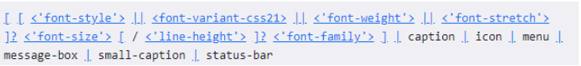

# CSS 常见选择器

## CSS 选择器(selector)

- 开发中经常需要找到==特定的网页元素进行设置样式==
  - 思考:如何找到特定的那个元素?
- **什么是 CSS 选择器**
  - 按照一定的规则==选出符合条件的元素==,为之添加 CSS 样式
- **选择器的种类繁多,大概可以这么归类**
  - 通用选择器(universal selector)
  - 元素选择器(type selectors)
  - 类选择器(class selectors)
  - id 选择器（id selectors）
  - 属性选择器(attribute selectors)
  - 组合(combinators)
  - 伪类(pseudo-classes)
  - 伪元素(pseudo-elements)

## 通用选择器

- **通用选择器( universal )**
  - 所有的元素都会被选中
- **一般用来给所有元素作一些通用性的设置**

  - 比如内边距、外边距
  - 比如重置一些内容

- ==效率比较低,尽量不要使用==

## 简单选择器

- **简单选择器是开发中用的最多的选择器:**
  - ==元素选择器(type selectors)==,使用==元素的名称==
  - ==类选择器(class selectors)==,使用==.类名==
  - ==id 选择器(id selectors)==,使用==#id==

## id 注意事项

- 一个 HTML 文档里面的 id 值**是唯一的,不能重复**
  - id 值如果由多个单词组成,单词之间可以用==中划线-、下划线\_连接==,也可以使用==驼峰标识==
  - 最好==不要用标签名作为 id 值==
- 中划线又叫==连字符(hyphen)==

## 属性选择器(attribute selectors)

- **拥有某一个属性==[att]==**
- **属性等于某个值==[att=val]==**

- **其他了解的(不用记)**
- ==[attr*=val]:==属性值包含某一个值 val
- ==[attr^=val]:==属性值以 val 开头
- ==[attr$=val]:==属性值以 val 结尾
- ==[attr|=val]:==属性值等于 val 或者以 val 开头后面紧跟连接符-
- ==[attr~=val]:==属性值包含 val, 如果有其他值必须以空格和 val 分割

## 后代选择器( descendant combinator )

- **后代选择器:所有的后代(直接/间接的后代)**
  - 选择器之间以==空格==分割

- **后代选择器二:直接子代选择器(必须是直接子代)**
  - 选择器之间以==\>==分割

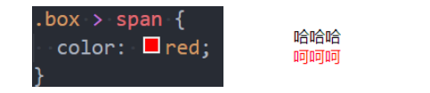

## 兄弟选择器(sibling combinator)

- **兄弟选择器一:相邻兄弟选择器**
  - 使用符号==+==链接

- **兄弟旋转器二:普遍兄弟选择器~**
  - 使用符号==~==链接

## 选择器组-交集选择器

- **交集选择器:需要同时符合两个选择器条件(两个选择器紧密连接)**
  - 在开发中通常为了==精准的选择某一个元素==

- **并集选择器:符合一个选择器条件即可(两个选择器以,号分割)**
  - 在开发中通常为了==给多个元素设置相同的样式==

## 认识伪类

- **什么是伪类呢?**
  - Pseudo-classes:翻译过来是==伪类==
  - 伪类是==选择器的一种==,它用于选择处于特定状态的元素
- 比如我们经常会实现的:当手指放在一个元素上时,显示另外一个颜色

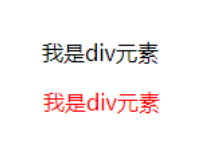

## 伪类(pseudo-classes)

- **常见的伪类有**
- **1.动态伪类**(dynamic pseudo-classes)
- :link、:visited、:hover、:active、:focus

- **2.目标伪类**(target pseudo-classes)
- :target

- **3.语言伪类**(language pseudo-classes)
- :lang()

- **4.元素状态伪类**( UI element states pseudo-classes)
- :enable、:disabled、:checked

- **5.结构伪类**(structural pseudo-classes)(后续学习)
- :nth-child()、:nth-last-child()、:nth-of-type()、:nth-last-of-type()
- :first-child、:last-child、:first-of-type、:last-of-type
- :root、:only-child、:only-of-type、:empty

- **6.否定伪类**(negation pseudo-classes)(后续学习)
- :not()

- 所有的伪类

[伪类 - CSS（层叠样式表） | MDN (mozilla.org)](https://developer.mozilla.org/zh-CN/docs/Web/CSS/Pseudo-classes)

## 动态伪类( dynamic pseudo-classes)

- **使用举例**
  - a:link 未访问的链接
  - a:visited 已访问的链接
  - ==a:hover== 鼠标挪动到链接上(重要)
  - a:active 激活的链接 (鼠标在链接上长按住未松开)
- **使用注意**
  - :hover 必须放在:link 和:visited 后面才能完全生效
  - :active 必须放在:hover 后面才能完全生效
  - 所以建议的编写顺序是:link、:visited、:hover、:active
- **除了 a 元素, :hover、:active 也能用在其他元素上**

## 动态伪类-:focus

- :focus 指当前**拥有输入焦点的元素**(能接收键盘输入)
  - 文本输入框一聚焦后,背景就会变红色
- 因为链接 a 元素可以**被键盘的 Tab 键选中聚焦,所以:focus 也适用于 a 元素**

- **动态伪类编写的顺序建议为**
  - :link、:visitd、:focus、:hover、:active
- **直接给 a 元素设置样式,相当于给 a 元素的所有动态伪类都设置了**
  - 相当于 a:link、a:visited、a:hover、a:active、a:focus 的 color 都是 red

## 伪元素(pseudo-elements)

- **常用的伪元素有**

  - :first-line、::first-line
  - :first-letter、::first-letter
  - :before、==::before==
  - :after、==::after==

- 为了区分伪元素和伪类,建议伪元素使用 2 个冒号,比如::first-line

## 伪元素-::first-line-::first-letter(了解)

- ::first-line 可以针对==首行文本设置属性==
- ::first-letter 可以针对==首字母设置属性==

## 伪元素-::before 和::after(常用)

- **::before 和::after**用来在一个元素的==内容之前或之后插入其他内容==(可以是文字、图片)
  - 常通过==content 属性==来作为一个元素添加修饰性的内容

# CSS 继承-层叠-元素类型

## CSS 的属性继承

- **CSS 的某些属性具有继承性(Inherited):**
  - 如果一个==属性具备继承性==,那么==在该元素上设置后==,它的==后代元素都可以继承这个属性==
  - 当然,如果==后代元素自己又设置该属性==,那么==优先使用后代元素自己的属性==(不管继承过来的属性权重多高)
- **如何知道一个属性是否具有继承性呢?**
  - 常见的==font-size/font-family/font-weight/line-height/color/text-align==都具有继承性
  - 这些==不用刻意去记==,用的多自然就记住了
- **另外要多学会查阅文档,文档中每个属性都有标明其继承性的:**

- **注意(了解):继承过来的是计算值,而不是设置值**

## 常见的继承属性有哪些呢?(不用记)

## CSS 属性的层叠

- **CSS 的翻译是层叠样式表,什么是==层叠==呢?**
  - 对于一个元素来说,==相同一个属性==我们可以==通过不同的选择器给它进行多次设置==
  - 那么属性会==被一层层覆盖上去==
  - 但是最终==只有一个会生效==
- **那么多喝样式属性覆盖上去,哪一个会生效呢?**

  - 判断一:==选择器的权重,权重大的生效,根据权重可以判断出优先级==
  - 判断二:==先后顺序,权重相同时,后面设置的生效==

- **那么如何知道元素的权重呢?**

## 选择器的权重

- **按照经验,为了方便比较 CSS 属性的优先级,可以给 CSS 属性所处的环境定义一个权值(权重)**
  - !important:==10000==
  - 内联样式:==1000==
  - id 选择器:==100==
  - 类选择器、属性选择器、伪类:==10==
  - 元素选择器、伪元素:==1==
  - 通配符:==0==

## HTML 元素的类型

- 在前面我们会经常提到**div 是==块级元素==会独占一行,span 是==行内级元素==会在同一行显示**
  - 到底什么是==块级元素==,什么是==行内级元素==呢?
- **HTML 定义元素类型的思路**:
  - ==HTML 元素有很多,==比如 h 元素/p 元素/div 元素/span 元素/img 元素/a 元素等等
  - 当我们把这个元素==放到页面上==时,这个元素==到底占据页面中一行多大的空间==呢
    - 为什么我们这里==只说一行==呢?因为垂直方向的==高度通常是内容决定==的
  - 比如一个==h1 元素的标题==,我们必然是希望==它独占一行==的,其他的内容==不应该和我的标题==放在一起
  - 比如一个==p 元素的段落==,必然也==应该独占一行==,其他的内容==不应该和我的标题==放在一起
  - 而类似于==img/span/a 元素==,通常是对==内容的某一个细节的特殊,没有必要独占一行==
- 所以,**为了区分哪些元素需要独占一行,哪些元素不需要独占一行,HTML 将元素区分(本质是通过 CSS 的)成了两类**
  - ==块级元素==(block-level elements):独占==父元素的一行==
  - ==行内级元素==(inline-level elements):==多个行内级元素可以在父元素的同一行中显示==

## 通过 CSS 修改元素类型

- **前面我们说过,事实上元素没有本质的区别:**
  - div 是块级元素,span 是行内级元素
  - div 之所以是块级元素仅仅是因为浏览器默认==设置了 display 属性==而已

- **那么我们是否可以通过 display 来改变元素的特性呢?**
- **==当然可以==**

## CSS 属性-display

- **CSS 中有个 display 属性,能修改元素的显示类型,有 4 个常用值**
- ==block==:让元素显示为块级元素
- ==inline==:让元素显示为行内级元素
- ==inline-block==:让元素同时具备行内级、块级元素的特征
- ==none==:隐藏元素

## display 值的特性(非常重要)

- **block 元素**
  - 独占父元素的一行
  - 可以随意设置宽高
  - 高度默认由内容决定
- **inline-block 元素:**
  - 跟其他行内级元素在同一行显示
  - 可以随意设置宽高
  - 可以这样理解
    - 对外来说,它是一个行内级元素
    - 对内来说,它是一个块级元素
- **inline**
  - 跟其他行内级元素在同一行显示
  - 不可以随意设置宽高
  - 宽高都由内容决定

## 编写 HTML 时的注意事项

- **块级元素、inline-block 元素**

  - 一般情况下,==可以包含其他任何元素==(比如块级元素、行内级元素、inline-block 元素)
  - 特殊情况,p 元素不能包含其他块级元素

- **行内级元素(比如 a、span、strong 等)**
  - 一般情况下,只能==包含行内级元素==

## 元素隐藏方法

- **方法一:display 设置为 none**
  - 元素不显示出来,并且也不占据位置,==不占据任何空间==(和不存在一样)
- **方法二:visibility 设置为 hidden**
  - 设置为 hidden,虽然元素不可见,但是==会占据元素应该占据的空间==
  - 默认为 visible,元素是可见的
- **方法三:rgba 设置颜色,将 a 的值设置为 0**
  - rgba 的 a 设置的是 alpha 值,可以设置透明度,==不影响子元素==
- **方法四:opacity 设置透明度,设置为 0**
  - 设置整个元素的透明度,==会影响所有的子元素==

## CSS 属性 - overflow

- **overflow 用于控制内容溢出时的行为**

- ==visible==:溢出的内容照样可见
- ==hidden==:溢出的内容直接裁剪
- ==scroll==:溢出的内容被裁剪,但可以通过滚动机制查看
  - 会一直显示滚动条区域,滚动条区域占用的空间属于 width、height
- ==auto==:自动根据内容是否溢出来决定是否提供滚动机制

## CSS 样式不生效技巧

- **为何有时候编写的 CSS 属性不好使,有可能是因为**
- 选择器的==优先级太低==
- 选择器==没选中对应的元素==
- CSS 属性的使用==形式不对==
  - 元素==不支持此 CSS 属性==,比如 span 默认是不支持 width 和 height 的
  - 浏览器==不支持此 CSS 属性==,比如旧版本的浏览器不支持一些 css module3 的某些属性
  - ==被同类型的 CSS 属性覆盖==,比如 font 覆盖 font-size
- 建议
- 充分利用==浏览器的开发者工具进行调试(增加、修改样式)、查错==

## CSS 盒子模型

## 认识盒子

- **生活中,我们经常会看到各种各样的盒子:**

## HTML 每个元素都是盒子

- 事实上,我们可以把 HTML 每一个元素看成一个个盒子

## 盒子模型( Box Model )

- HTML 中的每一个元素都**可以看做是一个盒子**,如右下图所示,可以具备这 4 个属性
- **内容(content)**
  - 元素的内容 width/height
- **内边距(padding)**
  - 元素和内容之间的间距
- **边框(border)**
  - 元素自己的边框
- **外边距(margin)**
  - 元素和其他元素之间的间距

## 盒子模型的四边

- **因为盒子有四边,所以==margin/padding/border==**都包括**==top/right/bottom/left==**四个边

## 在浏览器的开发工具中

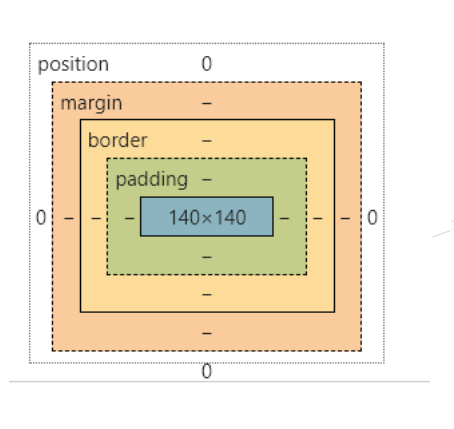

## 内容 - 宽度和高度

- **设置内容是通过宽度和高度设置的:**
  - 宽度设置:==width==
  - 高度设置:==height==
- 注意:对于==行内级非替换元素==来说,设置==宽高是无效==的!

- **另外我们还可以设置如下属性:**
  - ==min-width==:==最小宽度==,无论内容多少,宽度都==大于或等于 min-width==
  - ==max-width==:==最大宽度==,无论内容多少,宽度都==小于或等于 max-width==
  - ==移动端适配==时,可以设置最大宽度和最小宽度
- **下面两个属性不常用**
  - ==min-height==:最小高度,无论内容多少,高度都大于或等于 min-height
  - ==max-height==:最大高度,无论内容多少,高度都小于或等于 max-height

## 内边距-padding

- **==padding 属性==用于设置盒子的内边距,通常用于设置==边框和内容之间的间距==**
- **padding 包括四个方向,所以有如下的取值:**
  - ==padding-top==:上内边距
  - ==padding-right==:右边距
  - ==padding-bottom==:下内边距
  - ==padding-left==:左内边距
- **padding 单独编写时一个缩写属性:**
  - ==padding-top、padding-right、padding-bottom、padding-left==的简写属性
  - padding 缩写属性是==从零点钟方向开始==,沿着==顺时针转动==的,也就是==上右下左==
- **padding 并非必须是==四个值==,也可以有==其他值==**

## padding 的其他值

## 边框-border

- **border 用于设置盒子的边框**

- **==边框==相对于 content/padding/margin 来说特殊一些:**
  - 边框具备==宽度==width
  - 边框具备==样式==style
  - 边框具备==颜色==color

## 设置边框的方式

- **边框宽度**
  - ==border-top-width、border-right-width、border-bottom-width、border-left-width==
- **边框颜色**
  - ==border-top-color、border-right-color、border-bottom-color==
  - ==border-color==是上面 4 个属性的简写属性
- **边框样式**
  - ==border-top-style、border-right-style、border-bottom-style、border-left-style==
  - ==border-style==是上面 4 个属性的简写属性

## 边框的样式设置值

- **边框的样式有很多,我们可以了解如下的几个:**
  - ==groove==:凹槽,沟槽,边框看上去好像是雕刻在画布之内
  - ==ridge==:山脊,和 grove 相反,边框看上去好像是从画布中凸出来

## 同时设置的方式

- **如果我们相对某一边同时设置 宽度 样式 颜色,可以进行如下设置**
  - ==border-top==
  - ==border-right==
  - ==border-bottom==
  - ==border-left==
  - ==border==:统一设置 4 个方向的边框
- **边框颜色、宽度、样式的编写顺序任意**

## 圆角-border-radius

- **border-radius 用于设置盒子的圆角**

- **border-radius 常见的值:**
  - ==数值==:通常用来设置小的圆角,比如 6px
  - ==百分比==:通常用来设置一定的弧度或者圆形

## border-radius 补充

- **border-radius 事实上是一个缩写属性**
  - 将这四个属性 border-top-left-radius、border-top-right-radius、border-bottom-right-radius,和 border-bottom-left-radius 简写为一个属性
  - 开发中比较少见一个个圆角设置
- 如果一个元素是正方形,设置 border-radius 大于或等于 50%时,就会变成一个圆

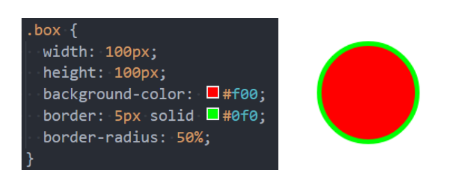

## 外边距 - margin

- **==margin 属性==用于设置盒子的==外边距==,通常用于==元素和元素之间的间距==**
- **margin 包括四个方向,所以有如下的取值:**
  - ==margin-top==:上内边距
  - ==margin-right==:右内边距
  - ==margin-bottom==:下内边距
  - ==margin-left==:左内边距
- **margin 单独编写是一个缩写属性:**
  - ==margin-top、margin-right、margin-bottom、margin-left==的简写属性
  - margin 缩写属性是==从零点钟方向开始==,沿着==顺时针转动的==,也就是==上右下左==
- **margin 也并非必须是四个值,也可以有其他值**

## margin 的其他值

## 上下 margin 的传递

- **margin-top 传递**
  - 如果==块级元素的顶部线和父元素的顶部线重叠==,那么==这个块级元素的 margin-top 值会传递给父元素==
- **margin-bottom 传递**
  - 如果==块级元素的底部线和父元素的底部线重写==,==并且父元素的高度是 auto==,那么==这个块级元素的 margin-bottom 值会传递给父元素==
- **如何防止出现传递问题?**
  - 给==父元素设置 padding-top\padding-bottom==
  - 给==父元素设置 border==
  - 触发 BFC:==设置 overflow 为 auto==
- **建议**
  - ==margin==一般是用来==设置兄弟元素之间==的间距
  - ==padding==一般是用来==设置父子元素之间==的间距

## 上下 margin 的折叠

- **垂直方向上相邻的 2 个 margin(margin-top、margin-bottom)有可能会合并为 1 个 margin,这种现象叫做==collapse==(折叠)**
- **水平方向上的 margin (margin-left、margin-right) 永远不会 collapse**

- **折叠后最终值的计算规则**
  - 两个值进行比较,==取较大的值==
- **如何防止 margin collapse?**
  - ==只设置其中一个元素的 margin==

## 上下 margin 折叠的情况

- ==两个兄弟块级元素==之间==上下 margin 的折叠==
- ==父子块级元素==之间==margin 的折叠==

## 外轮廓 - outline

- **outline 表示元素的==外轮廓==**
  - ==不占用空间==
  - 默认==显示在 border 的外面==
- **outline 相关属性有**

  - ==outline-width==:外轮廓的宽度
  - ==outline-style==:取值跟 border 的样式一样,比如 solid、dotted 等
  - ==outline-color==:外轮廓的颜色
  - ==outline==:outline-width、outline-style、outline-color 的简写属性,跟 border 用法类似

- **应用实例**
  - ==去除 a 元素、input 元素的 focus 轮廓效果==

## 盒子阴影 - box-shadow

- **box-shadow 属性可以设置一个或者多个阴影**
  - 每个阴影用< ==shdow==>表示
  - 多个银镜之间用==逗号,隔开==,==从前到后叠加==
- **\< shadow>的常见格式如下**

- 第 1 个\< length>:==offset-x==,水平方向的偏移,正数往右偏移
- 第 2 个\< lenght>==offset-y==,垂直方向的偏移,正数往下偏移
- 第 3 个\< length>:==blur-radius==,模糊半径
- 第 4 个\< length>:==spread-radiius==,延伸半径
- \< color>:==阴影的颜色==,如果没有设置,就跟随 color 属性的颜色
- inset:==外框阴影变成内框阴影==

## 盒子阴影-在线查看

- 我们可以通过一个网站测试盒子的阴影:

[Box Shadow CSS Generator | 𝗧𝗛𝗘 𝗕𝗘𝗦𝗧 𝗢𝗡𝗟𝗜𝗡𝗘 𝗖𝗦𝗦 𝗚𝗘𝗡𝗘𝗥𝗔𝗧𝗢𝗥 (html-css-js.com)](https://html-css-js.com/css/generator/box-shadow/)

## 文字阴影-text-shadow

- **text-shadow 用法类似于 box-shadow,用于给文字添加阴影效果**
- **\< shadow>的常见格式如下**
  - 
  - 相当于 box-shadow,它没有 spread-radius 的值
- **我们可以通过一个网站测试文字的阴影:**

[Box Shadow CSS Generator | 𝗧𝗛𝗘 𝗕𝗘𝗦𝗧 𝗢𝗡𝗟𝗜𝗡𝗘 𝗖𝗦𝗦 𝗚𝗘𝗡𝗘𝗥𝗔𝗧𝗢𝗥 (html-css-js.com)](https://html-css-js.com/css/generator/box-shadow/)

## 行内非替换元素的注意事项

- **以下属性对行内非替换元素不起作用**
  - width、height、margin-top、margin-bottom
- **以下属性对行内级非替换元素的效果比较特殊**
  - padding-top、padding-bottom、上下方向的 border

## 综合案例练习

## CSS 属性 - box-sizing

- **box-sizing 用来设置盒子模型中宽高的行为**
- **content-box**
  - padding、border 都布置在 width、height 外边
- **border-box**
  - padding、border 都布置在 width、height 里边

## box-sizing:content-box

- 元素的实际占用宽度 = border + padding + width
- 元素的实际占用高度 = border + padding + height

## box-sizing:border-box

- 元素的实际占用宽度 = width
- 元素的实际占用高度 = height

## IE 盒子模型

## 元素的水平居中方案

- **在一些需求中,需要元素在父元素中水平居中显示(父元素一般都是块级元素、inline-block)**

- **行内级元素(包括 inline-block 元素)**

  - 水平居中:在父元素中设置==text-align:center==

- **块级元素**
  - 水平居中:==margin:0 auto==

# CSS 设置背景

## 认识网页的背景

- **在开发中,为了让网页更加美观,我们经常会设置各种各样的背景:**
  - 我们前面已经学习了如何==设置背景颜色==,这里我们要学习==设置背景的更多知识==

## background-image

- **background-image 用于设置元素的背景图片**
  - ==会盖在(不是覆盖)background-color 的上面==
- **如果设置了多张图片**

  - 设置的==第一张图片将显示在最上面==,==其他图片按顺序层叠在下面==

- **注意:如果设置了背景图片后,元素没有具体的宽高,背景图片是不会显示出来的**

## background-repeat

- **background-repeat 用于设置背景图片是否要平铺**
- **常见的设置有**
  - ==repeat==:平铺
  - ==no-repeat==:不平铺
  - ==repeat-x==:只在水平方向平铺
  - ==repeat-y==:只在垂直方向平铺

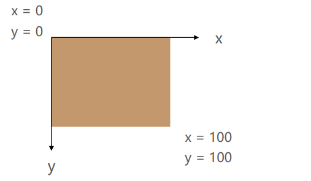

## background-size

- **background-size 用于设置背景图片的大小**
  - ==auto==:默认值,以背景图本身大小显示
  - ==conver==:缩放背景图,以完全覆盖铺满元素,可能背景图片部分看不见
  - ==contain==:缩放背景图,宽度或者高度铺满元素,但是图片保持宽高比
  - ==\< percentage>==:百分比,相当于背景区(background positioning area)
  - ==length==:具体的大小,比如 100px

## background-position

- **background-position 用于设置背景图片在水平,垂直方向上的具体位置**
  - 可以设置==具体的数值==比如 20px 30px
  - 水平方向还可以设置:==left==、==center==、==right==
  - 垂直方向还可以设置:==top==、==center==、==bottom==
  - 如果只==设置了一个方向==,==另一个方向默认是 center==

## background-attachment

- **background-attachment 决定背景图像的位置是在视口内固定,或者随着包含它的区块滚动**

- **可以设置以下 3 个值**
  - ==scroll==:此关键属性值表示背景相对于元素本身固定,而不是随着它的内容滚动
  - ==local==:此关键属性值表示背景相对于元素的内容固定。如果一个元素拥有滚动机制,背景将会随着元素的内容滚动
  - ==fixed==:此关键属性值表示背景相对于视口固定。即使一个元素拥有滚动机制,背景也不会随着元素的内容滚动

## background

- **background 是一系列背景相关属性的简写属性**

- **常用的格式是**

- background-size 可以省略,如果不省略,/background-size 必须跟在 background-position 的后面
- 其他属性也都可以省略,而且顺序任意

## background-image 和 img 对比

- **利用 background-image 和 img 都能够实现显示图片的需求,在开发中该如何选择?**

- **总结**
  - img,作为网页内容的重要组成部分,比如广告图片、LOGO 图片、文章配图、产品图片
  - background-image,可有可无。有,能让网页更加美观。无,也不影响用户获取完整的网页内容信息

# HTML 高级元素

## 认识列表元素

- **在开发一个网页的过程中,很多数据都是以列表的形式存在的**

## 列表的实现方式

- **事实上现在很多的列表功能采用了不同的方案来实现:**
  - 方案一:使用 div 元素来实现(比如汽车之家,知乎上的很多列表)
  - 方案二:使用列表元素,使用元素语义化的方式实现
- 事实上现在很多的网站对于列表元素没有很强烈的偏好,更加不拘一格,按照自己的风格来布局

  - 原因我认为是列表元素默认的 CSS 样式,让它用起来不是非常方便
  - 比如列表元素往往有很多的限制,ol/ul 中只能存放 li,li 再存放其他元素
  - 虽然我们可以通过重置来解决,但是我们更喜欢自由的 div

- HTML 提供了 3 组常用的用来展示列表的元素
  - 有序列表:ol、li
  - 无需列表:ul、li
  - 定义列表:dl、dt、dd

## 有序列表 - ol - li

- ol (ordered list)
  - 有序列表,直接子元素只能是 li
- li (list item)
  - 列表中的每一项

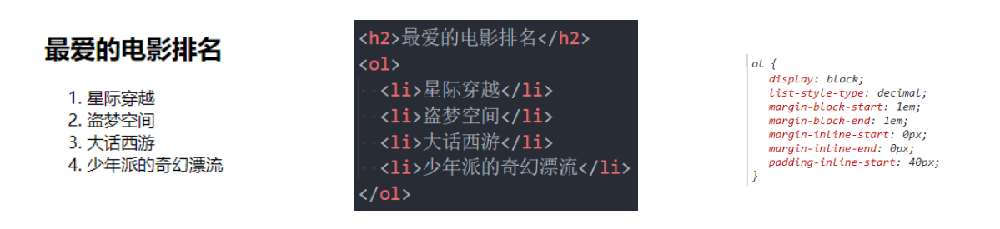

## 无序列表

- ul (unordered list)
  - 无序列表,直接子元素只能是 li
- li (list item)
  - 列表中的每一项

## 定义列表 - dl - dt - dd

- dl (definition list)
  - 定义列表,直接子元素只能是 dt、dd
- dt (definition term)
  - 列表中每一项的项目名
- dd (definition description)
  - 列表中每一项的具体描述,是对 dt 的描述、解释、补充
  - 一个 dt 后面一般紧跟着一个或者多个 dd

## 列表的练习

## 认识表格元素

- 在网页中,对于某些内容的展示使用表格元素更为合适和方便

## 表格常见的元素

- **编写表格最常见的下面的元素:**
- table
  - 表格
- tr(table row)
  - 表格中的行
- td(table data)

  - 行中的单元格

- 另外表格有很多相关的属性可以设置表格的样式,但是已经不推荐使用了

## 表格的练习

- 通过表格元素和 CSS 完成下面的表格

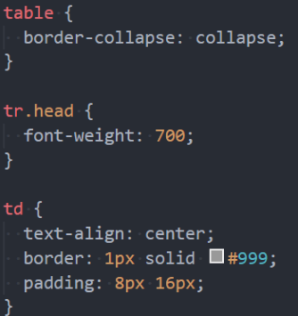

- **这里我们需要用到一个非常重要的属性:**
  - border-collapse CSS 属性是用来决定表格的边框是分开的还是合并的
  - table { border-collapse:collapse }
  - 合并单元格的边框

## 表格的其他元素

- **thead**
  - 表格的表头
- tbody
  - 表格的主体
- tfoot
  - 表格的页脚
- caption
  - 表格的标题
- th
  - 表格的表头单元格

## 单元格合并

- 在某些特殊的情况下,每个单元格占据的大小可能并不是固定的
  - 一个单元格可能会跨多行或者多列来使用
- 比如下面的表格

- 这个时候我们就要使用**单元格合并**来完成

## 如何使用单元格合并呢?

- 单元格合并分成两种情况:

  - 跨列合并:使用 colspan

    - 在最左边的单元格写上 colspan 属性,并且省略掉合并的 td

  - 在最上面的单元格协商 rowspan 属性,并且省略掉后面 tr 中的 td

## 单元格合并练习

## 作业布置

## 认识表单

- **HTML 表单元素是和==用户交互的重要方式==之一,在==很多网站都需要使用表单==**

## 常见的表单元素

- **form**
  - ==表单==,一般情况下,其他表单相关元素都是它的后代元素
- **input**
  - 单行==文本输入框、单选框、复选框、按钮==等元素
- textarea
  - ==多行文本框==
- select、option
  - ==下拉选择框==
- button
  - ==按钮==
- label
  - ==表单元素的标题==

## input 元素的使用

- 表单元素使用最多的是==input==元素
- **input 元素有如下常见的属性:**

- ==type==:**input 的类型**

  - ==text==:文本输入框(明文输入)
  - ==password==:文本输入框(密文输入)
  - ==radio==:单选框
  - ==checkbox==:复选框
  - ==reset==:重置
  - ==submit==:提交表单数据给服务器
  - ==file==:文件上传

- **==readonly==:**只读
- **==disabled==:**禁用
- **==checked==**:默认被选中
  - 只有当 type 为 radio 或 checkbox 时可用
- **==autofocus==**:当页面加载时,自动聚集
- ==**name**==:名字
  - 在提交数据给服务器,可用于区分数据类型
- **==value==**:取值

- **type 类型的其他取值和 input 的其他属性,查看文档:**
  - [：输入（表单输入）元素 - HTML（超文本标记语言） | MDN (mozilla.org)](https://developer.mozilla.org/zh-CN/docs/Web/HTML/Element/Input)

## 布尔属性 (boolean attributes)

- **常见的布尔属性有==disabled、checked、readonly、multiple、autofocus、selected==**

- **布尔属性可以没有属性值,==写上属性名就代表使用这个属性==**
  - 如果要给布尔属性设置值,值就是属性名本身

## 表单按钮

- **表单可以实现按钮效果:**
  - ==普通按钮(type=button)==:使用 value 属性设置按钮文字
  - ==重置按钮(type=reset)==:重置它所属 form 的所有表单元素(包括 input、textarea、select)
  - ==提交按钮(type=submit)==:提交它所属 form 的表单数据给服务器(包括 input、textarea、select)

## input 和 label 的关系

- **label 元素一般跟 input 配合使用,用来表示 input 的标题**
- lable 可以跟==某个 input 绑定,点击 label==就可以==激活对应的 input==变成选中

## radio 的使用

- **我们可以将 type 类型设置为 radio 变成单选框**
  - ==name 值相同的 radio 才具备选功能==

## checkbox 的使用

- **我们可以将 type 类型设置为 checkbox 变成多选框:**
  - ==属于同一种类型的 checkbox,name 值要保持一致==

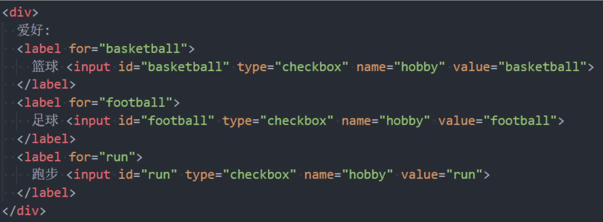

## textarea 的使用

- **textarea 的常用属性:**
  - ==cols==:列数
  - ==rows==:行数
- **缩放的 CSS 设置**
  - ==禁止==缩放:resize:none
  - ==水平==缩放:resize:horizontal
  - ==垂直==缩放:resize: vertical
  - ==水平垂直==缩放:resize:both

## select 和 option 的使用

- **option 是 select 的子元素,一个 option 代表一个选项**
- **select 常用号属性**
  - ==multiple==:可以多选
  - ==size==:显示多少项
- **option 常用属性**

  - ==selected==:默认被选中

- **form 常见的属性如下:**
- ==action==
  - 用于提交表单数据的==请求 URL==
- ==method==
  - 请求方法==(get 和 post)==,默认是 get
- ==target==
  - 在什么地方打开 URL (参考 a 元素的 target)

## 请求方式的对比

# Emmet 和结构伪类

## 认识 emmet 语法

- Emmet **(前身为 zen Coding)是一个能大幅度==提高前端开发效率==的一个工具**
  - 在前端开发的过程中,一大部分的工作是==写 HTML、CSS 代码==,如果手动来编写效果会非常低
  - VsCode 内置了==Emmet 语法==,在后缀为.html/.css 中输入缩写后按 Tab/Enter 键即会==自动生成响应代码==
- **!和 html:5 可以快速生成完整结构的 html5 代码**

## > (子代) 和 + (兄弟)

## \* (多个) 和 ^ (上一级)

## () (分组)

## 属性(id 属性、class 属性、普通属性) {} (内容)

## $ (数字)

## 隐式标签

## CSS Emmet

## 结构伪类-:nth-child

- **:nth:child(1)**
  - 是父元素中的==第一个子元素==
- **:nth-child(2n)**
  - n 代表任意==正整数和 0==
  - 是父元素中的第偶数个子元素(第 2、4、6、8...个)
  - 跟:nth-child(even)同义
- **:nth-child(2n + 1)**
  - n 代表任意==正整数和 0==
  - 是父元素中的第奇数个子元素 (第 1、3、5、7......个)
- **nth-child(-n + 2)**
  - 代表==前 2 个子元素==

## 结构伪类 - :nth-last-child()

- **:nth-last-child()的语法跟:nth-child()类似,不同点是:nth-last-child()从最后一个子元素开始往前计数**
  - :==nth-last-child==(1),代表倒数第一个子元素
  - :==nth-last-child==(-n + 2),代表最后 2 个子元素
- **:nth-of-type()用法跟:nth-child()类似**
  - 不同点是:==nth-of-type==()计数时只计算同种类型的元素
- **:nth-last-of-type()用法跟:nth-of-type()类似**
  - 不同点是:==nth-last-of-type==()从最后一个这种类型的子元素开始往前计数

## 结构伪类 - :nth-of-type()、:nth-last-of-type()

- **其他常见的伪类(了解):**

  - :==first-child==,等同于:nth-child(1)
  - :==last-child==,等同于:nth-last-child(1)
  - :==first-of-type==,等同于:nth-of-type(1)
  - :==last-of-type==,等同于:nth-last-of-type(1)
  - :==only-child==,是父元素中唯一的子元素
  - :==only-of-type==,是父元素中唯一的这种类型的子元素

- **下面的伪类偶尔会使用:**
  - :==root==,根元素,就是 HTML 元素
  - :==empty==代表里面完全空白的元素

## 否定伪类( negation pseudo-class)

- **:not()的格式是:not(x)**

  - x 是一个==简单选择器==
  - 元素选择器、通用选择器、属性选择器、类选择器、id 选择器、伪类(除否定伪类)

- **:not(x)表示==除 x 以外的元素==**

# 额外知识补充

## 边框的形状

- **border 主要是用来给盒子增加边框的,但是在开发中我们也可以利用边框的特性来实现一些形状:**

- **假如我们将 border 宽度设置成 50 会是什么效果呢?**
  - 如果我们进一步,将另外三边的颜色去除呢?
  - 如果我们将这个盒子旋转呢?
- **所以利用 border 或者 CSS 的特性我们可以做出很多图形**

[The Shapes of CSS | CSS-Tricks - CSS-Tricks](https://css-tricks.com/the-shapes-of-css/#top-of-site)

## 认识 web 字体

- **在之前我们有设置过页面使用的字体:font-family**

  - 我们需要提供==一个或者多个字体种类名称==,浏览器会在==列表中搜寻==,直到找到它==所运行的系统上可用的字体==
  - 这样的方式完全没有问题,但是对于传统的 web 开发人员来说,==字体选择是有限的==
  - 这就是所谓的==Web-safe 字体==
  - 并且这种默认可选的字体==并不能进行一些定制化的需求==

- **比如下面的字体样式,系统的字体肯定是不能实现的**

- **那么我们是否依然可以在网页中使用这些字体呢? ==使用 Web Fonts 即可==**

## Web fonts 的工作原理

- **首先,我们需要通过一些渠道==获取到希望使用的字体==(不是开发来做的事情):**
  - 对于==某些收费的字体==,我们需要获取到==对应的授权==
  - 对于某些==公司定制的字体==,需要==设计人员来设计==
  - 对于某些==免费的字体==,我们需要==获取到对应的字体文件==
- **其次,在我们的 CSS 代码当中==使用该字体==(重要):**
  - 具体的过程看后面的操作流程
- **最后,在==部署静态资源==时,将==HTML/CSS/javaScript/Font 一起部署在静态服务器==中**

- **用户的角度**
  - 浏览一个网页时,因为代码中有引入的字体文件,==字体文件会被一起下载下来==
  - 浏览器会根据使用的字体==下载的文件中查找、解析、使用对应的字体==
  - ==在浏览器中使用对应的字体显示内容==

## 使用 Web Fonts

- ==第一步==:在字体天下网站下载一个字体
  - [中文字体免费下载和在线预览-字体天下 (fonts.net.cn)](https://www.fonts.net.cn/fonts-zh-1.html)
  - 默认下载下来的是 ttf 文件
- ==第二步==:使用字体
- **使用过程如下:**

  - 1.将==字体放到对应的目录==中
  - 2.==通过@font-face 来引入字体==,并且==设置格式==
  - 3.==使用字体==

- **注意:@font-face 用于加载一个自定义的字体**

## web-fonts 的兼容性

- **我们刚才使用的字体文件是.ttf,它是 TrueType 字体**
  - 在开发中某些浏览器可能不支持该字体,所以为了浏览器的兼容性问题,我们需要有对应其他格式的字体
- **trueType 字体:拓展名是.ttf**
  - ==OpenType/TrueType 字体==:拓展名是.ttf、.otf,建立在 TrueType 字体之上
  - ==Embedded OpenType 字体==:拓展名是.eot,OpenType 字体的压缩版
  - ==SVG 字体==:拓展名是.svg、svgz
  - ==WOFF 表示 Web Open Font Format Web 开发字体==:
  - 拓展名是.woff,建立在 TrueType 字体之上
- **这里我们提供一个网站来生产对应的字体文件:**
  - [在线字体编辑器-JSON 在线编辑器 (qqe2.com)](https://font.qqe2.com/)

## web fonts 兼容性写法

- **如果我们具备很强的兼容性,那么可以如下格式编写:**

- **这被称为"bulletproof@font-face syntax (刀枪不入的@font-face 语法)":**
  - 这是==paul lrish==早期的一篇文章提及后@font-face 开始流行起来([Bulletproof @font-face syntax - Paul Irish](https://www.paulirish.com/2009/bulletproof-font-face-implementation-syntax/))
- **src 用于指定字体资源**
  - ==url==指定资源的路径
  - ==format==用于帮助浏览器快速识别字体的格式

## 认识字体图标

- **思考:字体可以==设计成各种各样的形状==**,**那么==能不能把字体直接设计成图标的样子==**

  - ==当然可以==,这个就叫做==字体图标==

- **字体图标的好处:**
  - 放大不会失真
  - 可以任意切换颜色
  - 用到很多个图标时,文件相对图片较小
- **字体图标的使用:**
  - 登录阿里 icons([iconfont-阿里巴巴矢量图标库](https://www.iconfont.cn/))
  - 下载代码,并且拷贝到项目中
- **将字体文件和默认的 css 文件导入到项目中**

## 字体图标的使用

- 字体图标的使用步骤:
- ==第一步==:通过 link 引入 iconfont.css 文件
- ==第二步==:使用字体图标

- **使用字体图标常见的有两种方式:**
  - ==方式一==:通过对应字体==图标的 Unicode==来显示代码
  - ==方式二==:利用已经==编写好的 class==,直接使用即可

## 认识精灵图 CSS Sprite

- **什么是 CSS Sprite**
  - 是一种==CSS 图像合成技术==,将==各种小图片合并到一张图上==,然后==利用 CSS 的背景定位来显示对应的图片部分==
  - 有人翻译为: ==CSS 雪碧、CSS 精灵==
- **使用 CSS Sprite 的好用**

  - 减少网页的==http 请求数量==,==加快网页响应速度==,==减轻服务器压力==
  - 减少==图片总大小==
  - 解决了==图片命名的困扰==,只需要针对一张集合的图片命名

- **Sprite 图片制作 (雪碧图、精灵图)**
- 方法 1:Photoshop,设计人员提供
- 方法 2:[CSS Sprites Generator Tool | Toptal®](https://www.toptal.com/developers/css/sprite-generator)

## 精灵图的使用

- **精灵图如何使用呢?**

  - 精灵图的原理是==通过只显示图片的很小一部分来展示==
  - **通常使用背景:**
    - 1.设置对应元素的高度和宽度
    - 2.设置精灵图作为背景图片
    - 3.调整背景图片的位置来展示

- **如何获取精灵图的位置**
  - [Sprite Cow - Generate CSS for sprite sheets](http://www.spritecow.com/)

## cursor

- **cursor 扩设置鼠标的指针 (光标)在元素上面时的显示样式**

- **cursor 常见的值有**
  - ==auto==:浏览器根据上下文决定指针的显示样式,比如根据文本和非文本切换指针样式
  - ==default==:由操作系统决定,一般就是一个小箭头
  - ==pointer==:一只小手,鼠标指针挪动到链接上面默认就是这个样式
  - ==text==:一条竖线,鼠标指针挪动到文本输入框上面默认就是这个样式
  - ==none==:没有任何指针显示在元素上面

# CSS 元素定位

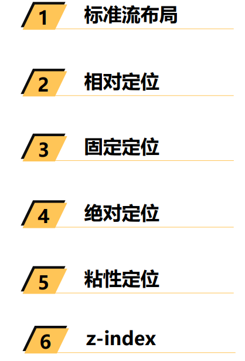

## 标准流 (Normal Flow)

- **默认情况下,元素都是按照==normal flow== (标准流、常规流、正常流、文档流[document flow]) 进行排布**
  - ==从左到右、从上到下==按顺序摆放好
  - 默认情况下,==互相之间不存在层叠现场==

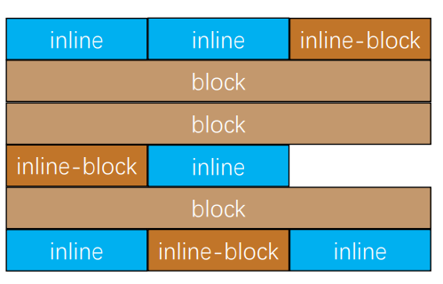

## margin-padding 位置调整

- **在标准流中,可以使用==margin、padding==对元素进行定位**
  - 其中 margin 还可以设置负数
- **比较明显的缺点是**

  - 设置一个元素的==margin 或者 padding==,通常会==影响到标准流中其他元素==的定位效果
  - ==不便于实现元素层叠的效果==

- **如果我们希望一个元素可以跳出标准量,单独的对某个元素进行定位呢?**
  - 我们可以通过 position 属性进行设置

## 认识元素的定位

- **定位允许您从==正常的文档流布局中取出元素==,并使它们具有不同的行为**
  - 例如==放在另一个元素的上面==
  - 或者==始终保持在浏览器视窗内的同一位置==
- **定位在开发中非常常见**:

## 认识 position 属性

- 利用 position 可以对元素进行定位,常用取值有 5 个:

- 默认值:
- ==static:==默认值,静态定位

- **使用下面的值,可以让元素变成 定位元素(positioned element)**
- ==relative==:相对定位
- ==absolute==:绝对定位
- ==fixed==:固定定位
- ==sticky:==粘性定位

## 静态定位 - static

- **position 属性的默认值**
  - 元素按照==normal flow==布局
  - ==left、right、top、bottom==没有任何作用

## 相对定位 - relative

- 元素按照==normal flow==布局
- 可以通过==left、right、top、bottom==进行定位
  - 定位==参照对象==是元素==自己原来的位置==
- left、right、top、bottom 用来设置元素的具体位置,对元素的作用如下所示

- **相对定位的应用场景**
- 在==不影响其他元素位置的前提==下,对==当前元素位置进行微调==

## 相对定位的练习

## 固定定位 - fixed

- 元素==脱离 normal flow==(脱离标准流、脱标)

- 可以通过==left、right、top、bottom==进行定位
- 定位参照对象是视口(viewport)

- 当画布滚动时,固定不动

## 画布 和 视口

- **视口 (Viewport)**
- 文档的可视区域
- 如右图==红框==所示

- **画布 (Canvas)**
- 用于渲染文档的区域
- 文档内容超出视口范围,可以通过滚动查看
- 如右图==黑框==所示

- **宽高对比**
- ==画布>=视口==

## 固定定位练习

## 绝对定位 - absolute

- **元素脱离 normal flow (脱离标准流、脱标)**

- **可以通过 left、right、top、bottom 进行定位**

  - 定位参照对象是==最邻近的定位祖先元素==
  - 如果==找不到这样的祖先元素==,==参照对象是视口==

- **定位元素 (positioned element)**
  - position 值不为==static==的元素
  - 也就是 position 值为==relative、absolute、fixed==的元素

## 子绝父相

- **在绝大数情况下,子元素的==绝对定位是相对于父元素进行定位==**

- **如果希望子元素相对于父元素进行定位,又不希望父元素脱标,常用解决方案是:**
  - 父元素设置==position:relative== (让父元素成为定位元素,而且父元素不脱离标准流)
  - 子元素设置==position:absolute==
  - 简称为==子绝父相==

## 将 position 设置为 absolute/fixed 元素的特点(一)

- 可以随意设置宽高

- 宽度默认由内容决定

- 不再受标准流的约束

  - 不再==严格按照从上到下、从左到右==排布
  - 不再==严格区分块级(block)、行内级(inline),行内块级(inline-block)的很多特性==都会消失

- **不再给父元素汇报宽高数据**

- **脱标元素内部默认还是按照标准流布局**

## 将 position 设置为 absolute/fixed 元素的特点(二)

- **绝对定位元素 (absolutely positioned element)**
  - position 值为==absolute==或者==fixed==元素
- **对于绝对定位元素来说**

  - 定位参照对象的宽度 = left + right + margin-left + margin-right + 绝对定位元素的实际占用宽度
  - 定位参照对象的高度 = top + bottom + margin-top + margin-bottom + 绝对定位元素的实际占用高度

- **如果希望绝对定位元素的宽高和定位参照对象一样，可以给绝对定位元素设置以下属性**
  - left:0、right:0、top:0、bottom:0、margin:0
- **如果希望绝对定位元素在定位参照对象中居中显示,可以给绝对定位元素设置以下属性**
  - left:0、right:0、top:0、bottom:0、margin:auto
  - 另外,还得==设置具体的宽高值== (宽高小于定位参照对象的宽高)

## auto 到底是什么?

- 800 = 200 + ml0 + mr0 + 0 + 0

- auto -> 交给浏览器处理

- width:auto
- 1.行内非替换元素 -> width: 包裹内容

## 绝对定位的案例练习

- 这个案例看似简单,但是里面涉及的知识点非常多
  - 按照自己的思路一步步布局即可,不要着急

## 粘性定位 - sticky

- **另外还有一个定位的值是==position:sticky==,比起==其他定位值要更新一些==**
  - sticky 是一个大家期待已久的属性
  - 可以看做是==相对定位和固定(绝对)定位的结合体==
  - 它允许被定位的元素==表现得像相对定位一样==,直到它滚动到某个阈值点
  - 当==达到这个阈值点==时,就会==变成固定(绝对)定位==

- sticky 是相对于最近的滚动祖先包含滚动视口的( the nearest ancestor scroll container's scrollport)

## position 值对比

## CSS 属性 - z-index

- z-index 属性用来设置定位元素的==层叠顺序==(仅对定位元素有效)
  - 取值可以是==正整数、负整数、0==
- 比较原则
  - 如果是==兄弟关系==
    - ==z-index 越大,层叠在越上面==
    - ==z-index 相等,写在后面的那个元素层叠在上面==
  - 如果不是兄弟关系
    - 各自==从元素自己以及祖先元素中,找出最邻近的 2 个定位元素进行比较==
    - 而且==这两个定位元素必须有设置 z-index 的具体数值==

# CSS 元素定位

## 认识浮动

- **float 属性可以指定一个元素应==沿其容器==的==左侧==或==右侧==放置,允许==文本和内联元素环绕它==**

  - float 属性最初只用于在一段文本内==浮动图像,实现文字环绕的效果==
  - 但是早期的 CSS 标准中并没有提供好的==左右布局方案==,因此在一段时间里面它成为==网页多列布局的最常用工具==

- **绝对定位、浮动都会让元素脱离标准流,以达到灵活布局的效果**

- **可以通过 float 属性让元素产生浮动效果,float 的常用取值**
  - ==none==:不浮动,默认值
  - ==left==:向左浮动
  - ==right==:向右浮动

## 浮动规则一

- **元素一旦浮动后,脱离标准流**
  - ==朝着向左或向右方向移动==,直到==自己的边界紧贴着包含块==(一般是父元素) 或者==其他浮动元素的边界==为止
  - ==定位元素会层叠在浮动元素上面==

## 浮动规则二

- **如果元素是向左(右)浮动,浮动元素的左(右)边界不能超出==包含块==的左(右)边界**

## 浮动规则三

- **规则五:浮动元素之间不能层叠**
  - 如果一个元素浮动,另一个浮动元素已经在那个位置了,后浮动的元素将紧贴着前一个浮动元素 (左浮找左浮,右浮找右浮)
  - 如果水平方向剩余的空间不够显示浮动元素,浮动元素将向下移动,直到有充足的空间为止

## 浮动规则四

- **浮动元素不能与行内级内容层叠,行内级内容将会被浮动元素推出**
  - 比如行内级元素、inline-block 元素、块级元素的文字内容

## 浮动规则五

- **规则五:行内级元素、inline-block 元素浮动后,其顶部将与所在行的顶部对齐**

## 浮动的问题 - 高度坍塌

- **由于浮动元素脱离了标准流,变成了脱标元素,所以==不再向父元素汇报高度==**

  - 父元素==计算总高度==时,就==不会计算浮动子元素的高度==,导致了==高度坍塌==问题

- **解决父元素高度坍塌的问题的过程,一般叫做==清浮动 (清理浮动、清除浮动)==**

- **清浮动的目的是**

  - 让==父元素计算总高度的时候==,把==浮动子元素的高度算进去==

- **如何清除浮动呢? 使用 clear 属性**

## CSS 属性 - clear

- **clear 属性是做什么的呢?**

  - clear 属性可以指定一个元素==是否必须移动==(清除浮动后)==到在它之前的浮动元素==下面

- **clear 的常用取值**
- ==left==:要求元素的顶部低于之前生成的所有左浮动元素的底部
- ==right==:要求元素的顶部低于之前生成的所有右浮动的底部
- ==both==:要求元素的顶部低于之前生成的所有浮动元素的底部
- ==none==:默认值,无特殊要求

- **那么我们可以利用这个特性来清除浮动**

## 清除浮动的方法

- **事实上我们有很多方法可以清除浮动**
- **方法一:给父元素设置固定高度**
  - 扩展性不好(不推荐)
- **方法二:在元素最后增加一个空的块级子元素,并且让它设置 clear:both**

  - 会==增加很多无意义的空标签==,维护麻烦
  - 违反了结构与样式分离的原则 (不推荐)

- **方法三:给元素添加一个伪元素**
  - ==推荐==
  - 编写好后可以轻松实现清除浮动

## 方法三 - 伪元素清除浮动

- **给父元素增加==::ater 伪元素==**
  - 纯 CSS 样式解决,结构与样式分离 (推荐)

## 布局方案总结

# CSS Flex 布局

## 认识 flexbox

- **FlexBox 翻译为弹性盒子:**
  - ==弹性盒子==是一种用于==按行或按列布局元素==的==一维布局方法==
  - 元素可以==膨胀一填充额外的空间==,==收缩以适应更小的空间==
  - 通常我们使用 Flexbox 来进行布局的方案称之为==flex 布局==(flex layout)
- **flex 布局是目前 web 开发中使用最多的布局方案:**

  - flex 布局 (Flexble 布局,弹性布局)
  - 目前特别在==移动端==可以说已经完全普及
  - 在==PC 端==也几乎已经完全普及和使用,只有==非常少数的网站依然在用浮动来布局==

- **为什么需要 flex 布局呢**
  - 长久以来,CSS 布局中唯一可靠且跨浏览器兼容的==布局工具只有[浮动 - 学习 Web 开发 | MDN (mozilla.org)](https://developer.mozilla.org/zh-CN/docs/Learn/CSS/CSS_layout/Floats)和[定位 - 学习 Web 开发 | MDN (mozilla.org)](https://developer.mozilla.org/zh-CN/docs/Learn/CSS/CSS_layout/Positioning)
  - 但是这两种方法本身==存在很大的局限性==,并且他们用于布局是在是无奈之举

## 原先的布局存在的痛点

- **原来的布局存在哪些痛点呢?举例说明:**
  - 比如在父内容里面==垂直居中一个块内容==
  - 
  - 比如使容器的==所有子项等分可用宽度/高度==,而==不管有多少宽度/高度可用==
  - 比如使==多列布局中的所有列采用相同的高度==,即使==它们包含的内容量不同==.

## flex 布局的出现

- **所以长久以来,大家非常期待一种真正可以利用对元素布局的方案:==于是 flex 布局出现了==**

  - Nature and nature's laws lay hid in night; God said "Let Newton be" and all was light.
  - 自然与自然的法则在黑夜隐藏，于是上帝说，让牛顿出现吧！于是世界就明亮了起来

- **flexbox 在使用时,我们最担心的是它的兼容性问题:**
  - 我们可以在==caniuse==上查询到具体的兼容性

## flex 布局的重要概念

- **两个重要的概念:**
  - 开启了 flex 布局的元素叫==flex container==
  - flex container 里面的直接子元素叫做 ==flex item==
- **当 flex container 中的子元素变成了 flex item 时,具备以下特点:**
  - flex item 的布局将==受 flex container 属性的设置来进行控制来布局==
  - flex item==不再严格区分块级元素和行内级元素==
  - flex item==默认情况下是包裹内容==的,==但是可以设置宽度和高度==
- **设置 display 属性为 flex 或者 inline-flex 可以成为 flex container**
  - ==flex==:flex container 以==block-level==形式存在
  - ==inline-flex==: flex container 以 ==inline-level==形式存在

## flex 布局的模型

## flex 相关的属性

- 应用在 flex container 上的 CSS 属性
  - flex-flow
  - flex-direction
  - flex-wrap
  - flex-flow
  - justify-content
  - align-items
  - align-content
- 应用在 flex items 上的 CSS 属性
  - flex-grow
  - flex-basis
  - flex-shrink
  - order
  - align-self
  - flex

## flex-direction

- **flex items 默认都是沿着 main axis (主轴)从 main start 开始往 main end 方向排布**
  - ==flex-direction== 决定了 ==main axis==的方向,有 4 个值
  - ==row==(默认值)、==row-reverse、column、column-reverse==

## flex-wrap

- **flex-wrap 决定了 flex container 是单行还是多行**
  - ==nowrap==(默认):单行
  - ==wrap==:多行
  - ==wrap-reverse==:多行 (对比 wrap,cross start 与 cross end 相反)

## flex-flow

- **flex-flow 属性是 flex-direction 和 flex-wrap 的简写**
  - 顺序任何,并且都可以省略

## justify-content

- **justify-content 决定了 flex items 在 main axis 上的对齐方式**
  - ==flex-start==(默认值):与 main start 对齐
  - ==flex-end==:与 main end 对齐
  - ==center==:居中对齐
  - ==space-between==:
    - flex items 之间的距离相等
    - 与 main start、main end 两端对齐
  - ==space-around==:
    - flex item 之间的距离相等
    - flex item 与 main start、main end 之间的距离是 flex items 之间距离的一半
  - ==space-evenly==:
    - flex items 之间的距离相等
    - flex items 与 main start、main end 之间的距离 等于 flex items 之间的距离

## align-item

- **align-items 决定了 flex items 在 cross axis 上的对齐方式**
  - ==normal==:在弹性布局中,效果和 stretch 一样
  - ==stretch==:当 flex items 在 cross axis 方向的 size 为 auto 时,会自动拉伸至填充 flex container
  - ==flex-start==:与 cross start 对齐
  - ==flex-end==:与 cross end 对齐
  - ==center==:居中对齐
  - ==baseline==:与基准线对齐

## align-content

- **align-content 决定了多行 flex items 在 cross axis 上的对齐方式,用法与 justify-content 类似**
  - ==stretch==(默认值): 与 align-items 的 stretch 类似
  - ==felx-start==:与 cross start 对齐
  - ==flex-end==:与 cross end 对齐
  - ==center==:居中对齐
  - ==space-between==:
    - flex items 之间的距离相等
    - 与 cross start、cross end 两端对齐
  - ==space-around==:
    - flex items 之间的距离相等
    - flex items 与 cross start、cross end 之间的距离是 flex items 之间距离的一半
  - ==sapce-evenly==:
    - flex items 之间的距离相等
    - flex items 与 cross start、cross end 之间的距离 等于 flex items 之间的距离

## flex-item 属性 - order

- **order 决定了 flex items 的排布顺序**
  - 可以设置==任意整数==(正整数、负整数、0),==值越小就越排在前面==
  - 默认值是 0

## flex-item 属性 - flex items

- **flex items 可以通过 align-self 覆盖 flex container 设置 align-items**
  - ==auto==(默认值):遵从 flex container 的 align-items 设置
  - ==stretch==、==flex-start==、==flex-end==、==center==、==baseline==,效果跟 align-items 一致

## flex-item 属性 - flex-grow

- **flex-grow 决定了 flex items 如何扩展(拉伸/成长)**
  - 可以设置==任意非负数字 (正小数、正整数、0),默认值是 0==
  - 当 flex container 在 main axis 方向上==有剩余 size==时,==flex-grow 属性才会有效=
- 如果所有 flex items 的 flex-grow==总和 sum 超过 1==,每个 flex item 扩展的 size 为
  - flex container 的剩余 size \* flex-grow/sum

- **flex items 扩展后的最终 size 不能超过 max-width/max-height**

## flex-item 属性 -flex-shrink

- **flex-shrink 决定了 flex items 如何收缩(缩小)**
  - 可以设置==任意非负数字 (正小数、正整数、0),默认值是 1==
  - 当 flex items 在 main axis 方向上==超过了 flex container 的 size,flex-shrink 属性才会有效==
- **如果所有 flex items 的 flex-shrink 总和超过 1,每个 flex item 收缩的 size 为**
  - flex items 超出 flex container 的 size \* 收缩比例/所有 flex items 的收缩比例之和
- **flex items 收缩后的最终 size 不能小于 min-width/min-height**

## flex-item 属性 - flex-basis

- **flex-basis 用来设置 flex items 在 main axios 方向上的 base size**
  - ==auto==(默认值)、==具体的宽度数值==(100px)
- **决定 flex items 最终 base size 的因素,从优先级高到低**
  - max-width\max-height\min-width\min-height
  - flex-basis
  - width\height
  - 内容本身的 size

## flex-item 属性 - flex 属性

- **flex 是 flex-grow || flex-shrink || flex-basis 的简写,flex 属性可以指定 1 个,2 个或 3 个值**

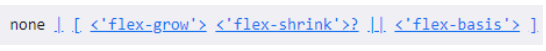

- **单值语法:值必须为以下其中之一:**
  - 一个无单位数(< \number>):它会被当做\< flex-grow>的值
  - 一个有效的宽度(width)值:它会被当作\< flex-basis>的值
  - 关键字 none,auto 或者 initail
- **双值语法:第一个值必须为一个无单位数,并且它会被当作\< flex-grow>的值**
  - 第二个值必须为以下之一:
    - 一个无单位数:它会被当作\< flex-shrink>的值
    - 一个有效的宽度值:它会被当作\< flex-basis>的值
- **三值语法:**
  - 第一个值必须为一个无单位数,并且它会被当作\< flex-grow>的值
  - 第二个值必须为一个无单位数,并且它会被当作\< flex-shrink>的值
  - 第三个值必须为一个有效的宽度值,并且它会被当作\< flex-basis>的值

## 思考:如下布局如何解决对齐问题

# 额外知识补充

## CSS 属性 - transform

- CSS transform 属性允许对某一个元素进行某些形变,包括==旋转,缩放,倾斜或平移等==
- transform 是==形变==的意思,transformer 就是变形金刚

- 注意事项,并非所有的盒子都可以进行 transform 的转换 ( 通常行内级元素不能进行形变 )

- 所以,transform 对于行内级非替换元素是无效的
  - 比如对 span、a 元素等

## transform 的用法

- transform 属性的语法如下:

- 常见的函数 transform function 有:

  - ==平移==: translate(x,y)
  - ==缩放==: scale(x,y)
  - ==旋转==: rotate(deg)
  - ==倾斜==: skew(deg,deg)

- 通过上面的几个函数,我们可以改变某个元素的形变

## 位移 - translate

- 平移: translate(x,y)
  - 这个 CSS 函数用于移动元素在平面上的位置
  - translate 本身可以表示翻译的意思,在物理上也可以表示平移
- 值个数
  - 一个值时,设置 x 轴上的位移
  - 两个值时,设置 x 轴和 y 轴上的位移
- 值类型
  - ==数字==:100px
  - ==百分比==:参照元素本身 (refer to the size of bounding box)

## translate 的补充

- 补充一:translate 是 translateX 和 translateY 函数的简写
  - translate3d 后续了解
- 补充二:translate 的百分比可以完成一个元素的水平和垂直居中

- translate 函数相对于 flex 布局的兼容性会好一点点
  - 不过目前 flex 布局已经非常普及,直接使用 flex 布局即可

## 缩放 - scale

- 缩放: scale(x,y)
  - sacle() CSS 函数可改变元素的大小
- 值个数
  - 一个值时,设置 x 轴上的缩放
  - 两个值时,设置 x 轴和 y 轴上的缩放
- 值类型
  - ==数字==:
    - 1:保持不变
    - 2:放大一倍
    - 0.5:缩小一半
  - ==百分比==:相对于自身
- scale 函数时 scaleX 和 scaleY 的缩写
  - scale3d 后续再了解

## transform - origin

- transform-origin:形变的原点
  - 比如在进行 scale 缩放或者 rotate 旋转时,都会有一个原点
- 一个值:
  - 设置 x 轴的原点
- 两个值:
  - 设置 x 轴和 y 轴的原点
- 必须是\< length>,\< percentage>,或 left,center,right,top,bottom 关键字中的一个
  - left,center,right,top,bottom 关键字
  - length:从左上角开始计算
  - 百分比:参考元素本身大小

## 缩放 - rotate

- 旋转: rotate(\< angle>)
- 值个数
  - 一个值时,标识旋转的角度
- 值类型:
  - 常用单位 deg:旋转的角度 (degress)
  - 正数为顺时针
  - 负数为逆时针
- 注意:旋转的原点受 transform-origin 的影响

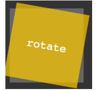

## rotate 补充

补充一：rotate 函数是 rotateZ 函数的简写写法。  rotate3d 后续再了解；

◼ 补充二：rotate 的其他单位  事实上 rotate 支持的单位是很多的；  度（degrees）、 百分度（gradians）、弧度（radians）或圈数（turns）；

## 倾斜 - skew

- 旋转: skew(x,y)
- 值个数
  - 一个值时,标识 x 轴上的倾斜
  - 两个值时,表示 x 轴和 y 轴的倾斜
- 值类型:
  - deg:旋转的角度
  - 正数为顺时针
  - 负数为逆时针

- 注意:倾斜的原点受 transform-origin 的影响

## transform 设置多个值

- 前面我们看到了 transform 的语法,它是可以设置多个 transform-function 的
  - 那么就意味着,我们可以给 transform 设置==多个形变的函数==

## 认识 transition 动画

- 什么是 transition 动画呢?
  - CSS transitions 提供了一种在更改==CSS 属性时==控制==动画速度的方法==
  - 可以让 css 属性变化成为一个==持续一段时间的过程==,而==不是立即生效==的
  - 比如将一个元素从==一个位置移动到另一个位置==,默认在修改完 CSS 属性后会立即生效
  - 但是我们可以通过 CSS transition, 让==让这个过程加上一定的动画效果==,包括==一定的曲线速率变化==
- 通常将两个状态之间的过渡称为隐士过渡 (implicit transitions) , 因为开始与结束之间的状态==由浏览器决定==

- CSS transitions 可以决定
  - 哪些属性发生动画效果 (明确地列出这些属性)
  - 何时开始(设置 delay)
  - 持续多久(设置 duration)
  - 如何动画(定义 timing function, 比如匀速地或先快后慢)

## 哪些 CSS 属性可以做动画呢?

- 并非所有的 CSS 属性都可以执行动画的,那么我们如何知道哪些属性支持动画呢?
- 方法一:在 MDN 可==执行动画的 CSS 属性==中查询
  - https://developer.mozilla.org/zh-CN/docs/Web/CSS/CSS_animated_properties
- 方法二:阅读 CSS 属性的文档说明

## 过渡动画 - transition

- transition CSS 属性是 transition-property,transition-duration,transition-timing-function 和 transition-delay 的一个简写属性

- ==transition-property==:指定应用过渡属性的名称
  - all: 所有属性都执行动画
  - none: 所有属性都不执行动画
  - CSS 属性名称: 要执行动画的 CSS 属性名称,比如 width、left、transform 等
- ==transition-duration==:指定过渡动画所需的时间
  - 单位可以是秒 (s) 或毫秒 (ms)
- ==transition-timing-function==:指定动画的变化曲线
  - https://developer.mozilla.org/zh-CN/docs/Web/CSS/transition-timing-function
- ==transition-delay==:指定过渡动画执行之前的等待时间

## 几个英语词汇的区分

- ==transform==是形变:
  - 一个 CSS 属性,该 CSS 属性用于设置形变
  - 后面的值是形变的函数,比如 scale、rotate、translate
- ==translate==是其中一个 transform-function
  - 用于对元素进行平移
- ==transition==是过渡的意思
  - 它本身也有转变的含义,但是更多表示的是过渡的过程

## 认识 CSS Animation

- 之前我们学习了 transition 来进行过渡动画,但是过渡动画有如下的缺点
  - transition==只能定义开始状态和结束状态==,不能定义中间状态,也就是说只有两个状态
  - transition==不能重复执行==,除非一再触发动画
  - transition 需要在==特定状态下会触发才能执行==,比如某个属性被修改了
- 如果我们希望可以有更多的状态的变化,我们可以使用 **CSS Animation**
- **CSS Animation 的使用分成两个步骤**
  - ==步骤一==:使用 keyframes 定义动画序列 (每一帧动画如何执行)
  - ==步骤二==:配置动画执行的名称、持续时间、动画曲线、延迟、执行次数、方向等等

## @keyframes 规则

- **可以使用@keyframes 来定义多个变化状态,并且使用 animation-name 来声明匹配:**
  - 关键帧使用==percentage==来指定动画发生的时间点
  - ==0%==表示动画的第一时刻,==100%==表示动画的最终时刻
  - 因为这两个时间点十分重要,所以还有特殊的别名:==from==和==to==
- **也就是说可以使用 from 和 to 关键字**
  - from 相当于 0%
  - to 相当于 100%

## animation 属性

- **CSS animation 属性是 animation-name, animation-duration, animation-timing-function, animation-delay, animation-iteration-count, animation-direction, animation-fill-mode 和 animation-play-state 属性的一个简写属性形式**
- ==animation-name==:指定执行哪一个关键帧动画
- ==animation-duration==:指定动画的持续时间
- ==animation-timing-function==:指定动画的变化曲线
- ==animation-delay==:指定延迟执行的时间
- ==animation-iteration-count==:指定动画执行的次数,执行 infinite 表示无限动画
- ==animation-direction==:指定方向,常用值 normal 和 reverse
- ==animation-fill-mode==:执行动画最后保留哪一个值
  - none:回到没有执行动画的位置
  - forwards:动画最后一帧的位置
  - backwards:动画第一针的位置
- ==animation-play-state==:指定动画运行或者暂停（在 JavaScript 中使用，用于暂停动画）

## CSS 属性 - vertical-align

## 深入理解 vertical-align - line boxes

- **官方文档的翻译: vertical-align 会影响==行内跨级元素==在一个==行盒==中垂直方向的位置**
- **思考:一个 div 没有设置高度的时候,会不会有高度?**
  - 没有内容,没有高度
  - 由内容,内容撑起来高度
- **但是内容撑起来高度的本质是什么呢?**
  - 内容有行高(line-height),撑起来 div 的高度
  - 有内容,内容撑起来高度
- **但是内容撑起来高度的本质是什么呢?**
  - 内容有行高 (line-height), 撑起来了 div 的高度
- **行高为什么可以撑起 div 的高度?**
  - 这是因为==line boxes==的存在,并且 line-boxes 有一个特性,包裹每行的 inline level
  - 而其中的文字是有行高的,必须将整个行高包裹进去,才算包裹这个 line-level
- **那么,进一步思考:**
  - 如果这个 div 中有图片,文字,inline-block,甚至他们设置了 margin 这些属性呢?

## 深入理解 vertical-align - 不同情况分析

- **情况一:只有文字时,line boxes 如何包裹内容? (注意:红色是包裹的 div,下面也都一样)**

- **情况二:有图片,有文字时,line-boxes 如何包裹内容?**

- **情况三:有图片,有文字,有 inline-block (比图片要大) 如何包裹内容?**

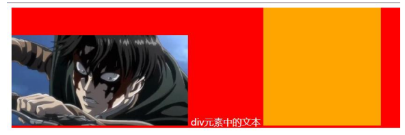

## 深入理解 vertical-align - 不同情况分析

- **情况四:有图片,有文字,有 inline-block (比图片要大) 而且设置了 margin-bottom 如何包裹内容?**

- **情况五:有图片、文字、inline-block (比图片要大) 而且设置了 margin-bottom 并且有文字,如何包裹内容?**

## vertical-align 的 baseline

- **结论:line-boxes 一定会想办法包裹住当前行中所有的内容**
- **但是,为什么对齐方式千奇百怪呢?**
  - 你认为的千奇百怪,其实有它的内在规律
  - 答案就是==baseline==对齐
- **我们来看官方 vertical-align 的默认值:没错,就是 baseline**

- **但是 baseline 都是谁呢?**
  - 文本的 baseline 是字母 x 的下方
  - inline-block 默认的 baseline 是 margin-bottom 的底部 (没有,就是盒子的底部)
  - inline-block 有文本时,baseline 是最后一行文本的 x 的下方
- **一切都解释通了**

## vertical-align 的其他值

- **现在,对于不同的取值就非常容易理解了**
  - ==baseline==(默认值):基线对齐 (你得先明白什么是基线)
  - ==top==:把行内级盒子的顶部跟 line boxes 顶部对齐
  - ==middle==:行内盒子的中心点与父盒基线加上 x-height 一半的线对齐
  - ==bottom==:把行内级盒子的底部跟 line box 底部对齐
  - \< percentage>:把行内级盒子提升或者下降一段距离(距离相对于 line-height 计算\元素高度),0%意味着同 baseline 一样
  - \< length>:把行内级盒子提示或者下降一段距离,0cm 意味着同 baseline 一样
- **解决图片下边缘的间隙方法:**
  - ==方法一==:设置成 top/middle/bottom
  - ==方法二==:将图片设置为 block 元素

# 项目实战

## 代码规范

- https://guide.aotu.io/

## CSS 编写顺序

## CSS 编写顺序的思路

- 1.先确定盒子本身是如何布局的
  - \*position:absolute
  - \*float:left/right
  - \*display:flex
- 2.盒子的特性和可见性
  - \*display:block/inline-block/inline/none
  - \*visibility/opacity
- 3.盒子模型
  - \*width/height
  - \*box-sizing
  - \*margin/border/padding/content
  - \*box-shadow/text-shadow
- 4.内部的文本文字
  - \*font/text
- 5.background
  - background-image/size/position/color
- 6.其他
  - transform/transition/overflow/white-space

## 组件化开发思路

- 事实上目前 Vue、React、小程序都采用的是组件化开发思路

## meta 元素

- **meta 元素用于定义元数据:**
  - 在之前讲解 head 的时候说过,head 中用于定义==元数据==
  - 比如标题 title、样式 style、link 外部资源等
  - meta 用于定义那些不能使用其他定元相关(meta-related)元素定义的任何元数据信息
- **meta 元素定义的元数据的类型包括以下几种:**
  - 如果设置了==charset==属性,meta 元素是一个字符集声明,告诉文档使用哪种字符编码
  - 如果设置了==http-equiv==,meta 元素则是编译指令
  - 如果设置了==name 属性==,meta 元素提供的是文档级别 (document-level)的元数据,应用于整个页面

## meta 元素的 http-equiv 属性

- 我们会发现,无论是默认创建的 html 页面还是王者荣耀都有如下代码

- 它的作用到底是什么呢?网上众说纷纭,我们直接看官方文档的解释:
  - 告知 IE 浏览器去模仿哪一个浏览器的行为
  - IE=edge,告知 IE8 使用最高有效模式来模仿

## meta 元素的 name 属性

- **name 属性的值非常多,具体的内容可以查看文档:**
  - https://developer.mozilla.org/zh-CN/docs/Web/HTML/Element/meta/name
- **我们介绍几个常用的:**
- ==robots==:爬虫、协作搜寻器,或者"机器人",对此页面的处理行为,或者说,应当遵守的规则
- ==author==:文档作者的名字
- ==Copyright==:版权声明
- ==description==:一段简短而精确的、对页面内容的描述
  - 一些浏览器,比如 Firefox 和 Opera, 将其用作书签的默认描述
- ==keywords==:与此页面内容相关的关键词,使用逗号分隔。某些搜索引擎会进行收录

## link 图标

- **Favicon 是==favorites icon==的缩写,亦被称为 website icon(站点图标)、page icon (页面图标);**
- **前面我们已经学习了它的用法:**

- **事实上它还有很多兼容性的写法:**

- **这里有一个疑惑?**
  - 为什么王者荣耀没有 link 元素也可以正常显示图标呢?

- 下面的 link 使用方法表示有另一个课替换的网站供选择

## CSS 样式的字符编码

- **之前我们有指定过 HTML 页面的编码,但是并没有指定 CSS 样式的编码**
  - 那么 CSS 样式的字符编码会按照什么规则来使用呢?
- **在样式表中有很多种方法去声明字符编码,浏览器会按照以下顺序尝试下面的方法(一单找到就停止并得出结果)**

  - 1.文件的开头的 Unicode byte-order (字节顺序标记) 字符值
    - https://en.wikipedia.org/wiki/Byte_order_mark
  - 2.由 Content-Type:HTTP header 中的 charset 属性给出的值或用于提供样式表的协议中的等效值
  - 3.CSS @规则 @charset
  - 4.使用参考文档定义的字符编码: \< link>元素的 charset 属性
    - 该方法在 HTML5 标准中已废除,无法使用
  - 5.假设文档是 UTF-8

- 开发中推荐在 CSS 的开头编写@charset 指定编码

## 额外知识补充(一)

## HTML5 语义化元素

- **在 HTML5 之前,我们的网站分布层级通常包括哪些部分呢?**
  - header、nav、main、footer
- **但是这样做有一个弊端:**
  - 我们往往==过多的使用 div==,通过 id 或 class 来区分元素
  - 对于浏览器来说这些==元素不够语义化==
  - 对于搜索引擎来说==不利于 SEO 的优化==
- **HTML5 新增了语义化的元素**
  - ==\< header>== 头部元素
  - ==\< nav>== 导航元素
  - ==\< section>== 定义文档某个区域的元素
  - ==\< article>== 内容元素
  - ==\< aside>== 侧边栏元素
  - ==\< footer>== 尾部元素

## HTML5 其他新增元素

- Web 端事实上一直希望可以**更好的嵌入音频和视频**,特别是 21 世纪以来,用户带宽的不断提高,浏览器因为看视频变得容易
  - 在 HTML5 之前是通过 flash 或者其他插件实现的,但是会有很多问题
  - 比如==无法很好的支持 HTML/CSS 特性,兼容性问题==等等
- **HTML5 增加了对媒体类型的支持:**
  - 音频 ==\< audio>==
  - 视频 ==\< video>==
- Video 和 Audio 使用方式有两个
  - 一方面我们可以直接通过元素使用 video 和 audio
  - 另一方面我们可以通过 javaScript 的 API 对其进行控制

## HTML5 新增元素 - video

- **HTML\< video>元素用于在 HTML 或者 XHTML 文档中嵌入媒体播放器,用于支持文档内的视频播放**

- **video 常见的属性:**

## video 支持的视频格式

- **每个视频都会有自己的格式,浏览器的 video 并非支持所有的视频格式**

## video 的兼容性写法

- **在\< video>元素中间的内容,是针对浏览器不支持此元素时候的降级处理**
  - 内容一:通过==\< source>元素==指定更多视频格式的源
  - 内容二:通过==p/div 等元素==指定在浏览器不支持 video 元素的情况下,显示内容

## HTML5 新增元素 - audio

- **HTML\< audio>元素用于在文档中嵌入音频内容,和 video 的用法非常类似**

- **常见属性:**

## audio 支持的音频格式

- **每个音频都会有自己的格式,浏览器的 audio 并非支持所有的视频格式**
- **具体的支持的格式可以通过下面的链接查看**
- [Web audio codec guide - Web media technologies | MDN (mozilla.org)](https://developer.mozilla.org/en-US/docs/Web/Media/Formats/Audio_codecs)
- **在\< audio>元素中间的内容,是针对浏览器不支持此元素时候的降级处理**

## input 元素的扩展内容

- **HTML5 对==input 元素==也进行了扩展,在之前我们已经学习过其中几个属性也是 HTML5 的特性:**

  - ==placeholder==:输入框的占位文字
  - ==multiple==:多个值
  - ==autofocus==:自动聚焦

- **另外对于 input 的 type 值也有很多扩展:**

  - ==data==
  - ==time==
  - ==number==
  - ==tel==
  - ==color==
  - ==email==
  - 等等

- **查看 MDN 文档:**

[：输入（表单输入）元素 - HTML（超文本标记语言） | MDN (mozilla.org)](https://developer.mozilla.org/zh-CN/docs/Web/HTML/Element/Input)

## 新增全局属性 data-\*

- **在 HTML5 中,新增一种全局属性的格式 data-\*,用于自定义数据属性:**
  - data 设置的属性可以在 javaScript 的 DOM 操作中通过==dataset==轻松获取到
  - 通常==用于 HTML 和 javaScript 数据之间的传递==

- 在小程序中,就是==通过 data-来传递数据==的,所以该全局属性必须要掌握

## CSS 属性 - white-space

- **white-space 用于设置空白处理和换行规则**
- ==normal==:合并所有连续的空白,==允许==单词超屏时自动换行
- ==nowrap==:合并所有连续的空白,==不允许==单词超屏时自动换行
- ==pre==:==阻止==合并所有连续的空白,==不允许==单词超屏时自动换行
- ==pre-wrap==:==阻止==合并所有连续的空白,==允许==单词超屏时自动换行
- ==pre-line==:合并所有连续的空白(单保留换行), ==允许==单词超屏时自动换行

## CSS 属性 - text-overflow

- **text-overflow 通常用来设置文字溢出时的行为**
- ==clip==:溢出的内容直接裁剪掉 (字符可能会显示不完整)
- ==elipsis==:溢出那行的结尾处用省略号表示

- text-overflow 生效的前提是 overflow 不为 visible

- 常见的是将 white-space、text-overflow、overflow 一起使用

## CSS 中的函数

- **在前面我们有使用过很多个 CSS 函数:**
  - 比如==rgb/rgba/translate/rotate/scale==等
- **下面我们再学习几个非常好用的 CSS 函数:**
  - ==var==:使用 CSS 定义的变量
  - ==calc==:计算 CSS 值,通常用于计算元素的大小或位值
  - ==blur==:毛玻璃(高斯模糊)效果
  - ==gradient==:颜色渐变函数

## CSS 函数 - var

- **CSS 中可以自定义属性**
  - ==属性名==需要以==两个减号(--)==开始
  - ==属性值==则可以是==任何有效的 CSS 值==

- **我们可以通过 var 函数来使用:**

## CSS 函数 - calc

- **calc()函数允许在声明 CSS 属性值时执行一些计算**
  - 计算支持==加减乘除==的运算
    - +和-运算符的==两边必须要有空白字符==
  - 通常用来==设置一些元素的尺寸或者位置==

## CSS 函数 - blur

- **blur 函数将==高斯模糊==应用于输出图片或者元素**
  - ==blur(radius)==
  - ==radius==,模糊的半径,用于定义高斯函数的偏差值,偏差值越大,图片越模糊
- **通常会和两个属性一起使用**
  - ==filter==:将模糊或颜色偏移等图形效果应用于元素
  - ==backdrop-filter==:为元素后面的区域添加模糊或者其他效果

## CSS 函数 - gradient

- **\< gradient>常见的函数实现有下面几种:**
  - ==liner-gradient()==:创建了一个表示两种或多种颜色线性渐变的图片
  - ==radial-gradient()==:创建了一个图像,该图像是由从原点发出的两种或者多种颜色之间的逐步过渡组成
  - ==repeating-liner-gradient()==创建一个由重复线性渐变组成的\< image>
  - ==repeating-radial-gradient()==:创建一个重复的原点触发渐变组成\< image>
  - 等等

## liner-gradient 的使用

- **liner-gradient:创建一个表示两种或多种颜色线性渐变的图片**

- **radial-gradient:创建了一个图像,该图像是由从原点发出的两种或者多种颜色之间的逐步过渡组成**

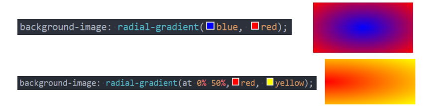

## 浏览器前缀

- **有时候可能会看到有些 CSS 属性名前面带有: ==-o-、-xv-、-ms-、-mso-、-moz-、-webkit-==**

- **官方文档专业术语叫做:vendor-specific extensions (供应商特定扩展)**
- **为什么需要浏览器前缀了?**
  - CSS 属性刚开始==并没有成为标准==,浏览器为了==防止后续会修改名字给新的属性添加了浏览器前缀==
- **上述前缀叫做浏览器私有前缀,只有对应的浏览器才能解析使用**
  - -o-、-xv-: Opera 等
  - -ms-、-mso-: IE 等
  - -moz-: Firefox 等
  - -webkit-: Safari、 Chrome 等

## FC - Formatting Context

- **什么是 FC 呢?**

- **FC 的全称是 Formatting Context, 元素在标准流里面都是属于一个 FC 的**

- **块级元素的布局属于 Block Formatting Context (BFC)**
  - 也就是==block level box==都是在==BFC==中布局的
- **行内级元素的布局属于 inline Formatting Context(IFC)**
  - 而==inline level box==都是在==IFC==中布局的

## BFC - Block Formatting Context

- **block level box 都是在 BFC 中布局的,那么这个 BFC 在哪里呢? 拿出来给我看看**

- **MDN 上有整理出在哪里具体的情况下会创建 BFC**
  - 根元素(\< html>)
  - 浮动元素(元素的 float 不是 none)
  - 绝对定位元素(元素的 position 为 absolute 或 fixed)
  - 行内块元素 (元素的 display 为 inline-block)
  - 表格单元格(元素的 display 为 table-cell,HTML 表格单元格默认为该值), 表格标题(元素的 display 为 table-caption, HTML 表格标题默认为该值)
  - 匿名表格单元格元素(元素的 display 为 table、table-row、table-row-group、table-header-group、table-footer-group (分别是 HTML table、row、tbody、thead、tfoot 的默认属性) 或 inline-table)
  - overflow 计算值(Conmputed)不为 visible 的块元素
  - 弹性元素 (display 为 flex 或 inline-flex 元素的直接子元素)
  - 网格元素 (display 为 grid 或 inline-grid 元素的直接子元素)
  - display 值为 flow-root 的元素

## BFC 有什么作用呢?

- **我们来看一下官方文档对 BFC 作用的描述**

- **简单概况如下:**
  - 在 BFC 中,box 会在==垂直方向上一个挨着一个==的排布
  - ==垂直方向的间距由 margin 属性==决定
  - 在同一个 BFC 中,==相邻两个 box 之间的 margin 会折叠(collapse)==
  - 在 BFC 中,每个元素的==左边缘是紧挨着包含块的左边缘==的
- **那么这个东西有什么用呢？**
  - 解决 margin 的折叠问题
  - 解决浮动高度坍塌问题

## BFC 的作用一:解决折叠问题(权威)

- **在同一个 BFC 中,相邻两个 box 之间的 margin 会折叠(collapse)**
  - 官方文档明确的有说
  - ==The vertical distance between two sibling boxes is determined by the 'margin' properties. Vertical margins between adjacent block-level boxes in a block formatting context collapse.==
  - 那么如果我们让两个 box 是不同的 BFC 呢?那么就可以解决折叠问题

## BFC 的作用二:解决浮动高度坍塌(权威)

- **网上有很多说法,BFC 可以解决浮动高度坍塌,可以实现清除浮动的效果**
  - 但是==从来没有给出过 BFC 可以解决高度坍塌的原理或者权威的文档说明==
  - 他们也压根没有办法解释,为什么可以解决浮动高度的坍塌问题,但是==不能解决绝对定位元素的高度坍塌问题==呢?
- **事实上,BFC 解决高度坍塌需要满足两个条件:**
  - 浮动元素的父元素触发 BFC,形成独立的块级格式化上下文 (Block Formatting Context)
  - 浮动元素的父元素的高度是 auto 的
- **BFC 的高度是 auto 的情况下,是如下方法计算高度的**
  - 1.如果只有 inline-level,是行高的顶部和底部的距离
  - 2.如果有 block-level,是由最底层的上边缘和最底层块盒子的下边缘之间的距离
  - 3.如果有绝对定位元素,将被忽略
  - ==4.如果有浮动元素,那么会增加高度以包括这些浮动元素的下边缘==

## 媒体查询

- 媒体查询是一种提供给**开发者**针对**不同设备需求**进行**定制化开发**的一个接口
- 你可以根据**设备的类型(比如屏幕设备、打印机设备) 或者特定的特性 (比如屏幕的宽度) 来修改你的页面**

- **媒体查询的使用方式主要有三种:**
  - 方式一:通过==@media 和@import==使用不同的 CSS (常用)
  - 
  - 方式二:使用==media 属性为\< style>,\< link>,\< source>和其他 HTML 元素指定特定的媒体类型==
  - 方式三:使用 Window.matchMedia()和 MediaQueryList.addListener()方法来测试和监控媒体状态

## 媒体查询 - 媒体类型 (Media types)

- **在使用媒体查询时,你必须指定要使用的媒体类型**
  - 媒体类型是可选的,并且(隐式地)应用 all 类型
- **常见的媒体类型值如下:**

  - ==all==:适用于所有设备
  - ==print==:适用于在打印预览模式下在屏幕上查看的分页材料和文档
  - ==screen==(掌握): 主要用于屏幕
  - ==speech==:主要用于语音合成器

- **被废弃的媒体类型:**
  - CSS2.1 和 Media Queries 3 定义了一些额外的媒体类型(tty,tv,projection,handheld,braille,embossed,以及 aural)
  - 但是他们在 Media Queries 4 中已经被废弃,并且不应该被使用
  - aural 类型被替换为具有相似效果的 speech

## 媒体查询 - 媒体特性 (Media features)

- 媒体特性( Media features )描述了 浏览器、输出设备,或是预览环境的具体特征
  - 通常会将媒体特性描述为一个表达式
  - 每条媒体特性表达式都必须用括号括起来

## 媒体查询 - 逻辑操作符 (logical operators)

- **媒体查询的表达式最终会获取一个 Boolean 值,也就是真(true) 或者假 (false)**
  - 如果结果为真(==true==),那么就会生效
  - 如果结果为假(==false==),那么就不会生效
- **如果有多个条件,我们可以通过逻辑操作符联合复杂的媒体查询:**
  - ==and==:and 操作符用于将多个媒体查询规则组合成单条媒体查询
  - not:not 运算符用于否定媒体查询,如果不满足这个条件则返回 true,否则返回 false
  - only:only 运算符仅在整个查询匹配时才用于应用样式
  - ,(逗号): 逗号用于将多个媒体查询合并为一个规则
- **比如下面的媒体查询,表示:屏幕宽度大于 500,小于 700 的时候,body 背景颜色为红色**

## 常见的移动端设备

- 这里我们以 iPhone 为例

## CSS 中的单位

- 前面编写的 CSS 中,我们经常会使用 px 来表示一个长度 (大小),比如 font-size 设置为 18px,width 设置为 100px
- **px 是一个长度(length)单位,事实上 CSS 中海油非常多的长度单位**

- **整体可以分成两类:**

  ==绝对长度单位==(Absolute length units)

  ==相对长度单位==(Relative length units)

## CSS 中的绝对单位 ( Absolute length units)

- **绝对单位:**
  - 它们==与其他任何东西都没有关系==,通常==被认为总是相同的大小==
  - 这些值中的多数在==用于打印时==比用于屏幕输出时更有用,列如,我们通常不会再屏幕上使用 cm
  - 唯一一个经常使用的值,就是==px==(像素)

## CSS 中的相对单位 ( Relative lenght units)

- **相对长度单位**
  - 相对长度单位==相对于其他一些东西==
  - 比如==父元素的字体大小==,或者==视口端口的大小==
  - 使用相对单位的好处是,经过一些==仔细的规划==,您可以==使文本或其他元素的大小与页面的其他内容==相对应

## 当我们聊 pixel 时,到底在聊些什么?

- **前面我们已经一致在使用 px 单位了,px 是 pixel 单词的缩写,翻译为像素**
- **那么像素到底是什么呢?**
  - ==像素是影响显示的基本单位== (比如屏幕上看到的画面、一副图片)
  - pix 是英语单词==picture==的常用简写,加上英语单词"元素"==element==就得到 pixel
  - "像素"表示"画像元素"之意,有时亦被称为==pel(picture element)==

## 像素的不同分类 (一)

- **但是这个 100 个 pixel 到底是多少呢？**
  - 我们确实可以在屏幕上看到一个大小,但是这个大小代表的真实含义是什么呢?
  - 我们经常说一个电脑的分辨率、手机的分辨率,这个 CSS 当中的像素又是什么关系呢?

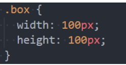

- **这里我们要深入到不同的像素概念中,来理解 CSS 中的 pixel 到底代表什么含义**
- **像素单位常见的有三种像素名称:**
  - ==设备像素== (也称之为物理像素)
  - ==设备独立像素== (也称之为逻辑像素)
  - ==CSS 像素==

## 物理像素和逻辑像素

- **设备像素,也叫物理像素**
  - 设备像素指的是==显示器上的真实像素==,==每个像素的大小是屏幕固有的属性==,==屏幕出厂以后就不会改变==了
  - 我们在购买==显示器或者手机的时候==,提到的==设备分辨率就是设备像素的大小==
  - 比如==iPhone X 的分辨率 1125\*2436,指的就是设备像素==
- **设备独立像素,也叫逻辑像素**
  - 如果==面向开发者==我们使用==设备像素显示一个 100px 的宽度==,那么==在不同屏幕上显示效果会是不同==
  - 开发者==针对不同的屏幕==很难进行较好的适配,编写程序必须==了解用户的分辨率==来进行开发
  - 所以在设备像素之上,==操作系统为开发者进行抽象,提供了逻辑像素的概念==
  - 比如你购买了一台显示器,在==操作系统上是以 1920*1080 设置的显示分辨率==,那么无论你购买的是==2k、4k 的显示器==,对于开发者来说,都是 1920*1080 的大小
- **CSS 像素**
  - CSS 中我们经常==使用的单位也是 pixel==,它在==默认情况下等同于设备独立像素==(也就是逻辑像素)
  - 毕竟逻辑像素才是面向我们开发者的
- 我们可以通过 javaScript 中的==screen.width 和 screen.height==获取到电脑的逻辑分辨率

## DPR、PPI

- **DPR、PPI**
  - 2010 年,iPhone4 问世,不仅仅带来了==移动互联网==,还带来了==Retina 屏幕==
  - Retina 屏幕翻译为==视网膜显示器==,可以为用户带来==更好的显示==
  - 在 Retina 屏幕中,==一个逻辑像素在长度==上对应==两个物理像素==,这个比例称之为==设备像素比== (device pixel ratio)
  - 我们可以通过==window.devicePixelRatio==获取到当前屏幕上的 DPR 的值

- **PPI (了解): 每英寸像素 (英语:Pixels Per Inch, 缩写:PPI)**
  - 通常用来表示一个打印图像或者显示器上像素的密度
  - 前面我们提过 1 英寸 = 2.54 里面,在工业领域被广泛应用

## CSS 编写的痛点

- **CSS 作为一种==样式语言==,本身用来==给 HTML 元素添加样式==是没有问题的**
- **但是目前前端项目已经越来越复杂,不再是简简单单的几行 CSS 就可以搞定的,我们需要几千行甚至上万行的 CSS 来完成页面的美化工作**
- **随着代码量的增加,必然会造成很多的编写不便:**
  - 比如大量的重读代码,虽然可以用==类来勉强管理和抽取==,但是==使用起来依然不方便==
  - 比如==无法定义变量 (当然目前已经支持)==,如果一个值被修改,那么需要==修改大量代码,可维护性很差==(比如主题颜色)
  - 比如==没有专门的作用域和嵌套==,需要==定义大量的 id/class 来保证选择器的准确性==,避免样式混淆
  - 等等一系列的问题
- **所以有一种对 CSS 称呼是==面向命名编程==**
  - CSS 预处理器是一个能让你通过==预处理器自己独有的语法==来生成 CSS 的程序
  - 市面上有很多==CSS 预处理器可供选择==,且绝大多数 css 预处理器会==增加一些原生 css 不具备的特性==
  - 代码最终==会转化为 css 来运行==,因为==对于浏览器来说只是别 css==

## 常见的 CSS 预处理器

- **常见的预处理器有哪些呢? 目前使用较多的三种预处理器:**
- **Sass/Scss:**

  - 2007 年诞生,最早也是最成熟的 CSS 预处理器,拥有 ruby 社区的支持,是属于 Haml (一种模板系统)的一部分
  - 目前受 LESS 影响,已经进化到了==全面兼容 CSS 的 SCSS==

- **Less:**
  - 2009 年出现,受 SASS 的影响较大,但又==使用 CSS 的语法==,让大部分==开发者容易上手==
  - 比起 SASS 来,可编程功能不够,不过优点是使用方式简单、便捷、兼容 CSS,并且已经足够使用
  - 另外反过来也影响了 SASS 演变到了 SCSS 的时代
  - 著名的 Twitter Bootstrap 就是采用 LESS 做底层语言的, 也包括 React 的 UI 框架 AntDesign
- **Stylus:**
  - 2010 年产生,来自 Node.js 社区,主要用来给 Node 项目进行 CSS 预处理器支持
  - 语法偏向于 Python,使用率相对于 Sass/Less 少很多

## 认识 Less

- **什么是 Less 呢?我们来看一下官方的介绍:**
  - it's CSS, with just a little more

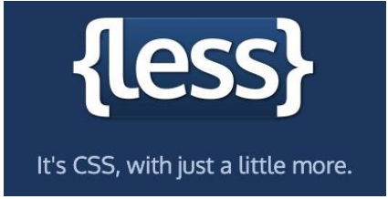

- **Less (Leaner Style Sheets 的缩写) 是一门 CSS 扩展语言,并且兼容 CSS**
  - Less 增加了很多==相比于 CSS 更好用的特性==
  - 比如==定义变量、混入、嵌套、计算==等等
  - ==Less 最终需要被编译成 CSS 运行于浏览器==中 (包括部署到服务器中)

## 编写 Less 代码

- **我们可以编写如下的 Less 代码:**

## less 代码的编译

- **这段代码如何被编译成 CSS 代码运行呢?**
- **方式一:下载 Node 环境,通过 npm 包管理下载 less 工具,使用 less 工具对代码进行编译**
  - 因为目前我们还没有学习过 Node,更没有学习过 npm 工具
  - 所以现阶段不推荐大家使用 less 本地工具来管理
  - 后续我们学习了 webpack 其实可以自动完成这些操作的
- **方式二:通过 VSCode 插件来编译成 CSS 或者在线编译**
  - [Less Preview (online playground) (lesscss.org)](https://lesscss.org/less-preview/#eyJjb2RlIjoiI2xpYigpIHtcbiAgICAuY29sb3JzKCkge1xuICAgICAgQHByaW1hcnk6IGJsdWU7XG4gICAgICBAc2Vjb25kYXJ5OiBncmVlbjtcbiAgICB9XG4gICAgLnJ1bGVzKEBzaXplKSB7XG4gICAgICBib3JkZXI6IEBzaXplIHNvbGlkIHdoaXRlO1xuICAgIH1cbiAgfVxuICBcbiAgLmJveCB3aGVuICgjbGliLmNvbG9yc1tAcHJpbWFyeV0gPSBibHVlKSB7XG4gICAgd2lkdGg6IDEwMHB4O1xuICAgIGhlaWdodDogKCR3aWR0aCAvIDIpO1xuICB9XG4gIFxuICAuYmFyOmV4dGVuZCguYm94KSB7XG4gICAgQG1lZGlhIChtaW4td2lkdGg6IDYwMHB4KSB7XG4gICAgICB3aWR0aDogMjAwcHg7XG4gICAgICAjbGliLnJ1bGVzKDFweCk7XG4gICAgfVxuICB9IiwiYWN0aXZlVmVyc2lvbiI6IjQueCJ9)
- **方式三:引入 CDN 的 less 编译代码,对 less 进行实时的处理**

- **方式四:将 less 编译的 js 代码下载到本地,执行 js 代码对 less 进行编译**

## Less 语法一:Less 兼容 CSS

- **Less 语法一:Less 是兼容 CSS 的**
  - 所以我们可以在 Less 文件中编写所有的 CSS 代码
  - 只是将 css 额==扩展名改成了.less==结尾而已

## Less 语法二 - 变量 (Variables)

- **在一个大型的网页项目中,我们 CSS 使用到的某几种属性值往往是特定的**

  - 比如我们使用到的主题颜色值,那么每次编写类似于==#f3c258==格式的语法
  - 一方面是记忆不太方便,需要重新编写或者拷贝样式
  - 另一方面如果有一天主题颜色改变,我们需要修改大量的代码
  - 所以,我们可以将常见的颜色或者字体等定义为变量来使用

- **在 Less 中使用如下的格式来定义变量**

  ==@变量名:变量值;==

  

## Less 语法三 - 嵌套 (Nesting)

- **在之前的项目,当我们需要找到一个内层的元素时,往往需要嵌套很多层的选择器**

- **Less 提供了选择器的嵌套**

- **特殊符号: ==&表示当前选择器的父级==**

## Less 语法四 - 运算 (Operations)

- **在 Less 中,算术运算符+、-、\*、/可以对任何数字、颜色或变量进行运算**
  - 算术运算符在加、减比较之前会进行单位换算,计算的结果==以最左侧操作数的单位类型==为准
  - 如果==单位换算无效或失去意义,则忽略单位==

## Less 语法五 - 混合 (Mixins)

- **在原来的 CSS 编写过程中,多个选择器中可能会有大量相同的代码**
  - 我们希望可以==将这些代码抽取到一个独立的地方==,==任何选择器都可以进行复用==
  - 在 less 中提供了==混入 (Mixins)== 来帮助我们完成这样的操作
- **混合 (Mixin)是一种将一组属性从一个规则集 (或混入) 到另一个规则集的方法**

- **注意:混入在没有参数的情况下,==小括号只可以省略,但是不建议这样使用==**

## Less 语法五 - 混合 (Mixins)

- **混入也可以传入变量(暂时了解)**

- **Less 语法六:映射 (Maps)**

- **混入和映射结合:混入也可以当做一个自定义函数来使用(暂时了解)**

## less 其他语法补充

- **Less 语法七:extend 继承**
  - 和 mixins 作用类似,用于==复用代码==
  - 和 mixins 相比,==继承代码最终会转化成并集选择器==

- **Less 语法八:Less 内置函数**
  - Less 内置了很多种函数用于转换颜色、处理字符串、算术运算等
  - 内置函数手册[Less 函数 | Less.js 中文文档 - Less 中文网 (bootcss.com)](https://less.bootcss.com/functions/)

## less 其他语法补充

- **Less 语法九:作用域(Scope)**
  - 在查找一个变量时,首先==在本地查找变量和混合 (mixins)==
  - 如果==找不到,则从"父"级作用域继承==

- **Less 语法十:注释 (Comments)**
  - 在 Less 中,==块注释和行注释==都可以使用
- **Less 语法十一:导入( Importing)**
  - ==导入的方式和 CSS 的用法==是一致的
  - 导入==一个.less 文件==,==此文件中的所有变量就可以全部使用==了
  - 如果导入==文件是.less 扩展名==,则可以==将扩展名省略掉==

## 认识 Sass 和 Scss

- **事实上,最初 Sass 是 Haml 的一部分,Haml 是一种模板系统,由 Ruby 开发者设计和开发**
- **所以,Sass 的语法使用的是==类似于 Ruby 的语法==,==没有花括号,没有分号,具有严格的缩进==**

- **我们会发现它的语法和 css 区别很大,后来官方==推出了全新的语法 SCSS,意思是 Sassy CSS==,他是==完全兼容 CSS==的**
- **目前在前端学习 SCSS 直接学习 SCSS 即可:**
  - SCSS 的语法也可以包括==变量、嵌套、混入、函数、操作符、作用域==等
  - 通常也包括==更为强大的控制语句、更灵活的函数、插值语法==等
  - 大家可以根据之前学习的 less 语法来学习一些 SCSS 语法
  - [Sass: Sass Basics (sass-lang.com)](https://sass-lang.com/guide)

## 什么是移动端适配

- **移动互联网的快速发展,让人们已经越来越习惯使用手机来完成大部分日常的事物**
  - 前端我们已经学习了大量的 HTML、CSS 的前端开发知识、并且也进行了项目实战
  - 这些知识也同样==适用于移动端开发==,但是如果想让一个页面==真正适配于移动端,我们最好多了解一些移动端的知识==
- **移动端开发目前主要包括三类:**
  - ==原生 App 开发== (IOS、Android、RN、uniapp、Flutter 等)
  - ==小程序开发== (原生小程序、uniapp、Taro 等)
  - ==Web 页面== (移动端的 Web 页面,可以使用浏览器或者 webview 浏览器)
- **因为目前移动端设备较多,所以我们需要对其进行一些适配**

- **这里有两个概念:**
  - ==自适应==:根据不同的设备屏幕大小来自动调整==尺寸、大小==
  - ==响应式:==会==随着屏幕的实时变动而自动调整,是一种自适应==

## 认识视口 viewport

- **在前面我们已经简单了解过视口的概念了:**
  - 在一个浏览器中,我们可以==看到的区域是视口(viewport)==
  - 我们说过==fixed 就是相对于视口来进行定位==的
  - 在==PC 端的页面==中,我们是==不需要对视口进行区分==,因为我们的==布局视口和视觉视口==是同一个
- **但是在移动端,不太一样,你布局的视口和你可见的视口是不太一样的**
  - 这是因为==移动端的网页窗口往往比较小==,我们可能会==希望一个大的网页在移动端可以完整的显示==
  - 所以在默认情况下,==移动端的布局是否是大于视觉视口==的
- **所以在移动端,我们可以将视口分为三种情况:**
  - ==布局视口== (layout viewport)
  - ==视觉视口== (visual viewport)
  - ==理想视口== (ideal viewport)
- **这些概念的区分,事实上来自 ppk,他也是对前端贡献比较大的一个人 (特别是在移动端浏览器)**
  - [A tale of two viewports — part two (quirksmode.org)](https://www.quirksmode.org/mobile/viewports2.html)

## 布局视口和视觉视口

- **布局视口 (layout viewport)**
- **默认情况下,一个在 PC 端的网页在移动端会如何显示呢?**
  - 第一,它会==按照宽度为 980px 来布局一个页面的盒子和内容==
  - 第二,为了==显示可以完整的显示在页面中,对整个页面进行缩小==
- **我们相对于 980px 布局的这个视口,称之为==布局视口(layout viewport)==**
  - 布局视口的默认宽度是==980px==
- **视觉视口 (visual viewport)**
  - 如果默认情况下,我们按照 980px 显示内容,那么==右侧有一部分区域就会无法显示==,所以==手机端浏览器会默认对页面进行缩放以显示到用户的可见区域==中
  - 那么==显示在可见区域的这个视口==,就是==视觉视口 (visual viewpoet)==
- **在 Chrome 上按 shift+鼠标左键可以进行缩放**

## 理想视口 (ideal viewport)

- **如果所有的网页都按照 980px 在移动端布局,那么最终页面都会被缩放显示**
  - 事实上这种方式是==不利于我们进行移动的开发==的,我们希望是==设置 100px,那么显示的就是 100px==
  - **如何做到这一点呢?**通过设置==理想视口(ideal viewport)==
- **理想视口 (ideal viewport)**
  - 默认情况下==layout viewport==并不适合我们进行布局
  - 我们可以对==layout viewport 进行宽度和缩放的设置==,以满足==正常在一个移动端窗口的布局==
  - 这个时候可以设置==meta 中的 viewport==

## 移动端适配方案

- **移动端的屏幕尺寸通常是非常繁多的,很多时候我们希望在不同的屏幕尺寸上显示不同的大小**
  - 比如我们设置一个 100\*100 的盒子
    - 在 375px 的屏幕上显示是 100\*100
    - 在 320px 的屏幕上显示的 90+\*90+
    - 在 414px 的屏幕上显示是 100+\*100+
  - 其他尺寸也是类似,比如==padding、margin、border、left、甚至是 font-size==等等
- **这个时候,我们可能可以想到一些方案来处理尺寸:**
  - ==方案一:百分比设置==
    - 因为不同属性的百分比值,相对的可能是不同参照物,所以百分比往往很难统一
    - 所以百分比在移动端适配中使用是非常少的
  - ==方案二:rem 单位+动态 html 的 font-size==
  - ==方案三:vw 单位==
  - ==方案四:flex 弹性布局==

## 适配方案 - rem + 动态 html 的 font-size

- **rem 单位是相对于 html 元素的 font-size 来设置的,那么如果我们需要在不同的屏幕下有不同的尺寸,可以动态的修改 html 的 font-size 尺寸**
- **比如如下案例:**
  - 1.设置一个==盒子的宽度是 2rem==
  - 2.设置==不同的屏幕上 html 的 font-size 不同==

- **这样在开发中,我们只需要考虑两个问题:**
  - 问题一:针对==不同的屏幕，设置 html 不同的 font-size==
  - 问题二:将==原来要设置的尺寸,转化成 rem 单位==

## rem 的 font-size 尺寸

- **方案一:媒体查询**
  - 可以通过==媒体查询来设置不同尺寸范围内的屏幕 html 的 font-size 尺寸==
  - 缺点
    - 1.我们需要==针对不同的屏幕编写大量的媒体查询==
    - 2.如果==动态改变尺寸,不会实时的进行更新==
- **方案二:编写 js 代码**
  - 如果希望==实时改变屏幕尺寸的,font-size 也可以实时更改,可以通过 js 代码==
  - 方法:
    - 1.根据 html 的宽度计算出==font-size 的大小==,并且==设置到 html==上
    - 2.监听==页面的实时改变==,并且==重新设置 font-size 的大小到 html==
- **方案三:lib-flexible 库**
  - 事实上,==lib-flexible 库做的事情是相同==的,你也可以直接引入它

## rem 的单位换算

- **方案一:手动换算**
  - 比如有一个在 375px 的屏幕上,100px 宽度和高度的盒子
  - 我们需要将 100px 转成对应的 rem 值
  - 100/37.5=2.66667,其他也是相同的方法计算即可
- **方案二:less/scss 函数**

## rem 的单位换算

- **方案三:postcss-pxtorem (后续学习)**
  - 目前在前端的工程化开发中,我们可以借助于 webpack 的工具来完成自动的转化
- **方案四:VSCode 插件**
  - px to rem 的插件,在编写时自动转化

## 适配方案 - vw

- **在 flexible GitHub 上已经有写过这样的一句话:**

- **所以它更推荐使用 viewport 的两个单位 vw、vh**
- **vw 的兼容性如何呢?**

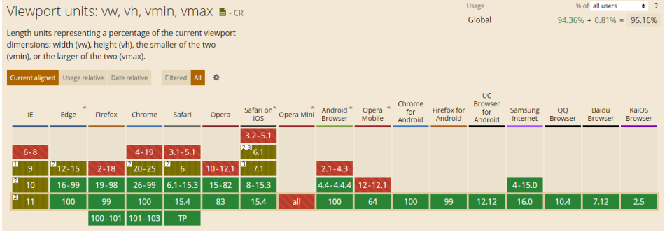

## vw 和 rem 的对比

- **rem 事实上是作为一种过渡的方案,它利用的也是 vw 的思想**
  - 前面不管是我们==自己编写的 js,还是 flexible 的源码==
  - 都是将==1rem 等同于设计稿的 1/10,==在利用==1rem 计算相对于整个屏幕的尺寸大小==
  - 那么我们来思考,==1vw 不是刚好等于屏幕的 1/100==吗?
  - 而且==相对于 rem 还更加有优势==
- **vw 相对于 rem 的优势:**
  - ==优势一:==不需要去计算 html 的 font-size 大小,也不需要给 html 设置这样一个 font-size
  - ==优势二：==不会因为设置 html 的 font-size 大小,而必须给 body 在设置一个 font-size,防止继承
  - ==优势三：==因为不依赖 font-szie 的尺寸,所以不用担心某些原因 html 的 font-size 尺寸被篡改,页面尺寸混乱
  - ==优势四：==vw 相比于 rem 更加语义化,1vw 刚才是 1/100 的 viewport 的大小
  - ==优势五:==可以具备 rem 之前所有的优点
- **vw 我们只面临一个问题,将尺寸换算成 vw 的单位即可**
- **所以,目前相比于 rem,更加==推荐大家使用 vw==(但是理解 rem 依然很重要)**

## vw 的单位换算

- **方案一:手动换算**
  - 比如有一个在 375px 屏幕上,100px 宽度和高度的盒子
  - 我们需要将 100px 转成对应的 vw 值
  - 100/3.75 = 26.667,其他也是相同的方法计算即可
- **方案二:less/scss 函数**

## vw 的单位换算

- **方案三: postcss-px-viewport-8-plugin**
  - 和 rem 一样，在前端的工程化开发中，我们可以借助于 webpack 的工具来 s 完成自动的转化；
- **方案四：VSCode 插件**
  - px to vw 的插件，在编写时自动转化；

