# 邂逅 javaScript

## 前端的三大核心

- 前端开发最主要需要掌握的是三个知识点:HTML、CSS、javaScript

## 计算机语言

- **前面我们已经学习了 HTML 和 CSS 很多相关的知识:**
  - 在之前我们提到过,HTML 是一种==标记语言==,CSS 也是一种==样式语言==
- **他们本身都是属于计算机语言,因为都在和计算机沟通交流**
  - 在生活中两个人想要沟通,必然是通过某一种语言(中文/英语/粤语/东北话)
  - 计算机语言就是我们==人和计算机进行交流==要学习的语言
- 网页的三大组成部分的另一个核心就是 javaScript: javaScript 必然也是一种计算机语言

## 编程语言

- **事实上,javaScript 我们可以对其有更加精准的说法:一种编程语言**
- **我们先搞清楚计算机语言和编程语言的关系和区别:**
  - 计算机语言: **计算机语言**(computer language) 指用于人与计算机之间通讯的语言,是人与计算机之间传递信息的介质。但是其概念比通用的==编程语言==要更广泛。列如,==HTML 是标记语言==,也是==计算机语言==,但==并不是编程语言==
  - 编程语言: **编程语言**(英语: programming language),是用来定义==计算机程序的形式语言==。它是一种够让==程序员==准确地定义==计算机所需要使用数据==的计算机语言,并精确地定义==在不同情况下所应当采取的行动==
- **很抽象,我们来说明一下编程语言的特点:**
  - ==数据和数据结构==
  - ==指令和流程控制==
  - ==引用机制和重用机制==
  - ==设计哲学==

## 常见的编程语言

## 编程语言的发展历史 - 机器语言

- **阶段一:机器语言**
  - 计算机的存储单元只有==0 和 1 两种状态==,因此一串代码要让计算机"读懂",这串代码只能由数字 0 和 1 组成
  - 像这种由数字 0 和 1 按照一定的规律组成的代码就叫==机器码==,也叫==二进制编码==
  - 一定长度的机器码组成了==机器指令==,==用这些机器指令所编写的程序就称为机器语言==

- **优点:**
  - 代码能==被计算机直接识别==,==不需要经过编译解析==
  - 直接对硬件产生作用,==程序的执行效率非常高==
- **缺点:**
  - 程序全是==些 0 和 1 的指令代码,可读性差,还容易出错==
  - ==不易编写==(目前没有人这样开发)

## 编程语言的发展历史 - 汇编语言

- **阶段二:汇编语言**
  - 为了解决机器语言的缺陷,==人们发明了另外一种语言--汇编语言==
  - 这种语言用==符号==来==代替冗长的、难以记忆的 0、1 代码== (mov/push 指令,经过==汇编器==,汇编代码再进一步转成 0101)
- **优点:**
  - 像机器语言一样,可以==直接访问、控制计算机的各种硬件设备==
  - ==占用内存少,执行速度快==
- **缺点:**
  - ==第一,不同的机器有不同的汇编语言语法和编译器,代码缺乏课移植性==
    - 也就是说,一个程序只能在一种机器上运行,换到其他机器上可能就不能运行
  - ==第二,符号非常多、难记==
    - 即使是完成简单的功能也需要大量的汇编语言代码,很容易产生 BUG,难于调试
- **应用场景**
  - 操作系统内核、驱动程序、单片机程序

## 编程语言的发展历史 - 高级语言

- **阶段三:高级语言**
  - 最好的编程语言应该是是什么? ==自然语言==
  - 而高级语言,就是接近==自然语言==,更符合==人类的思维方式==
  - 跟和人交流的方式很相似,但是大多数编程语言都是国外发明的,因为都是接近于==英文的交流方式==

- **优点:**
  - ==简单、易用、易于理解==,语法和结构类似于普通英文
  - ==远离对硬件的直接操作==,使得==一般人经过学习之后都可以编程==
  - 一个程序还可以在不同的机器上运行,具有==可移植性==
- **缺点:**
  - 程序==不能直接被计算机识别==,需要==经编译器翻译成二进制指令==后,才能运行到计算机上
  - 种类繁多:javaScript、C 语言、C++、C#、java、Objective-C、Python 等

## 机器语言和高级语言

## 认识 javaScript

- **维基百科对 javaScript 的定义:**
  - javaScript (通常缩写为 JS) 是一种==高级的、解释型的==编程语言
  - javaScript 是==一门基于原型、头等函数==语言、是==一门多范式的语言==,它支持==面向对象程序设计==,==指令式编程==,==以及函数式编程==
- **从上面的定义中,我们会发现很多关键词:**
  - ==解释型语言?原型?头等函数?多范式?面向对象程序设计?指令式编程?函数式编程?==
  - 这些改变往往会让人不知所云,需要我们==完全掌握 javaScript 再来回头看==,每一个词语描述的都非常准确
- **现在只需要知道,通俗的说法:**
  - javaScript 是==一门高级编程语言==,是==前端开发的重要组成部分==
- HTML 和 CSS**也是前端开发的重要组成部分,**而 javaScript 是**前端开发的灵魂**

## javaScript 的起源 (一)

- **1994 年,网景公司 (Netscape) 发布了 Navigator 浏览器 0.9 版**
- 这是历史上==第一个比较成熟的网络浏览器==,轰动一时
- 但是,这个版本的浏览器只能用来浏览器,不具备与访问者互动的能力
- **网景公司急需一种网页脚本语言,使得浏览器可以与网页互动**

## javaScript 的起源 (二)

- **网景公司当时想要选择一种语言来嵌入到浏览器中:**
  - ==采用现有的语言==,==比如 Perl、Python、Tcl、Scheme 等等,允许它们直接嵌入网页
  - 1995 年网景公司招募了==程序员 Brendan Eich==,希望将==Scheme 语言==作为网页脚本语言的可能性
- **就在这时,发生了另外一件大事:1995 年 Sun 公司将 Oak 语言改名为 java,正式向市场推出:**
  - java 推出之后立马在市场上引起了轰动,java 当初有一个口号: =="write once run anywhere=="
  - 网景公司动了心,决定==与 Sun 公司结成联盟==,希望==将 java 嵌入到网页==中来运行
  - Brendan Eich 本人非常热衷于 Scheme, 但是管理层那个时候有点倾向于 java,希望可以简化 java 来适应网页脚本的需求

## javaScript 的历史 (三)

- **但是 Brendan Eich 对此并不感兴趣,他用 10 天时间设计出来了 javaScript**

  - 最初这门语言的名字是==Mocha==(摩卡)
  - 在 Navigator2.0 beta 版本更名为==LiveScript==
  - 在 Navigator2.0 beta 3 版本正式重命名==javaScript==,当时是为了给这门语言搭上 java 这个热词

- **当然 10 天设计出来语言足够说明 Brendan Eich 式天才,但是这门语言当时更像是一个多钟语言的大杂烩**
  - 借鉴==C 语言==的基本语法
  - 借鉴==java 语言==的数据类型和内存管理
  - 借鉴==Scheme 语言==,将函数提升到"第一等公民" (first class)的地位
  - 借鉴==Self 语言==,使用基于原型 (prototype) 的继承机制
- **Brendan Eich 曾经这样描述过 javaScript**
  - 与其说我爱 javaScript,不如说我恨他,它是 C 语言和 Self 语言一夜情的产物
  - 十八世界英国文学家约翰逊博士说得好:==它的优秀之处并非原创,它的原创之处并不优秀==
  - （the part that is good is not original, and the part that is original is not good.）

## javaScript 的起源 (四)

- **微软公司于 1995 年首次推出 Internet Explorer,从而引发了与 Netscape 的浏览器大战**
  - 微软对 Netscape Navigator 解释器进行了逆向工程,创建了==JScript==,已与处于市场领导地位的网景产品同台竞争
  - 这个时候对于开发者来说是一场噩耗,因为需要针对不同的浏览器进行不同的适配
- **1996 年 11 月,网景正式向 ECMA (欧洲计算机制造商协会) 提供语言标准**

  - 1997 年 6 月,ECMA 以==javaScript 语言为基础==制定了==ECMAScript 标准规范 ECMA-262==
  - ECMA-262 是一份标准,定义了==ECMAScrpt==
  - ==javaScript==成为了==ECMAScript==最著名的实现之一
  - 除此之外,==ActionScript==和==JScript==也都是 ECMAScript 规范的实现语言

- **所以说,ECMAScript 是一种规范,而 javaScript 是这种规范的一种实现**

## javaScript 的组成

- **ECMAScript 是 javaScript 的标准,描述了该语言的语法和基本对象**
  - javaScript 是 ECMAScript 的语言层面的实现
  - 因为除了语言规范之外,==javaScript 还需要对页面和浏览器进行各种操作==
  - 除了基本实现之外,还包括==DOM 操作和 DOM 操作==
- 目前我们会针对性的学习 ECMAScript,也就是语言层面的内容,特别是 ES5 之前的语法

## javaScript 由谁来运行?

- **我们经常会说:不同的浏览器有不同的内核组成**
  - ==Gecko==:早期被 Netscape 和 Mozilla Firefox 浏览器使用
  - ==Trident==:微软开发,被 IE4~IE11 浏览器使用,但是 Edge 浏览器已经转向 Blink
  - ==Webkit==:苹果基于 KHTML 开发、开源的、用于 Safari、Googel Chrome 之前也在使用
  - ==Blink==:是 Webkit 的一个分支,Google 开发,目前应用于 Google Chrome、Edge、Opera 等
  - 等等
- **事实上,我们经常说的浏览器内核指的是浏览器的排版引擎:**
  - **排版引擎 **(layout engine), 也称为**浏览器引擎** (browser engine)、 **页面渲染引擎** (rendering engine) 或 **样版引擎**
- **那么,javaScript 代码由谁来执行呢?**
- javaScript 引擎

## 认识 javaScript 引擎

- **为什么需要 javaScript 引擎呢?**

  - 我们前面说过,==高级的编程语言==都是需要转成==最终的机器指令来执行==的
  - 事实上我们编写的 javaScript 无论你交给==浏览器或者 Node 执行==,最后都是需要被==CPU 执行==
  - 但是 CPU 只认识自己的指令集,实际上是机器语言,才能被 CPU 执行
  - 所以我们需要==javaScript 引擎==帮助我们将==javaScript 代码==翻译成==CPU 指令==来执行

- **比较常见的 javaScript 引擎有哪些呢?**
  - **SpiderMonkey:**第一款 javaScript 引擎,由 Brend Eich 开发 (也就是 javaScript 作者)
  - **Chakra:** 微软开发,用于 IE 浏览器
  - **javaScriptCore**: WebKit 中的 javaScript 引擎,Apple 公司开发
  - **V8**:Google 开发的强大 javaScript 引擎,也帮助 Chrome 从众多浏览器中脱颖而出

## 浏览器内核和 JS 引擎的关系

- **这里我们先以 WebKit 为例,WebKit 事实上由两部分组成的:**
  - ==WebCore==:负责 HTML 解析、布局、渲染等等相关的工作
  - ==javaScriptCore==:解析、执行 javaScript 代码
- **小程序中也是这样的划分**
  - 在小程序中编写的 javaScript 代码就是被 JSCore 执行的

## 著名的 Atwood 定律

- ==Stack Overflow 的创立者之一==的 jeff Atwood 在 2007 年提出了著名的==Atwood 定律==
  - Any application that can be written in javaScript, will eventually be written in javaScript
  - 任何可以使用==javaScript 来实现的应用==都最终会==使用 javaScript 实现==

## javaScript 应用越来越广泛

# javaScript 的基本语法

## javaScript 的编写方式

- **位置一:HTML 代码行内 (不推荐)**

- **位置二:script 标签中**

- **位置三:外部的 script 文件**
  - 需要通过 script 元素==src 属性==来==引入 javaScript 文件==

## < noscript>元素

- **如果运行的浏览器不支持 javaScript,那么我们如何给用户更好的提示呢?**
  - 针对早期浏览器不支持 javaScript 的问题,需要一个页面==优雅降级的处理方案==
  - 最终,==\< noscript>元素==出现,被用于给不支持 javaScript 的浏览器提供替代内容
- **下面的情况下,浏览器将显示包含在\< noscript>中的内容**
  - 浏览器不支持脚本
  - 浏览器对脚本的支持被关闭

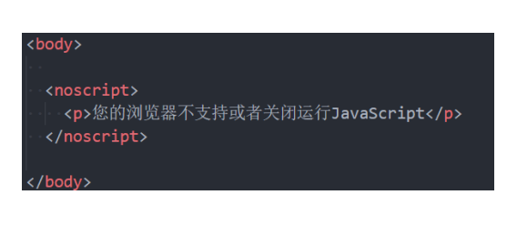

## javaScript 编写的注意事项

- **注意一:script 元素==不能写成单标签==**
  - 在外联式引用 js 文件时,script 标签中不可以写 javaScript 代码,并且 script 标签不能写成单标签
  - 即不能写成\< script src="index.js"/>
- **注意二:省略 type 属性**
  - 在以前的代码中,\< script>标签中会使用 type="text/javascript"
  - 现在可不写这个代码了,因为==javaScript 是所有现代浏览器以及 HTML5 中的默认脚本语言==
- **注意三:加载顺序**
  - 作为 HTML 文档内容的一部分,javaScript 默认遵循==HTML 文档的加载顺序==,即==自上而下的加载顺序==
  - 推荐将 javaScript 代码和==编写位置放在 body 子元素的最后一行==
- **注意四:javaScript 代码严格区分大小写**
  - ==HTML 元素和 CSS 属性不区分大小写==,但是==在 javaScript 中严格区分大小写==
- **后续补充:script 元素还有 defer、async 属性**

## javaScript 的交互方式

- **javaScript 有如下和用户交互的手段:**
  - 最常见的是通过 console.log,目前大家掌握这个即可

## Chrome 的调试工具

- **在前面我们利用 Chrome 的调试工具来调试了 HTML、CSS,它也可以帮助我们来调试 javaScript**
- **当我们在 javaScript 中通过 console 函数显示一些内容时,也可以使用 Chrome 浏览器来查看**

- **另外补充几点:**
  - 1.如果在代码中==出现了错误==,那么可以在==console 中显示错误==
  - 2.console 中==有个 > 标志,它表示控制台的命令行==
    - 在命令行中我们可以直接编写多行代码,可以按下 shift+enter 来进行换行编写
  - 3.在后续我们还会学习==如何通过 debug 方式来调试、查看代码的执行流程==

## javaScript 语句和分号

- **==语句==是==向浏览器发出的指令==,通常表达一个==操作或者行为(Action)==**
  - 语句英文是==Statements==
  - 比如我们前面编写的每一行代码都是一个语句,用于告知浏览器一条执行的命令

- **通常每条语句的后面我们会添加一个==分号==,表示语句的结束**
  - 分号的英文是==semicolon==
  - 当存在换行符( line break )时,在大多数情况下可以==省略分号==
  - javaScript 将==换行符理解成"隐式"的分号==
  - 这也被称之为==自动插入分号== (an automatic semicolon)
- **推荐**
  - 前期在对 javaScript 语法==不熟悉==的情况==推荐添加分号==
  - 后期对 javaScript 语法==熟练==的情况下,==任意==!

## javaScript 的注释

- **在 HTML、CSS 中我们都添加过注释,javaScript 也可以添加注释**
- **javaScript 的注释主要分为三种**
  - ==单行注释==
  - ==多行注释==
  - ==文档注释== (VSCode 中需要在单独的 javaScript 文件中编写才有效)
- **注意:javaScript 也不支持注释的嵌套**

## VSCode 插件和配置

## javaScript 变量和数据类型

## 程序中变量的数据

- **在我们平时开发中,使用最多的并不是固定的数据,而是会变换的数据:**
  - 比如==购物车商品的数量、价格的计算==等等
  - 比如==一首歌曲的播放时间、进度条、歌词的展示==等等
  - 比如==微信聊天中消息条数、时间、语音的长度、头像、名称==等等
  - 比如==游戏中技能的冷却时间、血量、蓝量、buff 时间、金币的数量==等等

## 变化数据的记录 - 变量

- **如果我们希望记录一个之后会变化的数据,在 javaScript 中我们可以定义一个==变量==**
  - 一个==变量==,就是一个用于==存放数值的容器==
  - 这个数值可能是一个用于计算的==数字==,或者是一个句子中的==字符串==,或者==其他任意的数据==
  - 变量的独特之处在于==它存放的数值是可以改变==的
- **我们可以把变量想象成一个==盒子==, 盒子里面==装着我们的数据==,我们需要给盒子进行一个特定的名称**
  - 例如,==变量 messge==可以被想象成一个==标有"message"的盒子==,盒子里面的==值为"Hello!"==
  - 并且,这个盒子的值,我们想改变多少次,就可以改变多少次

## 变量的命名格式

- **在 javaScript 中如何命名一个变量呢? 包含两个部分:**
  - **变量的声明:**在 javaScript 中声明一个变量使用==var 关键字==(variable 单词的缩写)
  - **变量的赋值: 使用 = 给变量进行赋值**
  - 
  - 这个过程也可以分开操作
  - 
  - 同时声明多个变量

## 变量的命名规范

- **变量命名规则:必须遵守**
  - 1.第一个字符必须是==一个字母、下划线(\_) 或一个美元符号 ($)==
  - 2.其他字符可以是==字母、下划线、美元符号或数字==
  - 3.不能使用关键字和保留字命名:
    - 什么是关键字,什么是保留字
    - [词法文法 - JavaScript | MDN (mozilla.org)](https://developer.mozilla.org/zh-CN/docs/web/javascript/reference/lexical_grammar)
  - 4.变量==严格区分大小写==
- **变量命名规范:建议遵守**
  - 多个单词使用==驼峰标识==
  - ==赋值 = 两边都加上一个空格==
  - ==一条语句结束后加上分号==;也有很多人的习惯是不加
  - 变量应该做到==见名知意==

## 变量的练习

- **练习一: 定义一些变量,保存自己的个人信息**
  - 比如姓名、年龄、身高、体重、爱好等等
- 练习二:**定义一个变量 name, 赋值成 coderwhy。定义一个变量 admin,将 name 赋值给 admin**
- **练习三:定义变量,保存两个数字,并且对两个变量的数字进行交换**

  - 方式一:使用临时变量
  - 方式二:不使用临时变量

- **练习四:让用户在浏览器中输入一个值,在 javaScript 程序中使用变量接收**
- **作业:你平时在使用一些应用程序时,哪些内容可以定义成变量**
  - 比如玩游戏、听歌、购物的应用程序中

## 变量的使用注意

- **注意一:如果一个变量未声明(declaration) 就直接使用,那么会报错**

- **注意二:如果有变量有声明,但是没有赋值,那么默认是 undefined**

- **注意三:如果没有使用 var 声明变量也可以,但是不推荐 (事实上会被添加到 window 对象上)**

## javaScript 的数据类型

- **javaScript 中的==值==都具有特定的类型**

  - 列如,字符串或数字
  - 我们可以将==值赋值给一个变量==,那么这个变量就==具备了特定的类型==
  - 一个变量可以在==前一刻是个字符串,下一刻就存储一个数字==
  - 允许这种操作的编程语言,列如 javaScript,被称为=="动态类型" (dynameically typed)==的编程语言

- **在 javaScript 中有 8 种基本的数据类型 (7 种原始类型和 1 种复杂类型)**

  - ==Number==
  - ==String==
  - ==Boolean==
  - ==Undefined==
  - ==Null==
  - ==Object==
  - BigInt
  - Symbol

- **typeof()的用法**
  - 你可能还会遇到另一种语法:==typeof(x)==,它==与 typeof x 相同==
  - typeof 是一个==操作符==,==并非是一个函数==,==()只是将后续的内容当做一个整体而已==

## Number 类型 (一)

- **number 类型代表整数和浮点数**

- **数字 number 可以有很多操作,比如,乘法\*、除法/、加法+、减法-等等**
  - 常见额运算符后续会专门讲解

- **除了常规的数字,还包括所谓的"特殊数值 ("special numeric values")" 也属于 Number 类型 (了解)**
  - ==Infinity==:代表数学概念中==无穷大==,也可以表示-Infinity
    - 比如 1/0 得到的就是无穷大
  - ==NaN==:NaN 代表一个==计算错误==,它是一个==错误的操作==所得到的结果
    - 比如字符串和一个数字相乘

## Number 类型 (二)

- **在之前我们学习过进制的概念,数字类型也有其他的进制表示方法:**
  - 十进制 (掌握)、十六进制、二进制、八进制 (了解 )

- **数字表示的范围**
  - ==最小整数值:==Number.MIN_VALUE，这个值为： 5e-324，小于这个的数字会被转化为 0
  - ==最大整数值:==Number.MAX_VALUE，这个值为： 1.7976931348623157e+308
- **isNaN**
  - 用于判断是否不是一个数字。不是数字返回 true,是数字返回 false

## String 类型 (一)

- **在开发中我们经常会有一些文本需要表示,这个时候我们会使用 String:**
  - 比如人的姓名:coderwhy 。地址:广州市
- **javaScript 中的字符串必须被括在引号里,有三种包含字符串的方式**
  - 双引号:"Hello"
  - 单引号:'Hello'
  - 反引号:`Hello`

- **前后的引号类型必须一致:**
  - 如果在字符串里面本身包括单引号,可以使用双引号
  - 如果在字符串里面本身包括双引号,可以使用单引号

## 字符串种的转义字符

- **除了普通的可以打印字符以外,一些有特殊功能的字符可以通过转义字符的形式放入字符串中:**

- **转义字符串开发中只有特殊场景才会用到**

## 字符串的属性和方法

- 字符串还有很多细节和操作方法,在后续学习了面向对象后,我们再详细学习
- **==操作一==**:字符串拼接,通过+运算符

- **==操作二==:获取字符串长度**

## Boolean 类型

- **Boolean (布尔) 类型用于表示真假:**
  - 比如==是否毕业,是否有身份证,是否购买车票,是否成年人==
  - 比如开发中,我们会判断一个账号==是否登录、是否是管理员、是否具备某个权限、是否拥有某个英雄、皮肤等==
- **布尔 (英语:==Boolean==) 是计算机科学中的逻辑数据类型,以发明布尔代数的数学家==乔治·布尔==为名**

- **Boolean 类型包含两个值:true 和 false**

- 在后续 **逻辑运算符** 中我们还会详细学习和使用 Boolean 类型

## Undefined 类型

- ==Undefined 类型==只有一个值,就是特殊值 ==undefined==
  - 如果我们==声明一个变量==,但是==没有对其进行初始化时==,它==默认就是 undefied==

- **下面的代码是一样的**

- **这里有两个注意事项:**
  - 注意一:最好在变量==定义的时候进行初始化==,而不只是声明一个变量
  - 注意二: ==不要显示的将一个变量赋值为 undefiend==
    - 如果变量刚开始什么都没有,我们可以初始化为 0s=、空字符串、null 等值

## Object 类型

- **Object 类型是一个特殊的类型,我们通常把它称为==引用类型或者复杂类型==**
  - 其他的数据类型我们通常称之为 =="原始类型"==, 因为它们的值只包含==一个单独的内容 (字符串、数字或者其他)==
  - Object 往往可以表示==一组数据==,是==其他数据的一个集合==
  - 在 javaScript 中我们可以使用 ==花括号{}== 的方式来表示一个对象

- Object 是==对象==的意思,后续我们会专门讲解面向对象的概念等
- **Object 相关的内容我们会在后续详细讲解**

## Null 类型

- **Null 类型同样只有一个值, 即特殊值 null**
  - null 类型通常用来表示==一个对象为空==,所以通常我们在==给一个对象进行初始化==时,会赋值为==null==

- **null 和 undefiend 的关系:**
  - undefined 通常只有在一个变量声明但是==未初始化==时,它的默认值是==undefined==才会用到
  - 并且我们==不推荐直接给一个变量赋值为 undefined==,所以很少主动来使用
  - ==null 值非常常用==,当一个变量准备保存一个对象,但是==这个对象不确定时,我们可以先赋值为 null==

## 数据类型总结

- **javaScript 中有八种基本的数据类型 (前 7 种为==基本数据类型,也称为原始类型==,而 object 为==复杂数据类型,也称为引用类型==)。**
  - ==number==用于任何类型的数字:整数或浮点数
  - ==string==用于字符串:一个字符串可以包含 0 个或多个字符,所以没有单独的单字符类型
  - ==boolean==用于 true 和 false
  - ==undefined==用于未定义的值 -- 只有一个 undefined 值的独立类型
  - ==object==用于更复杂的数据结构
  - ==null==用于未知的值 -- 只有一个 null 值的独立类型
- **后续学习的类型:**
  - symbol 用于唯一的标识符
  - bigint 用于任意长度的整数

## 数据类型的转换

- **在开发中,我们可能会在不同的数据类型之间进行某些操作**
  - 比如把==一个 String 类型的数字==和==另外一个 Number 类型的数字==进行运算
  - 比如把==一个 String 类型的文本==和==另外一个 Number 类型的数字==进行相加
  - 比如把==一个 String 类型或者 Number 类型==的内容,==当做一个 Boolean 类型==来进行判断
  - 等等
- **也就是在开发中,我们会经常需要对==数据类型进行转换==:**
  - ==大多数情况==下,==运算符和函数会自动将赋予它们的值转换为正确的类型==,这是一种==隐士转换==
  - 我们也可以,==通过显示的方式来对数据类型进行转换==
- **接下来我们来看一下数据类型之间的转换:**
  - String、Number、Boolean 类型

## 字符串 String 的转换

- **其他类型经常需要转换成字符串类型,比如和字符串拼接在一起活着使用字符串中的方法**
- **转换方式一:隐式转换**
  - ==一个字符串和另一个字符串进行+操作==
    - 如果+运算符左右两边有一个是字符串,那么另一边会自动转换成字符串类型进行拼接
  - ==某些函数的执行也会自动将参数转为字符串类型==
    - 比如 console.log 函数
- **转换方式三:显式转换**

  - 调用 String()
  - 调用 toString()方法 (后续面向对象再学习)

- 方法和函数的区别,我们后续再讲解面向对象时会讲到

## 数字类型 Number 的转换

- **其他类型也可能会转成数字类型**
- **转换方式一:隐式转换**
  - 在==算术运算==中，通常==会将其他类型转换成数字类型==来进行运算
    - 比如 "6" / "2"
    - 但是==如果是+运算==,并且==其中一边有字符串==,那么还是按照字符串来连接的
- **转换方式二:显式转换**
  - 我们也可以==使用 Number()函数==来进行显式的转换
- **其他类型转换数字的规则**

## 布尔类型 Boolean 的转换

- **布尔 (boolean) 类型转换是最简单的**
- 它发生在==逻辑运算==中,但是==也可以通过调用 Boolean(value)==显式地进行转换

- **转换规则如下:**
  - 直观上为"空"的值 (如 0、空字符串、null、undefined 和 NaN)将变为 false
  - 其他值变成 true

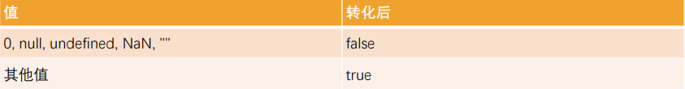

- **注意:包含 0 的字符串"0"是 true**
  - 一些编程语言(比如 PHP)视"0"为 false,但在 javaScript 中,非空的字符串总是 true

## javaScript 基础运算符

## 认识运算符

- **在小学的时候我们就学习了各种运算符,比如==加号+、乘号\*、减号-、除号/==**
- **几乎所有的编程语言都有各种各样的运算符(也被称之为操作符, operators)**
  - 初次接触这些==运算符==,你会感觉==种类繁多==,难以记忆
  - 但是并不需要特别担心,因为==很多的运算符==我们在以后的开发中,每天都会使用
  - 多练习,不需要刻意去记忆
  - 而且常见的高级语言==运算符都是相似的==,学了 javaScript 运算符很容易掌握 C/C++/OC/Python 等语言的运算符
- **计算机最基本的操作就是==执行运算,==执行运算时就需要==使用运算符来操作:==**
  - 比如 console.log(20 + 30) `+`号就是一个运算符
  - 比如 console.log(20 _ 30) `_`号也是一个运算符
- **javaScript 按照使用场景的不同将运算符分成了很多种类型**
  - ==算术运算符/赋值运算符/关系(比较)运算符/逻辑运算符==

## 认识运算元

- **在正式开始运算之前,我们先学习一下常见的术语:**
  - ==运算元== - ==运算符应用的对象==
    - 比如说乘法运算 5 \* 2, 有两个运算元
    - 左运算元 5 和 右运算元 2
    - 有时候人们也称其为 "参数"
  - 如果一个==运算符==对应的只有==一个运算元==,那么它是==一元运算符==
    - 比如说一个==负号运算符 (unary negation) -==,它的作用是对数字进行正负转换
  - 如果一个==运算符==拥有==两个运算元==,那么它是==二元运算符==
    - 比如 2 + 3
- **一元运算符通常我们是使用-和+, -号使用的会较多一些**

## javaScript 中的运算

- **算术运算符**
  - **算术运算符用在==数学表达式==中,它的使用方式和数学中也是一致的**
  - **算术运算符是==对数据进行计算的符号==**

## 取余%和求幂

- **取余运算符是%,尽管它看起来很像百分数,但实际并无关联**
  - ==a % b==的结果是 a 整除 b 的余数

- **求幂 a\*\*b 将 a 提升至 a 的 b 次幂 (ES7 中的语法,也叫做 ES2016)**
  - 在数学中我们将其表示为 a 的 b 次方

## 赋值运算符

- **前面我们使用的 ==\=其实也是一个运算符==,被称之为==赋值(assignments)运算符==**
- **= 是一个运算符,而不是一个有着 "魔法"作用的语言结构**
  - 语句 x = value 将值 value 写入 x 然后返回 x
- **链式赋值 (Chaining assignments)**
  - 
  - **链式赋值==从右到左进行计算==**
  - 首先,对最右边的表达式 2 + 2 求值, 然后将其赋给左边的变量:c、b 和 a
  - 最后,==所有的变量共享一个值==
- **但是从代码的可读性的角度来说,==不推荐这种写法==**

## 原地修改 (Modify-in-place)

- **什么是原地修改呢?**
  - 我们经常需要==对一个变量做运算==,并==将新的结果存储在同一个变量==中

- **可以使用运算符 += 和 \*=来缩写这种表示**

- **所有算术和位运算符都有简短的=="修改并赋值" 运算符:==/=和-=等**

## 自增、自减

- **对一个数进行==加一、减一==是==最常见的数学运算符==之一**

- **所以,对此有些专门的运算符**

  - 自增==++==将变量加 1
  - 自减==--==将变量减 1

- **自增/自减只能应用于变量**
  - 将其应用于数值 (比如 5++)则会报错

## ++和--的位置

- **运算符 ++ 和 -- 可以置于变量前,也可以置于变量后**
  - 当运算符置于变量后,被称为=="后置形式"== (postfox form): counter++
  - 当运算符置于变量前,被称为=="前置形式"== (prefix form): ++counter
  - 两者都做了同一件事:将变量 counter 与 1 相加
- **他们有什么区别吗?**
  - 有,但==只有当我们使用++/--的返回值时==才能看到区别
  - 如果==自增/自减的值不会被使用,那么两者形式没有区别==
  - 如果我们想要==对变量进行自增操作==,并且==需要立刻使用自增后的值==,那么==我们需要使用前置形式==
  - ==前置形式返回一个新的值==,但==后置返回原来的值==

## 运算符的优先级

- **运算符放到一起使用时会有一定的优先级**
- **在 MDN 上给出了所有运算符的优先级 (不用去记)**
- [运算符优先级 - JavaScript | MDN (mozilla.org)](https://developer.mozilla.org/zh-CN/docs/Web/JavaScript/Reference/Operators/Operator_Precedence)

## 比较运算符

- **我们知道,在数学中有很多用于比较大小的运算符,在 javaScript 中也有相似的比较:**
  - ==大于/小于:== a>b,a< b
  - ==大于等于 / 小于等于==: a>=b , a< =b
  - ==检查两个值的相等==: a==b,请注意双等号 == 表示相等性检查,而单等号 a = b 表示赋值
  - ==检查两个值不相等==:不相等在数学中的符号是!=,但在 javaScript 中写成 a!=b
- **比较运算符的结果都是 Boolean 类型的**

## === 和 == 的区别

- **普通的相等性检查 == 存在一个问题,它不能区分出 0 和 false,或者空字符传和 false 这类运算**

  - 这是因为在==比较不同类型的值时,==,处于==判断符号 == 两侧的值会先被转化为数字==
  - ==空字符串和 false 也是如此,转化后他们都为数字 0==

- **如果我们需要区分 0 和 false, 该怎么办?**
  - ==严格相等运算符== === 在进行比较时不会做任何的类型转换
- **同样的, "不相等"符号！=类似, "严格不相等"表示为！==**

- **严格相等的运算符虽然写起来稍微长一些,但是它能够==很清楚地显示代码意图==,==降低你犯错的可能性==**

# javaScript 分支语句

## 程序的执行顺序

- **在程序开发中,程序有三种不同的执行方式:**
  - **顺序 -- ==从上向下==,顺序执行代码**
  - **分支 -- 根据==条件判断==决定执行代码的分支**
  - **循环 -- 让 ==特定代码 重复==执行**

## 代码块的理解

- ==代码块==是多行执行代码的集合,通过一个==花括号{}==放到了一起
  - **在开发中,一行代码很难完成某一个特定的功能,我们就会将这些代码放到一个==代码块==中**

- **在 javaScript 中,我们可以通过流程控制语句来决定如何执行一个代码块:**
  - 通常会通过==一些关键字来告知 js 引擎代码==要如何被执行
  - 比如==分支语句、循环语句对应的关键字==等

## 生活中的条件判断

- **现实生活中有很多情况,我们要==根据条件来做一些决定:==**
  - 小明妈妈说:如果小明==考试考了 100 分==,就==去游乐场== (判断分数等于 100 分)
  - 网吧禁止==未成年人入内== (判断年龄大于等于 18 岁,是否带身份证,是否带钱)
  - 开发中,==登录成功==:帐号密码正确 或 扫描二维码成功

## 什么是分支结构

- **程序时生活的一种抽象**,只是我们用代码表示了出来

  - 在开发中,我们经常需要根据==一定的条件==,来决定代码的==执行方向==
  - 如果 ==条件满足==,才能==做某件事情==
  - 如果 ==条件不满足==,就==做另外一件事情==

- **分支结构**
  - 分支结构的代码就是让我们==根据条件==来==决定代码的执行==
  - 分支结构的语句被称为==判断结构==或者==选择结构==
  - 几乎==所有的编程语言都有分支结构== (C、C++、OC、javaScript 等等)
- javaScript**中常见的分支结构有:**
  - ==if==分支结构
  - ==switch==分支结构

## if 分支语句

- **if 分支结构有三种:**
- 单分支结构
  - ==if==
- 多分支结构
  - ==if...else...==
  - ==if..else if...else==

## 单分支结构

- **单分支语句:if**
  - if(...) 语句计算括号里的条件表达式,如果计算结果是 true,就会执行对应的代码块

- **案例一:如果小明考试超过 90 分,就去游乐场**
  - "如果"相当于 javaScript 中的关键字 if
  - 分数超过 90 分是一个条件(可以使用 > 符号)
- **案例二: 单位 5 元/斤的苹果, 如果购买超过 5 斤,那么立减 8 元**
  - 注意:这里我们让用户输入购买的重量,计算出最后的价格并且弹出结果

## if 语句的细节补充

- **补充一:如果代码块中只有一行代码,那么{}可以省略:**

- **补充二: if(...)语句会计算圆括号内的表达式,并将计算结果转换为布尔型 (Boolean)**
  - 转换规则和 Boolean 函数的规则一致
  - ==数字 0、空字符串 “”、null、undefined 和 NaN==都会被转成==false==
    - 因为它们被称为"假值(falsy)"
  - ==其他值==被转换为==true==,所以它们被称为=="真值(truthy)"==

## 多分支语句:if..else..

- **多分支语句一:if... else...**

  - if 语句有时会==包含一个可选的 "else" 块==

  - 如果判断条件不成立,就会执行它内部的代码

- **案例一:如果分数超过 90 分去游乐场,否则去上补习班**
  - 满足条件时,做某些事情
  - 不满足 (else) ,去做另外一些事情
- **案例二: m=20,n=30,比较俩个数字的大小,获取较大的那个数字**

## 多分支结构: if..else if..else..

- **多分支结构: if...else if..else...**
  - 有时我们需要判断多个条件
  - 我们可以通过使用 else if 子句实现

- **案例:分数评级:**
  - 考试分数大于 90:优秀
  - 大于 80 小于等于 90:良好
  - 大于 60 小于等于 80:合格
  - 小于 60 分: 不及格

## 三元运算符

- **有时我们需要根据一个条件去赋值一个变量**

  - 比如==比较数字大小==的时候,==获取较大的数字==
  - 这个时候==if else 语句就会显得过于臃肿==,有没有更加简介的方法呢?

- **条件运算符: '?'**

  - 这个运算符通过==问号?==表示
  - 有时它被称为==三元运算符==,被称为"三元" 是因为该运算符中有==三个操作数 (运算元)==
  - 实际上它是 javaScript 中唯一一个有这么多操作数的运算符

- **使用格式如下:**

  ==var result = codition ? value1 : value2==

  - 计算条件结果,如果结果为真,则返回 value1,否则返回 value2

- **案例一: m=20,n=30,比较两个数字的大小,获取较大的那个数字**

- **案例二:判断一个人是否是成年人了**

## 认识逻辑运算符

- **逻辑运算符,主要是由三个:**
  - ==||(或),&&(与),!(非)==
  - 它可以将==多个表达式或者值==放到一起来获取到一个==最终的结果==

- 有了逻辑运算符,我们就可以在判断语句汇总编写多个条件

## 逻辑或的本质

- **|| (或) 两个竖线符号表示"或"运算符 (也称为短路或)**

- 
  - ==从左到右==依次计算操作数
  - 处理==每一个操作数时==,都将其转化为==布尔值 (Boolean)==
  - 如果结果是==true==,就==停止计算,返回这个操作数的初始值==
  - 如果==所有的操作数都被计算过==( 也就是,转换结果都是 false)
- 注意: **返回的值是操作数的==初始形式==,不会转换为 Boolean 类型**
- **换句话说,一个或运算 || 的 链,将返回第一个真值,如果不存在真值,就返回该链的最后一个值**

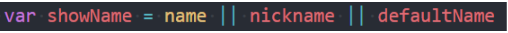

## 逻辑与的本质

- **&& (或) 两个竖线符号表示 "与" 运算符 (也称为短路与):**

  - 
  - ==从左到右==依次计算操作数
  - 在处理==每一个操作数==时,都将其转化为==布尔值 (Boolean)==
  - 如果结果是==false==,就==停止计算==,并==返回这个操作数的初始值(一般不需要获取到初始值)==
  - 如果==所有的操作数都被计算过==(列如都是真值),则==返回最后一个操作数==

- **换句话说,==与运算==返回第一个假值,如果没有假值就返回最后一个值**

## !(非)

- **逻辑非运算符接受一个参数,并按如下运算:**
  - 步骤一:将==操作数转化为布尔类型==:true/false
  - 步骤二:==返回相反的值==
- **两个非运算==!!==有时候用来将某个值转化为布尔类型:**
  - 也就是,第一个==非运算符将该值转化为布尔类型并取反,第二个非运算再次取反==
  - 最后我们就得到了一个==任意值到布尔值的转化==

## switch 语句

- **switch 是分支结构的一种语句:**
  - 它是通过判断==表达式的结果 (或者变量)== 是否等于==case 语句的常量==, 来执行响应的分支体的
- 与 if 语句不同的是,switch 语句==只能做值的相等判断== (使用全等运算符 \===) , 而 if 语句可以做值的范围判断
- **switch 的语法**
  - switch 语句有至少一个 case 代码和一个可选的 default 代码块

## switch 语句的补充

- **case 穿透的问题:**
  - 一条 case 语句结束后,==会自动执行下一个 case 的语句==
  - 这种现象被称之为==case 穿透==
- **break 关键字**

  - 通过在每个 case 的代码块后面添加==break 关键字==来解决这个问题

- **注意事项:这里的相等是严格相等**
  - 被比较的值必须是相同的类型才能进行匹配

# javaScript 基础运算符

## 认识循环

- **在开发中我们经常需要做各种各样的循环操作**
  - 比如把==一个列表中的商品、歌曲、视频==依次输出进行展示
  - 比如对==一个列表进行累加计算==
  - 比如==运行相同的代码将数字 1 到 10 逐个输出==
- **循环** 是一种重复运行同一代码的方法
  - 如果是对某一个列表进行循环操作,我们通常也会称之为==遍历(traversal) 或者迭代 (iteration)==
- **在 javaScript 中支持三张循环方式:**
  - ==while 循环==
  - ==do..while 循环==
  - ==for 循环==

## while 循环

- **while 循环的语法如下:**
  - 当==条件成立==时,==执行代码块==
  - 当==条件不成立==时,==跳出代码块==

- **如果条件一直成立 (为 true), 那么会产生==死循环==**
  - 这个时候必须通过==关闭页面来停止死循环==
  - 开发中一定==要避免死循环==的产生

## while 循环的练习

- **while 循环的练习题目**
- 练习一:打印 10 次的 Hello World
- 练习二:打印 0~99 的数字
- 练习三:计算 0~99 的数字和
- 练习四:计算 0~99 所有奇数的和
- 练习五:计算 0~99 所有偶数的和

## do..while 循环

- **do..while 循环和 while 循环非常像,二者经常可以相互替代==(不常用)==**
  - 但是 do..while 的特点是不管条件成不成立,do 循环体都会==先执行一次==

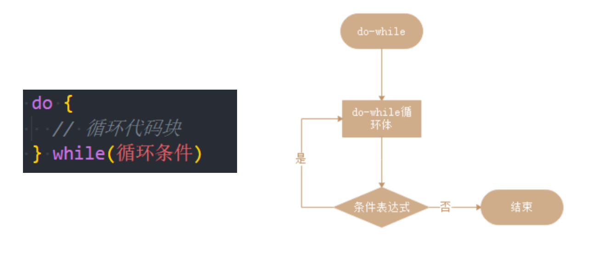

- **通常我们更倾向于使用 shile 循环**

## for 循环

- **for 循环更加复杂,但它是==最常使用的循环形式==**

- begin 执行一次,然后进行迭代:每次检查 condition 后,执行 body 和 step

## for 循环的练习

- **利用 for 循环实现之前的案例:**

- 练习一:打印 10 次的 Hello World
- 练习二:打印 0~99 的数字
- 练习三:计算 0~99 的数字和
- 练习四:计算 0~99 所有奇数的和
- 练习五:计算 0~99 所有偶数的和

## for 循环的嵌套

- **什么是循环的嵌套呢? (日常开发使用不算多,在一些算法中比较常见)**
  - **在开发中,某些情况下一次循环无法达到目的的,我们需要循环中嵌套循环**
- **我们通过循环 for 循环的嵌套来完成一些案例:**
- ==案例一==:在屏幕上显示包含很多 ♥ 的矩形
- ==案例二==:在屏幕上显示一个三角的 ❤ 图像
- ==案例三==:在屏幕上显示一个九九乘法表

## 循环控制

- **循环的跳转 (控制)**:
  - 在执行循环过程中,==遇到某一个条件==时,我们可能想要==做一些事情==
  - 比如==循环体不再执行(即使没有执行完),跳出循环==
  - 比如==本次循环体不再执行,执行下一次的循环体==
- **循环的跳转控制**
- ==break==:执行跳出循环,循环结束
  - break 某一条件满足时,退出循环,不再执行后续重复的代码
- ==continue==:跳过本次循环次,执行下一次循环体
  - continue 指令是 break 的"轻量版"
  - continue 某一条件满足时,不执行后续重复的代码

## 猜数字游戏

- **猜数字游戏规则:**
  - 电脑==随机生成一个 0~99 之间的数字==
  - 玩家有==7 次猜测的机会==
  - 玩家==猜测一个数字==,输入到程序中
  - 电脑根据输入的数字打印:==猜大了/猜小了/猜对了==的情况
  - ==猜对了==,那么==游戏结束==,==显示恭喜您==
  - ==7 次机会用完==打印:==您的次数用完了,您失败了==

## 循环的总结

- **我们学习了三种循环:**

  - ==while== - 每次迭代之前都要检查条件
  - ==do..while== - 每次迭代后都要检查条件
  - ==for(;;)== - 每次迭代之前都要检查条件,可以使用其他设置

- break/continue 可以对循环进行控制

# javaScript 函数

## 程序中的 foo、bar、baz

- **在学习编程的过程中,你可能会经常看到 foo、bar、baz 这些名词:**

  - 它们通常被用来作为==函数、变量、文件==的名词
  - 目前已经变成了计算机==编程术语==一部分
  - 但是它们本身==并没有特别的用途和意义==
  - 常被称之为=="伪变量"== (metasyntactic variable)

- **那么它们有什么由来吗?**
  - 事实上,foo、bar 这些名词最早从什么时候、地方流行起来的一直是有争论的
  - 一种说法是通过 Digital (**迪吉多**,数字设备公司,成立于 1957 年的美国电脑公司) 的手册说明流行起来的
  - 一种说法是说源自于电子学中的反转 foo 信号
  - 也有一种说法是 foo 因为出现在了一个漫画中,漫画中 foo 代表"好运",与中文的福读音类似
- **总之,foo、bar、baz 已经是编程流域非常常用的名词**

## 认识函数

- **什么是函数呢?**
- **目前,我们已经接触过几个函数了**
  - alert 函数:
    - 浏览器弹出一个弹窗
  - prompt 函数
    - 在浏览器弹窗中接收用户的输入
  - console.log 函数:
    - 在控制台输出内容
  - String/Number/Boolean 函数等
- **当我们在谈函数时,到底在谈些什么?**
  - ==函数==其实就是==某段代码的封装==,这段代码帮助我们完成某一个功能
  - 默认情况下 javaScript 引擎或者浏览器会给我们==提供一些已经实现好的函数==
  - 我们也可以==编写属于自己的函数==

## 函数使用的步骤

- **函数的使用包含两个步骤:**

  - ==声明函数== - 封装 独立的功能
  - ==调用函数== - 享受 封装 的成果

- ==声明函数==,在 javaScript 中也可以成为==定义函数==:

  - 声明函数的过程是==对某些功能的封装过程==
  - 在之后的开发中,我们会根据==自己的需求定义很多自己的函数==

- **调用函数,也可以称为函数调用:**
  - ==调用函数==是让已存在的函数为我们所用
  - 这些函数==可以是刚刚自己封装好的某个功能函数==
  - 当然,我们==也可以去使用默认提供的或者其他三方库定义好的函数==
- **函数的作用:**
  - 在开发程序时,==使用函数可以提高编写的效率以及代码的重用==

## 声明和调用函数

- **声明函数使用 function 关键字:这种写法称之为函数的定义**

-

- **注意:**
  - 函数名的==命名规则和前面变量名的命名规则==是相同的
  - 函数要尽量==做到见名知意== (并且函数通常是一些行为 (action) ,所以使用动词会更多一些)
  - 函数==定义玩后里面的代码是不会执行的==,==函数必须调用才会执行==
- **调用函数**通过==函数名()==即可:比如 test()
- **函数的练习:**
  - 练习一:定义一个函数,打印一个人的个人信息
  - 练习二:定义一个函数,函数中计算 10 和 20 数字的和,并且打印出结果

## 函数的参数

- **函数的参数:**

  - ==函数==,把==具有独立功能的代码块==组织为一个小模块,在需要的时候==调用==
  - ==函数的参数==,增加函数的==通用性==,针对==相同的数据处理逻辑==,能够==适应更多的数据==
    - 在函数**内部**,把参数当做**变量**使用,进行需要的数据处理
    - 函数调用时,按照函数定义的**参数顺序**,把**希望在函数内部处理的数据,通过参数**传递

- **形参和实参**
  - **形参 (参数 parameter): 定义 **函数时,小括号中的参数,是用来接收参数用的,在函数内部 **作为变量使用**
  - **实参 (参数 argument): 调用** 函数时,小括号中的参数,是用来把数据传递到**函数内部**用的

## 有参数的函数练习

- **一个参数的函数练习:**
  - 练习一:传入一个名字,对这个人 say Hello
  - 练习二: 为某个朋友唱生日快乐歌
- **连个参数的函数练习:**
  - 练习三:传入两个数字,计算两个数字的和,并且打印结果

## 函数的返回值

- **回想我们之前使用的 prompt 函数,函数需要接受参数,并且会返回用户的输入:**
- **所以说,函数不仅仅可以有参数,也可以有==返回值:==**
  - 使用==return 关键字==来返回结果
  - 一旦在函数中==执行 return 操作==,那么==当前函数会终止==
  - 如果函数中==没有使用 return 语句==,那么函数有==默认的返回值:undfiend==
  - 如果函数使用 return 语句,但是 return 后面没有任何值,那么==函数的返回值也是:undefined==

## 函数的练习

- **练习一:实现一个加法计算器**
- **练习二:定义一个函数,传入宽高,计算矩形区域的面积**
- **练习三:定义一个函数,传入半径,计算圆形的面积**
- **练习四:定义一个函数,传入 n(n 为正整数),计算 1~n 数字的和**

## arguments 参数 (JS 高级再学习)

- **事实上函数有一个特别的对象:arguments 对象**

  - 默认情况下,==arguments 对象==是所有 (非箭头) 函数中都可用的==局部变量==
  - 该对象中存放着所有的==调用者传入的参数==,==从 0 位置开始,依次存放==
  - arguments 变量的类型是==一个 object 类型 ( array-like ),不是一个数组==,但是和数组的用法看起来很相似
  - 如果==调用者传入的参数多于函数接受的参数==,可以通过==arguments 去获取所有的参数==

- **因为这里涉及到数组、对象等概念,目前大家了解有这么一个参数即可**
  - 后续我们会对其专门进行学习,==包括和数组之间的转化==

## 函数中调用函数

- **在开发中,函数内部是可以调用另外一个函数的**

- **既然函数中可以调用另外一个函数,那么函数是否可以调用自己呢?**
  - 当然是可以的
  - 但是函数调用自己==必须有结束条件,否则会产生无限调用,造成报错==

## 函数的递归

- **事实上,函数调用自己还有一个专业的名字,叫做递归 (Recursion)**
- **在语言学方面,我们也可以描述为递归:**
  - 从前有座山，山里有座庙，庙里有个老和尚，正在给小和尚讲故事呢！故事是什么呢？
  - 递归读取上面的话；
- **递归是一种重要的编程思想:**
  - 将一个复杂的任务,转化成可以重复执行的相同任务
- **案例:实现一个自己的幂函数 pow (pow 单词可以表示指数的意思)**
  - 我们可以先用 for 循环来实现

## 递归的实现思路

- **另一种实现思路是递归实现:**

  - 这是因为在数学上:==x^n^ = x \* x^n-1^==
  - 
  - 那么对于函数的调用,我们也可以进行划分
  - 这里需要有一个结束条件,就是当 n 已经等于 1 的时候就不需要拆分了

- **所以最终代码如下:**

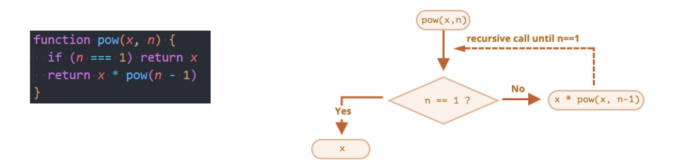

- **递归的代码第一次接触会有点绕,对于初次接触函数的同学,可以先跳过去**
  - 后续我们讲解数据结构与算法时,会使用递归来解决一些算法问题

## 局部变量和外部变量

- **在 javaScript (ES5 之前) 中没有块级作用域的概念, 但是函数可以定义自己的作用域**
  - ==作用域 (Scope)== 表示==一些标识符的作用有效范围== (所以也有被翻译为有效范围的)
  - ==函数的作用域==表示==在函数内部定义的变量, 只有在函数内部可以被访问到==
- **外部变量和局部变量的概念:**
  - 定义在函数内部的变量,被称之为==局部变量 (Local Variables)==
  - 定义在函数外部的变量,被称之为==外部变量== (==Outer Variables==)
- **什么是全局变量?**
  - 在函数之外声明的变量 (在 script 中声明的),称之为==全局变量==
  - 全局变量==在任何函数中都是可见==的
  - 通过==var 声明的全局变量会在 window 对象==上添加一个属性 (了解)==
- **在函数中,访问变量的顺序是什么呢?**
  - 优先访问自己函数中的变量,没有找到时,在外部访问

## 函数表达式 (Function Expressions)

- **在 javaScript 中,函数并不是一种神奇的语法结构,而是==一种特殊的值==**
  - 前面定义函数的方式,我们称之为==函数的声明 (Function Declaration)==
- **还有另外一种写法是函数表达式 (Function Expressions)**

- **注意,function 关键字后面没有函数名**
  - 函数表达式==允许省略函数名==

## 函数声明 vs 函数表达式

- **在开发中,函数的声明和函数表达式有什么区别,以及如何选择?**

  - **首先,语法不同:**
  - ==函数声明==: 在主代码流中声明为==单独的语句==的函数
  - ==函数表达式==:在==一个表达式中或另一个语法结构==中创建的函数

- **其次,javaScript 创建函数的时机是不同的:**
  - 函数表达式是在代码==执行到达时==被创建,并且==仅从那一刻可用==
  - 在==函数声明被定义之前,它就可以被调用==
    - 这是==内部算法的缘故==
    - 当==javaScript **准备** 运行脚本==时,首先会在脚本中==寻找全局函数声明,并创建这些函数==
- **开发中如何选择呢?**
  - 当我们需要==声明一个函数==时,首先考虑函数声明语法
  - 它能够为组织代码提供==更多的灵活性==,因为我们可以==在声明这些函数之前调用这些函数==

## javaScript 头等函数

- **头等函数 (first-class function; 第一级函数) 是指在程序设计语言中, 函数被当作头等公民**
  - 这意味着,函数可以作为==别的函数的参数,函数的返回值,赋值给变量==或==储存在数据结构==中
  - 有人主张也应包括支持匿名函数
- **通常我们对作为头等公民的编程方式,称之为==函数式编程==**

  - javaScript 就是==符合函数式编程的语言==,这个也是==javaScript 的一大特点==

- **比如:函数可以在变量和变量之间相互进行赋值**

## 回调函数 (Callback Function)

- **既然函数可以作为一个值相互赋值,那么也可以传递给另外一个函数**

- foo 这种函数我们也可以称之为**高阶函数 (Higher-order function)**
- **高阶函数必须至少满足两个条件之一:**
  - 接受==一个或多个函数==作为输入
  - ==输出一个函数==
- **匿名 (anonymous) 函数的理解**

## 立即执行函数

- **什么是立即执行函数?**
  - 专业名字:==Immediately-Inviked Function Expression== (IIFE 立即调用函数表达式)
  - 表达式含义是==一个函数定义完后被立即执行==
    - 第一部分是定义了一个匿名函数,这个函数有自己独立的作用域
    - 第二部分是后面的 (),表示这个函数被执行了

- **这个东西有什么用?**
  - 会创建一个独立的执行上下文环境,可以避免外界访问或修改内部的变量,也避免了对内部变量的修改

## 立即执行函数的其他写法

- **立即执行函数必须是一个表达式 (整体) , 不能是函数声明 (了解即可):**
  - 下面的这种写法会报错,因为是==一个函数声明,不是一个函数表达式==
  - 当圆括号出现在匿名函数的末尾想要调用函数时,他会默认将函数当成是函数声明

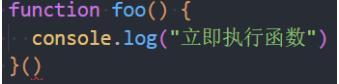

- **当圆括号包裹函数时,它会默认将函数作为表达式去解析,而不是函数声明**

- **下面是一个函数表达式,所以可以执行**

## Chrome 的 debug 调试技巧

# javaScript 的面向对象

## 认识对象类型

- **在数据类型中我们提到还有一种特别的类型:对象类型**
  - 对象类型涉及到 javaScript 的各个方面,所以掌握==对象类型非常重要==
  - 对象类型是一种==存储键值对 (key-value)== 的更复杂的数据类型
- **为什么需要对象类型呢?**
  - 基本数据类型可以存储一些简单的值,但是现实世界的实物抽象成程序时,往往比较复杂
  - 比如==一个人==,有==自己的特性== (比如姓名、年龄、身高), ==有一些行为== (比如跑步、学习、工作)
  - 比如==一辆车==,有==自己的特性== (比如颜色、重量、速度), ==有一些行为== (比如行驶)
- **这个时候,我们需要一种新的类型将这些特性和行为组织在一起,这种类型就是对象类型**
  - 对象类型可以==使用{...}==来创建的复杂类型,里面包含的是==键值对("key":"value")==
  - ==键值对==可以是==属性和方法 (在对象中的函数称之为方法)==
  - 其中==key 是字符串== (也叫做属性名 property name, ES6 之后也可以是 Symbol 类型)
  - 其中==value 可以是任意类型==,包括基本数据类型、函数类型、对象类型的等

## 创建对象和使用对象

- **对象的创建方法有很多,包括三种:**
  - ==对象字面量 (Object Literal)==: 通过{}
  - ==new Object+动态添加属性==
  - ==new 其他类==
- 目前我们主要掌握对象字面量的方式,后续我们学习其他两种方式
  - 属性之间是以==逗号 (commoa) 分隔==的
- **对象的使用过程包括如下操作:**
  - ==访问==对象的属性
  - ==修改==对象的属性
  - ==添加==对象的属性
  - ==删除==对象的属性

## 对象的常见操作

- **访问对象的属性**

- **修改对象的属性**

- **添加对象的属性**

- **删除对象的属性:delete 操作符**

## 方括号和引用的使用

- **为什么需要使用方括号呢?**
  - 对于多次属性来说,javaScript 是无法理解的

- 这是因为**点符号**要求 key 是**有效的变量标识符**

  - ==不包含空格,不以数字开头,也不包含特殊字符==(允许使用$和\_)

- **这个时候我们可以使用==方括号==**
  - 方括号运行我们在定义或者操作时更加的灵活

## 对象的遍历

- **对象的遍历(迭代) : 表示获取对象中所有的属性和方法**
  - ==Object.keys()==方法会返回一个由一个给定对象的自己可枚举属性组成的数组
- **遍历方式一:普通 for 循环**

- **遍历方式二: for in 遍历方法**

## 栈内存和堆内存

- **我们知道程序时需要加载到内存中来执行的,我们可以将内存划分为两个区域:**==栈内存和堆内存==
  - ==原始类型==占据的空间是在==栈内存==中分配的
  - ==对象类型==占据的空间是在==堆内存==中分配的

- 后续我们会学习图中的其他知识

## 值类型和引用类型

- **原始类型的保存方式:在变量中保存的是值本身**
  - 所以原始类型也被称之为==值类型==
- **对象类型的保存方式:在变量中保存的是对象的"引用"**
  - 所以对象类型也被称之为==引用类型==

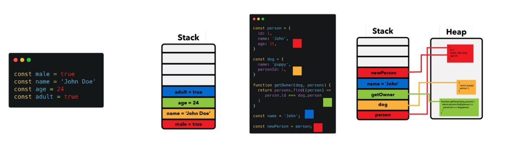

## 思考下面的现象

- **现场一:两个对象的比较**

- **现象二:引用传递和值传递的内存区别**

## 为什么需要 this

- **在常见的编程语言中,几乎都有 this 这个关键字 (Objective-C 中使用的是 self),但是 javaScript 中的 this 和常见的面向对象语言中的 this 不太一样:**
  - 常见面向对象的编程语言中,比如 java、C++、Swift、Dart 等等一系列语言中,==this 通常只会出现在类的方法==中
  - 也就是你需要有一个类,类中的方法 (特别是实例方法)中,==this 代表的说当前调用对象==
- **但是 javaScript 中的 this 更加灵活,无论是它出现的位置还是它代表的含义**
- 我们来看一下编写一个 Obj 的对象,有 this 和没有 this 的区别

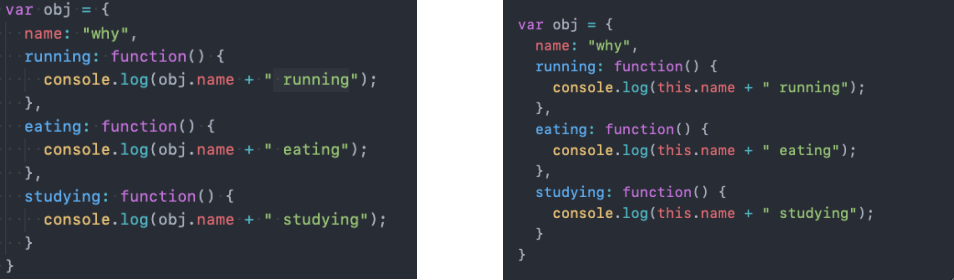

## this 指向什么?

- **目前掌握两个 this 的判断方法:**
  - 在==全局环境==下面,this 指向==window==
  - 通过==对象调用==,this 指向==调用的对象==

## 类和对象的思维方式

- **我们来思考一个问题:如果需要在开发中创建一系列的相似的对象,我们应该如何操作呢?**
- **比如下面的例子:**
  - 游戏中创建==一系列的英雄== (英雄具备的特性是相似的,比如都有名字、技能、价格,但是具体的值又不相同)
  - 学生系统中创建==一系列的学生== (学生都有学号、姓名、年龄等,但是具体的值又不相同)
- **当然,一种办法是我们创建一系列的对象**

- **这种方式有一个很大的弊端:创建同样的对象时,需要编写重复的代码**
  - 我们是否有可以批量创建对象,但是又让它们的属性不一样呢?

## 创建对象的方案 - 工厂函数

- **我们可以想到的一种创建对象的方式: 工厂函数**
  - 我们可以==封装一个函数==,这个函数用于帮助我们==创建一个对象==,我们只需要重复调用这个函数即可
  - ==工厂模式其实是一种常见的设计模式==

## 认识构造函数

- **工厂方法创建对象有一个比较大的问题:==我们在打印对象时,对象的类型都是 Object 类型==**

  - 但是从某些角度来说,这些对象应该有一个==他们共同的类型==
  - 下面我们来看一下另外一种模式:==构造函数的方式==

- **我们先理解什么是构造函数?**

  - ==构造函数==也称之为==构造器 (constructor),==通常是我们在==创建对象时会调用的函数==
  - 在其他面向的编程语言里面,==构造函数是存在于类中的一个方法,称之为构造方法==
  - 但是 javaScript 中的构造函数有点不太一样,==构造函数扮演了其他语言中类的角色==

- **也就是在 javaScript 中,构造函数其实就是类的扮演者:**
  - 比如==系统默认给我们提供的 Date 就是一个构造函数==,也可以==看成是一个类==
  - 在 ES5 之前,我们都是==通过 function 来声明一个构造函数(类)==的,==之后通过 new 关键字来对其进行调节==
  - 在 ES6 之后, ==javaScript 可以像别的语言一样==,==通过 class 来声明一个类==
- **那么类和对象到底是什么关系呢?**

## 类和对象的关系

- **那么什么是 (构造函数) 呢?**
  - 现实生活中往往是根据==一份描述/一个模板==来创建一个==实体对象==的
  - 编程语言也是一样,也必须先有==一份描述==,在这份描述中说明将来创建出来的对象==有哪些属性(成员变量)和行为(成员方法)==
- **比如现实生活中,我们会如此来描述一些事物:**
  - 比如水果==fruits==是一类事物的统称,==苹果、橘子、葡萄==等是具体的对象
  - 比如人==person==是一类事物的统称,而==jim、Lucy、Lily==是具体的对象

## 比如植物大战僵尸游戏

## javaScript 中的类 (ES5)

- **我们前面说过,在 javaScript 中类的表示形式就是构造函数**
- **javaScript 中的构造函数是怎么样的?**
  - 构造函数也是一个==普通的函数==,从表现形式来说,和==千千万万个普通的普通函数==没有任何区别
  - 那么如果这么一个==普通的函数被使用 new 操作符==来调用了,那么==这个函数就称之为是一个构造函数==
- **如果一个函数被使用 new 操作符调用了,那么它会执行如下操作:**
  - 1.在内存中创建一个新的对象 (空对象)
  - 2.这个对象内部的[[prototype]]属性会被赋值为该构造函数的 prototype 属性
  - 3.构造函数内部的 this,会指向创建出来的新对象
  - 4.执行函数的内部代码 (函数体代码)
  - 5.如果构造函数没有返回非空对象,则返回创建出来的新对象

## 创建对象的方案 - 构造函数 (类)

- **我们来通过构造函数实现一下:**

- 这个==构造函数==可以确保我们的对象是有 Person 的类型的 (实际上 constructor 的属性,这个我们后续再探讨)
- **事实上构造函数还有很多其他的特性:**
  - 比如原型、原型链、实现继承的方案
  - 比如 ES6 中类、继承的实现

## javaScript 常见的内置类

## 原始类型的包装类

- **javaScript 的原始类型==并非对象类型==,所以从理论上来说,它们是==没有办法获取属性或者调用方法==的**
- **但是,在开发中会看到,我们会经常这样操作:**

- **那么,为什么会出现这样奇怪的现象呢?**
  - 原始类型是==简单的值==,默认==并不能调用属性和方法==
- **常见的包装类型有:==String、Number、Boolean、Symbol、BigInt 类型==**

## 包装类型的使用过程

- **默认情况,当我们==调用一个原始类型的属性或者方法==时,会进行如下操作:**
  - 根据==原始值==，==创建一个原始类型对应的包装类型对象==
  - ==调用对应的属性或者方法,返回一个新的值==
  - ==创建的包装类对象被销毁==
  - 通常 javaScript==引擎会进行很多的优化==,==他可以跳过创建包装类的过程在内部直接完成属性的获取或者方法的调用==
- **我们也可以自己来创建一个包装类的对象:**
  - name1 是字面量(literal)的创建方式,name2 是 new 创建对象的方式

- 注意事项:==null、undefined 没有任何的方法,也没有对应的"对象包装类"==

## Number 类的补充

- **前面我们已经学习了 Number 类型,它有一个对应的==数字包装类型 Number==,我们来对它的方法做一些补充**
- **Number 属性补充:**
  - Number.MAX_SAFE_INTEGER: javaScript 中最大的安全整数 (2^53^ - 1)
  - Number.MIN_SAFE_INTEGER: javaScript 中最小的安全整数 -(2^53^ -1)
- **Number 实例方法补充:**
  - ==方法一: toString(base)==, 将数字转成字符串,并且按照 base 进制进行转化
    - base 的范围可以从 2 到 36,默认情况下是 10
    - 注意:如果是直接对一个数字操作,需要使用.运算符
  - ==方法二:toFixed(digits)==,格式化一个数字,保留 digits 位的小数
    - digits 的范围是 0 到 20 (包含) 之间
- **Number 类方法补充**
  - ==方法一:Number.parseInt(string[,radix])==,将字符串解析成整数,也有对应的全局方法 parseInt
  - ==方法二:Number.parseFloat(string)==,将字符串解析成浮点数,也有对应的全局方法 parseFloat
- **更多 Number 的知识,可以查看 MDN 文档:**

[Number - JavaScript | MDN (mozilla.org)](https://developer.mozilla.org/zh-CN/docs/Web/JavaScript/Reference/Global_Objects/Number)

## Math 对象

- **在除了 Number 类可以对数字进行处理之外,javaScript 还提供了一个==Math 对象==**
  - Math 是一个==内置对象== (不是一个构造函数), 它==拥有一些数学常熟属性和数学函数方法==
- **Math 常见的属性:**
  - Math.PI:圆周率,约等于 3.14159
- **Math 常见的方法:**
  - ==Math.floor==:向下舍入取整
  - ==Math.ceil==:向上舍入取整
  - ==Math.round==:四舍五入取整
  - ==Math.random==:生成 0~1 的随机数 (包含 0,不包含 1)
  - ==Math.pow(x,y)==:返回 x 的 y 次幂
- [Math - JavaScript | MDN (mozilla.org)](https://developer.mozilla.org/zh-CN/docs/Web/JavaScript/Reference/Global_Objects/Math)

## String 类的补充 (一) - 基本使用

- **在开发中,我们经常需要对字符串进行各种各样的操作,String 类提供给了我们对应的属性和方法**
- **String 常见的属性:**
  - ==length==:获取字符串的长度
- **String 也有很多常见的方法和操作,我们来进行学习**

- **操作一：访问字符串的字符**
  - 使用方法一:通过字符串的索引==str[0]==
  - 使用方法二:通过==str.charAt(pos)==方法
  - 它们的区别是==索引的方式没有找到会返回 undefined==,而==charAt 没有找到会返回空字符串==
- **练习:字符串的遍历**
  - 方式一:普通 for 循环
  - 方式二:for..of 遍历

## String 类的补充 (二) - 修改字符串

- **字符串的不可变性:**
  - 字符串在定义后是==不可以修改==的,所以下面的操作是没有任何意义的

- **所以,在我们改变很多字符串的操作中,都是生成了一个新的字符串**
  - 比如改变字符串大小的两个方法
  - ==toLowerCase()==:将所有的字符串转成小写
  - ==toUpperCase()==:将所有的字符转成大写

## String 类的补充 (三) - 查找字符串

- **在开发中我们经常会在一个字符串中查找或者获取另外一个字符串,String 提供了如下方法:**
- ==方法一:== 查找字符串位置 
  - 从 fromIndex 开始,查找 searchValue
  - 如果没有找到,那么返回-1
  - 有一个相似的方法,叫 lastIndexOf,从最后开始查找 (用的较少)
  - 
- ==方法二:是否包含字符串==
  - 从 position 位置开始查找 searchString,根据情况返回 true 或 false
  - 这是 ES6 新增的方法

## String 类的补充 (四) - 开头和结尾

- ==方式三: 以 xxx 开头==
  - 从 position 位置开始,判断字符串是否以 searchString 开头
  - 这是 ES6 新增的方法,下面的方法也一样
- ==方式四:以 xxx 结尾==
  - 在 length 长度内,判断字符串是否以 searchString 结尾
  - 
- ==方法五:替换字符串== 
  - 查找到对应的字符串,并且使用新的字符串进行替代
  - 这里也可以传入一个正则表达式来查找,也可以传入一个函数来替代
  - 

## String 类的补充 (五) - 获取子字符串

- ==方法八:获取子字符串==

- **开发中推荐使用 slice 方法**

## String 类的补充 (六) - 其他方法

- ==方法六:拼接字符串==

- ==方法七:删除首位空格==

- ==方法九:字符串分割==
  - separator:以什么字符串进行分割,也可以是一个正则表达式
  - limit:限制返回片段的数量

- **更多的字符串的补充内容,可以查看 MDN 的文档:**
  - https://developer.mozilla.org/zh-CN/docs/Web/JavaScript/Reference/Global_Objects/String

## 认识数组 (Array)

- **什么是数组(Array)呢?**
  - 对象允许==存储键值集合==,但是在==某些情况下使用键值对来访问并不方便==
  - 比如说==一系列的商品、用户、英雄==,包括==HTML 元素==,我们==如何将他们存储在一起==呢?
  - 这个时候我们需要==一种有序的集合==,里面的元素是==按照某一个顺序来排列==的
  - 这个==有序的集合==,我们可以通过==索引==来获取到它
  - 这个结构就是数组 (Array)
- **数组和对象都是一种保存对各数据的数据结构,在后续的数据结构中我们还会学习其他结构**
- **我们可以通过[]来创建一个数组**
  - 数组是==一种特殊的对象类型==

## 数组的创建方式

- **创建一个数组有两种语法:**

- **下面的方法是在创建一个数组时,设置数组的长度 (很少用)**

- **数组元素从 0 开始编号 (==索引 index==)**
  - 一些变成语言允许我们使用负数索引来实现这一点,例如 fruits[-1]
  - javaScript==并不支持这种写法==
- **我们先来学习一下数组的基本操作**
  - 访问数组中的元素
  - 修改数组中的元素
  - 增加数组中的元素
  - 删除数组中的元素

## 数组的基本操作

- ==访问==数组中的元素
  - 通过中括号[]访问
  - arr.at(i):
    - 如果 i>=0,则与 arr[i]完全相同
    - 对于 i 为负数的情况,它则从数组的尾部向前数

- ==修改==数组中的元素

- ==删除和添加==元素虽然也可以通过索引来直接操作,但是开发中很少这样操作

## 数组的添加、删除方法 (一)

- **在数组的尾端添加或删除元素:**
  - ==push==在末端添加元素
  - ==pop==从末端取出一个元素

- **在数组的首端添加或删除元素**
  - ==shift==取出队列首端的一个元素,整个数组元素向前移动
  - ==unshift==在首端添加元素,整个其他数组元素向后移动

- ==push/pop==方法运行的比较快,而==shift/unshift==比较慢

## 数组的添加、删除方法 (二)

- **如果我们希望在中间某个位置添加或者删除元素应该如何操作呢?**
- ==arr.splice 方法==可以说是处理数组的利器,它可以做所有的事情:==添加,删除和替换元素==
- **arr.splice 的语法结构如下:**
  - 从==start==位置开始,处理数组中的元素
  - ==deleteCount==:要删除元素的个数,如果为 0 或者负数表示不删除
  - ==item1,item2,...==在添加元素时,需要添加的元素

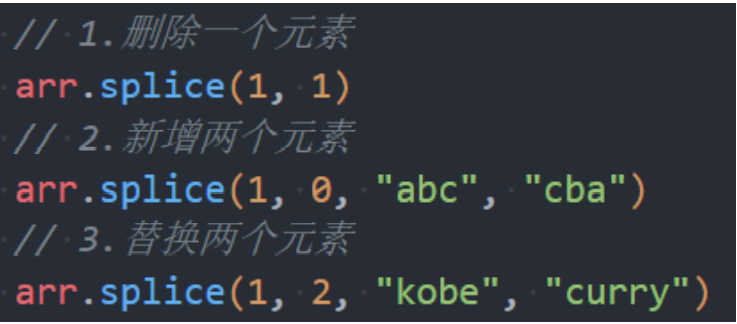

## length

- **==length 属性==用于获取数组的长度:**
  - 当我们==修改数组==的时候,==length 属性会自动更新==
- **length 属性的另一个有意思的点是它的是可写的**
  - 如果我们==手动增加一个大于默认 length 的数值==,那么==会增加数组的长度==
  - 但是如果我们==减少它,数组就会被截断==

- **所以,清空数组最简单的方法就是:arr.length = 0**

## 数组的遍历

- **普通 for 循环遍历:**

- **for..in 遍历, 获取到索引值:**

- **for..of 遍历,获取到每一个元素**

## 数组方法 - slice、cancat、join

- ==arr.slice 方法==:用于对数组进行截取 (类似字符串的 slice 方法)
  - 包含 bigin 元素,但是不包含 end 元素

- **==arr.concat 方法:==创建一个新数组,其中包含来自其他数组和其他项的值**

- ==arr.join 方法==: **将一个数组的所有元素连接成一个字符串并返回这个字符串**

## 数组方法 - 查找元素

- **==arr.indexOf 方法==: 查找某个元素的索引**
  - 从 fromIndex 开始查找,如果找到返回对应的索引,没有找到返回-1
  - 也有对应的从最后位置开始查找的 lastIndexOf 方法
- ==arr.includes 方法==:判断数组是否包含某个元素
  - 从索引 from 开始搜索 item,如果找到则返回 true (如果没找到,则返回 false)
- **==find 和 findIndex==直接查找元素或者元素的索引 (ES6 之后新增的语法)**

## 数组的排序 - sort/reverse

- **==sort 方法==也是一个高阶函数,用于对数组进行排序,并且生成一个排序后的新数组:**
  - 如果 compareFunction(a,b)小于 0 , 那么 a 会被排列到 b 前面
  - 如果 compareFunction(a,b)等于 0 , a 和 b 的相对位置不变
  - 如果 compareFunction(a,b)大于 0 , b 会被排列到 a 前面
  - 也就是说,谁小谁排在前面

- 等到后续讲解数据结构与算法时,我们会编写自己的排序算法:
  - 冒泡排序、插入排序、选择排序、堆排序、希尔排序、快速排序等
- **==reverse() 方法==将数组中元素的位置颠倒,并返回该数组**

## 数组的其他高阶方法

- **arr.forEach**
  - 遍历数组,并且让数组中每一个元素都执行一次对应的方法
- **arr.map**
  - map() 方法创建一个新数组
  - 这个新数组由原数组中的每个元素都调用一次提供的函数后的返回值组成
- **arr.filter**

  - filter() 方法创建一个新数组
  - 新数组中止包含每个元素调用函数返回为 true 的元素

- **arr.reduce**
  - 用于计算数组中所有元素的总和
  - 对数组中的每个元素按顺序执行一个由您提供的 reducer 函数
  - 每一次运行 **reducer** 会将先前元素的计算结果作为参数传入, 最后将其结果汇总为单个返回值

## 时间的表示方式

- **关于《时间》,有很多话题可以讨论:**
  - 比如物理学有==《时间简史:从大爆炸到黑洞》==,讲述的是关于==宇宙的起源、命运==
  - 比如文学上有==《纪念刘和珍君》==:时间永是流逝,街市依旧太平
  - 比如音乐上有==《时间都去哪儿了》:==时间都去哪儿了,还没好好感受年轻就老了
- **我们先来了解一下时间表示的基本概念:**
- 最初,人们是通过观察==太阳的位置==来决定时间的,但是这种方式有一个最大的弊端就是==不同区域位置大家使用的时间==是不一致的
  - 相互之间没有办法通过一个统一的时间来沟通、交流
- 之后,人们开始指定的标准时间是==英国伦敦的皇家格林威治 (Greenwich) 天文台的标准时间== (刚好在本初子午线经过的地方) , 这个时间也称之为 GMT (Greenwich Mean Time)
  - 其他时区根据标准时间来确定自己的时间,往东的时区 (GMT+hh:mm), 往西的时区 (GMT+hh:mm)
- 但是,根据公转有一定的误差,也会造成 GMT 的时间会造成一定的误差,于是就提出可根据==原子钟计算的标准时间 UTC== (Coordinated Universal Time)
- **目前 GMT 依然在使用,主要表示的是==某个时区中的时间==,而 UTC 是==标准的时间==**

## 时区对比图

## 创建 Date 对象

- **在 javaScript 中我们使用 Date 来表示和处理时间**
  - ==Date 的构造函数==有如下用法:

## dateString 时间的表示方式

- **日期的表示方式有两种: ==RFC 2822 标准== 或者 ==ISO 8601 标准==**
- **默认打印的时间格式是 RFC 2822 标准的:**

- **我们也可以将其转化成 ISO 8601 标准的:**
  - ==YYYY==:年份,0000~9999
  - ==MM==:月份,01~12
  - ==DD==:日,01~31
  - ==T==:分隔日期和时间,没有特殊含义,可以省略
  - ==HH==:小时,00~24
  - ==mm==:分钟,00~59
  - ==ss==：秒,00~59
  - ==.sss==:毫秒
  - ==Z==:时区

## Date 获取信息的方法

- **我们可以从 Date 对象中获取各种详细的信息:**

  - ==getFullYear()==:获取年份 (4 位数)
  - ==getMonth()==: 获取月份,从 0 到 11
  - ==getDate()==: 获取当月的具体日期,从 1 到 31
  - ==getHours()==: 获取小时
  - ==getMinutes()==:获取分钟
  - ==getSeconds()==:获取秒钟
  - ==getMilliseconds()==:获取毫秒

- **获取某周中的星期几:**
  - ==getDay()==:获取一周中的第几天,从 0 (星期日) 到 6 (星期六)

## Date 设置信息的方法

- Date 也有对应的设置方法
  - ==setFullYear(year,[month],[date])==
  - ==setMonth(month,[date])==
  - ==setDate(date)==
  - ==setHours(hour,[min],[sec],[ms])==
  - ==setMinutes(min.[sec],[ms])==
  - ==setSeconds(sec,[ms])==
  - ==setMilliseconds(ms)==
  - ==setTime(millseconds)==

## Date 获取 Unix 时间戳

- ==Unix 时间戳==: **它是一个整数值,表示自 1970 年一月一日 00:00:00 UTC 以来的毫秒数**
- **在 javaScript 中,我们有很多种方法可以获取这个时间戳**
  - 方式一:==new Date().getTime()==
  - 方式二:==new Date().valueOf()==
  - 方式三:==+new Date()==
  - 方式四:==Date.now()==

## 获取到 Unix 时间戳之后,我们可以利用它来测试代码的性能

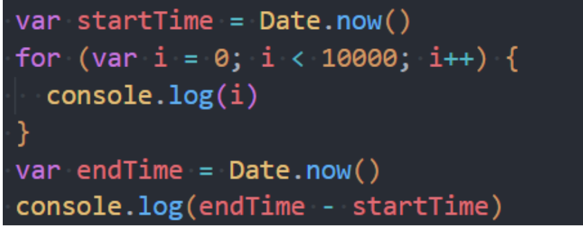

## Date.parse 方法

- **Date.parse(str)方法可以==从一个字符串中读取日期==,并且==输出对应的 Unix 时间戳==**
- **Date.parse(str):**
  - 作用==等同于 new Date(dateString).getTime()操作==
  - ==需要符合 RFC2822 或 ISO 8601 日期格式的字符串==
    - 比如 YYYY-MM-DDTHH:mm:ss.sssZ
  - 其他格式也许也支持,但==结果不能保证一定正常==
  - 如果输入的格式==不能被解析==,那么会返回==NAN==

## 时间格式化的方法 (JS 高级讲解)

# javaScript 的 DOM 操作(一)

## 认识 DOM 和 BOM

- **前面我们花了很多时间学习 javaScript 的基本语法,但是这些基本语法,好像和做网页没有什么关系,和前面学习的 HTML、CSS 也灭有什么关系**
  - 这是因为我们前面==学习的部分属于 ECMAScript==,也就是==javaScript 本身的语法部分==
  - 除了语法部分之外,我们还需要==学习浏览器提供给我们开发者的 DOM、BOM 相关的 API 才能对页面、浏览器==进行操作
- **前面我们学习了一个 window 的全局对象,window 上实际上就包含了这些内容:**
  - 我们已经学习了==javaScript 语法部分的 Object、Array、Date==
  - 另外还有==DOM、BOM 部分==
- **DOM:文档对象模型 (Document Object Model)**
  - 简称==DOM==,将==页面所有的内容表示为可以修改的对象==
- **BOM:浏览器对象模型 (Browser Object Model)**
  - 简称==BOM==,由==浏览器提供的用于处理文档 ( document ) 之外的所有内容的其他对象==
  - 比如==navigator、location、history==等对象

## 深入理解 DOM

- **浏览器会对我们==编写的 HTML、CSS 进行渲染==,同时它又要考虑我们可能会==通过 javaScript 来对其进行操作==:**
  - 于是==浏览器将我们编写在 HTML 中的每一个元素 (Element) 都抽象成了一个个对象==
  - 所有这些对象都可以==通过 javsScript 来对其进行访问==,那么我们就可以==通过 javaScript 来操作页面==
  - 所以,我们将==这个抽象过程==称之为 ==文档对象模型 (Document Object Model)==
- **整个文档被抽象到 document 对象中:**
  - 比如==document.documentElement==对应的是==html 元素==
  - 比如==document.body==对应的是==body 元素==
  - 比如==document.head==对应的是==head 元素==
- **下面的一行代码可以让整个页面变成红色:**

- **所以我们学习 DOM,就是在==学习如何通过 javaScript 对文档进行操作==的**

## DOM Tree 的理解

- **一个页面不只是有 HTML、head、body 元素,也包括很多的子元素:**
  - 在 htnl 结构中,最终会形成一个==树结构==
  - 在抽象成 DOM 对象的时候,它们也会形成一个==树结构==, 我们称之为==DOM Tree==

## DOM 的学习顺序

- **DOM 相关的 API 非常多,我们会通过如下顺序来学习:**
- 1.DOM 元素之间的关系
- 2.获取 DOM 元素
- 3.DOM 节点的 type、tag、content
- 4.DOM 节点的 attributes、properies
- 5.DOM 节点的创建、插入、克隆、删除
- 6.DOM 节点的样式、类
- 7.DOM 元素/window 的大小、滚动、坐标

## DOM 的继承关系图

- **DOM 相当于 javaScript 和 HTML、CSS 之间的桥梁**
  - 通过浏览器提供给我们的==DOM API==,我们可以==对元素以及其中的内容==做任何事情
- **类型之间又如下的继承关系**

## document 对象

- **Document 节点表示的整个载入的网页,它的实例是全局的==document 对象==:**
  - 对 DOM 的所有操作都是==从 document 对象开始==的
  - 它是==DOM 的入口点==,可以从==document==开始去访问任何节点元素
- **对于最顶层的 html、head、body 元素,我们可以直接在 document 对象中获取到:**
  - ==html 元素==: \< html> = document.documentElement
  - ==body 元素:== \< body> = document.body
  - ==head 元素==： \< head> = document.head
  - ==文档声明==: \< !DOCTYPE html> = document.doctype

## 节点 (Node) 之间的导航 (navigator)

- **如果我们获取到==一个节点( Node )== 后,可以根据==这个节点去获取其他的节点==,我们称之为==节点之间的导航==**
- **节点之间存在如下的关系:**
  - 父节点:==parentNode==
  - 前兄弟节点:==previousSibling==
  - 后兄弟节点：==nextSibling==
  - 子节点: ==childNodes==
  - 第一个子节点:==firstChild==
  - 第二个子节点:==lastChild==
- **尝试获取下面结构的节点:**

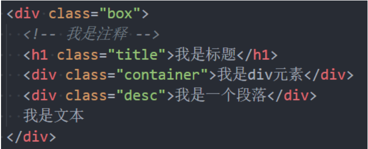

## 元素 (Element) 之间的导航 (navigator)

- **如果我们获取到一个==元素 (Element)==后,可以根据==这个元素去获取其他的元素==,我们==称之为元素之间的导航==**
- **节点之间存在如下的关系:**

  - 父元素:==parentElement==
  - 强兄弟节点:==previousElementSibling==
  - 后兄弟节点:==nextElementSibling==
  - 子节点:==children==
  - 第一个子节点==firstElementChild==
  - 最后一个子节点:==lastElementChild==

- **尝试获取下面结构的元素:**

## 表格(table)元素的导航 (navigator)

- **\< table>元素支持(除了上面给出的.之外) 以下这些属性:**

  - ==table.rows== - \< tr>元素的集合
  - ==table.caption/tHead/tFoot== - 引用元素 \< caption>、\< thead>、\< tfoot>
  - ==table.tBoodies== - \< tbody> 元素的集合

- **\< thead>,\< tfoot>,\< tbody>元素提供了 rows 属性:**
  - ==tbody.rows== - 表格内部 \< tr> 元素的集合
- **\< tr>：**
  - ==tr.cells== - 在给定\< tr>中的\< td> 和 \< th> 单元格的集合
  - ==tr.sectionRowIndex== - 给定的\< tr>在封闭的\< thead>/\< tbody>/\< tfoot>中的位置(索引)
  - ==tr.rowIndex== - 在整个表格中 \< tr> 的编号 (包括表格的所有行)
- \< td> 和 \< th>
  - ==td.cellIndex== - 在封闭的\< tr> 中单元格的编号

## 表单 (form) 元素的导航 (navigator)

- **\< form>元素可以直接通过 document 来获取:document.forms**

- **\< for,>元素中的内容可以通过 elements 来获取:form.elements**

- **哦我们可以设置表单子元素的 name 来获取它们**

## 获取元素的方法

- **当元素彼此靠近或者相邻时,DOM ==导航属性 (navigation property)== 非常有用**
  - 但是,在实际开发中,我们希望可以==任意的获取到某一个元素==应该如何操作呢?
- **DOM 为我们提供了获取元素的方法:**

- **开发中如何选择呢?**
  - 目前最常用的时==querySelector==和==querySelectAll==
  - ==getElementById==偶尔也会使用或者在适配一些低版本浏览器时

## 节点的属性 - nodeType

- **目前,我们已经可以获取到节点了,接下来我们来看一下节点中有哪些常见的属性:**

  - 当然,不同的节点类型有可能有不同的属性
  - 这里我们主要讨论==节点共有的属性==

- **nodeType 属性:**
  - nodeType 属性提供了一种获取==节点类型==的方法
  - 它有一个==数值型值== (numeric value)
- **常见的节点类型有如下:**

- **其他类型可以查看 MDN 文档: https://developer.mozilla.org/zh-CN/docs/Web/API/Node/nodeType**

## 节点的属性 - nodeName、tagName

- **nodeName:获取 node 节点的名字**
- **tagName:获取元素的标签名词**

- **tagName 和 nodeName 之间有什么不同呢?**
  - ==tagName== 属性仅适用于 Element 节点
  - ==nodeName== 是为任意 Node 定义的:
    - 对于元素, 它的意义与 tagName 相同 , 所以使用哪一个都是可以的
    - 对于其他节点类型 (text, comment 等) , 它拥有一个对应节点类型的字符串

## 节点的属性 - innerHTML、textContent

- **innerHTML 属性**
  - 将元素中的 HTML 获取为字符串形式
  - 设置元素中的内容
- **outerHTML 属性**
  - 包含了元素的完整 HTML
  - innerHTML 加上元素本身一样
- **textContent 属性**

  - 仅仅获取元素中的文本内容

- **innerHTML 和 textContent 的区别:**
  - 使用 innerHT,L, 我们将其 =="作为 HTML" 插入== ,带有所有 HTML 标签
  - 使用 textContent, 我们将其 =="作为文本" 插入==, 所有符号 (symbol) 均按字面意义处理

## 节点的属性 - nodeValue

- **nodeValue/data**
  - 用于==获取非元素节点的文本内容==

## 节点的其他属性

- **hidden 属性: 也是一个全局属性,可以用于设置元素隐藏**

- **DOM 元素还有其他属性:**
  - ==value==
    - \< input>,\< select> 和 \< textarea> (HTMLInputElement,HTMLSelectElement....) 的 value
  - ==href==
    - \< a href="..."> (HTMLAnchorElement) 的 href
  - ==id==
    - 所有元素 (HTMLElement) 的 "id" 特性 (attribute) 的值
- **class 和 style 我们会在后续专门讲解的**

## 元素的属性和特性

- **前面我们已经学习了如何获取节点, 已经节点通常所包含的属性, 接下来我们仔细研究元素 Element**
- 我们知道, 一个元素除了有==开始标签、结束标签、内容==之外,还有很多的==属性 (attribute)==

- **浏览器在解析 HTML 元素时,会将==对应的 attribute==也创建出来放到==对用的元素对象==上**
  - 比如==id、class 就是全局的 attribute==,会有对应的==id、class 属性==
  - 比如==href 属性==是针对==a 元素==的,==type、value 属性==是针对==input 元素==的

## attribute 的分类

- **属性 attribute 的分类:**
  - ==标准的 attribute==:某些 attribute 属性是标准的,比如 id、class、href、type、value 等
  - ==非标准的 attribute==:某些 attribute 属性是自定义的,比如 abc、age、height

## attribute 的操作

- **对于所有的 attribute 访问都支持如下的方法:**
  - ==elem.hasAttribute(name)== - 检查特性是否存在
  - ==elem.getAttribute(name)== - 获取这个特性值
  - ==elem.setAttibute(name,value)== - 设置这个特性值
  - ==elem.removeAttibute(name)== - 移除这个特性
  - ==atrribute==:attr 对象的集合,具有 name、value 属性

- **attribute 具备以下特征:**
  - 她们的==名字是大小不敏感的== (id 与 ID 相同)
  - 它们的==值总是字符串类型==的

## 元素的属性 (property)

- **对于==标准的 attribute==,会在 DOM 对象上创建==与其对应的 property 属性==**

- **在大多数情况下,它们是相互作用的**

  - 改变==property==,通过==attribute==获取的值,会随着改变
  - 通过==attribute==操作修改,==property==的值会随着改变
    - 但是 input 的 value 修改只能通过 attribute 的方法

- **除非特别情况,大多数情况下,设置、获取 attribute,推荐使用 property 的方式:**
  - 这是因为它==默认情况下是有类型==

## HTML5 的 data - \* 自定义属性

- 前面我们有学习 HTML5 的 data-\*自定义属性,那么它们是可以在 dataset 属性中获取到的

## javaScript 动态修改样式

- **有时候我们会通过 javaScript 来动态修改样式,这个时候我们有两个选择:**
  - 选择一:在 CSS 中编写好对应的样式,==动态的添加 class==
  - 选择二:==动态的修改 style 属性==
- **开发中如何选择呢?**
  - 在大多数情况下,如果可以动态修改 class 完成某个功能,更==推荐使用动态 class==
  - 如果对于某些情况,无法通过动态修改 class ( 比如精准修改某个 css 属性的值 ), 那么就可以==修改 style 属性==

## 元素的 className 和 classList

- **元素的 class attribute,对应的 property 并非叫 class,而是==className==:**
  - 这是因为 javaScript 早期不允许使用 class 这种关键字来作为对象的属性,所以 DOM 规范使用了==className==
  - 虽然现在 javaScript 已经没有这样的限制,但是并不推荐,并且依然在使用==className==这个名称
- **我们可以对 className 进行赋值,它会替换整个类中的字符串**

- **如果我们需要添加或者移除单个的 class,那么可以使用 classList 属性**
- **elem.classList 是一个特殊的对象:**
  - ==elem.classList.add (class)==: 添加一个类
  - ==elem.classList.remove (class)==: 添加/移除类
  - ==elem.classList.toggle(class)==: 如果类不存在就添加类,存在就移除它
  - ==elem.classList.contains(class)==: 检查给定类,返回 true/false
- **classList 是==可迭代对象==,可以通过==for of==进行遍历**

## 元素的 style 属性

- **如果需要单独修改某一个 CSS 属性,那么可以通过 style 来操作**
  - 对于==多词 (multi-word) 属性==,使用==驼峰式 camelCase==

- **如果我们将值设置为==空字符串==,那么会使用==CSS 的默认样式==:**

- **多个样式的写法,我们需要使用==cssText 属性==**:
  - 不推荐这种用法,因为它会替换整个字符串

## 元素 style 的读取 - getComputedStyle

- **如果我们需要读取样式:**

  - 对于==内联样式==,是可以==通过 style.\*的方式==读取到的
  - 对于==style、css 文件中的样式==,是==读取不到==的

- **这个时候, 我们可以通过==getComputedStyle==的全局函数来实现:**

## 创建元素

- **前面我们使用过 document.write 方法写入一个元素:**
  - 这种方式写起来非常便捷, 但是对于==复杂的内容、元素关系拼接并不方便==
  - 它是在早期没有 DOM 的时候使用的方案,目前依然被保留下来
- **那么目前我们想要插入一个元素,通常会按照如下步骤:**
  - ==步骤一:==创建一个元素
  - ==步骤二:==插入元素到 DOM 的某一个位置
- **创建元素:** document.createElement(tag)

## 插入元素

- 插入元素的方式如下:
  - ==node.append(...nodes or strings)== - 在 node 末尾 插入节点或字符串
  - ==node.prepend(...nodes or string)== - 在 node 开头插入节点或字符串
  - ==node.bofore(...node or string)==- 在 node 前面 插入节点或字符串
  - ==node.after(...nodes or string)==- 在 node 后面插入节点或字符串
  - ==node.replaceWith(...node or string)== - 将 node 替换为给定的节点或字符串

## 移除和克隆元素

- **移除元素我们可以调用元素本身的 remove 方法:**

- **如果我们想要复制一个现有的元素,可以通过 cloneNode 方法:**
  - 可以传入一个==Boolean 类型的值==,来决定==是否是深度克隆==
  - 深度克隆会克隆对应元素的子元素,否则不会

## 旧的元素操作方法

- **在很多地方我们也会看到一些旧的操作方法:**
  - ==parentElem.appendChild( node )==:
    - 在 parentElem 的父元素最后位置添加一个子元素
  - ==parentElem.inserBefore(node,nextSibling)==:
    - 在 parentElem 的 nextSibling 前面插入一个子元素
  - ==parentElem.replaceChild(node,oldChild)==
    - 在 parentElem 中,新元素替换之前的 oldChild 元素
  - ==parentElem.removeChild(node)==
    - 在 parentElem 中,移除某一个元素

## 元素的大小、滚动

- ==clientWidth==: contentWith + padding (不包含滚动条)
- ==clientHeight==: contentHeight + padding
- ==clientTop==: border-top 的宽度
- ==clientLeft==:boder-left 的宽度

- ==offsetWidth==:元素完整的宽度
- ==offsetHeight==:元素完整的高度
- ==offsetLeft==:距离父元素的 x
- ==offsetHeight==:距离父元素的 y

- ==scrollHeight==:整个可滚动的区域高度
- ==scrollTop==:滚动部分的高度

## window 的大小、滚动

- **window 的 width 和 height**

  - ==innerWidth、innerHeight==:获取 window 窗口的宽度和高度 (包含滚动条)
  - ==outerWidth、outerHeight==:获取 window 窗口的整个宽度和高度 (包括调试工具、工具栏)
  - ==documentElement.clientHeight、documentElement.clientWidth==: 获取 html 的宽度和高度 (不包含滚动条)

- **window 的滚动位置:**

  - ==scrollX==:X 轴的滚的位置 (别名 pageXOffset)
  - ==scrollY==:Y 轴滚动的位置 (别名 pageYOffset)

- **也有提供对应的滚动方法:**
  - 方法 scrollBy(x,y):将页面滚动至 相对于当前位置的(x,y)位置
  - 方法 scrollTo(pageX,pageY)将页面滚动至 绝对坐标

# javaScript 的事件处理

## 认识事件 (Event)

- **Web 页面需要经常和用户之间进行交互,而交互的过程中我们可能想要捕捉这个交互的过程:**
  - 比如==用户点击了某个按钮、用户在输入框里面输入了某个文本、用户鼠标经过了某个位置==
  - 浏览器需要搭建一条==javaScript 代码和事件之间的桥梁==
  - 当某个事件发生时,让 javaScript==可以相应 (执行某个函数)==,所以我们需要==针对事件编写处理程序 (handler)==
- **如何进行事件监听呢?**
  - 事件监听方式一:在 script 中直接监听 (很少使用)
  - 事件监听方式二:DOM 属性,通过元素的 on 来监听事件
  - 事件监听方式三:通过 EventTarget 中的 addEventListener 来监听

## 常见的事件列表

- **鼠标事件:**
  - click - 当鼠标点击一个元素时 (触摸屏设备会在点击时生成)
  - mouseover / mouseout - 当鼠标指针移入/离开一个元素时
  - mousedown / mouseup - 当在元素上按下/释放鼠标按钮时
  - mousemove - 当鼠标移动时
- **键盘事件:**
  - keydown 和 keyup - 当按下和松开一个按键时
- **表单 (form) 元素事件: **
  - submit - 当访问者提交一个 \< form> 时
  - focus - 当访问者聚焦于一个元素时,例如聚焦于一个 \< input>
- **Document 事件:**
  - DOMContentLoaded - 当 HTML 的加载和处理均完成,DOM 被完全构建完成时
- **CSS 事件:**
  - transitionend - 当一个 CSS 动画完成时

## 认识事件流

- **事件上对于事件有一个概念叫做事件流,为什么会产生事件流呢?**
  - 我们可以想到一个问题:当我们在浏览器上==对着一个元素点击时,你点击的不仅仅时这个元素本身==
  - 这是因为我们的==HTML 元素是存在元素叠加层级==的
  - 比如一个 span 元素是放在 div 元素上的,div 元素是放在 body 元素上的,body 元素是放在 html 元素上的

## 事件冒泡和事件捕获

- **我们会发现默认情况下事件是==从最内层的 span 内外一次传递的顺序==,这个顺序我们称之为==事件冒泡(Event Bubble)==**
- **事实上,还有另外一个监听事件流的方式就是==从外层到内层 (body -> span)==,这种称之为==事件捕获 (Event Captrue)== **
- **为什么会产生两种不同的处理流呢?**
  - 这是因为早期浏览器开发时,不管是==IE 还是 Net scape 公司都发现了这个问题==
  - 但是他们采用了==完全相反的事件流来对事件进行了传递==
  - IE 采用了==事件冒泡的方式==,Netscape 采用了==事件捕获的方式==
- **那么我们如何去监听事件捕获的过程呢?**

## 事件捕获和冒泡的过程

- **如果我们都监听,那么会按照如下顺序来执行:**
- ==捕获阶段 (Capturing phase)==
  - 事件 (从 Window ) 向下走近元素
- ==目标阶段 (Target phase)==
  - 事件到达目标元素
- ==冒泡阶段 (Bubbling phase)==

  - 事件从元素开始冒泡

- **事实上,我们可以通过 event 对象来获取当前的阶段:**
  - eventPhase
- **开发中通常会使用==事件冒泡==,所以事件捕获了解即可**

## 事件对象

- **当一个事件发生时,就会有和这个事件相关的很多信息:**
  - 比如==事件的类型时什么==,你点击的时==哪一个元素==,==点击的位置==时哪里等等相关的信息
  - 那么这些信息会被封装到一个==Event 对象中==,这个对象由==浏览器==创建,称之为==event 对象==
  - 该对象给我们提供了想要的一些属性,以及可以通过该对象进行某些操作
- **如何获取这个 event 对象呢?**
  - ==event 对象==会在==传入的事件处理 (event handler) 函数回调==时, 被系统传入
  - 我们可以在回调函数中拿到这个==event 对象==

- **这个对象中都有哪些常见的属性和操作呢?**

## event 常见的属性和方法

- **常见的属性**
  - ==type==: 事件的类型
  - ==target==:当前事件发生的元素
  - ==currentTarget==:当前处理事件的元素
  - ==eventPhase==:事件所处的阶段
  - ==offsetX、offsetY==:事件发生在元素内的位置
  - ==clientX、clientY==:事件发生在客户端内的位置
  - ==pageX、pageY==: 事件发生在客户端相对于 document 的位置
  - ==screenX、screenY==: 事件发生相对于屏幕的位置
- **常见的方法:**
  - ==preventDefault==:取消事件的默认行为
  - ==stopPropagation==: 阻止事件的进一步传递 (冒泡或者捕获都可以阻止 )

## 事件处理中的 this

- **在函数中,我们也可以通过 this 来获取当前的发生元素:**

- 这是因为在浏览器内部,调用==event handler 时绑定到当前 currentTarget==上的

## EventTarget 类

- **我们会发现,所有的节点、元素都继承自 EventTarget**
  - 事实上 Window 也继承自==EventTarget==

- **那么这个 EventTarget 是什么呢?**
  - EventTarget 是一个==DOM 接口==,主要用于==添加、删除、派发 Event 事件==
- **EventTarget 常见的方法:**
  - ==addEventListener==:注册某个事件类型以及事件处理函数
  - ==removeEventListener==:移除某个事件类型以及事件处理函数
  - ==dispatchEvent==:派发某个事件类型到 EventTarget 上

## 事件委托 (event delegation)

- **事件冒泡在某种情况下可以帮助我们实现强大的事件处理模式 - ==事件委托模式== (也是一种设置模式)**
- **那么这个模式是怎么样的呢?**
  - 因为==当子元素被点击==时,父元素可以==通过冒泡 可以监听到子元素的点击==
  - 并且==可以通过 event.target 获取到当前监听的元素==
- **案例: 一个 ul 中存放多个 li,点击某一个 li 会变成红色**
  - 方案一: 监听==每一个 li 的点击==并且==做出相应==
  - 方案二:在==ul 中监听点击==,并且==通过 event.target 拿到对应的 li 进行处理==
    - 因为这种方案并不需要遍历后给每一个 li 上添加事件监听,所以它更加高效

## 事件委托的标记

- **某些事件委托可能需要对具体的子组件进行区分,这个时候我们可以使用==data-\*==对其进行标记**
- **比如多个按钮的点击,区分点击哪一个按钮**

## 常见的鼠标事件

- **接下来我们来看一下常见的鼠标事件 (不仅仅时鼠标设备,也包括模拟的设备,比如手机、平板电脑)**
- **常见的鼠标事件:**

## mouseover 和 mouseenter 的区别

- **mouseenter 和 mouseleave**

  - ==不支持冒泡==
  - 进入子元素依然属于在该元素内,没有任何反应

- **mouseover 和 mouseout**

  - ###### ==支持冒泡==

  - 进入元素的子元素时

    - 先调用父元素的 mouseout
    - 再调用子元素的 mouseover
    - 因为支持冒泡,所以会将 mouseover 传递到父元素中

## 常见的键盘事件

- **常见的键盘事件:**

- **事件的执行顺序时 onkeydown、onkeypress、onkeyup**

  - ==down==事件先发生
  - ==press==发生在文本被输入
  - ==up==发生在文本输入完成

- **我们可以通过 key 和 code 来区分按下的键:**
  - ==code==: "按键代码" ("KeyA" , "ArrowLeft" 等) , 特定于键盘上按键的物理位置
  - ==key==: 字符 ("A", "a"等) , 对于非字符 (non-character) 的按键,通常具有与 code 相同的值

## 常见的表单事件

- **针对表单也有常见的事件:**

## 文档加载事件

- **==DOMContentLoaded==:浏览器已完全加载 HTML,并构建了 DOM 树,但像 \< img>和样式之类的外部资源可能尚未加载完成**
- **==load==:浏览器不仅加载完成了 HTML,还加载完成了所有外部资源:图片,样式等**

- **事件类型**:[事件参考 | MDN (mozilla.org)](https://developer.mozilla.org/zh-CN/docs/Web/Events)

# javaScript DOM 实战案例

## window 定时器方法

- **有时我并不想立即执行一个函数,而是等待特定一段时间之后再执行,我们称之为=="计划调用 (scheduling a call)"==**
- **目前有两种方式可以实现:**
  - ==seTimeout==允许我们将函数==推迟到一段时间间隔之后==再执行
  - ==setInterval==允许我们==重复允许一个函数==,从一段==时间间隔之后开始运行==,之后以时间间隔==连续重复运行该函数==
- **并且通常情况下体育提供对应的取消方法:**
  - ==clearTimeout==: 取消 setTimeout 的定时器
  - ==clearInterval==:取消 setInteval 的定时器
- **大多数运行环境都有内置的调度程序,并且提供了这些方法:**
  - 目前来讲, ==所有浏览器以及 Node.js== 都支持这两个方法
  - 所以我们后续学习 Node 的时候,也可以在 Node 中使用它们

## setTimeout 的使用

- **setTimeout 的语法如下:**
  - ==func | code==: 想要执行的函数或代码字符串
    - 一般传入的都是由函数,由于某些历史原因,支持传入代码字符串, 但是不建议这样做
  - ==delay==:执行前的延时,以毫秒为单位 (1000 毫秒 = 1 秒), 默认值时 0
  - ==arg1,arg2...==:要传入被执行函数 (或代码字符串) 的参数列表
- **clearTimeout 方法:**
  - setTimeout 在调用时会返回一个 =="定时器标识符( timer identifier)"==, 我们可以使用它来取消执行

## setInterval 的使用

- **setInterval 方法和 setTimeout 的语法相同:**
- 
  - 所有参数的意义也是相同的
  - 不过==与 setTimeout 只执行一次不同==,==setInterval 是每间隔给定的时间周期行执行==
- **clearInterval 方法:**
  - setInterval 也会返回一个 =="定时器标识符 (timer identifier)"==, 我们可以通过 clearInterval 来取笑这个定时器

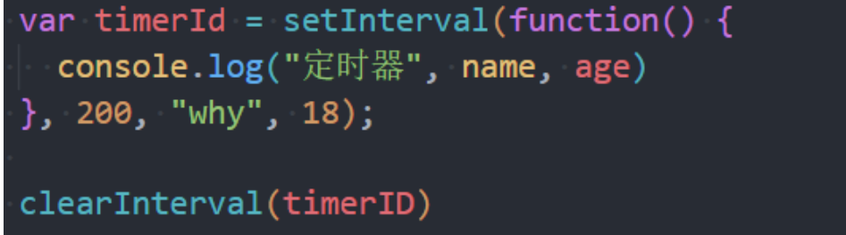

# javaScript 的 BOM 操作

## 认识 BOM

- **BOM: 浏览器对象模型 (Browser Object Model)**

  - 简称==BOM==,由==浏览器提供的用于处理文档 (document) 之外的所有内容的其他对象==
  - 比如 ==navigator、location、history==等对象

- javaScript 有一个非常重要的运行环境就是浏览器
  - 而且浏览器本身又作为一个应用程序需要对其本身进行操作
  - 所以通常浏览器会有对应的对象模型 (BOM, Browser Object Model)
  - 我们可以将 BOM 看成是连接 javaScript 脚本与浏览器窗口的桥梁
- BOM 主要包括一下的对象模型:
  - window:包括全局属性、方法、控制浏览器窗口相关的属性、方法
  - location: 浏览器连接到的对象的位置 (URL)
  - history: 操作浏览器的历史
  - navtgator: 用户代理 (浏览器) 的状态和标识 (很少用到)
  - screen: 屏幕窗口信息 (很少用到)

## window 对象

- **window 对象在浏览器中可以从两个视角来看待:**
  - ==视角一:全局对象==
    - 我们知道 ECMAScript 其实是有一个全局对象的,这个全局对象在==Node 中是 global==
    - 在浏览器中就是==window 对象==
  - ==视角二:浏览器窗口对象==
    - 作为==浏览器窗口时,提供了对浏览器操作的相关 API==
- **当然,这两个视角存在大量重叠的地方,所以不需要刻意的去区分它们:**
  - 事实上对于==浏览器和 Node 中全局对象名称不一样的情况==,目前已经指定了对应的标准,称之为==globalThis==,并且大多数现在浏览器都支持它
  - 放在==window 对象==上的所有属性都可以被访问
  - 使用==var 定义的变量会被添加到 window 对象==中
  - window 默认给我们提供了全局的函数和类 ==setTimeout、Math、Date、Object==等

## window 对象的作用

- **事实上 window 对象上肩负的重担时非常大的**:
  - 第一:==包含大量的属性==,localStorage、console、location、history、screenX、scrollX 等等 (大概 60+个属性)
  - 第二:==包含大量的方法==, alert、close、scrollTo、open 等等 (大概 40+个方法)
  - 第三:==包含大量的事件==, focus、blur、load、hashchange 等等 (大概 30+个事件)
  - 第四:包含从==EventTarget 继承过来的方法==,addEventListener、removeEventListener、dispatchEvent 方法
- **那么这些大量的属性、方法、事件在哪里查看呢?**
  - MDN 文档:[Window - Web API 接口参考 | MDN (mozilla.org)](https://developer.mozilla.org/zh-CN/docs/Web/API/Window)
- **查看 MDN 文档时,我们会发现有很多不同的符号**
  - ==删除符号==:表示这个 API 已经废弃,不推荐继续使用了
  - ==点踩符号==:表示这个 API 不属于 W3C 规范,某些浏览器有实现 (所以兼容性的问题)
  - ==实验符号==: 该 API 时实验性特性,以后可能会修改,并且存在兼容性问题

## window 常见的属性

- **我们来看一下常见的 window 属性**:

## window 常见的方法

- **我们来看一下常见的 window 方法:**

## window 常见的事件

- **我们来看一下常见的 window 事件:**

## location 对象常见的属性

- **location 对象用于表示 window 上当前链接到的 URL 信息**
- **常见的属性有哪些呢?**
  - ==href==:当前 window 对应的超链接 URL,整个 URL
  - ==protocol==: 当前的协议
  - ==host==:主机地址
  - ==hostname==:主机地址 (不带端口)
  - ==port==:端口
  - ==pathname==:路径
  - ==search==:查询字符串
  - ==hash==:哈希值
  - uesername:URL 中的 username (很多浏览器已经禁用)
  - password:URL 中的 password (很多浏览器已经禁用)

## Location 对象常见的方法

- **我们会发现 location 其实时 URL 的一个抽象实现:**

- **location 有如下常用的方法:**
  - ==assign==:赋值一个新的 URL,并且跳转到该 URL 中
  - ==replace==:打开一个新的 URL,并且跳转到该 URL 中 (不会在浏览记录中留下之前的记录)
  - ==reload==:重新加载页面,可以传入一个 Boolean 类型

## URLSearchParams

- **URLSearchParams 定义了一些实用的方法来处理 URL 的查询字符串**
  - 可以将一个字符串转化成==URLSearchParams==类型
  - 也可以将一个==URLSearchParams==类型转成字符串

- **URLSearchParams 常见的方法有如下:**
  - ==get==:获取搜索参数的值
  - ==set==:设置一个搜索参数的值
  - ==append==:追加一个搜索参数的值
  - ==has==:判断是否有某个搜索参数
  - [URLSearchParams - Web API 接口参考 | MDN (mozilla.org)](https://developer.mozilla.org/zh-CN/docs/Web/API/URLSearchParams)
- **中文会使用==encodeURIComponent==和==decodeURIComponent==进行编码和解码**

## history 对象常见的属性和方法

- **history 对象允许我们访问浏览器曾经的会话历史记录**
- 有两个属性:
  - ==length==:会话中的记录条数
  - ==state==:当前保留的状态值
- **有五个方法:**
  - ==back()==:返回上一页,等价于 history.go(-1)
  - ==forward()==:前进下一页,等价于 history.go(1)
  - ==go()==:加载历史中的某一页
  - ==pushState()==:打开一个指定的地址
  - ==replaceState()==:打开一个新的地址,并且使用 replace

- **history 和 hash 目前时 vue、react 等框架实现路由的底层原理**

## navigator 对象

- **navigator 对象表示用户代理的状态和标识等信息**

## screen 对象 (很少使用)

- **screen 主要记录的是浏览器窗口外面的客户端显示器的信息:**
  - 比如屏幕的逻辑像素 screen.width 、screen.height

## JSON 的由来

- **在目前的开发中,JSON 是一种非常重要的==数据格式==,它并不是==编程语言==,而是一种可以在服务器和客户端之间传输的数据格式**
- **JSON 的全称是 javaScript Object Notation (javaScript 对象符号)**:
  - JSON 是由==Douglas Crockford 构想和设计的一种轻量级资料交换格式==,==算是 javaScript 的一个子集==
  - 但是虽然==JSON 被提出来的时候是主要应用 javaScript==中,但是目前已经==独立于编程语言,可以在各个编程语言==中使用
  - 很多编程语言都实现了==将 JSON 转成对应模型的方式==
- **其他的传输格式:**
  - ==XML==:在早期的网络传输中主要是使用 XML 来进行数据交换的,但是这种格式在解析、传输等各方面都弱于 JSON,但是目前已经很少在被使用了
  - ==Protobuf==:另外一个在网络中传输中目前已经越来越多使用的传输格式是 protobuf,但是 2021 年的 3.x 版本才支持 javaScript,所以目前在前端使用的较少
- **目前 JSON 被使用的场景月越来越多:**
  - ==网络数据的传输 JSON 数据==
  - ==项目的某些配置文件==
  - ==非关系型数据库 (NoSQL) 将 json 作为存储格式==

## 小程序的 app.json

## JSON 基本语法

- **JSON 的顶层支持三种类型的值:**
  - ==简单值==: 数字 (Number)、字符串 (String, 不支持单引号) 、布尔类型 (Boolean) 、null 类型
  - ==对象值==: 由 key、value 组成, key 是字符串类型,并且必须添加双引号,值可以是简单值、对象值、数组值
  - ==数组值==:数组的值可以是简单值、对象值、数组值

## JSON 序列化

- **某些情况下我们希望将 javaScript 中的复杂类型转化成 JSON 格式的字符串,这样方便对其进行处理:**
  - 比如我们希望将一个对象保存到 localStorage 中
  - 但是如果我们直接存放一个对象,这个对象会被转化成[object Object] 格式的字符串,并不是我们想要的结果

## JSON 序列化方法

- **在 ES5 中引用了 JSON 全局对象,该对象由两个常用的方法:**
  - ==stringify 方法==:将 javaScript 类型转成对应的 JSON 字符串
  - ==parse 方法==:解析 JSON 字符串,转回对应的 javaScript 类型
- **那么上面的代码我们可以通过如下的方法来使用:**

## Stringify 的参数 replace

- **JSON.stringfy() 方法将一个 javaScript 对象或值转换为 JSON 字符串**
  - 如果指定了一个==replacer 函数==,则可以==选择性地替换值==
  - 如果==指定的 replacer 是数组==,则可==选择性地仅包含数组指定的属性==

## Stringify 的参数 space

- **如果对象本身包含 toJSON 方法,那么会直接使用 toJSON 方法的结果:**

## parse 方法

- **JSON.parse()方法用来解析 JSON 字符串,构造由字符串描述的 javaScript 值或对象**
  - 提供可选的 **reviver** 函数用以在返回之前对所得到的对象执行变换(操作)

- **JSON 的方法可以帮我们实现对象的深拷贝:**
  - 但是目前我们还没有了解什么是对象的拷贝、浅拷贝、深拷贝的概念
  - 我们会在 javaScript 高级中学习

## 认识 Storage

- **WebStorage 主要提供了一种机制,可以让浏览器提供一种比 cookie 更直观的 key、value 存储方式:**
  - ==localStorage==:本地存储,提供的是一种==永久性的存储方法==,在关闭掉网页重新打开时,存储的内容依然保留
  - ==sessionStorage==: 会话存储,提供的是==本次会话的存储==,在关闭掉会话时,存储的内容会被清除

## localStorage 和 sessionStorage 的区别

- 我们会发现 localStorage 和 sessionStorage 看起来非常的相似
- 那么它们有什么区别呢?
  - 验证一:关闭网页后重新打开,localStorage 会保留,而 sessionStorage 会被删除
  - 验证二:在页面内实现跳转,localStorage 会保留,sessionStorage 也会保留
  - 验证三:在页面外实现跳转 (打开新的网页) , localStorage 会保留, sessionStorage 不会被保留

## Storage 常见的方法和属性

- **Storage 有如下的属性和方法:**
- **属性:**
  - ==Storage.length==:只读属性
    - 返回一个整数, 表示存储在 Storage 对象中的数据项数量
- **方法:**
  - ==Storage.key()==: 该方法接受一个数值 n 作为参数, 返回存储中的第 n 个 key 名称
  - ==Storage.getItem():== 该方法接受一个 key 作为参数,并且返回 key 对应的 value
  - ==Storage.setItem()==: 该方法接受一个 key 和 value,并且将会把 key 和 value 添加到存储中
    - 如果 key 存在,则更新其对应的值
  - ==Storage.removeItem()==: 该方法接受一个 key 作为参数,并把该 key 从存储中删除
  - ==Storeage.clear()==: 该方法的作用时清空存储中的所有 key

# javaScript 函数 this 指向

## this 到底指向什么呢?

- **我们先来看一个让人困惑的问题:**
  - 定义一个函数,我们采用三种不同的方式对它进行调用,它产生了三种不同的结果
- **这个的案例可以给我们什么样的启示呢?**
  - 1.函数在调用时,javaScript 会==默认给 this 绑定一个值==
  - 2.this 的==绑定和定义的位置 (编写的位置)== 没有关系
  - 3.this 的==绑定和调用方式以及调用的位置有关系==
  - 4.this 是==在运行时被绑定的==
- **那么 this 到底是怎么样的绑定规则呢? 一起来学习一下吧**
  - 绑定一:==默认==绑定
  - 绑定二:==隐式==绑定
  - 绑定三:==显式==绑定
  - 绑定四:==new==绑定

## 规则一: 默认绑定 (讲过)

- **什么情况下使用默认绑定呢? 独立函数调用**
  - 独立的函数调用我们可以理解成函数没有被绑定到某个对象上进行调用
- **我们通过几个案例来看一下,常见的默认绑定**

## 规则二:隐式绑定 (讲过)

- **另外一种比较常见的调用方式时==通过某个对象进行调用==的**
  - 也就是它的调用位置中,是通过==某个对象发起的函数调用==
- 我们通过几个案例来看一下,常见的默认绑定

## 规则三: 显示绑定

- **隐式绑定有一个前提条件:**
  - 必须==在调用的对象内部有一个函数的引用== (比如一个属性)
  - 如果没有这样的引用,在进行调用时,会报找不到该函数的错误
  - 正是通过这个引用,间接的将 this 绑定到了这个对象上
- **如果我们不希望==对象内部==包含这个==函数的引用==,同时又希望在这个对象上==进行强制调用==,该怎么做呢?**
- **javaScript 所有的函数都可以使用==call 和 apply 方法==**
  - 第一个参数时相同的,要求传入一个对象
    - 这个对象的作用时什么呢? 就是给 this 准备的
    - 在调用这个函数时,会将 this 绑定到这个传入的对象上
  - 后面的参数,apply 为数组, call 为参数列表

- **因为上面的过程,我们明确的绑定了 this 指向的对象,所以称之为 显示绑定**

## call、apply、bind

- **通过 call 或者 apply 绑定 this 对象**
  - 显示绑定后,this 就会明确的指向绑定的对象

- **如果我们希望一个函数总是显示的绑定到一个对象上,可以怎么做呢?**
  - 使用 bind 方法,bind() 方法创建一个新的==绑定函数 (bound function, BF)==
  - 绑定函数是一个 ==exotic function object (怪异函数对象,ECMAScript 2015 中的术语)==
  - 在 bind() 被调用时,这个新函数的 this 被指定为 bind()的第一个参数,而其余参数将作为新函数的参数,供调用时使用

## 内置函数的绑定思考

- **有些时候,我们会调用一些 javaScript 的内置函数,或者一些第三方库中的内置函数**
  - 这些内置函数会要求我们传入==另外一个函数==
  - 我们自己==并不会显式的调用这些函数==, 而且==javaScript 内部或者第三方库内部会帮助我们执行==
  - 这些函数中的 this 又是如何绑定的呢?
- **setTimeout、数组的 forEach、div 的点击**

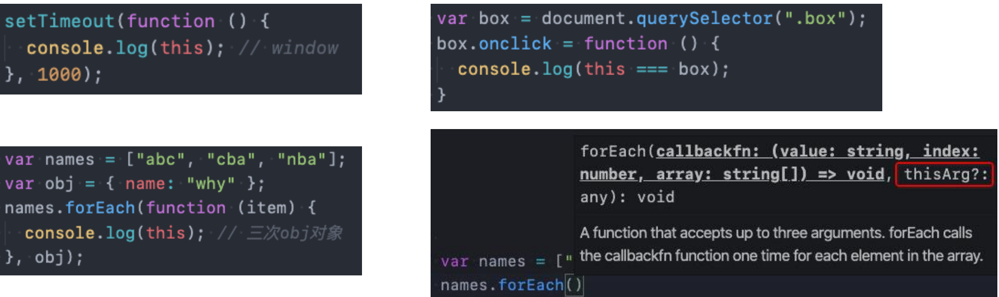

## new 绑定

- **javaScript 中的函数可以当做一个类的构造函数来使用,也就是使用 new 关键字**
- **使用 new 关键字来调用函数是,会执行如下的操作:**
  - 1.创建一个全新的对象
  - 2.这个对象会被执行 prototype 连接
  - 3.这个对象会绑定到函数调用的 this 上 (this 的绑定在这个步骤完成)
  - 4.如果函数没有返回其他对象,表达式会返回这个新对象

## 规则优先级

- **学习了四条规则,接下来开发中我们只需要去查找函数中调用应用了哪条规则即可,但是如果一个函数调用位置应用了多条规则,优先级谁更高呢?**
- **1.默认规则的优先级最低**
  - 毫无疑问,默认规则的优先级是最低的,因为存在其他规则时,就会通过其他规则的方式来绑定 this
- **2.显示绑定优先级高于隐式绑定**
  - 代码测试
- **3.new 绑定优先级高于隐式绑定**
  - 代码测试
- **4.new 绑定优先级高于 bind**
  - new 绑定和 call、apply 时不允许同时使用的,所以不存在谁的优先级更高
  - new 绑定可以和 bind 一起使用,new 绑定优先级更高

## this 规则之外 - 忽略显示绑定

- **我们讲到的规则已经足以应付平时的开发,但是总有一些语法,超出了我们的规则之外**

- **情况一: 如果在显示绑定中, 我们传入一个 null 或 undefined,那么 这个显示绑定会被忽略,使用默认规则:**

## this 规则之外 - 间接函数引用

- **情况二:创建一个函数的 ==间接引用==,这种情况使用默认绑定规则**
  - 赋值(obj2.foo = obj1.foo)的结果是 foo 函数
  - foo 函数被直接调用,那么是默认绑定

## 箭头函数 arrow function

- **箭头函数是 ES6 之后增加的一种编写函数的方法,并且它比函数表达式更加简洁:**
  - 箭头函数==不会绑定 this、arguments 属性==
  - 箭头函数==不能作为构造函数来使用== (不能和 new 一起来使用,会抛出错误)
- **箭头函数如何编写呢?**
  - ():函数的参数
  - {}:函数的执行体

## 箭头函数的编写优化

- **优化一:如果只有一个参数()可以省略**

- **优化二:如果函数执行体中只有一行代码,那么可以省略大括号**
  - 并且这行代码的返回值会作为整个函数的返回值

- **优化三:如果函数执行体只有返回一个对象,那么需要给这个对象加上()**

## this 规则之外 - ES6 箭头函数

- **箭头函数不适用 this 的四种标准规则 (也就是不绑定 this) , 而是根据外层作用域来决定 this**
- **我们来看一个模拟网络请求的案例:**
  - 这里我们使用 setTimeout 来模拟网络请求,请求到数据后如何可以存放到 data 中呢?
  - 我们需要拿到 obj 对象,设置 data
  - 但是直接拿到的 this 是 window,我们需要在外层定义: var \_this = this
  - 在 setTimeout 的回调函数中使用\_this 就代表了 obj 对象

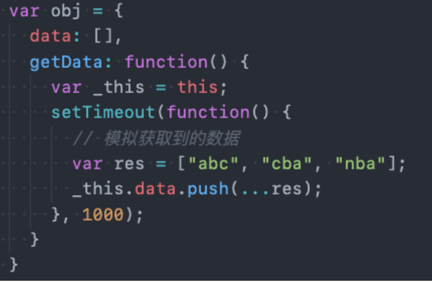

## ES6 箭头函数 this

- **之前的代码在 ES6 之前我们最常用的方式,从 ES6 开始,我们会使用箭头函数:**
  - 为什么在 setTimeout 的回调函数中可以直接使用 this 呢?
  - 因为箭头函数不绑定 this 对象,那么 this 引用就会从上层作用域中找到对应 this

- **思考:如果 getData 也是一个箭头函数,那么 setTimeout 中的回调函数中的 this 指向谁呢?**

## 面试题一:

## 面试题二:

## 面试题三:

## 面试题四:

# 深入浏览器的渲染原理

## 网页被解析的过程

- **大家有没有深入思考过:一个网页 URL 从输入浏览器到显示经历过怎么样的解析过程呢?**

## 浏览器的内核

- **常见的浏览器内核有**
  - ==Trident== (三叉戟):IE 、360 安全浏览器、搜狗高速浏览器、百度浏览器、UC 浏览器
  - ==Gecko== (壁虎 ) : Mozilla Firefox
  - ==Presto== (急板乐曲) -> Blink (眨眼): Opera
  - ==Webkt==: Safari、360 极速浏览器 、搜狗高速浏览器、移动端浏览器 (Android、IOS)
  - ==WebKit== -> ==Blink== : Google Chrome, Edge

- **我们经常说的浏览器内核指的是浏览器的排版引擎:**
  - **排版引擎**(layout engine), 也称为**浏览器引擎** (browser engine)、**页面渲染引擎** (render engine) 或 **样板引擎**
- 也就是一个网页下载下来后,就是由我们的渲染引擎来帮助我们解析的

## 渲染引擎如何解析页面呢?

- **渲染引擎在拿到一个页面后,如何解析整个页面并且最终呈现出我们的网页呢?**
  - 我们之前学习过下面的这幅图,现在让我们更加详细的学习它的过程

## 渲染页面的详细流程

- 更详细的解析过程如下:

https://www.html5rocks.com/en/tutorials/internals/howbrowserswork

## 解析一: HTML 解析过程

- **因为默认情况下服务器会给浏览器返回 index.html 文件,所以解析 HTML 是所有步骤的开始:**
- **解析 HTML,会构建 DOM Tree:**

## 解析二 - 生成 CSS 规则

- **在解析的过程中,如果遇到 CSS 的 link 元素,那么会由浏览器负责下载对应的 CSS 文件:**
  - 注意:下载 CSS 文件是不会影响 DOM 的解析的
- **浏览器下载完 CSS 文件后,就会对 CSS 文件进行解析,==解析出对应的规则树==:**
  - 我们可以称之为 ==CSSOM== (CSS Object Model, CSS 对象模型)

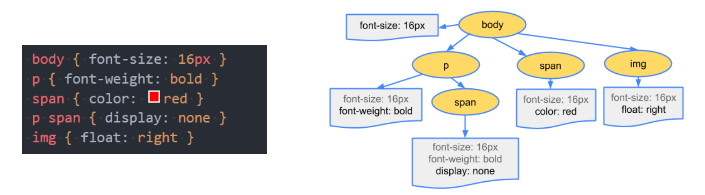

## 解析三 - 构建 Render Tree

- **当有了 DOM Tree 和 CSSOM Tree 后, 就可以两次结合来构建==Render Tree==了**

- **注意一: ==link 元素不会阻塞 DOM Tree 的构建过程==,但是==会阻塞 Render Tree 的构建过程==**
  - 这是因为 Render Tree 在构建时,需要对应 CSSOM Tree
- **注意二: ==Render Tree 和 DOM Tre 并不是一一对应的关系==,比如对于 display 为 none 的元素, 压根不会出现在 render tree 中**

## 解析四 - 布局 (layout) 和 绘制 (Paint)

- **第四步是在渲染树 (Render Tree) 上运行==布局 (Layout)== 以计算每个节点的几何体**
  - 渲染树会表示显示哪些节点以及其他样式,但是==不表示每个节点的尺寸、位置==等信息
  - 布局时确定呈现树中==所有节点的宽度、高度和位置信息==
- **第五步是将每个节点绘制 (Paint) 到屏幕上**
  - 在绘制阶段,浏览器将布局阶段计算的==每个 frame 转为屏幕上实际的像素点==
  - 包括==将元素的可见部分进行绘制==,比如==文本、颜色、边框、阴影、替换元素==

## 回流和重绘

- **理解回流 reflow: (也可以称之为重排)**
  - 第一次确定节点的大小和位置,称之为布局( layout)
  - 之后对节点的大小、位置修改重新计算称之为回流
- **什么情况下引起回流呢?**
  - 比如 DOM 结构发生改变 (添加新的节点或者移除节点)
  - 比如改变了布局 (修改了 width、height、padding、font-size 等值)
  - 比如窗口 resize (修改了窗口的尺寸等)
  - 比如调用了 getComputedStyle 方法获取尺寸、位置信息
- **理解重绘 repaint:**
  - 第一次渲染内容称之为重绘 (paint)
  - 之后重新渲染称之为重绘
- **什么情况下会引起重绘呢？**
  - 比如修改了背景色、文字颜色、边框颜色、样式等
- **回流一定会引起重绘,所以回流是一件很消耗性能的事情**
- **所以在开发中要尽量避免发生回流:**
- 1.修改样式时==尽量一次性修改==
  - 比如通过 cssText 修改,比如通过添加 class 修改
- 2.尽量==避免频繁的操作 DOM==
  - 我们可以在一个 DocumentFragment 或者父元素中将要操作的 DOM 操作完成,再一次性的操作
- 3.尽量==避免通过 getComputedStyle 获取尺寸、位置==等信息
- 4.对==某些元素使用 position 的 absolute 或者 fixed==
  - 并不是不会引起回流,而是开销相对较小,不会对其他元素造成影响

## 特殊解析 - composite 合成

- **绘制的过程,可以将布局后的元素绘制到多个合成图层中**
  - 这是浏览器的一种优化手段
- **默认情况下,标准流中的内容都是被绘制了同一个图层 (Layer) 中的**
- **而一些特殊的属性,会创建一个新的合成 (Compositing), 并且新的图层可以利用 GPU 来加速绘制**
  - 因为==每个合成层都是单独渲染==的
- **那么哪些属性可以形成新的合成层呢? 常见的一些属性:**
  - ==3D transforms==
  - ==video、canvas、iframe==
  - ==opacity 动画转换时==
  - ==position : fixed==
  - ==will-change:==一个实验性的属性,提前告诉浏览器元素可能发生哪些变化
  - ==animation 或 transition 设置了 opacity、transform==
- 分层确实可以提高性能,但是它以内存管理为代价,因此不能作为 web 性能优化策略的一部分过度使用

## script 元素和页面解析的关系

- **我们现在已经知道了页面的渲染过程,但是 javaScript 哎哪里呢?**
  - 事实上,浏览器在解析 HTML 的过程中,遇到了==script 元素时不能继续构建 DOM 树==的
  - 它会==停止继续构建,首先下载 javaScript 代码,并且执行 javaScript 的脚本==
  - 只有==等到 javaScript 脚本执行结束后,才会继续解析 HTML,构建 DOM 树==
- **为了解决这个问题,script 元素给我们提供了两个属性 (attribute) : defer 和 async**

## defer 属性

- **defer 属性高速浏览器==不要等待脚本下载==,而==继续解析 HTML,构建 DOM Tree==**
  - 脚本==会由浏览器来进行下载,但是不会阻塞 DOM Tree==的构建过程
  - 如果脚本提前下载好了,它会==等待 DOM Tree 构建完成,在 DOMContentLoaded 事件之前先执行 defer 中的代码==
- **所以 DOMContentLoaded 总是会等待 defer 中的代码先执行完成**

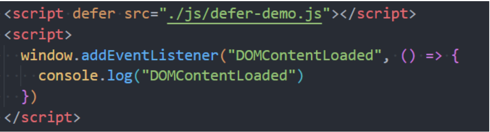

- **另外多个带 defer 的脚本时可以保持正确的顺序执行的**
- **从某种角度来说，defer 可以提高页面的性能,并且推荐放到 head 元素中**
- **注意:defer 仅适用于外部脚本,对于 script 默认内容会被忽略**

## async 属性

- **async 特性与 defer 有些类似, 它也能够让脚本不阻塞页面**
- **async 时让一个脚本完全独立的:**
  - 浏览器==不会因 async 脚本而阻塞== (与 defer 类似)
  - ==async 脚本不能保证顺序,它是独立下载、独立运行,不会等待其他脚本==
  - ==async 不会保证在 DOMContentLoaded 之前或者之后执行==

- **defer 通常用于需要在文档解析狗操作 DOM 的 javaScript 代码,并且对多个 script 文件由顺序要求的**
- **async 通常用于独立的脚本,对其他脚本,甚至 DOM 没有依赖**

# 深入 javaScript 的运行原理

## javaScript 代码的执行

- **javaScript 代码下载好之后,是如何一步步被执行的呢?**
- **我们知道,浏览器内核是由两部分组成的,以 webkit 为列:**
  - ==WebCore==:负责 HTML 解析、布局、渲染等等相关的工作
  - ==javaScriptCore==:解析、执行 javaScript 代码

- **另外一个强大的 javaScript 引擎就是 v8 引擎**

## V8 引擎的执行原理

- **我们来看一下官方对 V8 引擎的定义:**
  - V8 是用==C++编写==的 Google 开源==高性能 javaScript 和 webAssembly 引擎==,它用于==Chrome 和 Node.js==等
  - 它实现[ECMAScript® 2023 Language Specification (tc39.es)](https://tc39.es/ecma262/)和[WebAssembly Specification — WebAssembly 2.0 (Draft 2022-11-09)](https://webassembly.github.io/spec/core/),并在 window 7 或更高版本, macOS 10.12+ 和 使用 x64, IA-32,ARM 或 MIPS 处理器 Linux 系统上运行
  - ==V8 可以独立运行, 也可以嵌入到任何 C++ 应用程序==中

## V8 引擎的架构

- 引擎本身的源码**非常复杂**,大概有超过 **100w 行 c++代码**,通过了解它的架构,我们可以知道它是如何对 javaScript 执行的
- ==Parse==模块会将 javaScript 代码转换成 AST (抽象语法树), 这是因为解释器并不直接认识 javaScript 代码
  - 如果函数没有被调用,那么是不会被转成 AST 的
  - [Blazingly fast parsing, part 1: optimizing the scanner · V8](https://v8.dev/blog/scanner)Parse 的 V8 官方文档
- ==Ignition==是一个解释器,会将 AST 转换成 ByteCode
  - 同时会收集 TurboFan 优化所需要的信息( 比如函数参数的类型信息,有了类型才能进行真实的运算)
  - 如果函数只调用一次,ignition 会解释执行 ByteCode
  - ignition 的 V8 官方文档[Firing up the Ignition interpreter · V8](https://v8.dev/blog/ignition-interpreter)
- ==TurboFan==是一个编译器,可以将字节码编译为 CPU 可以直接执行的机器码
  - 如果一个函数被多次调用,那么就会被标记为==热点函数==,那么就会经过==TurboFan 转换成优化的机器码,提高代码的执行性能==
  - 但是,==机器码实际上会被还原为 ByteCode==,这是因为如果后续执行函数的过程中,==类型发生了变化(比如 sum 函数原来执行的是 number 类型,后来执行变成了 string 类型)==之前优化的机器码不能正确的处理运算,就会逆向的转换成字节码
  - TurboFan 的 V8 官方文档:[Digging into the TurboFan JIT · V8](https://v8.dev/blog/turbofan-jit)

## V8 引擎的解析图 (官方)

- **词法分析 (英文 lexical analysis)**
  - 将字符序列转换成 token 序列的过程
  - token 是 **记号化 ** (tokenization) 的 缩写
  - **词法分析器** (lexical analyzer,简称 lexer),也叫 **扫描器 **(scanner)
- **语法分析 (英语:syntactic analysis,也叫 parsing)**
  - **语法分析器也可以称之为**parser

## V8 引擎的解析图

## javaScript 代码执行原理 - 版本说明

- **在 ECMA 早期的版本中 (ECMAScript3), 代码的执行流程的术语和 ECMAScript5 以及之后的术语会有所区别:**
  - 目前网上大多数流行的说法都是==基于 ECMAScript3 版本的解析==,并且在==面试时==问到的大多数都是 ECMAScript3 的版本内容
  - 但是 ECMAScirpt3 终将过去, ==ECMAScript5 必然会成为主流==,所以最好也理解 ECMAScript5 甚至包括 ECMAScript6 以及更好版本的内容
  - 事实上在 TC39 ( ECMAScript ) 的最新描述中, 和 ECMAScript5 之后的版本又出现了一定的差异
- **那么我们课程按照如下顺序学习:**
  - 通过 ECMAScript3 中的概念学习==javaScrit 执行原理、作用域、作用域链、闭包==等概念
  - 通过 ECMAScript5 中的概念学习==块级作用域、let、const==等概念
- **事实上,它们只是在对某个概念上的描述不太一样,在整体思路上都是一致的**

## javaScript 的执行过程

- 加入我们有下面一段代码,它在 javaScript 中是如何被执行的呢?

## 初始化全局对象

- js 引擎会在==执行代码之前==,会在==堆内存中创建一个全局对象==:Global Object (GO)
  - 该对象 ==所有的作用域 (scope)==都可以访问
  - 里面会包含==Date、Array、String、Number、setTimeout、setInterval==等等
  - 其中还有一个==window 属性==指向自己

## 执行上下文 ( Execution Contexts )

- js 引擎内部有一个 **执行上下文栈 (Execution Context Stack,简称 ECS) **它是用于执行 **代码的调用栈**
- 那么现在它要执行谁呢? 执行的是 **全局代码块:**
  - 全局的代码块为了执行会构建一个 **Global Execution Context (GEC)**
  - GEC 会 ==被放入到 ECS 中== 执行
- **GEC 被放入到 ECS 中里面包含两部分内容:**
  - **第一部分:** 在代码执行前,在==parser 转成 AST 的过程中==,会将==全局定义的变量、函数==等加入到==GlobalObject==中,但是并==不会赋值==
    - 这个过程也称之为==变量的作用域提升 (hoisting)==
  - **第二部分:** 在代码执行中,对变量赋值,或者执行其他函数

## 认识 VO 对象 (Variable Object)

- **每一个执行上下文会关联一个==VO( Variable Object, 变量对象),  变量和函数声明==会被添加到这个 VO 对象中**

- **档全局代码被执行的时候,VO 就是 GO 对象了**

## 全局代码执行过程 ( 执行前 )

## 全局代码执行过程 ( 执行后 )

## 函数如何被执行呢?

- 在执行的过程中 **执行到一个函数时**, 就会根据 **函数体** 创建一个 **函数执行上下文 (Function Execution Context ,简称 FEC), 并且压入到 EC Stack**中
- **因为每个执行上下文都会关联一个 VO,那么函数执行上下文关联的 VO 是什么呢?**
  - 当进入一个函数执行上下文时,会创建一个==AO 对象  (Activation Object)==
  - 这个 AO 对象会==使用 argument 作为初始化==,并且==初始值传入的参数==
  - 这个==AO 对象会作为执行上下文的 VO 来存放变量的初始化==

## 函数的执行过程 (执行前)

## 函数的执行过程 (执行后)

## 作用域和作用域链 (Scope Chain)

- **当进入到一个执行上下文时,执行上下文也会关联一个作用域 (Scope Chain)**
  - ==作用域链是一个对象列表==,用于变量标识符的求值
  - 当进入一个执行上下文时,这个==作用域链被创建,并且根据代码类型,添加一系列的对象==

## 作用域提升面试题

# javaScript 内存管理和闭包

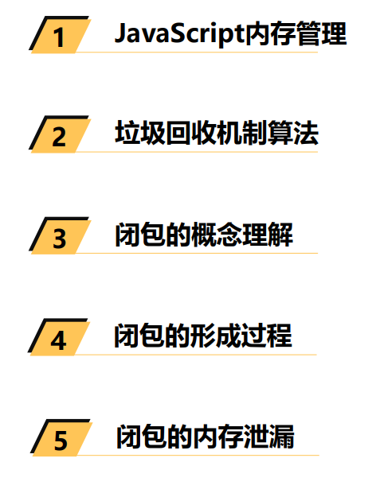

## 认识内存管理

- 不管什么样的编程语言,在 **代码的执行过程中都是需要给它分配内存**的,不同的是**某些编程语言**需要我们 **自己手动的管理内存**, **某些编程语言**会可以**自动帮助我们管理内存:**
- 不管以什么样的方式来管理内存, **内存的管理都会有如下的生命周期**
  - 第一步: ==分配申请你需要的内存== (申请)
  - 第二步: ==使用分配的内存== (存放一些东西,比如对象等)
  - 第三步: ==不需要使用时,对其进行释放==
- **不同的编程语言对于第一步和第三步会有不同的实现:**
  - ==手动管理内存==:比如 C、C++, 包括早期的 OC,都是需要手动来管理内存的申请和释放的 (malloc 和 free 函数)
  - ==自动管理内存==:比如 java、javaScript、Python、Swift、Dart 等,它们有自动帮助我们管理内存
- **对于开发者来说, javaScript 的内存管理是自动的、无形的**
  - 我们创建的==原始值、对象、函数.....这一切都会占用内存==
  - 但是我们==并不需要手动来它们进行管理,javaScript 引擎==会帮助我们处理好它

## javaScript 的内存管理

- javaScript 会在 **定义数据时** 为我们分配内存
- **但是内存分配方式是一样的吗?**
  - JS 对于 ==原始数据类型内存的分配==会在执行时,直接在栈空间进行分配
  - JS 对于 ==复杂数据类型内存的分配==会在堆内存中开辟一块空间,并且将这块空间的指针返回值变量引用

## javaScript 的垃圾回收

- 因为 **内存的大小是有限**的,所以当 **内存不再需要的时候,** 我们需要 **对其进行释放**, 以便腾出 **更多的内存空间**
- 在 **手动管理内存的语言**中,我们需要通过 **一些方式来释放不再需要的内存,比如 free 函数:**
  - 但是这种管理的方式其实 ==非常的低效==,影响我们 ==编写逻辑的代码的效率==
  - 并且这种方式对 ==开发者的要求也很高==, 并且 ==一不小心就会产生内存泄漏==
- 所以大部分 **现代的编程语言都是有自己的垃圾回收机制:**
  - 垃圾回收的英文是 ==Garbage Collection== , 简称 ==GC==
  - 对于 ==那些不再使用的对象==,我们都称之为是 ==垃圾==,它需要被 ==回收==,以释放更多的内存空间
  - 而我们的语言运行环境,比如 java 的运行环境 JVM,javaScript 的运行环境 js 引擎都会内存 ==垃圾回收期==
  - ==垃圾回收期==我们也会简称为 ==GC==,所以在很多地方你看到的 GC 其实指的是垃圾回收器
- 但是这里又出现了另外一个很关键的问题: **GC 怎么知道哪些对象是不再使用的呢?**
  - 这里就要用到 ==GC 的实现以及对应的算法==

## 常见的 GC 算法 - 引用计数 (Reference counting)

- **引用计数:**
  - 当==一个对象有一个引用指向它==时,那么这个==对象的引用就+1==
  - 当==一个对象的引用为 0==时,这个对象就==可以被销毁掉==
- **这个算法有一个很大的弊端就是会产生循环引用:**

## 常见的 GC 算法 - 标记清除 (mark-Sweep)

- **标记清楚:**
  - 标记清楚的核心思路是 ==可达性 (Reachability)==
  - 这个算法是设置一个 ==根对象 (root object), 垃圾回收器==会定期==从这个根==开始,找所有从根开始==有引用到的对象==,对于哪些==没有引用到的对象,认为是不可用的对象==
  - 这个算法==可以很好的解决循环引用的==问题

## 常见的 GC 算法 - 其他算法优化补充

- **JS 引擎比较广泛的采用的就是可达性中的标记清除算法,当然类似于 V8 引擎为了 ==进行更好的优化==,它在算法的实现细节上也会结合一些其他的算法**
- **标记整理 (Mark-Compact) 和 "标记 - 清除" 相似**
  - 不同的是,回收期间同时会将保留的存储对象 ==搬运汇集到连续的内存空间==,从而==整合空闲空间==,==避免内存碎片化==
- **分代收集 (Generational collection) -- 对象被分成两组: ==新的和旧的==**
  - 许多对象出现,完成它们的工作并很快死去,它们可以==很快被清理==
  - 那些长期存活的对象会变得 ==老旧==,而且 ==被检查的频次也会减少==
- **增量收集 (Incremental collection)**
  - 如果有许多对象,并且我们==试图一次遍历并标记整个对象集,则可能需要一些时间,并在执行过程中带来明显的延迟==
  - 所以引擎试图==将垃圾收集工作分成几部分来做==,然后==将这几部分逐一进行处理,这样会有许多微小的延迟而不是一个大的延迟==
- **闲时收集 (Idle-time collection)**
  - 垃圾收集器 ==只会在 CPU 空闲时尝试运行,以减少可能对代码执行==的影响

## V8 引擎详细的内存图

## 又爱又恨得闭包

- **闭包是 javaScript 中一个非常容易让人迷惑的知识点:**
  - 有同学在深入 JS 高级的交流群中发了这么一张图片
  - 并且闭包也是群里面大家讨论最多的一个话题

## javaScritpt 的函数式编程

- **在前面我们说过,javaScript 式支持 ==函数式编程==的**
- **在 javaScript 中,函数时非常重要的,并且是一等公民:**
  - 那么就意味着函数的使用是非常灵活的
  - 函数可以作为另外一个函数的参数,也可以作为另外一个函数的返回值来使用
- **所以 javaScript 存在很多的高阶函数:**
  - 自己编写高阶函数
  - 使用内置的高阶函数
- **目前在 vue3 + react 开发中,也都在趋向于函数式编程:**
  - vue3 composition api: setup 函数 -> 代码 (函数 hook ,定义函数)
  - react: class-> function-> hooks

## 闭包的定义

- **这里先来看一下闭包的定义,分成两个:==在计算机科学中和在 javaScript==中**
- **在计算机科学中对闭包的定义 (维基百科)**
  - 闭包 (英语: Closure), 又称 **词法闭包** (Lexical Closure) 或 **函数闭包** (function closures)
  - 是在支持 **头等函数** 的编程语言中,实现词法绑定的一种技术
  - 闭包在实现上是一个 ==结构体==,它存储了 ==一个函数和一个关联的环境== (相当于一个符号查找表)
  - 闭包跟函数最大的区别在于,当捕捉闭包的时候,它的 **自由变量** 会在捕捉时被确定,这样即使脱离了捕捉时的上下文,它也能照常运行
- **闭包的概念出现于 60 年代,最早实现闭包的程序是==Scheme==,那么我们就可以理解为什么 javaScript 中有闭包**
  - 因为 javaScript 中有大量的设计是来源 Scheme 的
- **我们再来看一下 MDN 对 javaScript 闭包的解释:**
  - 一个函数和对其周围状态 (lexical environment, **词法环境**) 的引用绑定在一起 (或者说函数被引用包围) , 这样的组合就是 **闭包 (closure)**
  - 也就是说,闭包让你可以在一个内层函数中访问到其外层函数的作用域
  - 在 javaScript 中,每当创建一个函数,闭包就会在函数创建的同时被创建出来
- **那么我的理解和总结:**
  - 一个普通的函数 function,如果可以访问外层作用域的自由变量,那么这个函数和周围的环境就是一个闭包
  - ==从广义的角度来说:javaScript 中的函数都是闭包==
  - ==从狭义的角度来说:javaScript 中一个函数,如果访问了外层作用域的变量,那么它是一个闭包==

## 闭包的访问过程

- **如果我们编写了如下的代码,它一定是形成可闭包的:**

## 闭包的执行过程

- **那么函数继续执行呢?**
  - 这个时候 makeAdder 函数执行完毕,正常情况下我们的 AO 对象会被释放
  - 但是因为在 0xb00 的函数中有作用域引用指向了这个 AO 对象,所以它不会被释放掉

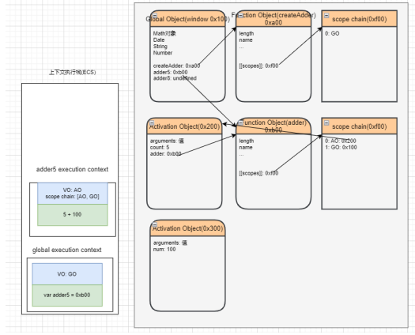

## 闭包的内存泄漏

- **那么我们为什么经常会说闭包是有内存泄漏的呢?**
  - 再上面的案例中,如果后续我们不再使用 add10 函数了,那么该函数对象应该要被销毁掉,并且其引用着的父作用域 AO 也应该被销毁掉
  - 但是目前因为在全局作用域下 add10 变量对 0xb00 的函数对象有引用,而 0xb00 的作用域中 AO (0x200) 有引用,所以最终会造成这些内存都是无法被释放的
  - 所以我们经常说的闭包造成内存泄漏,其实就是刚才的引用链中的所有对象都是无法释放的
- **那么,怎么解决这个问题呢?**
  - 因为当将 add10 设置为 null 时,就不再对函数对象 0xb00 有引用,那么对应的 AO 对象 0x200 也就不可达了
  - 在 GC 的下一次检测中,它们就会被销毁掉

## 闭包的内存泄漏测试

## AO 不使用的属性优化

- **我们来研究一个问题:AO 对象不会被销毁时,是否里面的所有属性都不会被释放?**
  - 下面这段代码中 name 属于闭包的父作用域里面的变量
  - 我们知道形成闭包之后 count 一定不会被销毁掉,那么 name 是否会被销毁掉呢?
  - 这里我打上了断点,我们可以在浏览器上看看结果

# JavaScript 函数的增强知识

## 函数对象的属性

- **我们知道 javaScript 中函数也是一个对象,俺么对象中就可以有属性和方法**
- ==属性 name==: 一个函数的名称我们可以通过 name 来访问

- ==属性 length==:属性 length 用于返回函数参数的个数
  - 注意:rest 参数是不参与参数的个数的

## 认识 arguments

- **arguments**是一个 对应于 **传递给函数的参数** 的 **类数组(array-like)对象**

- array-like 意味着它不是一个数组类型,而是一个对象类型
  - 但是它却拥有数组的一些特性,比如说 length,比如可以通过 index 索引来访问
  - 但是它却没有数组的一些方法,比如 filter、map 等

## arguments 转 Array

- **在开发中,我们经常需要将 arguments 转成 Array,以便使用数组的一些特性**
  - 常见的转化方式如下
- **转化方式一:**
  - 遍历 arguments,添加到一个新数组中
- **转化方式二:** **较难理解 (有点绕) , 了解即可**
  - 调用数组 slice 函数的 call 方法
- **转化方式三: ES6 中的两个方法**
  - Array.fom
  - [...arguments]

## 箭头函数不绑定 arguments

- 箭头函数时不绑定 arguments 的,所以我们再箭头函数中使用 arguments 会去上层作用域查找:

## 函数的剩余 (rest) 参数

- **ES6 中引用了 rest parameter, 可以将不定数量的参数放入到一个数组中:**
  - 如果最后一个参数是...为前缀的,那么它会将剩余的参数放到该参数中,并且作为一个数组

- **那么剩余参数和 arguments 有什么区别呢?**
  - 剩余参数只包含哪些 ==没有对应形参的实参==,而 ==arguments 对象包含了传给函数的所有实参==
  - ==arguments 对象不是一个真正的数组==,而==rest 参数是一个真正的数组==,可以进行数组的所有操作
  - arguments 是==早期的 ECMAScript==中为了方便去获取所有的参数提供的一个数据结构,而 rest 参数是==ES6 中提供==并且希望以此来替代 arguments 的
- **剩余参数必须放到最后一个位置,否则会报错**
-

## 理解 javaScript 纯函数

- **函数式编程**中有一个非常重要的概念叫 **纯函数**, javaScript 符合**函数式编程的范式**, 所以也**有纯函数的概念**
  - 在 **React 开发中纯函数是被多次提及**的
  - 比如 **React 中组件就被要求像是一个纯函数** (为什么是像,因为还有 class 组件), **redux 中有一个 reducer 的概念,** 也是要求必须是一个纯函数
  - 所以 **掌握纯函数对于理解很多框架的设计** 是非常有帮助的
- **纯函数的危机百科定义:**
  - 在程序设计中,若一个函数 ==符合以下条件==, 那么这个函数被称为纯函数
  - 此函数==在相同的输入值时==,需==产生相同的输出==
  - 函数的==输出和输入值以外的其他隐藏信息或状态无关==,也和 ==由 I/O 设备产生的外部输出==无关
  - 该函数==不能有语义上课观察的函数副作用==,诸如 =="触发事件",使输出设备输出,或更改输出值以外物件的内容==
- **当然上面的定义会过于的晦涩所以简单的总结一下:**
  - ==确定的输入,一定会产生确定的输出==
  - ==函数在执行过程中,不能产生副作用==

## 副作用概念的理解

- **那么这里又有一个概念,叫做副作用,**什么又是 **副作用** 呢?
  - **副作用 (side effect) **其实本身是医学的一个概念,比如我们经常说什么药本来是为了治病,可能会产生一些其他的副作用
  - 在计算机科学中,也引用了副作用的概念,表示==在执行一个函数==时,除了==返回函数值==之外,还对==调用函数产生了附加的影响==,比如==修改了全局变量,修改参数或者改变外部的存储==
- **纯函数在执行的过程中就是不能产生这样的副作用:**
  - 副作用往往是产生==bug 的 "温床"==

## 纯函数的案例

- **我们来看一个对数组操作的两个函数:**
  - ==slice==:slice 截取数组时不会对原数组进行任何操作,而是生成一个新的数组
  - ==splice==:splice 截取数组,会返回一个新的数组,也会对原数组进行修改
- **slice 就是一个纯函数,不会修改数组本身,而 splice 函数不是一个纯函数**

## 判断下面函数是否是纯函数

## 纯函数的作用和优势

- **为什么纯函数在函数式编程中非常重要呢?**
  - 因为你可以 ==安心的编写== 和 ==安心的使用==
  - 你在 ==写的时候== 保证了函数的纯度,只是 ==单纯实现自己的业务逻辑==即可, ==不需要关系传入的内容==是如何获得的或者==依赖其他的外部变量==是否已经发生了修改
  - 你在 ==用的时候== , 你确定==你的输入内容不会被任意篡改==,并且==自己确定的输入==, 一定会==有确定的输出==
- React 中就要求我们无论是 **函数还是 class 声明的一个组件**,这个组件都必须 **像纯函数一样,保护它们的 props 不被修改**

## 柯里化概念的理解

- **柯里化**也是输入 **函数式编程** 里面一个非常重要的概念
  - 是一种关于函数的高阶技术
  - 它不仅被用于 javaScript, 还被用于其他编程语言
- **我们先来看一下维基百科的解释:**
  - 在计算机科学中, **柯里化** (英语: Curring), 又译为 **卡瑞化** 或 **加里化**
  - 是把接收 ==多个参数的函数==,变成 ==接受一个单一参数== (最初函数的第一个参数) 的函数,并且 ==返回接受余下的参数==,而且 ==返回结果的新函数==的技术
  - 柯里化声称 =="如果你固定某些参数,你将得到接受余下参数的一个函数"==
  - ==这个过程就称之为柯里化==
- 柯里化是一种函数的转换,将一个函数从课调用的 f(a,b,c)转换为可调用的 f(a)(b)(c)
  - 柯里化不会调用函数。它只是对函数进行转换

## 柯里化的代码转换

- **那么柯里化是怎么样的表现呢?**

## 柯里化优势一 - 函数的职责单一

- **那么为什么需要有柯里化呢?**
  - 在函数式编程中,我们其实往往希望 ==一个函数处理的问题尽可能的单一==,而==不是将一大堆的处理
  - 那么 ==我们是否就可以每次传入的参数在单一的函数中进行处理==,处理完后在==下一个函数中再使用处理后的结果==
  - 比如上面的案例我们进行一个修改: **传入的函数需要分别被进行如下处理**
    - 第一个参数+2
    - 第二个参数\*2
    - 第三个参数\*\*2

## 柯里化优势二 - 函数的参数服用

- 另外一个使用柯里化的场景是可以帮助我们可以 **复用参数逻辑:**
  - makeAdder 函数要求我们传入一个 num (并且如果我们需要的话, 可以在这里对 num 进行一些修改)
  - 在之后使用返回的函数时,我们不需要继续传入 num 了

## 柯里化案例练习

- **这里我们在演示一个案例,需求是打印一些日志:**
  - 日志包括时间、类型、信息
- 普通函数的实现方案如下:

## 柯里化高级 - 自动柯里化函数

- 目前我们有将多个普通的函数,转成柯里化函数:

## 组合函数概念的理解

- **组合 (Compose) 函数**时在 javaScript 开发过程中一种对 **函数的使用技巧、模式:**
  - 比如我们现在需要对==某一个数据==进行==函数的调用==,执行 ==两个函数 fn1 和 fn2==,这==两个函数时依次执行的==
  - 那么如果每次我们都需要==进行两个函数的调用==,==操作上就会显得重复==
  - 那么==是否可以将这两个函数组合起来==,==自动依次调用==呢?
  - 这个过程就是==对函数的组合==,我们称之为 ==组合函数 (Compose Function)==

## 实现组合函数

- **刚才我们实现的 compose 函数比较简单**
- **我们需要考虑更加复杂的情况:比如传入了更多的函数,在调用 compose 函数时,传入了更多的参数:**

## with 语句的使用

- **with 语句** 扩展一个语句的作用域链

- 不建议使用 with 语句,因为它可能是混淆错误和兼容性问题的根源

## eval 函数

- **内建函数 eval 允许执行一个代码字符串**
  - ==eval 是一个特殊的函数==,它可以==将传入的字符串当做 javaScript 代码来执行==
  - ==eval 会将最后一句执行语句的结果,作为返回值==

- **不建议在开发中使用 eval:**
  - eval 代码的==可读性非常的差== (代码的可读性是高质量代码的重要原则)
  - eval 是==一个字符串==,那么有可能在==执行的过程中被刻意篡改,俺么可能会造成被攻击的风险==
  - eval 的执行==必须经过 javaScript 解释器,不能被 javaScript 引擎优化==

## 认识严格模式

- **javaScript 历史的局限性**:
  - 长久以来, ==javaScript 不断向前发展且并未带来任何兼容性==问题
  - 新的特性被加入,旧的功能也没有改变,这么做 ==有利于兼容旧代码==
  - 但缺点是 javaScript 创造者的==任何错误或不完善的决定也将永远被保留在 javaScript 语言==中
- 在 ECMAScript5 标准中,javaScript 提出了 **严格模式的概念 (Strict Mode):**
  - 严格模式很好理解,是一种 ==具有限制性的 javaScript 模式==,从而使 ==代码隐式的脱离了 "懒散 (sloppy) 模式"==
  - ==支持严格模式的浏览器==在检测到代码中有严格模式的,会==以更加严格的方式对代码进行检测和执行==
- 严格模式对正常的 javaScript 语义进行了一些限制:
  - 严格模式通过 ==抛出错误== 来消除一些原有的 ==静默 (silent)== 错误
  - 严格模式让==JS 引擎在执行代码时可以进行更多的优化== (不需要对一些特殊的语法进行处理)
  - 严格模式禁用了 ==ECMAScript 未来版本中可能会定义的一些语法==

## 开启严格模式

- **那么如何开启严格模式呢? 严格模式支持粒度化的迁移:**
  - 可以支持 ==在 js 文件中==开启严格模式
  - 也支持对==某一个函数==开启严格模式
- **严格模式通过在文件或者函数开头使用 use strict 来开启**

- **没有类似于 "no use strict" 这样的指令可以使程序返回默认模式**
- 现代 javaScript 支持 "class" 和 "module" , 它们会自动启用 use strict

## 严格模式限制

- **这里我们来说几个严格模式下的严格语法限制:**
  - javaScript 被设计为新手开发者更容易上手,所以有时候本来错误语法,被认为也是可以正常解析的
  - 但是这种方式可能留下安全隐患
  - 在严格模式下,这种失误就会被当做错误,以便可以快速的发现和修正
- **1.无法意外的创建全局变量**
- **2.严格模式会引起静默失败 (silently fail,注:不报错也没有任何效果)的赋值操作抛出异常**
- **3.严格模式下试图删除不可删除的属性**
- **4.严格模式不允许函数参数有相同的名称**
- **5.不允许 0 的八进制语法**
- **6.在严格模式下,不允许使用 with**
- **7.在严格模式下,eval 不再为上层引用变量**
- **8.严格模式下,this 绑定不会默认转成对象**

## 手写 apply 、call 、 bind 函数实现 (原型后)

- **接下来我们实现一下 apply、call、bind 函数:**
  - 注意:我们的实现是练习函数、this、调用关系、不会过度考虑一些边界情况

## javaScript 对象的增强知识

## 对属性操作的控制

- 在前面我们的属性都是 ==直接定义在对象内部==,或者==直接添加到对象内部==的
  - 但是这样做的时候我们就==不能对这个属性进行一些限制==:比如==这个属性是否可以通过 delete 删除的==? 这个属性 ==是否在 for- in 遍历的时候被遍历出来==呢?

- **如果我们想要对 ==一个属性进行比较精准的操作控制==,那么我们就可以使用==属性描述符==**
  - 通过属性描述符 ==可以精准的添加或者修改对象的属性==
  - 属性描述符需要使用 ==Object.defineProperty== 来对属性进行添加或者修改

## Object.defineProperty

- **Object.defineProperty()** 方法会直接在一个对象上定义一个新属性,或者修改一个对象的现有属性, 并返回此对象

- 可接收三个参数:
  - obj 要定义属性的对象
  - prop 要定义或修改的属性的名称或 Symbol
  - descriptor 要定义或修改的属性描述符
- 返回值
  - 被传递给函数的对象

## 属性描述符分类

- 属性描述符的类型有两种
  - ==数据属性== (Data Properties) 描述符 (Descriptor)
  - ==存取属性== (Accessor 访问器 Properties) 描述符 (Descripor)

## 数据属性描述符

- **数据属性描述符有如下四个特性:**
- [[Configurable]]: 表示属性是否可以通过 delete 删除属性,是否可以修改它的特性,或者是否可以将它修改为存取属性描述符

  - 当我们直接在一个对象上定义某个属性时,这个属性的[[Configurable]]为 true
  - 当我们通过属性描述符定义一个属性时,这个属性的[[Configurable]]默认为 false

- [[Enumerable]]: 表示属性是否可以通过 for-in 或者 Object.keys()返回该属性
  - 当我们直接在一个对象上定义某个属性时,这个属性的[[Enumerable]]为 true
  - 当我们通过属性描述符定义一个属性时,这个属性的[[Enumerable]]默认为 false
- [[Writable]]:表示是否可以修改属性的值
  - 当我们直接在一个对象上定义某个属性时,这个属性的[[Writable]]为 true
  - 当我们通过属性描述符定义一个属性时,这个属性的[[Writable]]默认为 false
- [[value]]:属性的 value 值,读取属性时会返回该值,修改属性时,会对其进行修改
  - 默认情况下这个值是 undefined

## 数据属性描述符测试代码

.

## 存取属性描述符

- **存取属性描述符有如下四个特性:**
- [[Configurable]]:表示属性是否可以通过 dekete 删除属性,是否可以修改它的特性,或者是否可以将它修改为存取属性描述符
  - 和数据属性描述符是一致的
  - 当我们直接在一个对象上定义某个属性时,这个属性的[[Configurable]]为 true
  - 当我们通过属性描述符定义一个属性时,这个属性的[[Configurable]]默认为 false
- [[Enumerable]]:表示属性是否可以通过 for-in 或者 Object.keys()返回该属性
  - 和数据属性描述符是一致的
  - 当我们直接在一个对象上定义某个属性时,这个属性的[[Enumerable]]为 true
  - 当我们通过属性描述符定义一个属性时,这个属性的[[Enumerable]]默认为 false
- [[get]]:获取属性时会执行的函数。默认为 undefined
- [[set]]:设置属性时会执行的函数。默认为 undefined

## 存储属性描述符的测试代码

## 同时定义多个属性

- **Object.defineProperties()**方法直接在一个对象上定义 **多个** 新的属性或修改现有属性,并且返回该对象

## 对象方法补充

- **获取对象的属性描述符:**

  - getOwnPropertyDescriptor
  - getOwnPropertyDescriptors

- **禁止对象扩展新属性: preventExtensions**
  - 给一个对象添加新的属性会失败 (在严格模式下会报错)
- **密封对象,不允许配置和删除属性:seal**
  - 实际是调用 preventExtensions
  - 并且将现有属性的 configurable:false
- **冻结对象,不允许修改现有属性:freeze**
  - 实际上是调用 seal
  - 并且将现有属性的 writable:false

## javaScript ES5 中实现继承

## 认识对象的原型

- **javaScript 当中每个对象都有一个特殊的内置属性[[prototype]], 这个特殊的对象可以指向另外一个对象**
- **那么这个对象有什么用呢?**
  - 当我们通过引用对象的==属性 key 来获取一个 value==时,它会==触发 [[Get]]==的操作
  - 这个操作会==首先检查该对象是否有对应的属性==, 如果有的话就使用它
  - ==如果对象中没有改属性,那么会访问对象[[prototype]]内置属性指向的对象上的属性==
- 那么如果通过字面量直接创建一个对象,这个对象也会有这样的属性吗?如果有,应该如何获取这个属性呢?
  - 答案是有的,只要是对象都会有这样的一个内置属性
- **获取的方式有两种:**
  - 方式一:通过对象的\_\_proto\_\_ 属性可以获取到 (但是这个是早期浏览器自己添加的, 存在一定的兼容性问题)
  - 方式二: 通过 Object.getPrototypeOf 方法可以获取到

## 函数的原型 prototype

- **那么我们知道上面的东西对于我们的构造函数创建对象来说有什么用呢?**
  - ==它的意义是非常重大的==,接下来我们继续来探讨
- **这里我们又要引入一个新的概念: 所有的函数都有一个 prototype 的属性 (注意: 不是\_\_proto\_\_)**

## 再看 new 操作符

- **我们前面讲过 new 关键字的步骤如下:**
  - 1.在内存中创建一个新的对象 (空对象)
  - 2.这个对象内部的[[prototype]]属性会被赋值为该构造函数的 prototype 属性
- 那么也就意味着我们通过 Persopn 构造函数创建出来的所有对象的[[prototype]]属性都指向 Person.prototype

## 创建对象的内存表现

## prototype 添加属性

## constructor 属性

- 事实上原型对象上面是有一个属性:constructor
  - 默认情况下原型上都会添加一个属性叫做 constructor,这个 constructor 指向当前的函数对象

## 重写原型对象

- 如果我们需要在原型上添加过多的属性,通常我们会重写整个原型对象:

- 前面我们说过,每创建一个函数,就会同时创建它的 prototype 对象,这个对象也会自动获取 constructor 属性
  - 而我们这里相当于给 prototype 重新赋值了一个对象,那么这个新对象的 constructor 属性,会指向 Object 构造函数,而不是 Person 构造函数了

## 原型对象的 constructor

- **如果希望 constructor 指向 Person, 那么可以手动添加**
- 上面的方式虽然可以,但是也会造成 constructor 的[[Enumerable]]特性被设置了 true
  - 默认情况下,原生的 constructor 属性是不可枚举的
  - 如果希望解决这个问题,就可以使用我们前面介绍的 Object.defineProperty()函数了

## 创建对象 - 构造函数和原型组合

- 我们再上一个构造函数的方式创建对象是,有一个弊端:会创建出重复的函数,比如 running、eating 这些函数
  - 那么有没有办法让所有的对象去共享这些函数呢?
  - 可以,将这些函数放到 Person.prototype 的对象上即可

## 面向对象的特性 - 继承

- **面向对象有三大特性: 封装、继承、多态**
  - 封装:我们前面将属性和方法封装到一个类中,可以称之为封装的过程
  - 继承:继承是面向对象中非常重要的,不仅仅可以减少重复代码的数量,也是多态的前提 (纯面向对象中)
  - 多态:不同的对象在执行时表现出不同的形态
- **那么继承是做什么呢?**
  - 继承可以帮助我们==将重复的代码和逻辑抽取到父类==中,子类只需要直接继承过来使用即可
  - 在很多编程语言中,==继承也是多态的前提==
- **那么 javaScript 当中如何实现继承呢?**
  - 不着急,我们先来看一下==javaScript 原型链的机制==
  - 再利用原型链的机制实现一下继承

## javaScript 原型链

- **在真正实现继承之前,我们先来理解一个非常重要的概念:原型链**
  - 我们知道,从一个对象上获取属性,如果在当前对象中没有获取到就会去它的原型上面获取

## Object 的原型

- 那么什么地方时原型链的尽头呢? 比如第三个对象是否也有原型\_\_proto\_\_属性呢?

- **我们会发现它打印的是 [Object: null prototype] {}**
  - 事实上这个原型就是我们最顶层的原型了
  - 从 Object 直接创建出来的对象的原型都是 [Object: null prototype] {}
- **那么我们可能会问题: [Object: null prototype] {} 原型有什么特殊吗?**
  - 特殊一: ==该对象有原型 属性==,但是他的原型属性已经指向的是 null,也就是已经是顶层原型了
  - 特殊二: ==该对象上有很多默认的属性和方法==

## 创建 Object 对象的内存图

## 原型链关系的内存图

## Object 是所有类的父类

- **从我们上面的 Object 原型我们可以得出一个结论: ==原型链最顶层的原型对象就是 Object 的原型对象==**

## 通过原型链实现继承

- **如果我们现在需要实现继承,那么就可以利用原型链来实现了:**
  - 目前 stu 的原型是 p 对象,而 p 对象的原型是 Person 默认的原型,里面包含 running 等函数

## 继承创建对象的内存图

## 原型链继承的弊端

- **但是目前有一个很大的弊端:某些属性其实是保存在 p 对象上的**
  - 第一,我们通过==直接打印对象是看不到这个属性==的
  - 第二,这个属性==会被多个对象共享,如果这个对象是一个引用类型,那么就会造成问题==
  - 第三,==不能给 Person 传递参数== (让每个 stu 有自己的属性) , 因为这个对象是一次性创建的 (没办法定制化)

## 借用构造函数继承

- **为了解决原型继承中存在的问题,开发人员提供了一种新的技术:constructor stealing (有很多名称:借用构造函数或者称之为经典继承或者称之为伪造对象)**
- ==steal 是偷窃、剽窃==的意思,但是这里可以翻译成==借用==

**借用继承的做法非常简单:在子类型构造函数的内部调用父类型构造函数**

- 因为函数可以在任意的时刻被调用
- 因此通过==apply()和 call()==也可以在新创建的对象上执行构造函数

## 组合借用继承的问题

- **组合继承是 javaScript 最常用的继承模式之一:**
  - 如果你理解到这里,点到为止,那么组合来实现继承只能说问题不大
  - 但是它依然不是很完美,但是基本已经没有问题了
- **组合继承存在什么问题呢?**
  - 组合继承最大的问题就是无论在什么情况下,都会==调用两次父类构造函数==
    - 一次在创建子类原型的时候
    - 另一次在子类构造函数内部 (也就是每次创建子类实例的时候)
  - 另外,如果你仔细按照我的流程,你会发现: ==所有的子类实例事实上会拥有两份父类的属性==
    - 一份在当前的实例自己里面(也就是 person 本身的),另一份在子类对应的原型对象中 (也就是 person.\_proto\_\_里面)
    - 当然,这两份属性我们无需担心访问出现问题,因为默认一定是访问实例本身这一部分

## 原型式继承函数

- **原型式继承的渊源**
  - 这种模式要从==道格拉斯·克罗克福德== (Douglas Crockford, 著名的前端大师,JSON 的创立者 ) 在 2006 年写的一篇文章说起: ==Prototypal Inheritance in JavaScript==(在 javaScript 中使用原型式继承)
  - 在这篇文章中,它介绍了一种继承方式,而且这种继承方式不是通过构造函数来实现的
  - 为了理解这种方式,我们先在此回顾一下 javaScript 想实现继承的目的: ==重复利用另外一个对象的属性和方法==
- **最终的目的: student 对象的原型指向了 person 对象**

## 寄生式继承函数

- **寄生式 (Parasitic) 继承**
  - 寄生式(Parasitic)继承是==与原型式继承紧密相关的一种思想==,并且同样==由道格拉斯·克罗克福德(Douglas Crockford)提出和推广==的
  - 寄生式继承的思路是==结合原型类继承和工厂模式==的一种方式
  - 即==创建一个封装继承过程的函数,该函数在内部以某种方式来增强对象,最后再将这个对象返回==

## 寄生组合式继承

- **现在我们来回顾一下之前提出的比较理想的组合继承**
  - 组合继承是比较理想的继承方式,但是存在两个问题
  - 问题一: ==构造函数会被调用两次==: 一次在创建子类原型对象的时候,一次在创建子类实例的时候
  - 问题二:==父类型中的属性会有两份==: 一份在原型对象中,一份在子类实例中
- **事实上,我们现在可以利用寄生式继承将这两个问题给解决掉**
  - 你需要先明确一点:当我们在子类型的构造函数中调用父类型.call(this,参数)这个参数的时候,就会将父类型中的属性和方法复制一份到了子类型中,所以父类型本身里面的内容,我们不再需要
  - 这个时候,我们还需要获取到一份类型的原型对象中的属性和方法
  - 能不能直接让子类型的原型对象 = 父类型的原型对象呢
  - 不能这么做,因为这么做就意味着以后修改了子类型原型对象的某个引用类型的时候,父类型原生对象的引用类型也会被修改
  - 我们使用前面的寄生式思想就可以了

## 寄生组合继承的代码

## 对象的方法补充

- **hasOwnProperty**
  - 对象是否有某一个属于自己的属性 (不是在原型上的属性)
- **in / for in 操作符**
  - 判断某个属性是否在某个对象或者对象的原型上
- **instanceof**
  - 用于检测 ==构造函数(Person、Student 类) 的 prototype==, 是否出现在==某个实例对象的原型链==上
- **isPrototypeOf**
  - 用于检测==某个对象==, 是否出现在==某个实例对象的原型链==上

## 原型继承关系

## 认识 class 定义类

- 我们会发现,按照前面的构造函数形式创建 **类**,不仅仅和编写普通的函数过于相似,而且代码并不容易理解
  - 在 ES6 (ECMAScript2015) 新的标准中使用了 class 关键字来直接定义类
  - 但是类本质上依然是前面所讲的构造函数、原型链的语法糖而已
  - 所以学好了前面的构造函数、原型链更有利于我们理解类的概念和继承关系
- 那么,如何使用 class 来定义一个类呢?
  - 可以使用两种方式来声明类: 类声明和类表达式

## 类和构造函数的异同

- 我们来研究一下类的一些特性:
  - 你会发现它和我们的构造函数的特性其实是一致的

## 类的构造函数

- 如果我们希望在创建对象的时候给类传递一些参数,这个时候应该如何做呢?
  - 每个类都可以有一个自己的构造函数 (方法), 这个方法的名称是固定的 constructor
  - 当我们通过 new 操作符, 操作一个类的时候会调用这个类的构造函数 constructor
  - 每个类只能有一个构造函数, 如果包含多个构造函数, 那么会抛出异常
- 当我们通过 new 关键字操作类的时候,会调用这个 constructor 函数,并且执行如下操作
  - 1.在内存中创建一个新的对象 (空对象)
  - 2.这个对象内部的[[prototype]]属性会被赋值为该类的 prototype 属性
  - 3.构造函数内部的 this,会指向创建出来的新对象
  - 4.执行构造函数的内部代码 (函数体代码)
  - 5.如果构造函数没有返回非空对象,则返回创建出来的新对象

## 类的实例方法

- 在上面我们定义的属性都是直接放到了 this 上,也就意味着它是放到了创建出来的新对象中
  - 在前面我们说过对于实例的方法,我们式希望放到原型上的,这样可以被多个实例来共享
  - 这个时候我们可以直接在类中定义

## 类的访问器方法

- 我们之前讲对象的属性描述符时有讲过对象可以添加 setter 和 getter 函数,那么类也是可以的:

## 类的静态方法

- 静态方法通常用于定义直接使用类来执行的方法,不需要有类的实例,使用 static 关键字来定义

## ES6 类的继承 - extends

- 前面我们花了很大的篇幅讨论了在 ES5 中实现继承的方案,虽然最终实现了相对满级的继承机制,但是过程却依然是非常繁琐的
  - 在 ES6 中新增了使用 extends 关键字,可以方便的帮助我们实现继承

## super 关键字

- 我们会发现在上面的代码中我使用了一个 super 关键字,这个 super 关键字有不同的使用方式
  - 注意: 在子 (派生) 类的构造函数中使用 this 或者返回默认对象之前,必须先通过 super 调用父类的构造函数
  - super 的使用位置有三个:子类的构造函数、实例方法、静态方法

## 继承内置类

- 我们也可以让我们的类继承自内置类,比如 Array

## 类的混入 mixin

- javaScript 的类只支持单继承:也就是只能有一个父类
  - 那么在开发中我们需要在一个类中添加更多相似的功能时,应该如何来做呢?
  - 这个时候我们可以使用混入 (mixin)

## javaScript 中的多态

- 面向对象的三大特性: 封装、继承、多态
  - 前面两个我们都已经详细解析过了,接下来我们讨论一下 javaScript 的多态
- javaScript 有多态吗?
  - 维基百科对多态的定义: **多态** (英语: polymorphism) 指为不同数据类型的实体提供统一的接口,或使用一个单一的符号来表示多个不同的类型
  - 非常的抽象, 个人的总结:不同的数据类型进行同一个操作,表现出不同的行为,就是多态的体现
- 那么从上面的定义来看,javaScript 是一定存在多态的

## 在 react 中的高阶组件

## babel 可以将 ES6 转成 ES5 代码

## 字面量的增强

- ES6 中对 **对象字面量** 进行了增强,称之为 Enhanced object literals (增强对象字面量)
- 字面量的增强主要包括下面几部分
  - 属性的简写 : **Property Shorthand**
  - 方法的简写: **Method Shorthand**
  - 计算属性名: **Computed Property Names**

## 解构 Destructuring

- **ES6 中新增了一个从数组或对象中方面获取数据的方法,称之为解构 Destructuring**
  - **解构赋值** 是一种特殊的语法, 它使我们可以将数组或对象 "拆包" 至一系列变量中
- **我们可以划分为:数组解构和对象的解构**
- **数组的解构:**
  - 基本解构过程
  - 顺序解构
  - 解构出数组: ...语法
  - 默认值

- **对象的解构:**
  - 基本解构流程
  - 任意顺序
  - 重命名
  - 默认值

## 解构的应用场景

- **解构目前在开发中使用时非常多的:**
  - 比如在开发中拿到一个变量时,自动对其进行解构使用
  - 比如对函数的参数进行解构

# ES6 ~ ES13 新特性 (一)

## 新的 ECMA 代码执行描述

- 在执行学习 javaScript 代码执行过程中,我们学习了很多 ECMA 文档的术语
  - 执行上下文栈: Execution Context Stack , 用于执行上下文的栈结构
  - 执行上下文: Execution Context ,代码在执行之前会先创建对应的执行上下文
  - 变量对象: Variable Object,上下文关联的 VO 对象,用于记录函数和变量声明
  - 全局对象: Global object, 全局执行上下文关联的 VO 对象
  - 激活对象: Activation Object,函数执行上下文关联的 VO 对象
  - 作用域链: scope chain ,作用域链,用于关联指向上下文的变量查找
- 在新的 ECMA 代码执行描述中 (ES5 以及之上) , 对于代码的执行流程描述改成了另外的一些词汇
  - 基本思路是相同的,只是对于一些词汇的描述发生了改变
  - 执行上下文栈和执行上下文也是相同的

## 词法环境 (Lexical Environments)

- 词法环境是一种规范类型,用于在词法嵌套结构中定义关联的变量、函数等标识符
  - 一个词法环境是由环境记录 (Environment Record) 和一个外部词法环境 (outer: Lexical Environment ) 组成
  - 一个词法环境经常用于关联一个函数声明、代码块语句、try-catch 语句,当它们的代码被执行时,词法环境被创建出来

- 也就是在 ES5 之后,执行一个代码,通常会关联对应的词法环境
  - 那么执行上下文会关联哪些词法环境呢?

## LexicalEnvironment 和 VariableEnvironment

- LexicalEnvironment 用于存放 let、const 声明的标识符

- VariableEnvironment 用于存放 var 和 function 声明的标识符

## 环境记录 (Environment Record)

- 在这个规范中有两种主要的环境记录值:声明环境记录和对象环境记录
  - 声明式环境记录:声明性环境记录用于定义 ECMAScript 语言语法元素的效果,如函数声明、变量声明和直接将标识符绑定与 ECMAScript 语言值关联起来的 Catch 子句
  - 对象式环境记录:对象环境记录用于定义 ECMAScirpt 元素的效果,例如 WithStatement,它将标识符绑定与某些对象的属性关联起来

## let/const 基本使用

- **在 ES5 中我们声明变量都是使用 var 关键字,从 ES6 开始新增了两个关键字可以声明变量:let、const**
  - let、const 在其他编程语言中都是有的,所以也并不是新鲜的关键字
  - 但是 let、const 确确实实给 javaScript 带来一些不一样的东西
- let 关键字
  - 从直观的角度来说,let 和 var 是没有太大的区别的,都是用于声明一个变量
- const 关键字
  - const 关键字是 constant 的单词的缩写,表示常量、衡量的意思
  - 它表示保存的数据一旦被赋值,就不能被修改
  - 但是如果赋值的是引用类型,那么可以通过引用找到对应的对象,修改对象的内容
- 注意:另外 let、const 不允许重复声明变量

## let/const 作用域提升

- let、const 和 var 声明的变量时会进行作用域提升的
- 但是如果我们使用 let 声明的变量,在声明之前访问会报错

- 那么是不是意味着 foo 变量只有在代码执行阶段才会创建的呢?
  - 事实上并不是这样的,我们可以看一下 ECMA262 对 let 和 const 的描述
  - **这些变量会被创建在包含它们的词法环境被实例化时,但是是不可以访问它们的,直到词法绑定被求值**

## let/const 有没有作用域提升呢?

- 从上面我们可以看出,在执行上下文的词法环境创建出来的时候,变量事实上已经被创建了,只是这个变量是不能被访问的
  - 那么变量已经有了,但是不能被访问,是不是一种作用域的提升呢?
- 事实上维基百科并没有对作用域提升有严格的概念解释,那么我们自己从字面量上理解
  - **作用域提升:** 在声明变量的作用域中,如果这个变量可以在声明之前被访问,那么我们可以称之为作用域提升
  - 在这里,它虽然被创建出来了,但是不能被访问,我认为不能称之为作用域提升
- 所以我的观点是 let、const 没有进行作用域提升,但是会在解析阶段被创建出来

## Window 对象添加属性

- 我们知道,在全局通过 var 来声明一个变量,事实上会在 window 上添加一个属性:
  - 但是 let、const 是不会给 window 上添加任何属性的
- 那么我们可能会想这个变量时保存在哪里呢?
- 我们先回顾一下最新的 ECM 标准中对执行上下文的描述

## 变量被保存到 VariableMap 中

- 也就是说我们声明的变量和环境记录是被添加到变量环境中的:
  - 但是标准有没有规定这个对象是 window 对象或者其他对象呢?
  - 其实并没有,那么 JS 引擎在解析的时候,其实会有自己的实现
  - 比如 v8 中其实是通过 VariableMap 的 一个 hashmap 来实现他们的存储的
  - 那么 window 对象呢? 而 window 对象是早期的 GO 对象, 在最新的实现中其实是浏览器添加的全局对象,并且一直保持了 window 和 var 之间值的相等性

## var 的块级作用域

- 在我们前面的学习中,javaScript 只会形成两个作用域:全局作用域和函数作用域

- ES5 中放到一个代码中定义的变量,外面是可以访问的:

## let/const 的块级作用域

- 在 ES6 中新增了块级作用域,并且通过 let、const、function、class 声明的标识符是具备块级作用域的限制的

- 但是我们会发现函数拥有块级作用域,但是外面依然是可以访问的:
  - 这是因为引擎会对函数的声明进行特殊的处理,允许像 var 那样进行提升

## 块级作用域的应用

- 我们看一个实际的案例:获取多个按钮监听点击

- 使用 let 或 const 来实现:

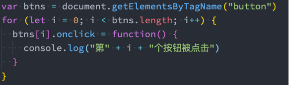

## var、let、const 的选择

- 那么在开发中,我们到底应该选择使用哪一种方式来定义我们的变量呢?
- 对于 var 的使用:
  - 我们需要明白一个事实,var 所表现出来的特殊性:比如作用域提升、window 全局对象、没有块级作用域等都是一些历史遗留问题
  - 其实是 javaScript 在设计之初的一种语言缺陷
  - 当然目前市场上也在利用这种缺陷处一系列的面试题,来考察大家对 javaScript 语言本身以及底层的理解
  - 但是在实际工作站,我们可以使用最新的规范来编写,也就是不再使用 var 来定义变量了
- 对于 let、 const
  - 对于 let 和 const 来说,是目前开发中推荐使用的
  - 我们会优先推荐使用 const,这样可以保证数据的安全性不会被随意的篡改
  - 只有当我们明确直到一个变量回叙会需要被重新赋值时,这个时候再使用 let
  - 这种在很多其他语言里面也都是一种约定俗成的规范,尽量我们也遵守这种规范

## 字符串模板基本使用

- 在 ES6 允许我们使用字符串模板来嵌入 JS 的变量或者表达式来进行拼接
  - 首先,我们会使用\``符号来编写字符串,称之为模板字符串
  - 其次,在模板字符串中,我们可以通过\${expression} 来嵌入动态的内容

## 标签模板字符串使用

- 模板字符串还有一种用法:标签模板字符串 (Tagged Template Literals)
- 我们一起来看一个普通的 javaScript 的函数

- 如果我们使用标签模板字符串,并且在调用的时候插入其他的变量
  - 模板字符串被拆分了
  - 第一个元素是数组,时被模板字符串拆分的字符串组合
  - 后面的元素是一个个模板字符串传入的内容

## React 的 styled-components 库

## 函数的默认参数

- 在 ES6 之前,我们编写的函数参数是没有默认值的,所以我们再编写函数时,如果有下面的需求
  - 传入了参数,那么使用传入的参数
  - 没有传入参数,那么使用一个默认值
- 而在 ES6 中,我们允许给函数一个默认值

## 函数默认值的补充

- 默认值也可以和解构一起来使用

- 另外参数的默认值我们通常会将其放到最后 (在很多语言中,如果不放到最后其实会报错的)
  - 但是 javaScrip 允许不将其放到最后,但是意味着还是会按照顺序来匹配
- 另外默认值会改变函数的 length 的个数,默认值以及后面的参数都不计算在 length 之内了

## 函数的剩余参数

- ES6 中引用了 rest parameter, 可以将不定数量的参数放入到一个数组中
  - 如果最后一个参数是...为前缀, 那么它会将剩余的参数放到该参数中,并且作为一个数组

- **那么剩余参数和 arguments 有什么区别呢?**
  - 剩余参数只包含那些 ==没有对应形参的实参==, 而 ==arguments 对象包含了传给函数的所有实参==
  - ==arguments 对象不是一个真正的数组==, 而 ==rest 参数是一个真正的数组==,可以进行数组的所有操作
  - arguments 是 ==早期的 ECMAScript==中为了方便去获取所有的参数提供的一个数组结构,而 rest 参数是==ES6 中提供==并且希望以此来替代 arguments 的
- 剩余参数必须放到最后一个位置,否则会报错

## 函数箭头函数的补充

- 在前面我们已经学习了箭头函数的用法,这里进行一些补充
  - 箭头函数时没有显式原型的,所以不能作为构造函数,使用 new 来创建对象
  - 箭头函数也 ==不绑定 this、arguments、super 参数==

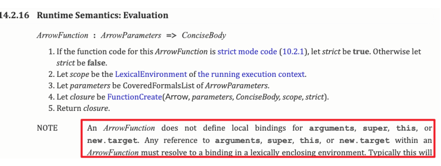

## 展开语法

- **展开语法 (Spread syntax):**
  - 可以在函数调用/数组构造时,将数组表达式或者 string 在语法层面展开
  - 还可以在构造字面量对象时,将对象表达式按 key-value 的方式展开
- **展开语法的场景:**

  - 在 ==函数调用==时使用
  - 在==数组构造==时使用
  - 在 ==构建对象字面量==时,也可以使用展开运算符,这个是在 ES2018 (ES9) 中添加的新特性

- **注意:展开运算符其实是一种浅拷贝**

## 数值的表示

- 在 ES6 中规范了二进制和八进制的写法:

- 另外在 ES2021 新增特性:数字过长时,可以使用\_作为连接符

## Symbol 的基本使用

- Symbol 是什么呢? Symbol 是 ES6 中新增的一个基本数组类型,翻译为符号
- **那么为什么需要 Symbol 呢?**

  - 在 ES6 之前,对象的属性名都是字符串形式,那么很容易造成==属性名的冲突==
  - 比如原来有一个对象,我们希望在其中 ==添加一个新的属性和值==, 但是我们再不确定它原来内部有什么内容的情况下,==很容易造成冲突,从而覆盖掉它内部的某个属性==
  - 比如我们前面在讲 apply、call、bind 实现时,我们有给其中==添加一个 fn 属性==,那么如果它内部原来已经有了 fn 属性了呢?
  - 比如开发中我们使用了混入,那么混入中出现了同名的属性,必然有一个会被覆盖掉

- Symbol 就是为了解决上面的问题,用来 **生成一个独一无二的值**
  - Symbol 值是通过 ==Symbol 函数==来生成的,生成后可以 ==作为属性名==
  - 也就是在 ES6 中,对象的属性名可以使用==字符串==,也可以使用 ==Symbol 值==
- **Symbol 即使多次创建值,它们也是不同的**:Symbol 函数执行后每次创建出来的值都是独一无二的
- **我们也可以在创建 Symbol 值的时候传入一个描述 description:** 这个是 ES2019 (ES10) 新增的特性

## Symbol 作为属性名

- 我们通常会使用 Symbol 在对象中表示唯一的属性名

## 相同值的 Symbol

- **前面我们讲 Symbol 的目的是为了创建一个独一无二的值,那么如果我们现在就是想创建相同的 Symbol 应该怎么来做呢?**
  - 我们可以使用 ==Symbol.for 方法==来做到这点
  - 并且我们可以通过==Symbol.keyFor 方法==来获取对应的 key

## Set 的基本使用

- **在 ES6 之前,我们存储数据的结构主要有两种: ==数组、对象==**

  - **在 ES6 中新增了另外两种数据结构: ==Set、Map==以及它们的另外形式 WeakSet、WeakMap**

- **Set 是一个新增的数据结构,可以用来保存数据,类似于数组,但是和数组的区别是==元素不能重复==**
  - 创建 Set 我们需要通过==Set 构造函数==
- 我们可以发现 Set 中存放的元素 ==是不会重复==的, 那么 Set 有一个非常常用的功能就是 ==给数组去重==

## Set 的常见方法

- **Set 常见的属性:**
  - ==size==:返回 Set 中元素的个数
- **Set 常用的方法:**
  - ==add(value):==添加某个元素, 返回 Set 对象本身
  - ==delete(value)==:从 set 中删除和这个值相等的元素,返回 boolean 类型
  - ==has(value)==:判断 set 中是否存在某个元素,返回 boolean 类型
  - ==clear()==:清空 set 中所有的元素,没有返回值
  - ==forEach(callback,[,thisArg]):==通过 forEach 遍历 set
- **另外 Set 是支持 for of 的遍历的**

## WeakSet 使用

- **和 Set 类似的另外一个数据结构称之为==WeakSet==,也是内部元素不能重复的数据结构**
- **那么和 Set 有什么区别呢?**
  - 区别一: WeakSet 中 ==只能存放对象类型,不能存放基本数据类型==
  - 区别二:WeakSet==对元素的弱引用是弱引用==,如果没有其他引用对某个对象进行引用,那么 GC 可以对对象进行回收

- **WeakSet 常见的方法:**
  - add(value):添加某个元素,返回 WeakSet 对象本身
  - delete(value): 从 WeakSet 中删除和这个值相等的元素,返回 boolean 类型
  - has(value): 判断 WeakSet 中是否存在某个元素,返回 boolean 类型

## WeakSet 的应用

- **注意:WeakSet 不能遍历**
  - 因为==WeakSet 只是对对象的弱引用==,如果我们遍历获取到其中的元素,那么有可能造成不能正常的销毁
  - 所以==存储到 WeakSet 中的对象是没办法获取==的
- **那么这个东西有什么用呢?**
  - 事实上这个问题并不好回答,我们来使用一个 Stack Overflow 上的答案

## Map 的基本使用

- **另外一个新增的数据结构是 Map, 用于==存储映射关系==**
- **但是我们可能会想,在之前我们可以==使用对象来存储映射关系,他们有什么区别==呢?**
  - 事实上我们对象存储映射关系只能用 ==字符串 (ES6 新增了 Symbol) 作为属性名 (key)
  - 某些情况下我们可能希望通过 ==其他类型作为 key==,==比如对象==,这个时候==会自动将对象转成字符串来作为 key==
- **那么我们就可以使用 Map:**

## Map 的常用方法

- **Map 常见的属性**
  - ==size==:返回 Map 中元素的个数
- **Map 常见的方法:**
  - ==set(key,value)==: 在 Map 中添加 key、value,并且返回整个 Map 对象
  - ==get(key)==:根据 key 获取 Map 中的 value
  - ==has(key)==:判断是否包括某一个 key,返回 Boolean 类型
  - ==delete(key)==:根据 key 删除一个键值对,返回 Boolean 类型
  - ==clear()==:清空所有的元素
  - ==forEach(callback,[,thisArg])==:通过 forEach 遍历 Map
- **Map 也可以通过 for of 进行遍历**

## WeakMap 的使用

- **和 Map 类型的另外一个数据结构称之为==WeakMap==,也是以==键值对的形式==存在的**
- 那么和 Map 有什么区别呢?
  - 区别一: ==WeakMap 的 key 只能适用对象,不接受其他的类型作为 key==
  - 区别二:WeakMap 的==key 对对象的引用是弱引用==,如果没有其他引用引用这个对象,那么 GC 可以回收该对象

- **WeakMap 常见的方法有四个:**
  - ==set(key, value)==:在 Map 中添加 key、value,并且返回整个 Map 对象
  - ==get(key)==:根据 key 获取 Map 中的 value
  - ==has(key)==:判断是否包括某一个 key,返回 Boolean 类型
  - ==delete(key)==:根据 key 删除一个键值对,返回 Boolean 类型

## WeakMap 的应用

- **注意: WeakMap 也是不能遍历的**
  - 没有 forEach 方法,也不支持通过 for of 的方式进行遍历
- **那么我们的 WeakMap 有什么作用呢?**

## ES6 其他知识点说明

- **事实上 ES6 (ES2015) 是一次非常大的版本更新,所以里面重要的特性非常多:**
  - 除了前面讲到的特性还有很多其他特性
- **Proxy、Reflect,我们会在后续专门进行学习**
  - 并且会利用 Proxy、Reflect 来讲解 Vue3 的响应式原理
- **Promise,用于处理一步的解决方案**
  - 后续会详细学习
  - 并且会学习如何手写 Promise
- **ES Module 模块化开发:**
  - 从 ES6 开发,javaScript 可以进行原生的模块化开发
  - 这部分内容会在工程化部分学习
  - 包括其他模块化方案:CommonJS、AMD、CMD 等方案

## ES7 - Array Includes (已学)

- 在 ES7 之前,如果我们想判断一个数组中是否包含某个元素,需要通过 indexOf 获取结果,并且判断是否为-1
- 在 ES7 中,我们可以通过 includes 来判断一个数组中是否包含一个指定的元素,根据情况,如果包含则返回 true,否则返回 false

## ES7 - 指数 exponentiation 运算符 (已学)

- 在 ES7 之前,计算数字的乘方需要通过 Math.pow 方法来完成
- 在 ES7 中,增加了 **\*\*运算符**,可以对数字来计算乘方

## ES8 Object values

- 之前我们可以通过 ==Object.keys==获取一个对象所有的 key
- **在 ES8 中提供 ==Object.values==来获取所有的 value 值:**

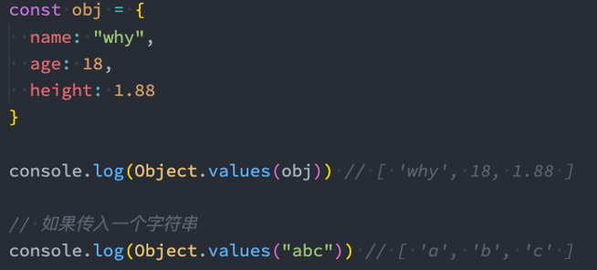

## ES8 Object entries

- **通过 ==Object.entries== 可以获取到一个数组, 数组中会存放可枚举属性的键值对数组**
  - 可以针对 ==对象、数组、字符串==进行操作

## ES8 - String Padding

- 某些字符串我们需要对其进行前后的填充,来实现某种格式化效果,ES8 中增加了 ==padStart 和 padEnd== 方法,分别是==对字符串的首尾进行填充==的

- **我们简单具一个应用场景:比如需要对身份证、银行卡的前面位数进行隐藏:**

## ES8 - Trailing Commas

- **在 ES8 中,我们允许在函数定义和调用时==多加一个逗号==**:

## ES8 - Object Descriptors

- **Object.getOwnPropertyDescriptors**:
  - 这个在之前已经讲过了,这里不再重复
- **Async Functiion: async、await**
  - 后续讲完 Promise

## ES9 新增知识点

- **Async iterators: 后续迭代器讲解**
- **Object spread operators: 前面讲过了**
- **Promise finally: 后续讲 Promise 讲解**

## ES10 - flat flatMap

- **flat() 方法会按照一个可指定的深度递归遍历数组, 并将所有元素与遍历到的子数组中的元素合并为一个新数组返回**

- **flatMap() 方法首先使用映射函数映射每个元素,然后将结果压缩成一个新数组**
  - 注意一: flatMap 是先进行 map 操作,再做 flat 的操作
  - 注意二:flatMap 中的 flat 相当于深度为 1

## ES10 - Object fromEntries

- **在前面, 我们可以通过 Object.entries 将一个对象转成 entries**
- **那么如果我们有一个 entries 了,如何将其转换成对象呢?**
  - ES10 提供了 ==Object.fromEntries==来完成转换
- **那么这个方法有什么应用场景呢?**

## ES10 - trimStart trimEnd

- **去除一个字符串首尾的空格, 我们可以通过 trim 方法, 如果单独去除前面或者后面呢 ？**
  - ES10 中给我们提供了 ==trimStart 和 trimEnd==

## ES10 其他知识点

- **Symbol description: 已经讲过了**
- **Optional catch binding: 后面讲解 try catch 讲解**

## ES11 - BigInt

- **在早期的 javaScript 中,我们不能正确的表示过大的数字:**
  - 大于 ==MAX_SAFE_INTEGER==的数值,表示的可能是不正确的

- **那么 ES11 中,引入了新的数据类型 BigInt,用于表示大的整数:**
  - BigInt 的表示方式是在数值的==后面加上 n==

## ES11 - Nullish Coalescing Operator

- **ES11 , Nullish Coalsescing Operator 增加了空值合并操作符**

## ES11 - Optional Chaining

- ==可选链==也是==ES11 中新增一个特性==,主要作用是让我们的代码在 ==进行 null 和 undefined 判断时更加清晰==和简洁

## ES11 - Global This

- **在之前我们希望获取 javaScript 环境的全局对象,不同的环境获取的方式是不一样的**
  - 比如在浏览器中可以通过 this.window 来获取
  - 比如在 Node 中我们需要通过 global 来获取
- **在 ES11 中对获取全局对象进行了统一的规范: globalThis**

## ES11 - for..in 标准化

- **在 ES11 之前,虽然很多浏览器支持 for..in 来遍历==对象类型==,但是并没有被 ECMA 标准化**
- **在 ES11 中,对其进行了标准化,==for...in 是用于遍历对象==key 的:**

## ES11 其他知识点

- **Dynamic Import:** 后续 ES Module 模块化中讲解
- **Promise.allSettled**:后续讲 Promise 的时候讲解
- **import meta**: 后续 ES Module 模块化中讲解

## ES12 - FinalizationRegistry

- ==FinalizationRegistry== 对象可以让你在对象被垃圾回收时请求一个回调
  - FinalizationRegistry 提供了这样的一种方法: 当一个==在注册表中注册的对象被回收==时, ==请求在某个时间点上调用一个清理回调== (清理回调有时被称为 finalizer)
  - 你可以通过==调用 register 方法,注册任何你想要清理回调的对象,传入该对象和所含的值==

## ES12 - WeakRefs

- 如果我们默认将一个对象赋值给另外一个引用,那么这个引用是一个强引用:
  - 如果我们希望是一个弱引用,可以使用 WeakRef

## ES12 - logical assignment operators

## ES12 其他知识点

- Numeric Separator: 讲过了
- String.replaceAll: 字符串替换

## ES12 - method.at()

- 前面我们有学过字符串、数组的 at 方法,它们是作为 ES12 中的特性加入的

## ES13 - Object.hasOwn(obj,proKey)

- Object 中新增了一个静态方法 (类方法) : hasOwn(obj, propKey)
  - 该方法用于判断一个对象中是否有某个自己的属性
- 那么和之前学习的 Object.prototype.hasOwnProperty 有什么区别的?
- 
  - 区别一：防止对象内部有重写 hasOwnProperty
  - 区别二: 对于隐式原型指向 null 的对象, hasOwnProperty 无法进行判断

## ES13 - New members of classes

- 在 ES13 中,新增了定义 class 类中成员字段 (filed) 的其他方式:
  - Instance public fields
  - Static public fields
  - Instance private fields
  - Static private fields
  - static block

# Proxy-Reflect 使用详解

## 监听对象的操作

- **我们先来看一个需求: 有一个对象, 我们希望监听这个对象中这个对象中的属性被设置或获取的过程**
  - 通过我们前面所学的知识,能不能做到这一点呢?
  - 其实是可以的,我们可以通过之前的属性描述符中的存储属性描述符来做到
- **左边这段代码就利用了前面讲过的 Object.defiineProperty 的存储属性描述符来对属性的操作进行监听**
- **但是这样做有什么缺点呢?**
  - 首先,Object.defineProperty 设计的初衷, 不是为了去监听截止一个对象中所有的属性的
    - 我们再定义某些属性的时候,初中起始是定义普通的属性,但是后面我们强行将它变成了数据属性描述符
  - 其次, 如果我们想监听更加丰富的操作, 比如新增属性、删除属性,那么 Object.defineProperty 是无能为力
- 所以我们要知道,存储数据描述符设计的初衷并不是为了去监听一个完整的对象

## Proxy 基本使用

- **在 ES6 中,新增了一个 Proxy 类,这个类从名字就可以看出来,适用于帮助我们创建一个代理的:**
  - 也就是说,如果我们希望==监听一个对象的相关操作==, 那么我们可以==先创建一个代理对象  (Proxy 对象)==
  - 之后对==该对象的所有操作==,都通过==代理对象来完成==,代理对象==可以监听我们想要对原对象进行哪些操作==
- **我们可以将上面的案例用 Proxy 来实现一次:**
  - 首先,我们需要 ==new Proxy 对象==, 并且==传入需要侦听的对象以及一个处理对象==, 可以称之为 ==handler==
    - const p = new Proxy(target, handler)
  - 其次, ==我们之后的操作都是直接对 Proxy 的操作==,而==不是原有的对象==,因为我们需要在 handler 里面进行侦听

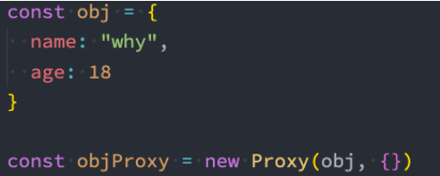

## Proxy 的 set 和 get 捕获器

- **如果我们想要侦听某些具体的,那么就可以在 handler 中添加对应的==捕获器 (Trap)==**
- **set 和 get 分别对应的是函数类型:**
  - ==set 函数有四个参数==:
    - target: 目标对象 (侦听的对象)
    - property: 将被设置的属性 key
    - value:新属性值
    - receiver:调用的代理对象
  - ==get 函数有三个参数==
    - target:目标对象 (侦听的对象)
    - property: 被获取的属性 key
    - receiver:调用的代理对象

## Proxy 所有捕获器

- **13 个捕获器分别是做什么的呢?**
  - handler.getPrototypeOf()
    - Object.getPrototypeOf 方法的捕获器
  - handler.setPrototypeOf()
    - Object.setPrototypeOf 方法的捕获器
  - handler.isExtensible()
    - Object.isExtensible 方法的捕获器 (判断是否可以新增属性)
  - handler.preventExtensions()
    - Object.preventExtensions 方法的捕捉器
  - handler.getOwnPropertyDescriptor()
    - Object.getOwnPropertyDescriptor 方法的捕捉器
  - handler.defineProperty()
    - Object.defineProperty 方法的捕获器
  - handler.ownKeys()
    - Object.getOwnPropertyNames 方法和 Object.getOwnPropertySymbols 方法的捕捉器
  - ==handler.has()==
    - in 操作符的捕捉器
  - ==handler.get()==
    - 属性读取操作的捕捉器
  - ==handler.set()==
    - 属性设置操作的捕捉器
  - ==handler.deleteProperty()==
    - delete 操作符的捕捉器
  - handler.apply()
    - 函数调用操作的捕捉器
  - handler.construct()
    - new 操作符的捕捉器

## Proxy 和 construct 和 apply

- **当然,我们还会看到捕捉器中还有 ==construct==和==apply==,它们是应用于函数对象的:**

## Reflect 的作用

- **Reflect 也是 ES6 新增的一个 API, 它是==一个对象==,字面的意思是==反射==**
- **那么这个 Reflect 有什么用呢?**
  - 它主要提供了很多==操作 javaScript 对象的方法==,有点像==Object 中操作对象的方法==
  - 比如 Reflect.getPrototypeOf(target)类似于 Object.getPrototypeOf()
  - 比如 Reflect.defineProperty(target,propertyKey,attributes)类似于 Object.defineProperty()
- **如果我们有 Object 可以做这些操作,那么==为什么还需要有 Reflect 这样的新增对象==呢?**
  - 这是因为在早期的 ECMA 规范中没有考虑到这种==对 对象本身 的操作如何设计会更加规范==,所以 ==将这些 API 放到了 Object 上面==
  - 但是==Object 作为一个构造函数==, 这些操作实际上==放到它身上并不合适==
  - 另外还包括一些==类似于 in、delete 操作符==,让 JS 看起来是会有一些奇怪的
  - 所以在 ES6 中==新增了 Reflect==, 让我们这些操作都集中到了 Reflect 对象上
  - 另外在使用 Proxy 时,可以做到==不操作原对象==
- **那么 Object 和 Reflect 对象之间的 AOI 关系 s,可以参考 MDN 文档**

[比较 Reflect 和 Object 方法 - JavaScript | MDN (mozilla.org)](https://developer.mozilla.org/zh-CN/docs/Web/JavaScript/Reference/Global_Objects/Reflect/Comparing_Reflect_and_Object_methods)

## Reflect 的常见方法

- **Reflect 中有哪些常见的方法呢? 它和 Proxy 是一一对应的,也是 13 个:**
- Reflect.getPrototypeOf(target)
  - 类似于 Object.getPrototypeOf()
- Reflect.setPrototypeOf(target, prototype)
  - 设置对象的原型的函数.返回一个 Boolean, 如果更新成功,则返回 true
- Reflect.isExtensible(target)
  - 类似于 Object.isExtensible()
- Reflect.preventExtensions(target)
  - 类似于 Object.preventExtensions() 返回一个 Boolean
- Reflect.getOwnPropertyDescriptor(target, propertyKey)
  - 类似于 Object.getOwnPropertyDescriptor() 。如果对象中存在该属性 , 则返回对应的属性描述符, 否则返回 undefined
- Reflect.defineProperty(target, propertyKey, attributes)
  - 和 Object.defineProperty() 类似。 如果设置成功就会返回 true
- Reflect.ownKeys(target)
  - 返回一个包含所有自身属性 (不包含继承属性) 的数组。 (类似于 Object.keys(), 但不会受 enumerable 影响)
- ==Reflect.has(target, propertyKey)==
  - 判断一个对象是否存在某个属性, 和 in 运算符 的功能完全相同
- ==Reflect.get(target, propertyKey) [, receiver]==
  - 获取对象身上某个属性的值,类似于 target[name]
- ==Reflect.set(target,propertyKey,value[,receiver])==
  - 将值分配给属性的函数。返回一个 Boolean,如果更新成功,则返回 true
- ==Reflect.deleteProperty(target, propertyKey)==
  - 作为函数的 delete 操作符,相当于执行 delete target[name]
- Reflect.apply(target, thisArgument, argumentsList)
  - 对一个函数进行调用操作,同时可以传入一个数组作为调用参数。 和 Function.prototype.apply() 功能类似
- Reflect.construct(target,argumentsList [,new Target])
  - 对构造函数进行 new 操作, 相当于执行 new target(...args)

## Reflect 的使用

- **那么我们可以将之前 Proxy 案例中对原对象的操作,都修改为==Reflect 来操作==**

## Receiver 的作用

- **我们发现在使用 getter、setter 的时候有一个 ==receiver 的参数==,它的作用是什么呢?**

  - 如果我们的源对象 (obj) 有==setter、getter 的访问器属性==,那么可以 ==通过 receiver 来改变里面的 this==

- **我们来看这样的一个对象**

## Reflect 的 construct

# Promise 使用详解

## 异步任务的处理

- **在 ES6 出来之后,又很多关于 Promise 的讲解、文章,也有很多经典的书籍讲解 Promise**
  - 虽然等你学会 Promise 之后,会觉得 Promise 不过如此
  - 但是在初次接触的时候都会觉得==这个东西不好理解==
- **那么这里我从一个实际的例子来作为切入点:**
  - 我们调用一个函数,这个函数中发送网络请求 (我们可以用定时器来模拟)
  - 如果==发送网络请求成功了==, 那么==告知调用者发送成功==,==并且将相关数据返回回去==
  - 如果==发送网络请求失败了==,那么==告知调用者发送失败==,==并且告知错误信息==

## 什么是 Promise 呢?

- **在上面的解决方案中,我们确确实实可以解决请求函数得到结果之后,获取到对应的回调,但是它存在两个主要的问题:**
  - 第一:我们 ==需要自己来设计回调函数 、回调函数的名称、回调函数的使用==等
  - 第二: ==对于不同的人、不同的管家设计出来的方案是不同==的,那么我们必须耐心==去看别人的源码或者文档==,以便可以理解它这个函数到底怎么用
- **我们来看一下 Promise 的 API 是怎么样的:**
  - ==Promise 是一个类== 可以翻译成 ==承诺、许诺、契约==
  - 当我们需要的时候, ==给予调用者一个承诺==: 待会儿 ==我们给你回调数据时==,就可以 ==创建一个 Promise 的对象==
  - 在通过 new 创建 Promise 对象时,我们需要==传入一个回调函数==,我们称之为 ==executor==
    - 这个回调函数==会被立即执行==,并且给==传入另外两个回调函数 resolve、reject==
    - 当我们==调用 resolve 回调函数时==,==会执行 Promise 对象的 then 方法==传入的回调函数
    - 当我们==调用 reject 回调函数时==,==会执行 Promise 对象的 catch 方法==传入的回调函数

## Promise 的代码结构

- **我们来看一下 Promise 代码结构:**
- **上面 Promise 使用过程,我们可以将它划分成三个状态:**
  - ==待定(pending):==初始状态,既没有被兑现,也没有被拒绝
    - 当执行 executor 中的代码时,处于该状态
  - ==已兑现  (fulfilled)==: 意味着操作成功完成
    - 执行了 resolve,处于该状态, Promise 已经被兑现
  - ==已拒绝 (rejected)==: 意味着操作失败
    - 执行了 reject 时,处于该状态, Promise 已经被拒绝

## Promise 重构请求

- **那么有了 Promise,我们就可以将之前的代码进行重构了:**

## Executor

- **Executor 是在创建 Promise 时需要传入一个回调函数,这个==回调函数会被立即执行==,并且==传入两个参数==:**

- **通常我们会在 Executor 中确定我们的 Promise 状态:**
  - 通过==resolce==,可以兑现 (==fulfilled==) Promise 的状态, 我们也可以称之为已决议 (resolved)
  - 通过==reject==,可以拒绝 (==reject==) Promise 的状态
- **这里需要注意:一旦状态被确定下来，Promise 的状态会被 锁死, 该 Promise 的状态是不可更改的**
  - 在我们==调用 resolve==的时候,如果==resolve 传入的值本身不是一个 Promise==,那么==会将该 Promise 的状态变成兑现 (fulfilled)==
  - 在==之后我们去调用 reject 时,已经不会有任何的响应了== (并不是这行代码不会执行,而是无法改变 Promise 状态)

## resolve 不同值的区别

- **情况一: 如果 resolve 传入==一个普通的值或者对象==,那么==这个值会作为 then 回调的参数==**
- **情况二:resolve 中传入的是==另外一个 Promise==, 那么==这个新 Promise 会决定原 Promise 的状态==**

- **情况三: 如果 resolve 中传入的是==一个对象==,并且这个对象==有实现 then 方法==,那么==会执行该 then 方法==,并且根据==then 方法的结果来决定 Promise 的状态==**

## then 方法 - 接受两个参数

- **then 方法是 Promise 对象上的一个方法 (实例方法) :**
  - 它其实是放在 Promise 的原型上的 Promise.prototype.then
- **then 方法接受两个参数:**
  - ==fulfilled 的回调函数:== 当状态变成 fulfilled 时会回调的函数
  - ==reject 的回调函数==: 当状态变成 rejct 时会回调的函数

## then 方法 - 返回值

- **then 方法本身是有返回值的, 它的返回值是一个 Promise, 所以我们可以进行如下的链式调用:**
  - 但是==then 方法返回的 Promise 到底处于什么样的状态呢==?
- **Promise 有三种状态,俺么这个 Promise 处于什么状态呢?**
  - 当==then 方法中的回调函数本身在执行的时候,那么它处于 pending==状态
  - 当==then 方法中的回调函数返回一个结果==时,那么它==处于 fulfilled 状态==,并且==会将结果作为 resolve 的参数==
    - 情况一: 返回一个普通的值
    - 情况二:返回一个 Promise
    - 情况三:返回一个 thenable 值
  - 当==then 方法抛出一个异常时,那么它处于 reject 状态==

## catch 方法 - 多次调用

- **catch 方法也是 promise 对象行的一个方法 (实例方法) :**
  - 它也是放在 Promise 的原型上的 Promise.prototype.catch
- **一个 Promise 的 catch 方法是可以被多次调用的:**
  - 每次调用我们==都可以传入对应的 reject 回调==
  - 当==Promise 的状态变成 reject 的时候,这些回调函数都会被执行==

## catch 方法 - 返回值

- **事实上 catch 方法也是会==返回一个 Promise 对象==的,所以 catch 方法后面我们==可以继续使用 then 方法或者 catch 方法==**
  - 下面的代码,后续是 catch 中的 err2 打印,还是 then 中的 res 打印呢?
  - 答案是 res 打印,这是因为 catch 传入的回调在执行完后,==默认状态依然会是 fulfilled==的

- **那么如果我们希望后续继续执行 catch,那么需要抛出一个异常:**

## finally 方法

- **finally 是在 ES9 (ES2018) 中新增的一个特性: 表示==无论 Promise 对象无论变成 fulfilled 还是 rejected 状态==,==最终都会被执行的代码==**
- **finally 方法是不接收参数的,因为无论前面是 fulfilled 状态,还是 rejected 状态,它都会执行**

## resolve 方法

- **前面我们学习的 then、catch、finally 方法都属于==Pormise 的实例方法==,都是==存放在 Promise 的 prototype 上==**
  - 下面我们再来学习一下==Promise 的类方法==
- **有时候我们已经有一个==现成的内容==了,希望==将其转成 Promise 来使用==,这个时候我们可以==使用 Promise.resolve 方法==来完成**
  - ==Promise.resolve 的用法相当于 new Promise==,==并且执行 resolve 操作==

- **resolve 参数的形态:**
  - 情况一:参数是一个普通的值或者对象
  - 情况二：参数本身是 Promise
  - 情况三:参数是一个 thenable

## reject 方法

- **reject 方法类似于 resolve 方法, 只是会将 Promise 对象的状态设置为 reject 状态**
- **Promise.reject 的用法相当于 new Promise, 只是会调用 reject:**

- **Promise.reject 传入的参数无论是什么状态,都会直接作为 reject 状态的参数传递到 catch 的**

## all 方法

- **另外一个类方法是 Promise.all:**
  - 它的作用是==将多个 Promise 包裹在一起形成一个新的 Promise==
  - ==新的 Promise 状态由包裹的所有 Promise 共同决定==:
    - 当==所有的 Promise 状态变成 fulfilled 状态==时, ==新的 Promise 状态为 fulfilled==,并且会==将所有 Promise 的返回值组成一个数组==
    - 当==有一个 Promise 状态为 reject==时,==新的 Promise 状态为 reject==,并且==会将第一个 reject 的返回值作为参数==

## allSettled 方法

- **all 方法有一个缺陷:当有其中一个 Promise 变成 reject 状态时, 新 Promise 就会立即变成对应的 reject 状态**
  - 那么对于 resolved 的,以及依然处于 pending 状态 Promise,我们时获取不到对应的结果的
- **在 ES11 (ES2020) 中, 添加了新的 API Promise.allSettled:**
  - 该方法==会在所有的 Promise 都有结果 (settled) , 无论时 fulfilled , 还是 rejected 时, 才会有最终的状态==
  - 并且==这个 Promise 的结果一定是 fulfilled==的

- **我们来看一下打印的结果:**
  - allSettled 的结果是一个数组,数组中存放着每一个 Promise 的结果,并且是对应一个对象的
  - 这个对象中 ==包含 status 状态,以及对应的 value 值==

## race 方法

- **如果有一个 Promise 有了结果,我们就希望决定最终新 Promise 的状态,那么可以使用 race 方法:**
  - ==race 是竞技、竞赛==的意思,表示==多个 Promise 相互竞争==,谁==先有结果,那么就使用谁的结果==

