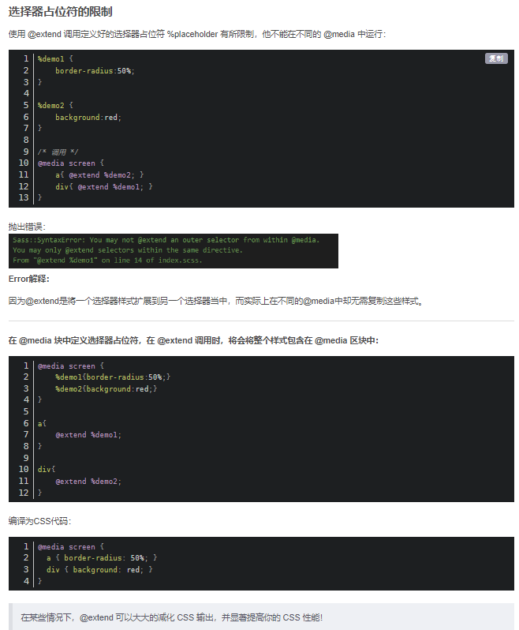
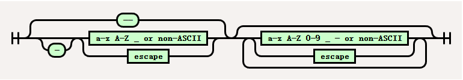

# 学习 Sass

## 函数

#### if()函数 表示三元表达式

#### length()函数表示数组的长度

#### nth(target,index) 从目标中选择下标第 index 的元素

#### index(target,value) 数组中查询某项的下标,没有返回 null

#### append(target,value)向目标数组追加元素

#### map.merge()数组合并

### change-color()改变颜色中某项的值(1\*xxx)

### scale-color()改变颜色中某项的值(current * (1+current*xxx))（只能百分比）

### mix 两种颜色的混合

## 句法

### 注释

SCSS 中的注释与其他语言（如 JavaScript）中的注释类似。**单行注释**以 开始`//`，一直到行尾。单行注释中的任何内容都不会作为 CSS 发出；就 Sass 而言，它们可能不存在。它们也被称为**silent comments**，因为它们不产生任何 CSS。

**多行注释**以下一个开始`/*`和结束`*/`。如果多行注释写在允许[声明](https://sass-lang.com/documentation/syntax/structure#statements)的地方，它会被编译为 CSS 注释。与无声评论相比，它们也被称为**大声评论。**编译为 CSS 的多行注释可能包含[interpolation](https://sass-lang.com/documentation/interpolation)，它将在编译注释之前进行评估。

默认情况下，多行注释会在[压缩模式下从编译后的](https://sass-lang.com/documentation/cli/dart-sass#style)CSS 中去除。但是，如果注释以 开头，它将始终包含在 CSS 输出中。`/*!`

### 特殊函数

该[`url()`函数在](https://developer.mozilla.org/en-US/docs/Web/CSS/url)CSS 中很常用，但它的语法与其他函数不同：它可以接受带引号*或*不带引号的 URL。因为未加引号的 URL 不是有效的 SassScript 表达式，Sass 需要特殊的逻辑来解析它。

```scss
$roboto-font-path: '../fonts/roboto';

@font-face {
  // This is parsed as a normal function call that takes a quoted string.
  src: url('#{$roboto-font-path}/Roboto-Thin.woff2') format('woff2');

  font-family: 'Roboto';
  font-weight: 100;
}

@font-face {
  // This is parsed as a normal function call that takes an arithmetic
  // expression.
  src: url($roboto-font-path + '/Roboto-Light.woff2') format('woff2');

  font-family: 'Roboto';
  font-weight: 300;
}

@font-face {
  // This is parsed as an interpolated special function.
  src: url(#{$roboto-font-path}/Roboto-Regular.woff2) format('woff2');

  font-family: 'Roboto';
  font-weight: 400;
}
```

```css
@font-face {
  src: url('../fonts/roboto/Roboto-Thin.woff2') format('woff2');
  font-family: 'Roboto';
  font-weight: 100;
}
@font-face {
  src: url('../fonts/roboto/Roboto-Light.woff2') format('woff2');
  font-family: 'Roboto';
  font-weight: 300;
}
@font-face {
  src: url(../fonts/roboto/Roboto-Regular.woff2) format('woff2');
  font-family: 'Roboto';
  font-weight: 400;
}
```

## 样式规则

### 声明变量

在 Sass 中和在 CSS 中一样，属性声明定义了如何设置与选择器匹配的元素的样式。但是 Sass 添加了额外的特性，使它们更容易编写和自动化。首先，声明的值可以是任何[SassScript 表达式](https://sass-lang.com/documentation/syntax/structure#expressions)，它将被计算并包含在结果中。

```scss
.circle {
  $size: 100px;
  width: $size;
  height: $size;
  border-radius: $size * 0.5;
}
```

```css
.circle {
  width: 100px;
  height: 100px;
  border-radius: 50px;
}
```

#### 插补

属性的名称可以包含[interpolation](https://sass-lang.com/documentation/interpolation)，这使得根据需要动态生成属性成为可能。您甚至可以插入整个属性名称！

```scss
SCSS 语法 @mixin prefix($property, $value, $prefixes) {
  @each $prefix in $prefixes {
    -#{$prefix}-#{$property}: $value;
  }
  #{$property}: $value;
}

.gray {
  @include prefix(filter, grayscale(50%), moz webkit);
}
```

```css
.gray {
  -moz-filter: grayscale(50%);
  -webkit-filter: grayscale(50%);
  filter: grayscale(50%);
}
```

#### 嵌套

许多 CSS 属性以相同的前缀开头，充当一种命名空间。例如，`font-family`, `font-size`, 以及`font-weight`所有以 开头的`font-`。Sass 通过允许嵌套属性声明使这更容易和更少冗余。外部属性名称添加到内部，用连字符分隔。

```scss
.enlarge {
  font-size: 14px;
  transition: {
    property: font-size;
    duration: 4s;
    delay: 2s;
  }

  &:hover {
    font-size: 36px;
  }
}
```

```css
.enlarge {
  font-size: 14px;
  transition-property: font-size;
  transition-duration: 4s;
  transition-delay: 2s;
}
.enlarge:hover {
  font-size: 36px;
}
```

其中一些 CSS 属性具有使用名称空间作为属性名称的速记版本。对于这些，您可以编写速记值*和* 更明确的嵌套版本。

```scss
.info-page {
  margin: auto {
    bottom: 10px;
    top: 2px;
  }
}
```

```css
.info-page {
  margin: auto;
  margin-bottom: 10px;
  margin-top: 2px;
}
```

#### 隐藏声明(if())

有时您只希望在某些时候显示属性声明。如果一个声明的值是[`null`](https://sass-lang.com/documentation/values/null)或一个空的不带[引号的字符串](https://sass-lang.com/documentation/values/strings#unquoted)，Sass 根本不会将该声明编译成 CSS。

```scss
SCSS 语法
$rounded-corners: false;

// if()函数是三元表达式
.button {
  border: 1px solid black;
  border-radius: if($rounded-corners, 5px, null);
}
```

```css
.button {
  border: 1px solid black;
}
```

#### 自定义属性

[CSS 自定义属性](https://developer.mozilla.org/en-US/docs/Web/CSS/--*)，也称为 CSS 变量，具有不寻常的声明语法：它们几乎允许在其声明值中使用任何文本。此外，JavaScript 可以访问这些值，因此任何值都可能与用户相关。这包括通常会被解析为 SassScript 的值。

因此，Sass 以不同于其他属性声明的方式解析自定义属性声明。所有标记，包括那些看起来像 SassScript 的标记，都按原样传递给 CSS。唯一的例外是[插值](https://sass-lang.com/documentation/interpolation)，这是将动态值注入自定义属性的唯一方法。

```scss
SCSS 语法
$primary: #81899b;
$accent: #302e24;
$warn: #dfa612;

:root {
  --primary: #{$primary};
  --accent: #{$accent};
  --warn: #{$warn};

  // Even though this looks like a Sass variable, it's valid CSS so it's not
  // evaluated.
  --consumed-by-js: $primary;
}
```

```scss
:root {
  --primary: #81899b;
  --accent: #302e24;
  --warn: #dfa612;
  --consumed-by-js: $primary;
}
```

> 不幸的是，[插值](https://sass-lang.com/documentation/interpolation)从字符串中删除了引号，这使得当它们来自 Sass 变量时很难使用带引号的字符串作为自定义属性的值。作为解决方法，您可以使用该[`meta.inspect()`函数](https://sass-lang.com/documentation/modules/meta#inspect)来保留引号。
>
> ```scss
> @use 'sass:meta';
>
> $font-family-sans-serif: -apple-system, BlinkMacSystemFont, 'Segoe UI', Roboto;
> $font-family-monospace: SFMono-Regular, Menlo, Monaco, Consolas;
>
> :root {
>   --font-family-sans-serif: #{meta.inspect($font-family-sans-serif)};
>   --font-family-monospace: #{meta.inspect($font-family-monospace)};
> }
> ```

### 父级选择器(&)

父选择器`&`是 Sass 发明的一种特殊选择器，用于[嵌套选择器](https://sass-lang.com/documentation/style-rules#nesting)中以引用外部选择器。它使得以更复杂的方式重用外部选择器成为可能，例如添加[伪类](https://developer.mozilla.org/en-US/docs/Web/CSS/Pseudo-classes)或在父级*之前添加选择器。*

```scss
.alert {
  // The parent selector can be used to add pseudo-classes to the outer
  // selector.
  &:hover {
    font-weight: bold;
  }

  // It can also be used to style the outer selector in a certain context, such
  // as a body set to use a right-to-left language.
  [dir='rtl'] & {
    margin-left: 0;
    margin-right: 10px;
  }

  // You can even use it as an argument to pseudo-class selectors.
  :not(&) {
    opacity: 0.8;
  }
}
```

```css
.alert:hover {
  font-weight: bold;
}
[dir='rtl'] .alert {
  margin-left: 0;
  margin-right: 10px;
}
:not(.alert) {
  opacity: 0.8;
}
```

#### 添加后缀

您还可以使用父选择器向外部选择器添加额外的后缀。[这在使用像 BEM](http://getbem.com/) 这样使用高度结构化类名的方法时特别有用。只要外部选择器以字母数字名称结尾（如类、ID 和元素选择器），您就可以使用父选择器附加其他文本。

```scss
.accordion {
  max-width: 600px;
  margin: 4rem auto;
  width: 90%;
  font-family: 'Raleway', sans-serif;
  background: #f4f4f4;

  &__copy {
    display: none;
    padding: 1rem 1.5rem 2rem 1.5rem;
    color: gray;
    line-height: 1.6;
    font-size: 14px;
    font-weight: 500;

    &--open {
      display: block;
    }
  }
}
```

```css
.accordion {
  max-width: 600px;
  margin: 4rem auto;
  width: 90%;
  font-family: 'Raleway', sans-serif;
  background: #f4f4f4;
}
.accordion__copy {
  display: none;
  padding: 1rem 1.5rem 2rem 1.5rem;
  color: gray;
  line-height: 1.6;
  font-size: 14px;
  font-weight: 500;
}
.accordion__copy--open {
  display: block;
}
```

#### 在 SassScript 中

父选择器也可以在 SassScript 中使用。[这是一个特殊的表达式，它以选择器函数](https://sass-lang.com/documentation/modules/selector#selector-values)使用的相同格式返回当前父选择器：一个逗号分隔的列表（选择器列表），其中包含空格分隔的列表（复杂选择器），其中包含不带引号的字符串（复合选择器）

```scss
SCSS 语法 .main aside:hover,
.sidebar p {
  parent-selector: &;
  // => ((unquote(".main") unquote("aside:hover")),
  //     (unquote(".sidebar") unquote("p")))
}
```

```css
.main aside:hover,
.sidebar p {
  parent-selector: .main aside:hover, .sidebar p;
}
```

如果`&`表达式在任何样式规则之外使用，则返回`null`. 由于`null`是[假](https://sass-lang.com/documentation/at-rules/control/if#truthiness-and-falsiness)的，这意味着您可以轻松地使用它来确定是否在样式规则中调用了 mixin。

```scss
@mixin app-background($color) {
  #{if(&, '&.app-background', '.app-background')} {
    background-color: $color;
    color: rgba(#fff, 0.75);
  }
}

@include app-background(#036);

.sidebar {
  @include app-background(#c6538c);
}
```

```css
.app-background {
  background-color: #036;
  color: rgba(255, 255, 255, 0.75);
}

.sidebar.app-background {
  background-color: #c6538c;
  color: rgba(255, 255, 255, 0.75);
}
```

#### 高级嵌套(@at-root)

您可以`&`用作普通的 SassScript 表达式，这意味着您可以将其传递给函数或将其包含在插值中——甚至在其他选择器中！将它与[选择器函数](https://sass-lang.com/documentation/modules/selector#selector-values)和[`@at-root`规则](https://sass-lang.com/documentation/at-rules/at-root)结合使用可以让您以非常强大的方式嵌套选择器。

例如，假设您要编写一个匹配外部选择器*和*元素选择器的选择器。您可以编写一个像这样的 mixin，它使用该[`selector.unify()`函数](https://sass-lang.com/documentation/modules/selector#unify)`&`与用户的选择器组合。

```scss
@use 'sass:selector';

@mixin unify-parent($child) {
  @at-root #{selector.unify(&, $child)} {
    @content;
  }
}

.wrapper .field {
  @include unify-parent('input') {
    /* ... */
  }
  @include unify-parent('select') {
    /* ... */
  }
}
```

```css
.wrapper input.field {
  /* ... */
}

.wrapper select.field {
  /* ... */
}
```

### 占位选择器(%)

Sass 有一种特殊的选择器，称为“占位符”。它看起来和行为很像类选择器，但它以 a 开头`%`并且不包含在 CSS 输出中。事实上，任何*包含*占位符选择器的复杂选择器（逗号之间的选择器）都不会包含在 CSS 中，也不会包含所有选择器都包含占位符的样式规则。

```scss
.alert:hover,
%strong-alert {
  font-weight: bold;
}

%strong-alert:hover {
  color: red;
}
```

```css
.alert:hover {
  font-weight: bold;
}
```

有时候你只会想写一个 @extend 扩展样式类，而且不想直接在你的 HTML 中使用。在写一个 Sass 样式库时，这是特别有用，如果他们需要，在这里你可以提供 @extend 扩展样式给用户，如果他们不需要，直接被忽视。

对于上面这种情况，如果使用普通的样式类，在最终生成的样式表中会有很多额外的 CSS，并且在 HTML 被使用时，很容易和其他样式类结合的时造成冲突。

```scss
%toolbelt {
  box-sizing: border-box;
  border-top: 1px rgba(#000, 0.12) solid;
  padding: 16px 0;
  width: 100%;

  &:hover {
    border: 2px rgba(#000, 0.5) solid;
  }
}

.action-buttons {
  @extend %toolbelt;
  color: #4285f4;
}

.reset-buttons {
  @extend %toolbelt;
  color: #cddc39;
}
```

```css
.action-buttons,
.reset-buttons {
  box-sizing: border-box;
  border-top: 1px rgba(0, 0, 0, 0.12) solid;
  padding: 16px 0;
  width: 100%;
}
.action-buttons:hover,
.reset-buttons:hover {
  border: 2px rgba(0, 0, 0, 0.5) solid;
}

.action-buttons {
  color: #4285f4;
}

.reset-buttons {
  color: #cddc39;
}
```



## 变量

Sass 变量很简单: 为以 $开头的名称赋值，然后可以引用该名称而不是值本身。尽管它们很简单，但它们是 Sass 带到谈判桌上的最有用的工具之一。变量使得减少重复、进行复杂的数学计算、配置库等等成为可能。

```scss
语法
$base-color: #c6538c;
$border-dark: rgba($base-color, 0.88);

.alert {
  border: 1px solid $border-dark;
}
```

```css
.alert {
  border: 1px solid rgba(198, 83, 140, 0.88);
}
```

> CSS 有[自己的变量](https://sass-lang.com/documentation/style-rules/declarations#custom-properties)，这与 Sass 变量完全不同。了解差异！
>
> - Sass 变量全部由 Sass 编译掉。CSS 变量包含在 CSS 输出中。
> - CSS 变量对于不同的元素可以有不同的值，但是 Sass 变量一次只能有一个值。
> - Sass 变量是*命令式*的，这意味着如果你使用一个变量然后改变它的值，之前的使用将保持不变。CSS 变量是*声明性*的，这意味着如果您更改值，它会影响早期使用和以后使用。
>
> ```scss
> $variable: value 1;
> .rule-1 {
>   value: $variable;
> }
>
> $variable: value 2;
> .rule-2 {
>   value: $variable;
> }
> ```
>
> ```CSS
> CSS 输出
> .rule-1 {
> value: value 1;
> }
>
> .rule-2 {
> value: value 2;
> }
> ```

> Sass 变量和所有 Sass 标识符一样，将连字符和下划线视为相同。这意味着`$font-size`和`$font_size`都引用同一个变量。这是 Sass 早期的历史遗留问题，当时*它只*允许在标识符名称中使用下划线。一旦 Sass 添加了对连字符的支持以匹配 CSS 的语法，这两者就等同起来使迁移更容易。

### 默认值(!default)

通常当你给一个变量赋值时，如果该变量已经有一个值，它的旧值将被覆盖。但是，如果您正在编写一个 Sass 库，您可能希望允许您的用户在您使用它们生成 CSS 之前配置您的库的变量。

为了使这成为可能，Sass 提供了`!default`标志。*仅当*该变量未定义或其值为时，才将值分配给该变量[`null`](https://sass-lang.com/documentation/values/null)。否则，将使用现有值。

使用@use 引入的使用时,可以修改`!default`

```scss
// _library.scss
$black: #000 !default;
$border-radius: 0.25rem !default;
$box-shadow: 0 0.5rem 1rem rgba($black, 0.15) !default;

code {
  border-radius: $border-radius;
  box-shadow: $box-shadow;
}
```

```scss
// style.scss
@use 'library' with (
  $black: #222,
  $border-radius: 0.1rem
);
```

```css
CSS 输出 code {
  border-radius: 0.1rem;
  box-shadow: 0 0.5rem 1rem rgba(34, 34, 34, 0.15);
}
```

### 内置变量

不能修改由[内置模块](https://sass-lang.com/documentation/modules)定义的变量。

```scss
@use 'sass:math' as math;

// This assignment will fail.
math.$pi: 0;
```

### 作用域

在样式表的顶层声明的变量是*全局*的。这意味着它们在声明后可以在模块中的任何地方访问。但并非所有变量都如此。那些在块中声明的（ SCSS 中的大括号或 Sass 中的缩进代码）通常是*本地*的，并且只能在它们被声明的块内访问。

```scss
$global-variable: global value;

.content {
  $local-variable: local value;
  global: $global-variable;
  local: $local-variable;
}

.sidebar {
  global: $global-variable;

  // This would fail, because $local-variable isn't in scope:
  // local: $local-variable;
}
```

```css
.content {
  global: global value;
  local: local value;
}

.sidebar {
  global: global value;
}
```

局部变量甚至可以用与全局变量相同的名称来声明。如果发生这种情况，实际上有两个同名的不同变量：一个局部变量和一个全局变量。这有助于确保编写局部变量的作者不会意外更改他们甚至不知道的全局变量的值。

```scss
SCSS 语法
$variable: global value;

.content {
  $variable: local value;
  value: $variable;
}

.sidebar {
  value: $variable;
}
```

```scss
.content {
  value: local value;
}

.sidebar {
  value: global value;
}
```

如果您需要在局部范围内（例如在 mixin 中）设置全局变量的值，则可以使用该`!global`标志。标记为 的变量声明`!global`将*始终*分配给全局范围。

`!global`在局部修改全局的变量

```scss
$variable: first global value;

.content {
  $variable: second global value !global;
  value: $variable;
}

.sidebar {
  value: $variable;
}
```

```css
.content {
  value: second global value;
}

.sidebar {
  value: second global value;
}
```

> 该`!global`标志只能用于设置已在文件顶层声明的变量。它*不能*用于声明新变量。

### 流程控制作用域(@if)

[在流量控制规则](https://sass-lang.com/documentation/at-rules/control)中声明的变量有特殊的作用域规则：它们不会隐藏与流量控制规则相同级别的变量。相反，他们只是分配给那些变量。这使得有条件地为变量赋值或在循环中构建值变得更加容易。

```scss
SCSS 语法
$dark-theme: true !default;
$primary-color: #f8bbd0 !default;
$accent-color: #6a1b9a !default;

@if $dark-theme {
  $primary-color: darken($primary-color, 60%);
  $accent-color: lighten($accent-color, 60%);
}

.button {
  background-color: $primary-color;
  border: 1px solid $accent-color;
  border-radius: 3px;
}
```

```css
.button {
  background-color: #750c30;
  border: 1px solid #f5ebfc;
  border-radius: 3px;
}
```

> 流程控制作用域中的变量可以赋值给外部作用域中的现有变量，但不能在那里声明新变量。确保变量在赋值之前已经声明，即使您需要将其声明为 `null`.

### 高级变量函数(map)

Sass 核心库提供了一些用于处理变量的高级函数。该[`meta.variable-exists()`函数](https://sass-lang.com/documentation/modules/meta#variable-exists)返回当前作用域中是否存在具有给定名称的变量，该[`meta.global-variable-exists()`函数](https://sass-lang.com/documentation/modules/meta#global-variable-exists)的作用相同，但仅限于全局作用域。

> 用户偶尔会希望使用插值来根据另一个变量定义一个变量名。Sass 不允许这样做，因为它让人更难一眼看出哪些变量定义在哪里。不过，您*可以*做的是定义一个从名称到值的[映射](https://sass-lang.com/documentation/values/maps)，然后您可以使用变量访问该映射。

```scss
SCSS 语法
@use "sass:map";

$theme-colors: (
  "success": #28a745,
  "info": #17a2b8,
  "warning": #ffc107,
);

.alert {
  // Instead of $theme-color-#{warning}
  background-color: map.get($theme-colors, "warning");
}
```

```css
.alert {
  background-color: #ffc107;
}
```

## 插值语法

几乎可以在 Sass 样式表的任何地方使用插值，将[SassScript 表达式](https://sass-lang.com/documentation/syntax/structure#expressions)的结果嵌入到 CSS 块中。只需在以下任何地方包裹一个表达式`#{}`：

- [样式规则中的选择器](https://sass-lang.com/documentation/style-rules#interpolation)
- [声明中的属性名称](https://sass-lang.com/documentation/style-rules/declarations#interpolation)
- [自定义属性值](https://sass-lang.com/documentation/style-rules/declarations#custom-properties)
- [CSS 规则](https://sass-lang.com/documentation/at-rules/css)
- [`@extend`秒](https://sass-lang.com/documentation/at-rules/extend)
- [纯 CSS `@import` \_](https://sass-lang.com/documentation/at-rules/import#plain-css-imports)
- [带引号或不带引号的字符串](https://sass-lang.com/documentation/values/strings)
- [特殊功能](https://sass-lang.com/documentation/syntax/special-functions)
- [纯 CSS 函数名称](https://sass-lang.com/documentation/at-rules/function#plain-css-functions)
- [大声评论](https://sass-lang.com/documentation/syntax/comments)

```scss
@mixin corner-icon($name, $top-or-bottom, $left-or-right) {
  .icon-#{$name} {
    background-image: url('/icons/#{$name}.svg');
    position: absolute;
    #{$top-or-bottom}: 0;
    #{$left-or-right}: 0;
  }
}

@include corner-icon('mail', top, left);
```

```css
.icon-mail {
  background-image: url('/icons/mail.svg');
  position: absolute;
  top: 0;
  left: 0;
}
```

### 在 SassScript 中

可以在 SassScript 中使用插值将 SassScript 注入到未加[引号的字符串](https://sass-lang.com/documentation/values/strings#unquoted)中。这在动态生成名称（例如动画）或使用[斜杠分隔值](https://sass-lang.com/documentation/operators/numeric#slash-separated-values)时特别有用。请注意，SassScript 中的插值总是返回一个不带引号的字符串。

```scss
@mixin inline-animation($duration) {
  $name: inline-#{unique-id()};

  @keyframes #{$name} {
    @content;
  }

  animation-name: $name;
  animation-duration: $duration;
  animation-iteration-count: infinite;
}

.pulse {
  @include inline-animation(2s) {
    from {
      background-color: yellow;
    }
    to {
      background-color: red;
    }
  }
}
```

> 插值对于将值注入字符串很有用，但除此之外，它在 SassScript 表达式中很少需要。您绝对*不需要*它来仅在属性值中使用变量。不用写`color: #{$accent}`，你可以直接写 `color: $accent`！

> 对数字使用插值几乎总是一个坏主意。插值返回不带引号的字符串，这些字符串不能用于任何进一步的数学运算，并且它避免了 Sass 的内置安全措施来确保正确使用单位。
>
> Sass 具有强大的[单位算法](https://sass-lang.com/documentation/values/numbers#units)，您可以使用它来代替。例如，与其编写`#{$width}px`，不如编写`$width * 1px`— 或者更好的是，以开头声明`$width`变量。`px`这样，如果`$width`已经有单位，你会得到一个很好的错误信息，而不是编译伪造的 CSS。

### 带引号的字符串

在大多数情况下，插值会注入与表达式用作[属性值](https://sass-lang.com/documentation/style-rules/declarations)时将使用的完全相同的文本。但有一个例外：带引号的字符串周围的引号被删除（即使那些带引号的字符串在列表中）。这使得编写包含 SassScript 中不允许的语法（如选择器）的引用字符串并将它们插入样式规则成为可能。

```scss
.example {
  unquoted: #{'string'};
}
```

```css
.example {
  unquoted: string;
}
```

> 虽然使用此功能将带引号的字符串转换为不带引号的字符串很诱人，但使用[`string.unquote()`函数](https://sass-lang.com/documentation/modules/string#unquote). 而不是`#{$string}`，写 `string.unquote($string)`！

## 规则

Sass 的许多额外功能都以添加到 CSS 之上的新[规则的形式出现：](https://developer.mozilla.org/en-US/docs/Web/CSS/At-rule)

- [`@use`](https://sass-lang.com/documentation/at-rules/use)从其他 Sass 样式表加载混合、函数和变量，并将来自多个样式表的 CSS 组合在一起。
- [`@forward`](https://sass-lang.com/documentation/at-rules/forward)`@use`加载一个 Sass 样式表，并在您的样式表加载规则时使其 mixin、函数和变量可用 。
- [`@import`](https://sass-lang.com/documentation/at-rules/import)扩展 CSS 规则以从其他样式表加载样式、混合、函数和变量。
- [`@mixin`并使`@include`](https://sass-lang.com/documentation/at-rules/mixin)重用大量样式变得容易。
- [`@function`](https://sass-lang.com/documentation/at-rules/function)定义可在[SassScript 表达式](https://sass-lang.com/documentation/syntax/structure#expressions)中使用的自定义函数。
- [`@extend`](https://sass-lang.com/documentation/at-rules/extend)允许选择器相互继承样式。
- [`@at-root`](https://sass-lang.com/documentation/at-rules/at-root)将样式放在 CSS 文档的根目录中。
- [`@error`](https://sass-lang.com/documentation/at-rules/error)导致编译失败并显示错误消息。
- [`@warn`](https://sass-lang.com/documentation/at-rules/warn)在不完全停止编译的情况下打印警告。
- [`@debug`](https://sass-lang.com/documentation/at-rules/debug)打印一条消息用于调试目的。
- [`@if`](https://sass-lang.com/documentation/at-rules/control/if)、[`@each`](https://sass-lang.com/documentation/at-rules/control/each)、[`@for`](https://sass-lang.com/documentation/at-rules/control/for)和等流量控制规则[`@while`](https://sass-lang.com/documentation/at-rules/control/while)控制样式是否发出或发出多少次。

Sass 对于[纯 CSS at-rules](https://sass-lang.com/documentation/at-rules/css)也有一些特殊的行为：它们可以包含[插值](https://sass-lang.com/documentation/interpolation)，并且可以嵌套在样式规则中。其中一些，如[`@media`](https://sass-lang.com/documentation/at-rules/css#media)和[`@supports`](https://sass-lang.com/documentation/at-rules/css#supports)，还允许直接在规则本身中使用 SassScript 而无需插值。

### @use

该`@use`规则从其他 Sass 样式表加载[mixins](https://sass-lang.com/documentation/at-rules/mixin)、[functions](https://sass-lang.com/documentation/at-rules/function)和[变量](https://sass-lang.com/documentation/variables)，并将来自多个样式表的 CSS 组合在一起。加载的样式表`@use`称为“模块”。Sass 还提供了充满实用功能的[内置模块。](https://sass-lang.com/documentation/modules)

最简单的@use 规则是@use“ < URL >”，它在给定的 URL 加载模块。以这种方式加载的任何样式都只会包含在已编译的 CSS 输出中一次，而不管这些样式被加载了多少次。

> 样式表的“@use”规则必须位于“@forward”以外的任何规则之前，包括样式规则。但是，您可以在@use 规则之前声明变量，以便在配置模块时使用。

```scss
// foundation/_code.scss
code {
  padding: 0.25em;
  line-height: 0;
}
```

```scss
// foundation/_code.scss
code {
  padding: 0.25em;
  line-height: 0;
}
// foundation/_lists.scss
ul,
ol {
  text-align: left;

  & & {
    padding: {
      bottom: 0;
      left: 0;
    }
  }
}
```

```scss
// style.scss
@use 'foundation/code';
@use 'foundation/lists';
```

```css
code {
  padding: 0.25em;
  line-height: 0;
}

ul,
ol {
  text-align: left;
}
ul ul,
ol ol {
  padding-bottom: 0;
  padding-left: 0;
}
```

#### 加载成员

您可以通过编写＜ namespace ＞从另一个模块访问变量、函数和混合< variable>，< namespace>< function>（）或@include ＜ namespace ＞.＜ mixin ＞（）。默认情况下，命名空间只是模块 URL 的最后一个组件。

使用@use 加载的成员（变量、函数和混合）仅在加载它们的样式表中可见。如果其他样式表也想访问它们，则需要编写自己的@use 规则。这有助于确定每个成员的确切来源。如果要一次从多个文件加载成员，可以使用@forward 规则从一个共享文件中转发所有成员。

> 因为将名称空间添加到成员名称中，所以在编写样式表时`@use`选择非常简单的名称是安全的，例如`$radius`或。`$width`这与旧规则不同，旧[`@import`规则](https://sass-lang.com/documentation/at-rules/import)鼓励用户写长名称`$mat-corner-radius`以避免与其他库发生冲突，这有助于保持样式表清晰易读！

```scss
// src/_corners.scss
$radius: 3px;

@mixin rounded {
  border-radius: $radius;
}
```

```scss
// style.scss
@use 'src/corners';

.button {
  @include corners.rounded;
  padding: 5px + corners.$radius;
}
```

```css
.button {
  border-radius: 3px;
  padding: 8px;
}
```

#### 修改命名空间

默认情况下，模块的命名空间只是其 URL 的最后一个组件，没有文件扩展名。然而，有时您可能想要选择一个不同的命名空间——您可能想要为您经常引用的模块使用一个较短的名称，或者您可能正在加载具有相同文件名的多个模块。您可以通过编写来做到这一点 `@use "<  url>" as <  namespace>`。

```scss
// src/_corners.scss
$radius: 3px;

@mixin rounded {
  border-radius: $radius;
}
```

```scss
// style.scss
@use 'src/corners' as c;

.button {
  @include c.rounded;
  padding: 5px + c.$radius;
}
```

```css
.button {
  border-radius: 3px;
  padding: 8px;
}
```

您甚至可以通过编写 来加载*没有*`@use "<  url>" as *`命名空间的模块。不过，我们建议您只对您编写的样式表执行此操作；否则，他们可能会引入新成员，导致名称冲突！

```scss
SCSS 语法
// src/_corners.scss
$radius: 3px;

@mixin rounded {
  border-radius: $radius;
}
```

```scss
// style.scss
@use 'src/corners' as *;

.button {
  @include rounded;
  padding: 5px + $radius;
}
```

```css
.button {
  border-radius: 3px;
  padding: 8px;
}
```

#### 私有成员

作为样式表作者，您可能不希望您定义的所有成员都可以在样式表之外使用。`-`Sass 通过以或开头的名称使定义私有成员变得容易`_`。这些成员将在定义它们的样式表中正常工作，但它们不会成为模块公共 API 的一部分。这意味着加载模块的样式表看不到它们！

> 如果你想让一个成员对整个*包*私有，而不是只对一个模块私有，只是不要从你包的任何入口点（你告诉你的用户加载的样式表以使用你的包）[转发它的模块。](https://sass-lang.com/documentation/at-rules/forward)您甚至可以在转发其模块的其余部分时[隐藏该成员！](https://sass-lang.com/documentation/at-rules/forward#controlling-visibility)

```scss
// src/_corners.scss
$-radius: 3px;

@mixin rounded {
  border-radius: $-radius;
}
```

```css
// style.scss
@use 'src/corners';

.button {
  @include corners.rounded;

  // This is an error! $-radius isn't visible outside of `_corners.scss`.
  padding: 5px + corners.$-radius;
}
```

#### 配置(!default)

样式表可以定义带有[`!default`标志](https://sass-lang.com/documentation/variables#default-values)的变量，使它们可配置。要加载带有配置的模块，请编写`@use <  url> with (<  variable>: <  value>, <  variable>: <  value>)`. 配置的值将覆盖变量的默认值。

```scss
SCSS 语法
// _library.scss
$black: #000 !default;
$border-radius: 0.25rem !default;
$box-shadow: 0 0.5rem 1rem rgba($black, 0.15) !default;

code {
  border-radius: $border-radius;
  box-shadow: $box-shadow;
}
```

```scss
// style.scss
@use 'library' with (
  $black: #222,
  $border-radius: 0.1rem
);
```

```css
CSS 输出 code {
  border-radius: 0.1rem;
  box-shadow: 0 0.5rem 1rem rgba(34, 34, 34, 0.15);
}
```

#### 混入

使用 来配置模块`@use ... with`非常方便，尤其是在使用最初为使用[`@import`规则](https://sass-lang.com/documentation/at-rules/import)而编写的库时。但它不是特别灵活，我们不建议将它用于更高级的用例。如果您发现自己想要一次配置多个变量，将[映射](https://sass-lang.com/documentation/values/maps)作为配置传递，或者在加载模块后更新配置，请考虑编写一个 mixin 来设置您的变量，另一个 mixin 来注入您的样式。

```scss
// _library.scss
$-black: #000;
$-border-radius: 0.25rem;
$-box-shadow: null;

/// If the user has configured `$-box-shadow`, returns their configured value.
/// Otherwise returns a value derived from `$-black`.
@function -box-shadow() {
  @return $-box-shadow or (0 0.5rem 1rem rgba($-black, 0.15));
}

@mixin configure($black: null, $border-radius: null, $box-shadow: null) {
  @if $black {
    $-black: $black !global;
  }
  @if $border-radius {
    $-border-radius: $border-radius !global;
  }
  @if $box-shadow {
    $-box-shadow: $box-shadow !global;
  }
}

@mixin styles {
  code {
    border-radius: $-border-radius;
    box-shadow: -box-shadow();
  }
}
```

```scss
// style.scss
@use 'library';

@include library.configure($black: #222, $border-radius: 0.1rem);

@include library.styles;
```

```css
code {
  border-radius: 0.1rem;
  box-shadow: 0 0.5rem 1rem rgba(34, 34, 34, 0.15);
}
```

#### 重新分配变量

加载模块后，您可以重新分配其变量。

```scss
// _library.scss
$color: red;
```

```scss
// _override.scss
@use 'library';
library.$color: blue;
```

```scss
// style.scss
@use 'library';
@use 'override';
@debug library.$color; //=> blue
```

如果您使用 导入没有命名空间的模块，这甚至可以工作 `as *`。分配给该模块中定义的变量名将覆盖其在该模块中的值。

> [`math.$pi`](https://sass-lang.com/documentation/modules/math#$pi)无法重新分配内置模块变量（例如）。

#### 查找模块

为您加载的每个样式表写出绝对 URL 不会有任何乐趣，因此 Sass 用于查找模块的算法使它更容易一些。对于初学者，您不必明确写出要加载的文件的扩展名；`@use "variables"`将自动加载 `variables.scss`, `variables.sass`, 或 `variables.css`.

> 为了确保样式表适用于每个操作系统，Sass 通过*URL*加载文件，而不是通过*文件路径*。这意味着您需要使用正斜杠，而不是反斜杠，即使在 Windows 上也是如此。

##### 加载路径

所有 Sass 实现都允许用户提供*加载路径*：Sass 在定位模块时将查找的文件系统路径。例如，如果您`node_modules/susy/sass`作为加载路径传递，则可以使用`@use "susy"`加载`node_modules/susy/sass/susy.scss`.

不过，模块将始终相对于当前文件首先加载。只有在不存在与模块 URL 匹配的相关文件时才会使用加载路径。这确保您在添加新库时不会意外地弄乱您的相关导入。

> 与其他一些语言不同，Sass 不要求您使用`./`相对导入。相对导入始终可用。

##### 片段

按照惯例，仅作为模块加载而不是自行编译的 Sass 文件以`_`（如`_code.scss`）开头。这些称为*partials*，它们告诉 Sass 工具不要尝试自己编译这些文件。您可以`_`在导入部分时省略。

##### 加载 css

除了加载`.sass`和`.scss`文件之外，Sass 还可以加载普通的旧 `.css`文件。

```scss
// code.css
code {
  padding: 0.25em;
  line-height: 0;
}
```

```scss
// style.scss
@use 'code';
```

```css
code {
  padding: 0.25em;
  line-height: 0;
}
```

作为模块加载的 CSS 文件不允许任何特殊的 Sass 功能，因此不能公开任何 Sass 变量、函数或混合。为了确保作者不会不小心在他们的 CSS 中编写 Sass ，所有不是有效 CSS 的 Sass 特性都会产生错误。否则，CSS 将按原样呈现。它甚至可以[扩展](https://sass-lang.com/documentation/at-rules/extend)！

##### 区别于@import

该`@use`规则旨在取代旧[`@import`规则](https://sass-lang.com/documentation/at-rules/import)，但它有意设计为以不同的方式工作。以下是两者之间的一些主要区别：

- `@use`仅使变量、函数和混合在当前文件的范围内可用。它从不将它们添加到全局范围。这可以很容易地找出您的 Sass 文件引用的每个名称的来源，并且意味着您可以使用较短的名称而没有任何冲突风险。
- `@use`每个文件只加载一次。这确保您不会意外地多次重复依赖项的 CSS 。
- `@use`必须出现在文件的开头，并且不能嵌套在样式规则中。
- 每条`@use`规则只能有一个 URL。
- `@use`需要在其 URL 周围加上引号，即使使用[缩进语法](https://sass-lang.com/documentation/syntax#the-indented-syntax)也是如此。

### @forward

该规则加载一个 Sass 样式表，并在您的样式表加载该[规则](https://sass-lang.com/documentation/at-rules/use)`@forward`时使其[mixins](https://sass-lang.com/documentation/at-rules/mixin)、[函数](https://sass-lang.com/documentation/at-rules/function)和[变量](https://sass-lang.com/documentation/variables)可用。它使得跨多个文件组织 Sass 库成为可能，同时允许用户加载单个入口点文件。[`@use`](https://sass-lang.com/documentation/at-rules/use)

规则是写的`@forward "<  url>"`。它像 一样在给定的 URL`@use`加载模块，但它使加载模块的[公共](https://sass-lang.com/documentation/at-rules/use#private-members)成员对您的模块的用户可用，就好像它们是直接在您的模块中定义的一样。但是，这些成员在您的模块中不可用——如果您需要，您还需要编写一条`@use`规则。别担心，它只会加载模块一次！

如果在同一文件中同时为同一模块编写@forward 和@use，那么最好先编写@forward。这样，如果您的用户想要配置转发模块，则在@use 加载@forward 之前，该配置将应用于@forward，而无需任何配置。

> 该`@forward`规则的作用就像`@use`涉及到模块的 CSS 时一样。来自转发模块的样式将包含在编译的 CSS 输出中，并且带有的模块`@forward`可以[扩展](https://sass-lang.com/documentation/at-rules/extend)它，即使它不是 `@use`

```scss
SCSS 语法
// src/_list.scss
@mixin list-reset {
  margin: 0;
  padding: 0;
  list-style: none;
}
```

```scss
// bootstrap.scss
@forward 'src/list';
```

```scss
// styles.scss
@use 'bootstrap';

li {
  @include bootstrap.list-reset;
}
```

```css
li {
  margin: 0;
  padding: 0;
  list-style: none;
}
```

##### 添加前缀

因为模块成员通常与[命名空间](https://sass-lang.com/documentation/at-rules/use#loading-members)一起使用，所以简短的名称通常是最易读的选项。但是这些名称在它们定义的模块之外可能没有意义，因此`@forward`可以选择为它转发的所有成员添加一个额外的前缀。

这是写`@forward "<  url>" as <  prefix>-*`的，它将给定的前缀添加到模块转发的每个 mixin、函数和变量名的开头。例如，如果模块定义了一个名为的成员`reset`并且它被转发`as list-*`，下游样式表将引用它作为 `list-reset`。

```scss
SCSS 语法
// src/_list.scss
@mixin reset {
  margin: 0;
  padding: 0;
  list-style: none;
}
```

```scss
// bootstrap.scss
@forward 'src/list' as list-*;
```

```scss
// styles.scss
@use 'bootstrap';

li {
  @include bootstrap.list-reset;
}
```

```css
li {
  margin: 0;
  padding: 0;
  list-style: none;
}
```

##### 控制看见性

有时，您不想转发模块中的*每个*成员。您可能希望将某些成员设为私有，以便只有您的包可以使用它们，或者您可能希望要求您的用户以不同的方式加载某些成员。`@forward "<  url>" hide <  members...>`您可以通过写或 来精确控制转发哪些成员`@forward "<  url>" show <  members...>`。

该`hide`表格意味着不应转发列出的成员，但应转发其他所有内容。该`show`表单意味着*只*应转发指定的成员。在这两种形式中，您都列出了 mixins、函数或变量（包括 `$`）的名称。

```scss
// src/_list.scss
$horizontal-list-gap: 2em;

@mixin list-reset {
  margin: 0;
  padding: 0;
  list-style: none;
}

@mixin list-horizontal {
  @include list-reset;

  li {
    display: inline-block;
    margin: {
      left: -2px;
      right: $horizontal-list-gap;
    }
  }
}
```

```css
// bootstrap.scss
@forward 'src/list' hide list-reset, $horizontal-list-gap;
```

##### 配置模块

@forward 规则还可以加载带有配置的模块。这主要与@USE 相同，并加上一个加法：@forward 规则的配置可以在其配置中使用！默认标志。这允许模块更改上游样式表的默认值，同时仍允许下游样式表覆盖它们。

```scss
// _library.scss
$black: #000 !default;
$border-radius: 0.25rem !default;
$box-shadow: 0 0.5rem 1rem rgba($black, 0.15) !default;

code {
  border-radius: $border-radius;
  box-shadow: $box-shadow;
}
```

```scss
// _opinionated.scss
@forward 'library' with (
  $black: #222 !default,
  $border-radius: 0.1rem !default
);
```

```css
// style.scss
@use 'opinionated' with (
  $black: #333
);
```

### @import

Sass 扩展了 CSS 的[`@import`规则](https://developer.mozilla.org/en-US/docs/Web/CSS/@import)，能够导入 Sass 和 CSS 样式表，提供对[混合](https://sass-lang.com/documentation/at-rules/mixin)、[函数](https://sass-lang.com/documentation/at-rules/function)和[变量](https://sass-lang.com/documentation/variables)的访问，并将多个样式表的 CSS 组合在一起。与需要浏览器在呈现页面时发出多个 HTTP 请求的纯 CSS 导入不同，Sass 导入完全在编译期间处理。

SASS 导入与 CSS 导入具有相同的语法，除了它们允许多个导入用逗号分隔而不是要求每个导入都有自己的`@import`. 此外，在[缩进语法](https://sass-lang.com/documentation/syntax#the-indented-syntax)中，导入的 URL 不需要有引号。

> Sass 团队不鼓励继续使用该`@import`规则。Sass 将在未来几年[逐步淘汰它，并最终将其完全从语言中移除。](https://github.com/sass/sass/blob/master/accepted/module-system.md#timeline)更喜欢[`@use`规则](https://sass-lang.com/documentation/at-rules/use)。（请注意，目前只有 Dart Sass 支持`@use`。其他实现的用户必须改用该`@import`规则。）
>
> #### 怎么了 `@import`？
>
> 该`@import`规则有许多严重的问题：
>
> - `@import`使所有变量、mixin 和函数都可以全局访问。这使得人们（或工具）很难分辨任何东西是在哪里定义的。
> - 因为一切都是全局的，图书馆必须为所有成员添加前缀以避免命名冲突。
> - [`@extend`规则](https://sass-lang.com/documentation/at-rules/extend)也是全局的，这使得很难预测将扩展哪些样式规则。
> - 每个样式表都会在每次编辑时执行并发出其 CSS *，*这会增加编译时间并产生臃肿的输出。`@import`
> - 无法定义下游样式表无法访问的私有成员或占位符选择器。
>
> 新的模块系统和`@use`规则解决了所有这些问题。
>
> #### 如何迁移？
>
> 我们编写了一个[迁移工具](https://sass-lang.com/documentation/cli/migrator)，可以在瞬间自动将大多数`@import`基于 - 的代码转换为基于 - 的代码。`@use`只需将它指向您的入口点并让它运行！

```scss
SCSS 语法
// foundation/_code.scss
code {
  padding: 0.25em;
  line-height: 0;
}
```

```scss
// foundation/_lists.scss
ul,
ol {
  text-align: left;

  & & {
    padding: {
      bottom: 0;
      left: 0;
    }
  }
}
```

```scss
// style.scss
@import 'foundation/code', 'foundation/lists';
```

```css
code {
  padding: 0.25em;
  line-height: 0;
}

ul,
ol {
  text-align: left;
}
ul ul,
ol ol {
  padding-bottom: 0;
  padding-left: 0;
}
```

当 Sass 导入一个文件时，该文件被评估为好像它的内容直接出现在`@import`. 导入文件中的任何[mixins](https://sass-lang.com/documentation/at-rules/mixin)、[functions](https://sass-lang.com/documentation/at-rules/function)和[变量](https://sass-lang.com/documentation/variables)都可用，并且它的所有 CSS 都包含在`@import`编写文件的确切位置。更重要的是，之前定义的任何 mixins、函数或变量 `@import`（包括来自其他`@import` 的）都可以在导入的样式表中使用。

如果多次导入同一个样式表，则每次都会重新评估。如果它只是定义函数和混合，这通常没什么大不了的，但如果它包含样式规则，它们将被多次编译为 CSS 。

#### 查找文件

为您导入的每个样式表写出绝对 URL 不会有任何乐趣，因此 Sass 用于查找要导入的文件的算法使它更容易一些。对于初学者，您不必明确写出要导入的文件的扩展名；`@import "variables"`将自动加载`variables.scss`, `variables.sass`, 或 `variables.css`

> 为了确保样式表适用于每个操作系统，Sass 通过*URL*导入文件，而不是通过*文件路径*。这意味着您需要使用正斜杠，而不是反斜杠，即使您在 Windows 上也是如此。

### 加载路径

所有 Sass 实现都允许用户提供*加载路径*：Sass 在解析导入时将查找的文件系统路径。例如，如果您`node_modules/susy/sass`作为加载路径传递，则可以使用`@import "susy"` 加载 `node_modules/susy/sass/susy.scss`.

不过，导入总是首先相对于当前文件进行解析。只有在不存在与导入匹配的相关文件时才会使用加载路径。这确保您在添加新库时不会意外地弄乱您的相关导入。

> 与其他一些语言不同，Sass 不要求您使用`./`相对导入。相对导入始终可用。

#### _partials_

按照惯例，仅用于导入而非自行编译的 Sass 文件以`_`（如`_code.scss`）开头。这些称为*partials*，它们告诉 Sass 工具不要尝试自己编译这些文件。`_`您可以在导入部分时省略。

#### 索引文件

如果你在一个文件夹中写一个`_index.scss`或`_index.sass`，当文件夹本身被导入时，该文件将被加载到它的位置。

```scss
// foundation/_code.scss
code {
  padding: 0.25em;
  line-height: 0;
}
```

```scss
// foundation/_lists.scss
ul,
ol {
  text-align: left;

  & & {
    padding: {
      bottom: 0;
      left: 0;
    }
  }
}
```

```scss
// foundation/_index.scss
@import 'code', 'lists';
```

```scss
// style.scss
@import 'foundation';
```

```css
code {
  padding: 0.25em;
  line-height: 0;
}

ul,
ol {
  text-align: left;
}
ul ul,
ol ol {
  padding-bottom: 0;
  padding-left: 0;
}
```

#### 自定义导入

所有 Sass 实现都提供了一种定义自定义导入器的方法，它控制如何`@import`定位样式表：

- [npm 上的 Node Sass](https://npmjs.com/package/node-sass)和[Dart Sass](https://npmjs.com/package/sass)提供了一个[`importer`选项](https://github.com/sass/node-sass#importer--v200---experimental) 作为其 JS API 的一部分。
- [Pub 上的 Dart Sass](https://pub.dartlang.org/packages/sass)提供了一个抽象[`Importer`类](https://pub.dartlang.org/documentation/sass/latest/sass/Importer-class.html)，可以由自定义导入器扩展。
- [Ruby Sass](https://sass-lang.com/ruby-sass)提供了一个可以由自定义导入器扩展的抽象[`Importers::Base`类。](https://www.rubydoc.info/gems/sass/Sass/Importers/Base)

#### 嵌套

导入通常写在样式表的顶层，但并非必须如此。 它们也可以嵌套在[样式规则](https://sass-lang.com/documentation/style-rules)或[纯 CSS 规则中。](https://sass-lang.com/documentation/at-rules/css)导入的 CSS 嵌套在该上下文中，这使得嵌套导入对于将 CSS 块限定为特定元素或媒体查询非常有用。请注意，嵌套导入中定义的顶级[mixins](https://sass-lang.com/documentation/at-rules/mixin)、[functions](https://sass-lang.com/documentation/at-rules/function)和[变量仍然是全局定义的。](https://sass-lang.com/documentation/variables)

```scss
// _theme.scss
pre,
code {
  font-family: 'Source Code Pro', Helvetica, Arial;
  border-radius: 4px;
}
```

```scss
// style.scss
.theme-sample {
  @import 'theme';
}
```

```css
.theme-sample pre,
.theme-sample code {
  font-family: 'Source Code Pro', Helvetica, Arial;
  border-radius: 4px;
}
```

嵌套导入对于确定第三方样式表的范围非常有用，但如果您是要导入的样式表的作者，通常更好的做法是将您的样式编写在混合中并将该混合包含在嵌套上下文[中](https://sass-lang.com/documentation/at-rules/mixin)。mixin 可以以更灵活的方式使用，并且在查看导入的样式表时会更清楚它的用途。

> 嵌套导入中的 CSS 像混合一样被评估，这意味着任何[父选择器](https://sass-lang.com/documentation/style-rules/parent-selector)都将引用样式表嵌套在其中的选择器。
>
> ```scss
> // _theme.scss
> ul li {
>   $padding: 16px;
>   padding-left: $padding;
>   [dir='rtl'] & {
>     padding: {
>       left: 0;
>       right: $padding;
>     }
>   }
> }
> ```
>
> ```scss
> // style.scss
> .theme-sample {
>   @import 'theme';
> }
> ```
>
> ```css
> .theme-sample ul li {
>   padding-left: 16px;
> }
> [dir='rtl'] .theme-sample ul li {
>   padding-left: 0;
>   padding-right: 16px;
> }
> ```

#### 导入 CSS

```scss
// code.css
code {
  padding: 0.25em;
  line-height: 0;
}
```

```scss
// style.scss
@import 'code';
```

```css
code {
  padding: 0.25em;
  line-height: 0;
}
```

SASS 导入的 CSS 文件不允许任何特殊的 Sass 功能。为了确保作者不会不小心在他们的 CSS 中编写 Sass ，所有不是有效 CSS 的 Sass 特性都会产生错误。否则，CSS 将按原样呈现。它甚至可以[扩展](https://sass-lang.com/documentation/at-rules/extend)！

#### css import

因为`@import`也在 CSS 中定义，SASS 需要一种编译纯 CSS 的 方法，`@import`而无需在编译时尝试导入文件。为了实现这一点，并确保 SCSS 尽可能多地成为 CSS 的超集，Sass 会将`@import`具有以下特征的编译为纯 CSS 导入：

- 导入 URL 以 `.css`.
- 从 URL 开始`http://`或 `https://`.
- 导入 URL 写为 `url()`.
- 具有媒体查询的导入。

```css
@import 'theme.css';
@import 'http://fonts.googleapis.com/css?family=Droid+Sans';
@import url(theme);
@import 'landscape' screen and (orientation: landscape);
```

#### 插值

尽管 Sass 导入不能使用[插值](https://sass-lang.com/documentation/interpolation)（以确保始终可以分辨出[mixins](https://sass-lang.com/documentation/at-rules/mixin)、[函数](https://sass-lang.com/documentation/at-rules/function)和[变量的](https://sass-lang.com/documentation/variables)来源），但纯 CSS 导入可以。这使得动态生成导入成为可能，例如基于 mixin 参数。

```scss
SCSS 语法 @mixin google-font($family) {
  @import url('http://fonts.googleapis.com/css?family=#{$family}');
}

@include google-font('Droid Sans');
```

#### 导入和模块

Sass 的[模块系统](https://sass-lang.com/documentation/at-rules/use)与 无缝集成`@import`，无论您是导入包含规则的文件`@use`还是加载包含作为模块导入的文件。 我们希望尽可能顺利地完成从`@import`到 的过渡。`@use`

##### 导入模块系统文件

当您导入包含规则的文件时`@use`，导入文件可以访问直接在该文件中定义的所有成员（甚至私有成员），但*不能*访问该文件已加载的模块中的任何成员。但是，如果该文件包含[`@forward`rules](https://sass-lang.com/documentation/at-rules/forward)，则导入文件将有权访问转发的成员。这意味着您可以导入一个库，该库是为与模块系统一起使用而编写的。

> `@use`当导入带有规则的文件时，所有由这些规则加载的 CSS 都包含在生成的样式表中，即使它已经被另一个导入包含在内。如果您不小心，这可能会导致 CSS 输出过大！

##### 导入文件

对 有意义的 API 可能`@use`对`@import`. 例如，`@use`默认为所有成员添加命名空间，这样您就可以安全地使用短名称，但`@import`如果不这样做，您可能需要更长的名称。如果您是图书馆作者，您可能会担心如果您更新您的图书馆以使用新的模块系统，您现有的`@import`基于 的用户将会中断。

为了使这更容易，Sass 还支持*import-only files*。如果你命名一个文件`<  name>.import.scss`，它只会被加载用于导入，而不是用于`@use`s。这样，您可以为`@import`用户保留兼容性，同时仍然为新模块系统的用户提供良好的 API 。

```scss
// _reset.sass

// Module system users write `@include reset.list()`.
@mixin list() ul margin: 0 padding: 0 list-style: none;
```

```scss
// _reset.import.sass

// Legacy import users can keep writing `@include reset-list()`.
@forward 'reset' as reset-*;
```

#### 通过导入配置模块

```scss
SASS 语法
$color: blue !default

a
  color: $color

```

```scss
// _library.import.sass
@forward 'library' as lib-*;
```

```scss
// style.sass
$lib-color: green @import 'library';
```

```css
a {
  color: green;
}
```

> `@import`模块只加载一次，因此如果您在第一次（即使是间接）模块后更改配置，如果`@import`再次加载模块，更改将被忽略。

#### 加载包含导入的模块

当您使用`@use`（或`@forward`）加载使用 的模块时`@import`，该模块将包含您加载的样式表定义的所有公共成员*以及*样式表传递导入的所有内容。换句话说，导入的所有内容都被视为是在一个大样式表中编写的。

这使得转换开始`@use`在样式表中使用变得容易，甚至在您依赖的所有库都转换为新模块系统之前。但是请注意，如果他们确实进行了转换，那么他们的 API 很可能会发生变化！

### @mixin 和@include

Mixin 允许您定义可在整个样式表中重复使用的样式。它们可以很容易地避免使用非语义类，如`.float-left`，并在库中分发样式集合。

Mixin 是使用`@mixin`at 规则定义的，它被写为`@mixin <  name> { ... }`or `@mixin name(<  arguments...>) { ... }`。mixin 的名称可以是任何 Sass 标识符，它可以包含除[顶级语句](https://sass-lang.com/documentation/syntax/structure#top-level-statements)之外的任何[语句](https://sass-lang.com/documentation/syntax/structure#statements)。它们可用于封装可放入单个[样式规则](https://sass-lang.com/documentation/style-rules)中的样式；它们可以包含自己的样式规则，这些规则可以嵌套在其他规则中或包含在样式表的顶层；或者它们只能用于修改变量。

Mixins 使用 at 规则包含在当前上下文中`@include`，该规则写为`@include <  name>`or `@include <  name>(<  arguments...>)`，其中包含 mixin 的名称。

```scss
@mixin reset-list {
  margin: 0;
  padding: 0;
  list-style: none;
}

@mixin horizontal-list {
  @include reset-list;

  li {
    display: inline-block;
    margin: {
      left: -2px;
      right: 2em;
    }
  }
}

nav ul {
  @include horizontal-list;
}
```

> Mixin 名称，像所有 Sass 标识符一样，将连字符和下划线视为相同。这意味着`reset-list`和`reset_list`都引用相同的 mixin。这是 Sass 早期的历史遗留问题，当时*它只*允许在标识符名称中使用下划线。一旦 Sass 添加了对连字符的支持以匹配 CSS 的语法，这两者就等同起来使迁移更容易。

#### 参数

Mixins 也可以接受参数，这允许在每次调用它们时自定义它们的行为。参数在`@mixin`mixin 名称之后的规则中指定，作为用括号括起来的变量名称列表。mixin 必须包含相同数量的[SassScript 表达式](https://sass-lang.com/documentation/syntax/structure#expressions)形式的参数。这些表达式的值在 mixin 的主体中作为相应的变量可用。

> 参数列表也可以有尾随逗号！这使得在重构样式表时更容易避免语法错误。

#### 可选参数

通常，mixin 声明的每个参数都必须在包含 mixin 时传递。但是，您可以通过定义*默认值*来使参数可选，如果未传递该参数，则将使用该默认值。[默认值使用与变量声明](https://sass-lang.com/documentation/variables)相同的语法：变量名，后跟一个冒号和一个[SassScript 表达式](https://sass-lang.com/documentation/syntax/structure#expressions)。这使得定义可以以简单或复杂的方式使用的灵活的 mixin API 变得容易。

```scss
SCSS 语法 @mixin replace-text($image, $x: 50%, $y: 50%) {
  text-indent: -99999em;
  overflow: hidden;
  text-align: left;

  background: {
    image: $image;
    repeat: no-repeat;
    position: $x $y;
  }
}

.mail-icon {
  @include replace-text(url('/images/mail.svg'), 0);
}
```

```scss
.mail-icon {
  text-indent: -99999em;
  overflow: hidden;
  text-align: left;
  background-image: url('/images/mail.svg');
  background-repeat: no-repeat;
  background-position: 0 50%;
}
```

> 默认值可以是任何 SassScript 表达式，它们甚至可以引用更早的参数！

#### 关键字参数

当包含 mixin 时，除了按参数列表中的位置传递参数外，还可以按名称传递参数。这对于具有多个可选参数的 mixins 特别有用，或者具有[布尔](https://sass-lang.com/documentation/values/booleans)参数，如果没有名称，它们的含义不明显。[关键字参数使用与变量声明](https://sass-lang.com/documentation/variables)和[可选参数](https://sass-lang.com/documentation/at-rules/mixin#optional-arguments)相同的语法。

> 因为*任何*参数都可以按名称传递，所以在重命名 mixin 的参数时要小心……它可能会破坏你的用户！将旧名称作为[可选参数](https://sass-lang.com/documentation/at-rules/mixin#optional-arguments)保留一段时间并在有人通过它时打印[警告](https://sass-lang.com/documentation/at-rules/warn)会很有帮助，这样他们就知道要迁移到新参数。

```scss
SCSS 语法 @mixin square($size, $radius: 0) {
  width: $size;
  height: $size;

  @if $radius != 0 {
    border-radius: $radius;
  }
}

.avatar {
  @include square(100px, $radius: 4px);
}
```

```css
.avatar {
  width: 100px;
  height: 100px;
  border-radius: 4px;
}
```

> 因为*任何*参数都可以按名称传递，所以在重命名 mixin 的参数时要小心……它可能会破坏你的用户！将旧名称作为[可选参数](https://sass-lang.com/documentation/at-rules/mixin#optional-arguments)保留一段时间并在有人通过它时打印[警告](https://sass-lang.com/documentation/at-rules/warn)会很有帮助，这样他们就知道要迁移到新参数。

#### 任意参数

有时，mixin 能够接受任意数量的参数是很有用的。如果`@mixin`声明中的最后一个参数以 结尾`...`，则该 mixin 的所有额外参数都将作为[列表](https://sass-lang.com/documentation/values/lists)传递给该参数。此参数称为[参数列表](https://sass-lang.com/documentation/values/lists#argument-lists)。

```scss
@mixin order($height, $selectors...) {
  @for $i from 0 to length($selectors) {
    #{nth($selectors, $i + 1)} {
      position: absolute;
      height: $height;
      margin-top: $i * $height;
    }
  }
}

@include order(150px, 'input.name', 'input.address', 'input.zip');
```

```css
input.name {
  position: absolute;
  height: 150px;
  margin-top: 0px;
}

input.address {
  position: absolute;
  height: 150px;
  margin-top: 150px;
}

input.zip {
  position: absolute;
  height: 150px;
  margin-top: 300px;
}
```

#### 采用任意关键字参数

参数列表还可用于获取任意关键字参数。Keywords ()函数接受一个参数列表，并返回任何额外的关键字，这些关键字作为从参数名称(不包括 $)到这些参数值的映射传递给 Mixin。

```scss
@use 'sass:meta';

@mixin syntax-colors($args...) {
  @debug meta.keywords($args);
  // (string: #080, comment: #800, variable: #60b)

  @each $name, $color in meta.keywords($args) {
    pre span.stx-#{$name} {
      color: $color;
    }
  }
}

@include syntax-colors($string: #080, $comment: #800, $variable: #60b);
```

```css
pre span.stx-string {
  color: #080;
}

pre span.stx-comment {
  color: #800;
}

pre span.stx-variable {
  color: #60b;
}
```

#### 传递任意参数

就像参数列表允许 mixin 接受任意位置或关键字参数一样，相同的语法可用于*将*位置和关键字参数传递给 mixin。如果你传递一个列表`...`作为包含的最后一个参数，它的元素将被视为额外的位置参数。同样，后跟的映射`...`将被视为附加关键字参数。你甚至可以同时通过两个！

```scss
$form-selectors: 'input.name', 'input.address', 'input.zip' !default;

@include order(150px, $form-selectors...);
```

> 因为[参数列表](https://sass-lang.com/documentation/values/lists#argument-lists)同时跟踪位置参数和关键字参数，所以您可以使用它同时将两者传递给另一个 mixin。这使得为 mixin 定义别名变得非常容易！
>
> ```scss
> @mixin btn($args...) {
>   @warn "The btn() mixin is deprecated. Include button() instead.";
>   @include button($args...);
> }
> ```

#### 内容块

除了接受参数之外，mixin 还可以接受整个样式块，称为*内容块*。`@content`mixin 可以通过在其主体中包含 at 规则来声明它采用内容块。内容块像 Sass 中的任何其他块一样使用花括号传入，并且它被注入到`@content` 规则的位置。

```scss
@mixin hover {
  &:not([disabled]):hover {
    @content;
  }
}

.button {
  border: 1px solid black;
  @include hover {
    border-width: 2px;
  }
}
```

```css
.button {
  border: 1px solid black;
}
.button:not([disabled]):hover {
  border-width: 2px;
}
```

> 一个 Mixin 可以包含多个@content at-rules，如果包含，那么每个@content 的内容块将被单独包含。

> 内容块是*词法范围*的，这意味着它只能看到包含 mixin 的范围内的[局部变量。](https://sass-lang.com/documentation/variables#scope)它看不到任何在它传递给的 mixin 中定义的变量，即使它们是在调用内容块之前定义的。

#### 将参数传递给内容块

mixin 可以将参数传递给它的内容块，就像它通过编写将参数传递给另一个 mixin 一样`@content(<  arguments...>)`。编写内容块的用户可以通过编写来接受参数`@include <  name> using (<  arguments...>)`。内容块的参数列表就像 mixin 的参数列表`@content`一样工作，传递给它的参数就像将参数传递给 mixin 一样。

> 如果 mixin 将参数传递给它的内容块，则该内容块*必须*声明它接受这些参数。这意味着只按位置（而不是按名称）传递参数是个好主意，这意味着传递更多参数是一项重大更改。
>
> 如果您想灵活地传递给内容块的信息，请考虑向它传递一个包含它可能需要的信息的[地图！](https://sass-lang.com/documentation/values/maps)

```scss
@mixin media($types...) {
  @each $type in $types {
    @media #{$type} {
      @content ($type);
    }
  }
}

@include media(screen, print) using ($type) {
  h1 {
    font-size: 40px;
    @if $type == print {
      font-family: Calluna;
    }
  }
}
```

```css
@media screen {
  h1 {
    font-size: 40px;
  }
}
@media print {
  h1 {
    font-size: 40px;
    font-family: Calluna;
  }
}
```

#### 缩进混合语法

[缩进语法](https://sass-lang.com/documentation/syntax#the-indented-syntax)除了标准`@mixin`和`@include`. Mixin 是使用字符 定义的`=`，它们是使用 包含的`+`。虽然这种语法更简洁，但也更难一目了然，建议用户避免使用它。

```sass
=reset-list
  margin: 0
  padding: 0
  list-style: none

=horizontal-list
  +reset-list

  li
    display: inline-block
    margin:
      left: -2px
      right: 2em

nav ul
  +horizontal-list
```

```css
nav ul {
  margin: 0;
  padding: 0;
  list-style: none;
}
nav ul li {
  display: inline-block;
  margin-left: -2px;
  margin-right: 2em;
}
```

### @function

函数允许您在[SassScript 值](https://sass-lang.com/documentation/values)上定义复杂的操作，您可以在整个样式表中重复使用这些值。它们使以可读的方式抽象出常见的公式和行为变得容易。

函数是使用`@function`at 规则定义的，写为`@function <  name>(<  arguments...>) { ... }`. 函数的名称可以是任何 Sass 标识符。它只能包含[通用语句](https://sass-lang.com/documentation/syntax/structure#universal-statements)，以及指示要用作函数调用结果的值的[`@return`at 规则。](https://sass-lang.com/documentation/at-rules/function#return)使用普通的 CSS 函数语法调用函数。

```scss
SCSS 语法 @function pow($base, $exponent) {
  $result: 1;
  @for $_ from 1 through $exponent {
    $result: $result * $base;
  }
  @return $result;
}

.sidebar {
  float: left;
  margin-left: pow(4, 3) * 1px;
}
```

```css
.sidebar {
  float: left;
  margin-left: 64px;
}
```

> 像所有 Sass 标识符一样，函数名将连字符和下划线视为相同。这意味着`scale-color`和`scale_color`都指的是同一个函数。这是 Sass 早期的历史遗留问题，当时*它只*允许在标识符名称中使用下划线。一旦 Sass 添加了对连字符的支持以匹配 CSS 的语法，这两者就等同起来使迁移更容易。

> [虽然从技术上讲函数可能具有设置全局变量](https://sass-lang.com/documentation/variables#scope)等副作用，但强烈建议不要这样做。使用[mixin](https://sass-lang.com/documentation/at-rules/mixin)来处理副作用，使用函数来计算值。

#### 参数

参数允许在每次调用函数时自定义函数的行为。参数在`@function`函数名称之后的规则中指定为用括号括起来的变量名称列表。该函数必须以[SassScript 表达式](https://sass-lang.com/documentation/syntax/structure#expressions)的形式使用相同数量的参数调用。这些表达式的值在函数体中作为相应的变量可用。

> 参数列表也可以有尾随逗号！这使得在重构样式表时更容易避免语法错误。

#### 可选参数

通常，函数声明的每个参数都必须在包含该函数时传递。但是，您可以通过定义*默认值*来使参数可选，如果未传递该参数，将使用该默认值。[默认值使用与变量声明](https://sass-lang.com/documentation/variables)相同的语法：变量名，后跟一个冒号和一个[SassScript 表达式](https://sass-lang.com/documentation/syntax/structure#expressions)。这使得定义可以简单或复杂方式使用的灵活函数 API 变得容易。

```scss
@function invert($color, $amount: 100%) {
  // 全局函数color.change
  $inverse: change-color($color, $hue: hue($color) + 180);
  // 混合函数 最后一个参数代表混合度
  @return mix($inverse, $color, $amount);
}

$primary-color: #036;
.header {
  background-color: invert($primary-color, 80%);
}
```

> 默认值可以是任何 SassScript 表达式，它们甚至可以引用更早的参数！

#### 关键字参数

调用函数时，除了按参数列表中的位置传递参数外，还可以按名称传递参数。这对于具有多个可选参数的函数或具有[布尔](https://sass-lang.com/documentation/values/booleans) 参数的函数特别有用，这些参数的含义在没有名称的情况下不明显。[关键字参数使用与变量声明](https://sass-lang.com/documentation/variables)和[可选参数](https://sass-lang.com/documentation/at-rules/function#optional-arguments)相同的语法。

```scss
$primary-color: #036;
.banner {
  background-color: $primary-color;
  color: scale-color($primary-color, $lightness: +40%);
}
```

```css
.banner {
  background-color: #036;
  color: #0a85ff;
}
```

> 因为*任何*参数都可以按名称传递，所以在重命名函数的参数时要小心……它可能会破坏您的用户！将旧名称作为[可选参数](https://sass-lang.com/documentation/at-rules/function#optional-arguments)保留一段时间并在有人通过它时打印[警告](https://sass-lang.com/documentation/at-rules/warn)会很有帮助，这样他们就知道要迁移到新参数。

#### 任意参数

有时，函数能够接受任意数量的参数是很有用的。如果`@function`声明中的最后一个参数以 结尾`...`，则该函数的所有额外参数都将作为[列表](https://sass-lang.com/documentation/values/lists)传递给该参数。此参数称为[参数列表](https://sass-lang.com/documentation/values/lists#argument-lists)。

```scss
SCSS 语法 @function sum($numbers...) {
  $sum: 0;
  @each $number in $numbers {
    $sum: $sum + $number;
  }
  @return $sum;
}

.micro {
  width: sum(50px, 30px, 100px);
}
```

```css
CSS 输出 .micro {
  width: 180px;
}
```

#### 任意关键字参数

参数列表还可用于获取任意关键字参数。Keywords ()函数接受一个参数列表，并将传递给函数的任何额外关键字作为从参数名称(不包括 $)到这些参数值的映射返回

> 如果您从未将参数列表传递给[`meta.keywords()`function](https://sass-lang.com/documentation/modules/meta#keywords)，则该参数列表将不允许额外的关键字参数。这有助于函数的调用者确保他们没有不小心拼错任何参数名称。

#### 传递任意参数

就像参数列表允许函数采用任意位置参数或关键字参数一样，可以使用相同的语法*将*位置参数和关键字参数传递给函数。如果你传递一个列表`...`作为函数调用的最后一个参数，它的元素将被视为额外的位置参数。同样，后跟的映射`...`将被视为附加关键字参数。你甚至可以同时通过两个！

```scss
$widths: 50px, 30px, 100px;
.micro {
  width: min($widths...);
}
```

```css
.micro {
  width: 30px;
}
```

> 因为[参数列表](https://sass-lang.com/documentation/values/lists#argument-lists)同时跟踪位置参数和关键字参数，所以您可以使用它同时将两者传递给另一个函数。这使得为函数定义别名变得非常容易！

```scss
@function fg($args...) {
  @warn "The fg() function is deprecated. Call foreground() instead.";
  @return foreground($args...);
}
```

#### @return

@ return at-rule 表示作为调用函数的结果使用的值。它只能在@函数体中使用，并且每个@函数必须以@return 结束。

当遇到@return 时，它立即结束函数并返回其结果。提前返回对于处理边界情况或者可以使用更有效的算法而无需将整个函数封装在@else 块中的情况非常有用。

```scss
@use 'sass:string';

@function str-insert($string, $insert, $index) {
  // Avoid making new strings if we don't need to.
  @if string.length($string) == 0 {
    @return $insert;
  }

  $before: string.slice($string, 0, $index);
  $after: string.slice($string, $index);
  @return $before + $insert + $after;
}
```

#### 其他 Function

除了用户定义的函数之外，Sass 还提供了大量的内置函数[核心库，随时可用。](https://sass-lang.com/documentation/modules)Sass 实现还可以在宿主语言中定义[自定义函数。](https://sass-lang.com/documentation/js-api/interfaces/LegacySharedOptions#functions)当然，您始终可以调用[纯 CSS 函数](https://sass-lang.com/documentation/at-rules/function#plain-css-functions)（即使是[语法怪异](https://sass-lang.com/documentation/syntax/special-functions)的函数）。

##### 纯 CSS 函数

任何不是用户定义函数或[内置](https://sass-lang.com/documentation/modules)函数的函数调用都会被编译为纯 CSS 函数（除非它使用[Sass 参数语法](https://sass-lang.com/documentation/at-rules/function#arguments)）。参数将被编译为 CSS 并按原样包含在函数调用中。这确保了 Sass 支持所有 CSS 功能，而无需在每次添加新功能时都发布新版本。

```scss
@debug var(--main-bg-color); // var(--main-bg-color)

$primary: #f2ece4;
$accent: #e1d7d2;
@debug radial-gradient($primary, $accent); // radial-gradient(#f2ece4, #e1d7d2)
```

> 因为任何未知函数都会被编译为 CSS，所以当您输入错误的函数名称时很容易错过。考虑在样式表的输出上运行[CSS linter ，以便在发生这种情况时收到通知！](https://stylelint.io/)

> 一些 CSS 函数，例如`calc()`和`element()`具有不寻常的语法。Sass[将这些函数专门解析](https://sass-lang.com/documentation/syntax/special-functions)为不[带引号的字符串](https://sass-lang.com/documentation/values/strings#unquoted)。

### @extend

在设计页面时经常会出现这样的情况，一个类应该具有另一个类的所有样式，以及它自己的特定样式。例如，[BEM 方法](http://getbem.com/naming/)鼓励在与块或元素类相同的元素上使用修饰符类。但这会导致 HTML 混乱，容易因忘记包含这两个类而出错，并且会在您的标记中带来非语义样式问题。

```html
< div class="error error--serious">Oh no! You've been hacked!< /div>
```

```scss
.error {
  border: 1px #f00;
  background-color: #fdd;
}

.error--serious {
  border-width: 3px;
}
```

Sass 的`@extend`规则解决了这个问题。它写成`@extend <  selector>`，它告诉 Sass 一个选择器应该继承另一个选择器的样式。

```scss
.error {
  border: 1px #f00;
  background-color: #fdd;

  &--serious {
    @extend .error;
    border-width: 3px;
  }
}
```

```css
.error,
.error--serious {
  border: 1px #f00;
  background-color: #fdd;
}
.error--serious {
  border-width: 3px;
}
```

当一个类扩展另一个类时，Sass 会为所有匹配扩展器的元素设置样式，就好像它们也匹配被扩展的类一样。当一个类选择器扩展另一个类选择器时，它的工作方式就好像您将扩展类添加到 HTML 中已经具有扩展类的每个元素一样。你可以只写`class="error--serious"`，Sass 会确保它的样式就像它`class="error"`一样。

当然，选择器不仅仅在样式规则中单独使用。Sass 知道在使用选择器的*任何地方*进行扩展。这确保您的元素的样式与扩展选择器完全匹配。

```scss
.error:hover {
  background-color: #fee;
}

.error--serious {
  @extend .error;
  border-width: 3px;
}
```

```css
.error:hover,
.error--serious:hover {
  background-color: #fee;
}

.error--serious {
  border-width: 3px;
}
```

> 在编译样式表的其余部分后解析扩展。特别是，它发生在[父选择器](https://sass-lang.com/documentation/style-rules/parent-selector)被解析之后。这意味着如果你`@extend .error`，它不会影响内部选择器`.error { &__icon { ... } }`。这也意味着[SassScript 中的父选择器](https://sass-lang.com/documentation/style-rules/parent-selector#in-sassscript)看不到扩展的结果。

#### 工作原理

与将样式复制到当前样式规则的[mixins](https://sass-lang.com/documentation/at-rules/mixin)不同， `@extend`更新包含扩展选择器的样式规则，以便它们也包含扩展选择器。在扩展选择器时，Sass 进行*智能统一*：

- 它永远不会生成`#main#footer`不可能匹配任何元素的选择器。
- 它确保复杂的选择器是交错的，这样无论 HTML 元素的嵌套顺序如何，它们都能正常工作。
- 它尽可能地修剪冗余选择器，同时仍然确保特异性大于或等于扩展器的特异性。
- 它知道一个选择器何时匹配另一个选择器所做的一切，并且可以将它们组合在一起。
- 它智能地处理[组合](https://developer.mozilla.org/en-US/docs/Web/CSS/CSS_Selectors#Combinators)器、[通用选择器](https://developer.mozilla.org/en-US/docs/Web/CSS/Universal_selectors)和[包含选择器的伪类](https://developer.mozilla.org/en-US/docs/Web/CSS/:not)。

> [您可以使用选择器功能](https://sass-lang.com/documentation/modules/selector)直接访问 Sass 的智能统一！该[`selector.unify()`函数](https://sass-lang.com/documentation/modules/selector#unify)返回一个与两个选择器的交集相匹配的选择器，而该[`selector.extend()`函数](https://sass-lang.com/documentation/modules/selector#extend)的工作方式与 类似`@extend`，但在单个选择器上。

> 因为`@extend`更新包含扩展选择器的样式规则，所以它们的样式在[级联](https://developer.mozilla.org/en-US/docs/Web/CSS/Cascade)中的优先级基于扩展选择器的样式规则出现的位置，*而不是*基于`@extend`出现的位置。这可能会造成混淆，但请记住：如果将扩展类添加到 HTML 中，这些规则的优先级相同！

#### 占位选择器

有时您想要编写*仅*用于扩展的样式规则。在这种情况下，您可以使用[占位符选择器](https://sass-lang.com/documentation/style-rules/placeholder-selectors)`%`，它看起来像以而不是开头的类选择器`.`。任何包含占位符的选择器都不会包含在 CSS 输出中，但扩展它们的选择器会。

```scss
.alert:hover,
%strong-alert {
  font-weight: bold;
}

%strong-alert:hover {
  color: red;
}
```

```css
.alert:hover {
  font-weight: bold;
}
```

#### 私有占位符

与[模块成员](https://sass-lang.com/documentation/at-rules/use#private-members)一样，占位符选择器可以通过其名称以`-`或开头来标记为私有`_`。私有占位符选择器只能在定义它的样式表中扩展。对于任何其他样式表，它看起来好像该选择器不存在。

#### 扩展范围

当一个样式表扩展一个选择器时，这个扩展只会影响在上游模块中编写的样式规则ーー也就是说，使用@use 规则或@forward 规则由样式表加载的模块，由这些模块加载的模块，等等。这有助于使您的“扩展”规则更可预测，确保它们只影响您在编写时意识到的样式。

> 如果您使用的是@import 规则，那么扩展根本没有作用域。它们不仅会影响您导入的每个样式表，还会影响导入您的样式表的每个样式表，以及这些样式表导入的所有其他内容，等等。没有@use，扩展就是全局的。

#### 强制性和选择性 extends

通常，如果 an`@extend`不匹配样式表中的任何选择器，Sass 将产生错误。这有助于防止拼写错误或重命名选择器而不重命名从它继承的选择器。要求扩展选择器存在的扩展是*强制性*的。

不过，这可能并不总是您想要的。如果您希望在`@extend`扩展选择器不存在时什么都不做，只需添加`!optional`到末尾即可。

```scss
.content nav.sidebar {
  @extend .info !optional;
}

// This won't be extended, because `p` is incompatible with `nav`.
p.info {
  background-color: #dee9fc;
}

// There's no way to know whether `<  div class="guide">` will be inside or
// outside `<  div class="content">`, so Sass generates both to be safe.
.guide .info {
  border: 1px solid rgba(#000, 0.8);
  border-radius: 2px;
}

// Sass knows that every element matching "main.content" also matches ".content"
// and avoids generating unnecessary interleaved selectors.
main.content .info {
  font-size: 0.8em;
}
```

#### @extend 还是@mixin

在 Sass 中，扩展和混合都是封装和重用样式的方法，这就自然而然地引出了何时使用哪种样式的问题。当您需要使用参数配置样式时，混合显然是必要的，但是如果它们只是一大块样式呢？

根据经验，在表达语义类(或其他语义选择器)之间的关系时，扩展是最佳选择。因为带类的元素。错误——严重的是一个错误，扩展它是有意义的。错误。但是对于非语义的样式集合，编写一个混合可以避免级联头痛，并且更容易进行配置。

> 大多数 web 服务器都使用一种非常擅长处理重复的相同文本块的算法来压缩它们提供的 CSS。这意味着，尽管 mixin 可能产生比 extend 更多的 CSS，但它们可能不会显著增加用户需要下载的数量。因此，选择对您的用例最有意义的特性，而不是生成最少 CSS 的特性！

#### 限制

只有简单的选择器（例如.info 或 a）才能扩展。如果可以扩展.message.info，则@Extend 的定义说，与扩展器相匹配的元素将像它们匹配.message.info 一样。这与匹配.message 和.info 的匹配相同，因此编写而不是@extend .message，.info 没有任何好处。

同样，如果.info 可以扩展，它将（几乎）与自行扩展。微妙的差异并不值得看起来像是在做根本不同的事情，因此也不允许这样做。

```scss
.alert {
  @extend .message.info;
  //      ^^^^^^^^^^^^^
  // Error: Write @extend .message, .info instead.

  @extend .main .info;
  //      ^^^^^^^^^^^
  // Error: write @extend .info instead.
}
```

#### HTML 启发

当@extend 交织复杂选择器时，它不会生成祖先选择器的所有可能组合。它可以生成的许多选择器实际上不太可能与真正的 HTML 相匹配，生成它们都会使样式表太大，实际价值很小。相反，它使用了一种启发式方法：它假设每个选择器的祖先都是独立的，而不与任何其他选择器的祖先交错。

```scss
header .warning li {
  font-weight: bold;
}

aside .notice dd {
  // Sass doesn't generate CSS to match the <  dd> in
  //
  // <  header>
  //   <  aside>
  //     <  div class="warning">
  //       <  div class="notice">
  //         <  dd>...<  /dd>
  //       <  /div>
  //     <  /div>
  //   <  /aside>
  // <  /header>
  //
  // because matching all elements like that would require us to generate nine
  // new selectors instead of just two.
  @extend li;
}
```

```css
header .warning li,
header .warning aside .notice dd,
aside .notice header .warning dd {
  font-weight: bold;
}
```

#### @extend 作用于@media

虽然在@media 和其他 CSS at-rules 中允许@tended，但是不允许扩展出现在 at-rule 之外的选择器。这是因为扩展选择器只应用于给定的媒体上下文，而且如果不复制整个样式规则，就无法确保在生成的选择器中保留限制。

> ```scss
> @media screen and (max-width: 600px) {
>   .error--serious {
>     @extend .error;
>     //      ^^^^^^
>     // Error: ".error" was extended in @media, but used outside it.
>   }
> }
>
> .error {
>   border: 1px #f00;
>   background-color: #fdd;
> }
> ```

### @error

编写带有参数的[混合宏](https://sass-lang.cn/documentation/at-rules/mixin)和[函数时](https://sass-lang.cn/documentation/at-rules/function)，通常需要确保这些参数具有您的 API 期望的类型和格式。如果不是，则需要通知用户，并且您的 mixin /功能需要停止运行。

Sass 通过`@error`编写的规则使此操作变得容易`@error <  expression>`。它打印[表达式](https://sass-lang.cn/documentation/syntax/structure#expressions)的值（通常是一个字符串）以及指示如何调用当前 mixin 或函数的堆栈跟踪。一旦错误被打印出来，Sass 就停止编译样式表，并告诉正在运行任何系统的系统都发生了错误。

```scss
@mixin reflexive-position($property, $value) {
  @if $property != left and $property != right {
    @error "Property #{$property} must be either left or right.";
  }

  $left-value: if($property == right, initial, $value);
  $right-value: if($property == right, $value, initial);

  left: $left-value;
  right: $right-value;
  [dir='rtl'] & {
    left: $right-value;
    right: $left-value;
  }
}

.sidebar {
  @include reflexive-position(top, 12px);
  //       ^^^^^^^^^^^^^^^^^^^^^^^^^^^^^
  // Error: Property top must be either left or right.
}
```

错误和堆栈跟踪的确切格式因实现而异，也可能取决于您的构建系统。这是从命令行运行时在 Dart Sass 中的样子：

```scss
Error: "Property top must be either left or right."
  ╷
3 │     @error "Property #{$property} must be either left or right.";
  │     ^^^^^^^^^^^^^^^^^^^^^^^^^^^^^^^^^^^^^^^^^^^^^^^^^^^^^^^^^^^^
  ╵
  example.scss 3:5   reflexive-position()
  example.scss 19:3  root stylesheet
```

### @warn

在编写[mixins](https://sass-lang.com/documentation/at-rules/mixin)和[functions](https://sass-lang.com/documentation/at-rules/function)时，您可能希望阻止用户传递某些参数或某些值。他们可能会传递现在已弃用的遗留参数，或者他们可能会以不太理想的方式调用您的 API。

该`@warn`规则就是为此而设计的。它被编写 `@warn <  expression>`并为用户打印[表达式](https://sass-lang.com/documentation/syntax/structure#expressions)（通常是字符串）的值，以及指示当前混合或函数如何被调用的堆栈跟踪。不过，与[`@error`规则](https://sass-lang.com/documentation/at-rules/error)不同的是，它并没有完全阻止 Sass。

```scss
SCSS 语法
$known-prefixes: webkit, moz, ms, o;

@mixin prefix($property, $value, $prefixes) {
  @each $prefix in $prefixes {
    @if not index($known-prefixes, $prefix) {
      @warn "Unknown prefix #{$prefix}.";
    }

    -#{$prefix}-#{$property}: $value;
  }
  #{$property}: $value;
}

.tilt {
  // Oops, we typo'd "webkit" as "wekbit"!
  @include prefix(transform, rotate(15deg), wekbit ms);
}
```

```css
.tilt {
  -wekbit-transform: rotate(15deg);
  -ms-transform: rotate(15deg);
  transform: rotate(15deg);
}
```

警告和堆栈跟踪的确切格式因实现而异。这就是 Dart Sass 中的样子：

```
Warning: Unknown prefix wekbit.
    example.scss 6:7   prefix()
    example.scss 16:3  root stylesheet
```

### @debug

有时在开发样式表时查看[变量](https://sass-lang.com/documentation/variables)或[表达式](https://sass-lang.com/documentation/syntax/structure#expressions)的值很有用。这就是`@debug`规则的用途：它写成`@debug <  expression>`，并打印该表达式的值，以及文件名和行号。

```scss
@mixin inset-divider-offset($offset, $padding) {
  $divider-offset: (2 * $padding) + $offset;
  @debug 'divider offset: #{$divider-offset}';

  margin-left: $divider-offset;
  width: calc(100% - #{$divider-offset});
}
```

调试消息的确切格式因实现而异。这就是 Dart Sass 中的样子：

```scss
test.scss:3 Debug: divider offset: 132px
```

> 您可以将任何值传递给`@debug`，而不仅仅是一个字符串！[`meta.inspect()`它打印与函数](https://sass-lang.com/documentation/modules/meta#inspect)相同的值表示。

### @at-root

该`@at-root`规则通常被编写`@at-root <  selector> { ... }`并导致其中的所有内容都在文档的根部发出，而不是使用正常的嵌套。在使用[SassScript 父选择器](https://sass-lang.com/documentation/style-rules/parent-selector#in-sassscript)和[选择器函数进行](https://sass-lang.com/documentation/modules/selector)[高级嵌套](https://sass-lang.com/documentation/style-rules/parent-selector#advanced-nesting)时最常使用它。

例如，假设您要编写一个匹配外部选择器*和*元素选择器的选择器。您可以编写一个像这样的 mixin，它使用该[`selector.unify()`函数](https://sass-lang.com/documentation/modules/selector#unify)`&`与用户的选择器组合。

```scss
@use 'sass:selector';

@mixin unify-parent($child) {
  @at-root #{selector.unify(&, $child)} {
    @content;
  }
}

.wrapper .field {
  @include unify-parent('input') {
    /* ... */
  }
  @include unify-parent('select') {
    /* ... */
  }
}
```

```css
.wrapper input.field {
  /* ... */
}

.wrapper select.field {
  /* ... */
}
```

这里的`@at-root`规则是必要的，因为 Sass 在执行选择器嵌套时不知道使用什么插值来生成选择器。这意味着它会自动将外部选择器添加到内部选择器，*即使*您用作`&`SassScript 表达式也是如此。`@at-root`明确告诉 Sass 不要包含外部选择器。

> 也可以将@at-root 规则编写为@at-root { ... } ，以将多个样式规则放置在文档的根目录中。事实上,@at-root < selector > { ... }只是@at-root { < selector > { ... }}的简写！

#### 规则

就其本身而言,@at-root 只是摆脱了风格规则。诸如“ media”或“@support”之类的 at-rules 将保留在。但是，如果这不是您想要的，那么您可以使用像媒体查询特性这样的语法来控制它包含或排除的内容，例如使用@at-root (with: < rules... >){ ... }或@at-root (without: < rules... >){ ... }编写。查询告诉 Sass 应该排除哪些规则; (with: ...)查询排除除列出的规则之外的所有规则。

```scss
@media print {
  .page {
    width: 8in;

    @at-root (without: media) {
      color: #111;
    }

    @at-root (with: rule) {
      font-size: 1.2em;
    }
  }
}
```

```css
@media print {
  .page {
    width: 8in;
  }
}
.page {
  color: #111;
}
.page {
  font-size: 1.2em;
}
```

除了 at 规则的名称外，还有两个特殊值可用于查询：

- `rule`指样式规则。例如，`@at-root (with: rule)` 排除所有 at 规则但保留样式规则。
- `all`指的是所有的规则*和*样式规则都应该被排除在外。

https://www.cnblogs.com/ibabyli/p/9871609.html

默认 @at-root 只会跳出选择器嵌套，而不能跳出 @media 或 @support，如果要跳出这两种，则需使用 @at-root(without: media)，@at-root(without: support)。这个语法的关键词有

四个：all（表示所有）, rule（表示常规）, media（表示 media），support（表示 support ）。我们默认的 @at-root 其实就是 @at-root( without: rule )。

**(1)、@at-root(without: rule)**

rule 关键词只能跳出选择器嵌套，不能跳出 @media 和 @support

**（2）、\*\*@at-root(without: media)\*\***

可以跳出 @media ，但是没有跳出父级选择器

由上可以看出 @at-root(without: media) 可以跳出 @media ，但是没有跳出父级选择器，如果我们想跳出 @media 和 父级嵌套，可以一次添加两个指令，两个指令用空格分隔，scss

```scss
@media print {
  .page {
    width: 800px;
    a {
      color: red;
      @at-root (without: media rule) {
        span {
          color: #00f;
        }
      }
    }
  }
}
```

```css
@media print {
  .page {
    width: 800px;
  }
  .page a {
    color: red;
  }
}

span {
  color: #00f;
}
```

**（3）、@at-root(without: support)**

@at-root(without: support) 和 @at-root(without: media) 相似，只是跳出的是 @support。

**（4）、@at-root(without: all)**

@at-root(without: all) 是跳出所的指令和规则，如上面的代码里 @at-root(without: media rule) 我们可以换成 @at-root(without: all)，效果是一样的。

## 流程控制

Sass 提供了许多规则，可以控制样式是否被发出，或者多次发出它们，变化很小。它们也可以用在[mixin](https://sass-lang.com/documentation/at-rules/mixin)和[函数](https://sass-lang.com/documentation/at-rules/function)中来编写小算法，从而使编写 Sass 变得更容易。Sass 支持四种流量控制规则：

- [`@if`](https://sass-lang.com/documentation/at-rules/control/if)控制是否评估块。
- [`@each`](https://sass-lang.com/documentation/at-rules/control/each)[为 list](https://sass-lang.com/documentation/values/lists)中的每个元素 或[map](https://sass-lang.com/documentation/values/maps)中的每一对计算块。
- [`@for`](https://sass-lang.com/documentation/at-rules/control/for)评估一个块一定次数。
- [`@while`](https://sass-lang.com/documentation/at-rules/control/while)评估一个块，直到满足特定条件。

### @if 和@else

@ if 规则编写为@if < expression > { ... } ，它控制是否计算其块(包括以 CSS 形式发出任何样式)。表达式通常返回 true 或 false ーー如果表达式返回 true，则对块进行计算，如果表达式返回 false，则不返回。

```scss
@mixin avatar($size, $circle: false) {
  width: $size;
  height: $size;

  @if $circle {
    border-radius: $size / 2;
  }
}

.square-av {
  @include avatar(100px, $circle: false);
}
.circle-av {
  @include avatar(100px, $circle: true);
}
```

```css
.square-av {
  width: 100px;
  height: 100px;
}

.circle-av {
  width: 100px;
  height: 100px;
  border-radius: 50px;
}
```

#### @else

一个`@if`规则后面可以有选择地跟一个`@else`规则，写成`@else { ... }`. `@if`如果表达式返回，则评估此规则的块`false`。

```scss
$light-background: #f2ece4;
$light-text: #036;
$dark-background: #6b717f;
$dark-text: #d2e1dd;

@mixin theme-colors($light-theme: true) {
  @if $light-theme {
    background-color: $light-background;
    color: $light-text;
  } @else {
    background-color: $dark-background;
    color: $dark-text;
  }
}

.banner {
  @include theme-colors($light-theme: true);
  body.dark & {
    @include theme-colors($light-theme: false);
  }
}
```

```css
.banner {
  background-color: #f2ece4;
  color: #036;
}
body.dark .banner {
  background-color: #6b717f;
  color: #d2e1dd;
}
```

条件表达式可以包含[布尔运算符](https://sass-lang.com/documentation/operators/boolean)( `and`, `or`, `not`)。

#### @else if

`@else`您还可以选择是否通过编写来评估规则的块`@else if <  expression> { ... }`。如果这样做，则仅当前面`@if`的表达式返回`false` *并且*的表达式返回时，才对块求`@else if`值 `true`。

事实上，您可以`@else if`在`@if`. `true`将评估链中表达式返回的第一个块，而不是其他块。如果`@else`链的末端有一个平原，则如果其他块都失败，则将评估其块。

```scss
@use 'sass:math';

@mixin triangle($size, $color, $direction) {
  height: 0;
  width: 0;

  border-color: transparent;
  border-style: solid;
  border-width: math.div($size, 2);

  @if $direction == up {
    border-bottom-color: $color;
  } @else if $direction == right {
    border-left-color: $color;
  } @else if $direction == down {
    border-top-color: $color;
  } @else if $direction == left {
    border-right-color: $color;
  } @else {
    @error "Unknown direction #{$direction}.";
  }
}

.next {
  @include triangle(5px, black, right);
}
```

```CSS
.next {
  height: 0;
  width: 0;
  border-color: transparent;
  border-style: solid;
  border-width: 2.5px;
  border-left-color: black;
}

```

### 真值与假值

在允许为 true 或 false 的任何地方，也可以使用其他值。值 false 和 null 是 false，这意味着 Sass 认为它们表示 false 并导致条件失败。其他所有的价值观都被认为是真实的，所以萨斯认为它们像真实一样工作，并创造了成功的条件。

例如，如果想检查一个字符串是否包含空格，只需编写 string.index ($string，“”)。如果没有找到字符串，则 string.index ()函数返回 null，否则返回数字。

> 有些语言认为更多的值是错误的，而不仅仅是`false`和`null`。Sass 不是那些语言中的一种！空字符串、空列表和数字`0`在 Sass 中都是真实的。

### @each

该`@each`规则使得为[列表](https://sass-lang.com/documentation/values/lists)中的每个元素或[映射](https://sass-lang.com/documentation/values/maps)中的每一对发出样式或评估代码变得容易。它非常适合重复样式，它们之间只有一些变化。它通常写成`@each <  variable> in <  expression> { ... }`，其中[表达式](https://sass-lang.com/documentation/syntax/structure#expressions)返回一个列表。依次为列表中的每个元素评估块，并将其分配给给定的变量名称。

#### 使用 Map

您还可以`@each`通过编写 it 来迭代映射中的每个键/值对`@each <  variable>, <  variable> in <  expression> { ... }`。键被分配给第一个变量名，元素被分配给第二个。

```scss
SCSS 语法
$icons: ("eye": "\f112", "start": "\f12e", "stop": "\f12f");

@each $name, $glyph in $icons {
  .icon-#{$name}:before {
    display: inline-block;
    font-family: "Icon Font";
    content: $glyph;
  }
}

```

```css
@charset "UTF-8";
.icon-eye:before {
  display: inline-block;
  font-family: 'Icon Font';
  content: '';
}

.icon-start:before {
  display: inline-block;
  font-family: 'Icon Font';
  content: '';
}

.icon-stop:before {
  display: inline-block;
  font-family: 'Icon Font';
  content: '';
}
```

#### 解构

如果您有一个列表列表，您可以使用@each 将变量自动分配给内部列表中的每个值，方法是在 < expression > { ... }中写入@each < variable... > 。这被称为解构，因为变量匹配内部列表的结构。每个变量名都被分配给列表中相应位置的值，如果列表没有足够的值，则为 null。

```scss
$icons: 'eye' '\f112'12px, 'start' '\f12e'16px, 'stop' '\f12f'10px;

@each $name, $glyph, $size in $icons {
  .icon-#{$name}:before {
    display: inline-block;
    font-family: 'Icon Font';
    content: $glyph;
    font-size: $size;
  }
}
```

```css
@charset "UTF-8";
.icon-eye:before {
  display: inline-block;
  font-family: 'Icon Font';
  content: '';
  font-size: 12px;
}

.icon-start:before {
  display: inline-block;
  font-family: 'Icon Font';
  content: '';
  font-size: 16px;
}

.icon-stop:before {
  display: inline-block;
  font-family: 'Icon Font';
  content: '';
  font-size: 10px;
}
```

> 因为@each 支持解构，而且映射作为列表列表计数，所以@each 的映射支持可以工作，而不需要特别为映射提供特殊支持。

### @for

从< expression>到< expression>{…}的@for ＜ variable ＞或从< expression>至< expression>1{…｝的@for< variable ＞，从一个数字（第一个表达式的结果）向另一个数字计数（第二个表达式的结果），并为其间的每个数字计算一个块。沿途的每个数字都分配给给定的变量名。如果使用 to，则排除最终编号；如果使用了 through，则包含在内。

#### to:<

#### through: < =

```scss
SCSS SYNTAX
$base-color: #036;

@for $i from 1 through 3 {
  ul:nth-child(3n + #{$i}) {
    background-color: lighten($base-color, $i * 5%);
  }
}
```

```css
ul:nth-child(3n + 1) {
  background-color: #004080;
}

ul:nth-child(3n + 2) {
  background-color: #004d99;
}

ul:nth-child(3n + 3) {
  background-color: #0059b3;
}
```

### @while

如果表达式返回 true，则@while 规则写入@while < expression > { ... }计算其块。然后，如果它的表达式仍然返回 true，它将再次计算它的块。这种情况一直持续到表达式最终返回 false。

```scss
@use 'sass:math';

/// Divides `$value` by `$ratio` until it's below `$base`.
@function scale-below($value, $base, $ratio: 1.618) {
  @while $value > $base {
    $value: math.div($value, $ratio);
  }
  @return $value;
}

$normal-font-size: 16px;
sup {
  font-size: scale-below(20px, 16px);
}
```

```css
sup {
  font-size: 12.36094px;
}
```

> 尽管`@while`对于一些特别复杂的样式表来说是必需的，但您通常最好使用其中一个，[`@each`](https://sass-lang.com/documentation/at-rules/control/each)或者[`@for`](https://sass-lang.com/documentation/at-rules/control/for)如果其中一个可以工作的话。它们对读者来说更清晰，而且通常也可以更快地编译。

#### 真值与假值

在任何地方`true`或`false`允许的地方，您也可以使用其他值。值`false`和[`null`](https://sass-lang.com/documentation/values/null)是*falsey*，这意味着 Sass 认为它们表示虚假并导致条件失败。每个其他值都被认为是*truthy*，因此 Sass 认为它们可以正常工作`true`并导致条件成功。

例如，如果你想检查一个字符串是否包含空格，你可以只写`string.index($string, " ")`. 如果未找到该字符串，则该[`string.index()`函数](https://sass-lang.com/documentation/modules/string#index) 返回`null`，否则返回一个数字。

> 有些语言认为更多的值是错误的，而不仅仅是`false`和`null`。Sass 不是那些语言中的一种！空字符串、空列表和数字`0`在 Sass 中都是真实的。

## CSS At-Rules

Sass 支持 CSS 适当的所有 at 规则。为了保持灵活性和向前兼容未来版本的 CSS，Sass 提供了一般性的支持，默认情况下几乎涵盖了所有 at-rules。CSS at-rule 写成@< name > < value > 、@< name > { ... }或@< name > < value > { ... }。名称必须是一个标识符，并且值(如果存在的话)可以是几乎任何值。名称和值都可以包含插值。

```scss
@namespace svg url(http://www.w3.org/2000/svg);

@font-face {
  font-family: 'Open Sans';
  src: url('/fonts/OpenSans-Regular-webfont.woff2') format('woff2');
}

@counter-style thumbs {
  system: cyclic;
  symbols: '\1F44D';
}
```

如果一个 CSS at-rule 嵌套在一个样式规则中，那么两个样式规则会自动交换位置，使 at-rule 位于 CSS 输出的顶层，而样式规则位于其中。这使得添加条件样式很容易，而不必重写样式规则的选择器。

```scss
.print-only {
  display: none;

  @media print {
    display: block;
  }
}
```

```css
.print-only {
  display: none;
}
@media print {
  .print-only {
    display: block;
  }
}
```

### @media

@media 规则完成了以上所有任务。除了允许插值外，它还允许在功能查询中直接使用 SassScript 表达式。

```scss
$layout-breakpoint-small: 960px;

@media (min-width: $layout-breakpoint-small) {
  .hide-extra-small {
    display: none;
  }
}
```

```css
@media (min-width: 960px) {
  .hide-extra-small {
    display: none;
  }
}
```

```scss
SCSS SYNTAX @media (hover: hover) {
  .button:hover {
    border: 2px solid black;

    @media (color) {
      border-color: #036;
    }
  }
}
```

```css
@media (hover: hover) {
  .button:hover {
    border: 2px solid black;
  }
}
@media (hover: hover) and (color) {
  .button:hover {
    border-color: #036;
  }
}
```

### @supports

@supports 规则还允许在声明查询中使用 SassScript 表达式。

```scss
@mixin sticky-position {
  position: fixed;
  @supports (position: sticky) {
    position: sticky;
  }
}

.banner {
  @include sticky-position;
}
```

```css
.banner {
  position: fixed;
}
@supports (position: sticky) {
  .banner {
    position: sticky;
  }
}
```

### @keyframes

@ keyframe 规则的工作方式与通用 at-rule 类似，只不过它的子规则必须是有效的关键帧规则(< number >% ，from，or to) ，而不是普通的选择器。

```scss
@keyframes slide-in {
  from {
    margin-left: 100%;
    width: 300%;
  }

  70% {
    margin-left: 90%;
    width: 150%;
  }

  to {
    margin-left: 0%;
    width: 100%;
  }
}
```

```css
@keyframes slide-in {
  from {
    margin-left: 100%;
    width: 300%;
  }
  70% {
    margin-left: 90%;
    width: 150%;
  }
  to {
    margin-left: 0%;
    width: 100%;
  }
}
```

## values

Sass 支持多种值类型，其中大部分直接来自 CSS。每个[表达式](https://sass-lang.com/documentation/syntax/structure#expressions)都产生一个值，[变量](https://sass-lang.com/documentation/variables)保存值。大多数值类型直接来自 CSS：

- [数字](https://sass-lang.com/documentation/values/numbers)，可能有也可能没有单位，例如`12` 或`100px`。
- [Strings](https://sass-lang.com/documentation/values/strings)，可能有也可能没有引号，比如`"Helvetica Neue"`or `bold`。
- [Colors](https://sass-lang.com/documentation/values/colors)，可以通过它们的十六进制表示或名称来引用，例如`#c6538c`or `blue`，或者从函数返回，例如`rgb(107, 113, 127)`or `hsl(210, 100%, 20%)`。
- [值列表](https://sass-lang.com/documentation/values/lists)，可以用空格或逗号分隔，可以用方括号括起来，也可以不带括号，例如`1.5em 1em 0 2em`, `Helvetica, Arial, sans-serif`, 或 `[col1-start]`。

还有一些特定于 Sass：

- [布尔](https://sass-lang.com/documentation/values/booleans)值`true`和 `false`。\_
- 单例[`null`](https://sass-lang.com/documentation/values/null) 值。
- [将值与键相关联的映射](https://sass-lang.com/documentation/values/maps)，例如`("background": red, "foreground": pink)`.
- 返回[`get-function()`](https://sass-lang.com/documentation/modules/meta#get-function) 并调用的[函数引用](https://sass-lang.com/documentation/values/functions)[`call()`](https://sass-lang.com/documentation/modules/meta#call)。

### Numbers

Sass 中的数字有两个组成部分：数字本身和它的单位。例如，`16px`数字是`16`，单位是`px`。数字可以没有单位，也可以有复数单位。有关更多详细信息，请参见下面的[单位](https://sass-lang.com/documentation/values/numbers#units)。

```scss
@debug 100; // 100
@debug 0.8; // 0.8
@debug 16px; // 16px
@debug 5px * 2px; // 10px*px (read "square pixels")
```

SASS 数字支持与 CSS 数字相同的格式，包括[scientific notation](https://en.wikipedia.org/wiki/Scientific_notation)，它是用`e`介于数字和它的 10 次方之间的一个符号书写的。由于历史上浏览器对科学计数法的支持一直不稳定，Sass 总是将其编译为完全扩展的数字。

```scss
@debug 5.2e3; // 5200
@debug 6e-2; // 0.06
```

> Sass 不区分整数和小数，因此例如`math.div(5, 2)`返回`2.5`而不是`2`. 这与 JavaScript 的行为相同，但与许多其他编程语言不同。

#### 单位

Sass 对基于[真实世界单位计算](https://en.wikipedia.org/wiki/Unit_of_measurement#Calculations_with_units_of_measurement)工作方式的操作单位有强大的支持。当两个数相乘时，它们的单位也相乘。当一个数字除以另一个数字时，结果采用第一个数字的分子单位和第二个数字的分母单位。一个数字在分子和/或分母中可以有任意数量的单位。

```scss
@debug 4px * 6px; // 24px*px (read "square pixels")
@debug math.div(5px, 2s); // 2.5px/s (read "pixels per second")

// 3.125px*deg/s*em (read "pixel-degrees per second-em")
@debug 5px * math.div(math.div(30deg, 2s), 24em);

$degrees-per-second: math.div(20deg, 1s);
@debug $degrees-per-second; // 20deg/s
@debug math.div(1, $degrees-per-second); // 0.05s/deg
```

> 因为 CSS 不支持像方形像素这样的复杂单位，所以使用具有复杂单位的数字作为[属性值](https://sass-lang.com/documentation/style-rules/declarations)会产生错误。不过，这是伪装的功能；如果你最终没有得到正确的单位，这通常意味着你的计算有问题！请记住，您始终可以使用[`@debug`规则](https://sass-lang.com/documentation/at-rules/debug)来检查任何变量或[表达式](https://sass-lang.com/documentation/syntax/structure#expressions)的单位。

Sass 会自动在兼容的单位之间进行转换，尽管它会为结果选择哪个单位取决于您使用的 Sass 的实现。如果您尝试组合不兼容的单位，例如`1in + 1em`，Sass 将抛出错误。

```scss
// CSS defines one inch as 96 pixels.
@debug 1in + 6px; // 102px or 1.0625in

@debug 1in + 1s;
//     ^^^^^^^^
// Error: Incompatible units s and in.
```

与现实世界的单位计算一样，如果分子包含与分母中的单位兼容的单位（如`math.div(96px, 1in)`），它们将相互抵消。这使得定义可用于在单位之间进行转换的比率变得容易。在下面的示例中，我们将所需速度设置为每 50 个像素一秒，然后将其乘以过渡覆盖的像素数以获得它应该花费的时间。

```scss
$transition-speed: math.div(1s, 50px);

@mixin move($left-start, $left-stop) {
  position: absolute;
  left: $left-start;
  transition: left ($left-stop - $left-start) * $transition-speed;

  &:hover {
    left: $left-stop;
  }
}

.slider {
  @include move(10px, 120px);
}
```

```css
.slider {
  position: absolute;
  left: 10px;
  transition: left 2.2s;
}
.slider:hover {
  left: 120px;
}
```

> 如果你的算术给你错误的单位，你可能需要检查你的数学。您可能会为了应该拥有它们的数量而放弃单位！保持单元整洁可以让 Sass 在出现问题时给出有用的错误提示。
>
> 您应该特别避免使用像`#{$number}px`. 这实际上并没有创建一个数字！它创建一个不带[引号的字符串](https://sass-lang.com/documentation/values/strings#unquoted)，*看起来*像一个数字，但不适用于任何[数字操作](https://sass-lang.com/documentation/operators/numeric)或[函数](https://sass-lang.com/documentation/modules/math)。尝试让你的数学单位干净，以便`$number`已经有 unit `px`，或者写 `$number * 1px`。

> Sass 中的百分比就像所有其他单位一样工作。它们*不能*与小数互换，因为在 CSS 中小数和百分比表示不同的东西。例如，`50%`是一个以`%`为单位的数字，Sass 认为它不同于数字 `0.5`。
>
> 您可以使用单位算术在小数和百分比之间进行转换。`math.div($percentage, 100%)`会返回相应的小数，`$decimal * 100%`也会返回相应的百分比。您还可以将[`math.percentage()`函数](https://sass-lang.com/documentation/modules/math#percentage)用作更明确的编写方式 `$decimal * 100%`。

#### 精准

- Sass 数字支持小数点后 10 位数字的精度。这意味着一些不同的东西:

  生成的 CSS 中只包含小数点后的前十位数字。

  像 = = 和 > = 这样的运算将考虑两个数字等价，如果它们在小数点后的第十位数字相同。

  如果一个数与一个整数之间的距离小于 0.000000001，那么对于像 list.nth ()这样需要整数参数的函数来说，它被认为是一个整数。

```scss
@debug 0.012345678912345; // 0.0123456789
@debug 0.01234567891 == 0.01234567899; // true
@debug 1.00000000009; // 1
@debug 0.99999999991; // 1
```

> 当数字在精度相关的地方使用时，它们会*懒惰地*四舍五入到 10 位精度。这意味着数学函数将在内部使用完整数值以避免累积额外的舍入误差。

### String

字符串是字符序列（特别是[Unicode 代码点](https://en.wikipedia.org/wiki/Code_point)）。Sass 支持两种内部结构相同但呈现方式不同的字符串：[带引号的字符串](https://sass-lang.com/documentation/values/strings#quoted)，如`"Helvetica Neue"`，和不[带引号的字符串](https://sass-lang.com/documentation/values/strings#unquoted)（也称为*标识符*），如`bold`。这些共同涵盖了出现在 CSS 中的不同类型的文本。

> 您可以使用函数将带引号的字符串转换为不带引号的字符串，也可以使用[函数](https://sass-lang.com/documentation/modules/string#quote)将不带引号的字符串转换为带引号的[`string.unquote()`字符串](https://sass-lang.com/documentation/modules/string#unquote)。[`string.quote()`](https://sass-lang.com/documentation/modules/string#quote)

```scss
@use 'sass:string';

@debug string.unquote('.widget:hover'); // .widget:hover
@debug string.quote(bold); // "bold"
```

#### Escapes

所有 Sass 字符串都支持标准的 CSS [转义码](https://developer.mozilla.org/en-US/docs/Web/CSS/string#Syntax)：

- `\`除了从 A 到 F 的字母或从 0 到 9 的数字（甚至是换行符！）之外的任何字符都可以通过在其前面书写来作为字符串的一部分。
- 任何字符都可以作为字符串的一部分，通过写入`\`后跟以[十六进制](https://en.wikipedia.org/wiki/Hexadecimal)形式写入的[Unicode 代码点编号](https://en.wikipedia.org/wiki/List_of_Unicode_characters)。您可以选择在代码点编号后包含一个空格，以指示 Unicode 编号结束的位置。

```scss
@debug '"'; // '"'
@debug \.widget; // \.widget
@debug '\a'; // "\a" (a string containing only a newline)
@debug 'line1\a line2'; // "line1\a line2"
@debug 'Nat + Liz \1F46D'; // "Nat + Liz 👭"
```

```
05_scss复习整理笔记\values\string.scss:6 Debug: "
05_scss复习整理笔记\values\string.scss:7 Debug: \.widget
05_scss复习整理笔记\values\string.scss:8 Debug:

05_scss复习整理笔记\values\string.scss:9 Debug: line1
line2
05_scss复习整理笔记\values\string.scss:10 Debug: Nat + Liz 👭
```

> 对于允许出现在字符串中的字符，写入 Unicode 转义符会产生与写入字符本身完全相同的字符串。

#### 引用

带引号的字符串写在单引号或双引号之间，如`"Helvetica Neue"`. 它们可以包含[interpolation](https://sass-lang.com/documentation/interpolation)以及任何未转义的字符，除了：

- `\`, 可以转义为 `\\`;
- `'`or `"`，以用于定义该字符串的那个为准，可以将其转义为`\'`or `\"`；
- 换行符，可以转义为`\a`（包括尾随空格）。

带引号的字符串保证被编译成与原始 Sass 字符串具有相同内容的 CSS 字符串。确切的格式可能因实现或配置而异——包含双引号的字符串可能被编译为`"\""`or `'"'`，非[ASCII](https://en.wikipedia.org/wiki/ASCII)字符可能会或可能不会被转义。但在任何符合标准的 CSS 实现中，包括所有浏览器，都应该对其进行相同的解析。

```scss
@debug 'Helvetica Neue'; // "Helvetica Neue"
@debug 'C:\\Program Files'; // "C:\\Program Files"
@debug '"Don\'t Fear the Reaper"'; // "\"Don't Fear the Reaper\""
@debug 'line1\a line2'; // "line1\a line2"

$roboto-variant: 'Mono';
@debug 'Roboto #{$roboto-variant}'; // "Roboto Mono"
```

```
05_scss复习整理笔记\values\string.scss:12 Debug: Helvetica Neue
05_scss复习整理笔记\values\string.scss:13 Debug: C:\Program Files
05_scss复习整理笔记\values\string.scss:14 Debug: "Don't Fear the Reaper"
05_scss复习整理笔记\values\string.scss:15 Debug: line1
line2
05_scss复习整理笔记\values\string.scss:18 Debug: Roboto Mono
```

> 当通过插值将带引号的字符串注入另一个值时，[它的引号将被删除](https://sass-lang.com/documentation/interpolation#quoted-strings)！这使得编写包含选择器的字符串变得容易，例如，可以在不添加引号的情况下将其注入样式规则。

#### 未引用

不带引号的字符串被写成 CSS [identifiers](https://drafts.csswg.org/css-syntax-3/#ident-token-diagram)，遵循下面的语法图。它们可能包括任何地方的[插值](https://sass-lang.com/documentation/interpolation) 。



```scss
@debug bold; // bold
@debug -webkit-flex; // -webkit-flex
@debug --123; // --123

$prefix: ms;
@debug -#{$prefix}-flex; // -ms-flex
```

> 并非所有标识符都被解析为不带引号的字符串：
>
> - [CSS 颜色名称](https://developer.mozilla.org/en-US/docs/Web/CSS/color_value#Color_keywords)被解析为[colors](https://sass-lang.com/documentation/values/colors)。
> - `null`被解析为[Sass 的`null`值](https://sass-lang.com/documentation/values/null)。
> - `true`并被`false`解析为[布尔值](https://sass-lang.com/documentation/values/booleans)。
> - `not`, `and`, 和`or`被解析为[布尔运算符](https://sass-lang.com/documentation/operators/boolean)。
>
> 因此，通常编写带引号的字符串是个好主意，除非您专门编写使用不带引号的字符串的 CSS 属性的值。

#### 不带引号的字符串中的转义

解析未加引号的字符串时，转义的文字文本将作为字符串的一部分进行解析。例如，`\a`被解析为字符`\`、`a`和空格。但是，为了确保以相同的方式解析在 CSS 中具有相同含义的未加引号的字符串，这些转义符被*规范化*了。对于每个代码点，无论是转义还是未转义：

- 如果它是一个有效的标识符字符，它会以未转义的方式包含在未加引号的字符串中。例如，`\1F46D`返回未加引号的字符串 `👭`。
- 如果它是换行符或制表符以外的可打印字符，则它包含在`\`. 例如，`\21`返回未加引号的字符串 `\!`。
- 否则，小写 Unicode 转义包含在尾随空格中。例如，`\7Fx`返回未加引号的字符串 `\7f x`。

```scss
@use 'sass:string';

@debug \1F46D; // 👭
@debug \21; // \!
@debug \7Fx; // \7f x
@debug string.length(\7Fx); // 5
```

#### 字符串索引

Sass 有许多[字符串函数](https://sass-lang.com/documentation/modules/string)可以获取或返回数字，称为*索引*，它引用字符串中的字符。索引 1 表示字符串的第一个字符。请注意，这与索引从 0 开始的许多编程语言不同！Sass 还可以轻松引用字符串的末尾。索引 -1 表示字符串中的最后一个字符，-2 表示倒数第二个字符，依此类推。

```scss
@use 'sass:string';

@debug string.index('Helvetica Neue', 'Helvetica'); // 1
@debug string.index('Helvetica Neue', 'Neue'); // 11
@debug string.slice('Roboto Mono', -4); // "Mono"
```

### Colors

Sass 内置了对颜色值的支持。与 CSS 颜色一样，它们表示 sRGB 颜色空间中的点，尽管许多 Sass 颜色函数使用 HSL 坐标(这只是表示 sRGB 颜色的另一种方法)进行操作。Sass 颜色可以写成十六进制代码(# f2ece4 或 # b37399aa)、 CSS 颜色名称(深蓝色、透明色)或函数 rgb ()、 rgba ()、 hsl ()和 hsla ()。

```scss
@debug #f2ece4; // #f2ece4
@debug #b37399aa; // rgba(179, 115, 153, 67%)
@debug midnightblue; // #191970
@debug rgb(204, 102, 153); // #c69
@debug rgba(107, 113, 127, 0.8); // rgba(107, 113, 127, 0.8)
@debug hsl(228, 7%, 86%); // #dadbdf
@debug hsla(20, 20%, 85%, 0.7); // rgb(225, 215, 210, 0.7)
```

> 无论 Sass 颜色最初是如何编写的，它都可以与基于 HSL 和基于 RGB 的函数一起使用！

CSS 支持许多可以表示相同颜色的不同格式：它的名称、它的十六进制代码和[功能符号](https://developer.mozilla.org/en-US/docs/Web/CSS/color_value)。Sass 选择将颜色编译成哪种格式取决于颜色本身、它在原始样式表中的编写方式以及当前的输出模式。因为它可以变化如此之大，所以样式表作者不应该依赖于他们编写的颜色的任何特定输出格式。

Sass 支持许多有用的[颜色函数，这些函数可用于通过](https://sass-lang.com/documentation/modules/color)[将颜色混合在一起](https://sass-lang.com/documentation/modules/color#mix)或[缩放它们的色调、饱和度或亮度](https://sass-lang.com/documentation/modules/color#scale)来基于现有颜色创建新颜色。

```scss
$venus: #998099;

@debug scale-color($venus, $lightness: +15%); // #a893a8
@debug mix($venus, midnightblue); // #594d85
```

### Lists

列表包含一系列其他值。在 Sass 中，列表中的元素可以用逗号 ( `Helvetica, Arial, sans-serif`)、空格 ( `10px 15px 0 0`) 或[斜杠分隔](https://sass-lang.com/documentation/values/lists#slash-separated-lists)，只要它在列表中保持一致即可。与大多数其他语言不同，Sass 中的列表不需要特殊的括号；任何用空格或逗号分隔的[表达式](https://sass-lang.com/documentation/syntax/structure#expressions)都算作一个列表。但是，您可以使用方括号 ( `[line1 line2]`) 编写列表，这在使用[`grid-template-columns`](https://developer.mozilla.org/en-US/docs/Web/CSS/grid-template-columns).

Sass 列表可以包含一个甚至零个元素。单元素列表可以写成`(<  expression>,)`或`[<  expression>]`，零元素列表可以写成`()`或`[]`。此外，所有[列表函数](https://sass-lang.com/documentation/modules/list)都会将不在列表中的单个值视为包含该值的列表，这意味着您很少需要显式创建单元素列表。

> 没有括号的空列表不是有效的 CSS，所以 Sass 不会让你在属性值中使用它。

#### 斜杠分隔的列表

Sass 中的列表可以用斜杠分隔，以表示值，例如`font: 12px/30px`用于设置的简写`font-size`和`line-height`/或`hsl(80 100% 50% / 0.5)`用于创建具有给定不透明度值的颜色的语法。但是，**斜杠分隔的列表目前不能按字面意义书写。** Sass 过去使用`/`字符来表示除法，因此虽然现有的样式表过渡到使用[`math.div()`](https://sass-lang.com/documentation/modules/math#div)斜线分隔的列表，但只能使用[`list.slash()`](https://sass-lang.com/documentation/modules/list#slash).

有关更多详细信息，请参阅[重大更改：斜线作为除法](https://sass-lang.com/documentation/breaking-changes/slash-div)。

#### Using Lists

Sass 提供了一些[函数](https://sass-lang.com/documentation/modules/list)，可以使用列表来编写强大的样式库，或者使您的应用程序的样式表更清晰、更易于维护。

##### 索引

其中许多函数采用或返回数字，称为*索引*，引用列表中的元素。索引 1 表示列表的第一个元素。请注意，这与索引从 0 开始的许多编程语言不同！Sass 还可以轻松引用列表的末尾。索引 -1 表示列表中的最后一个元素，-2 表示倒数第二个元素，依此类推。

##### 访问元素

如果不能从中获取值，列表就没有多大用处。您可以使用该[`list.nth($list, $n)`函数](https://sass-lang.com/documentation/modules/list#nth)获取列表中给定索引处的元素。第一个参数是列表本身，第二个参数是要取出的值的索引。

```scss
@debug list.nth(10px 12px 16px, 2); // 12px
@debug list.nth([line1, line2, line3], -1); // line3
```

#### 为每个元素做点什么

这实际上并没有使用函数，但它仍然是使用列表的最常见方式之一。该[`@each`规则](https://sass-lang.com/documentation/at-rules/control/each)为列表中的每个元素评估一个样式块，并将该元素分配给一个变量。

```scss
$sizes: 40px, 50px, 80px;

@each $size in $sizes {
  .icon-#{$size} {
    font-size: $size;
    height: $size;
    width: $size;
  }
}
```

```css
CSS 输出 .icon-40px {
  font-size: 40px;
  height: 40px;
  width: 40px;
}

.icon-50px {
  font-size: 50px;
  height: 50px;
  width: 50px;
}

.icon-80px {
  font-size: 80px;
  height: 80px;
  width: 80px;
}
```

#### 添加到列表

向列表中添加元素也很有用。该[`list.append($list, $val)`函数](https://sass-lang.com/documentation/modules/list#append)接受一个列表和一个值，并返回列表的副本，并将值添加到末尾。请注意，因为 Sass 列表是[不可变](https://sass-lang.com/documentation/values/lists#immutability)的，所以它不会修改原始列表。

```scss
@debug append(10px 12px 16px, 25px); // 10px 12px 16px 25px
@debug append([col1-line1], col1-line2); // [col1-line1, col1-line2]
```

#### 在列表中查找元素

如果您需要检查某个元素是否在列表中或找出它位于哪个索引处，请使用[`list.index($list, $value)`函数](https://sass-lang.com/documentation/modules/list#index). 这需要一个列表和一个要在该列表中定位的值，并返回该值的索引。

```scss
@debug list.index(1px solid red, 1px); // 1
@debug list.index(1px solid red, solid); // 2
@debug list.index(1px solid red, dashed); // null
```

如果该值根本不在列表中，则`list.index()`返回[`null`](https://sass-lang.com/documentation/values/null)。因为`null`是[falsey](https://sass-lang.com/documentation/at-rules/control/if#truthiness-and-falsiness)，您可以使用`list.index()`with[`@if`](https://sass-lang.com/documentation/at-rules/control/if)或[`if()`](https://sass-lang.com/documentation/modules#if) 来检查列表是否包含或不包含给定值。

```scss
SCSS 语法
@use "sass:list";

$valid-sides: top, bottom, left, right;

@mixin attach($side) {
  @if not list.index($valid-sides, $side) {
    @error "#{$side} is not a valid side. Expected one of #{$valid-sides}.";
  }

  // ...
}
```

#### 不变性

Sass 中的列表是*不可变*的，这意味着列表值的内容永远不会改变。Sass 的列表函数都返回新列表而不是修改原始列表。不变性有助于避免在样式表的不同部分共享相同列表时可能潜入的许多偷偷摸摸的错误。

不过，您仍然可以通过将新列表分配给同一变量来随着时间的推移更新您的状态。这通常用于函数和混合中，以将一堆值收集到一个列表中。

```scss
@use 'sass:list';
@use 'sass:map';

$prefixes-by-browser: (
  'firefox': moz,
  'safari': webkit,
  'ie': ms,
);

@function prefixes-for-browsers($browsers) {
  $prefixes: ();
  @each $browser in $browsers {
    $prefixes: list.append($prefixes, map.get($prefixes-by-browser, $browser));
  }
  @return $prefixes;
}

@debug prefixes-for-browsers('firefox' 'ie'); // moz ms
```

#### 参数列表

[当您声明一个带有任意参数](https://sass-lang.com/documentation/at-rules/mixin#taking-arbitrary-arguments)的混入或函数时，您得到的值是一个称为*参数列表的特殊列表*。它就像一个列表，包含传递给 mixin 或函数的所有参数，还有一个额外的功能：如果用户传递关键字参数，则可以通过将参数列表传递给[`meta.keywords()`函数](https://sass-lang.com/documentation/modules/meta#keywords)来将它们作为映射访问。

```scss
@use 'sass:meta';

@mixin syntax-colors($args...) {
  @debug meta.keywords($args);
  // (string: #080, comment: #800, variable: #60b)

  @each $name, $color in meta.keywords($args) {
    pre span.stx-#{$name} {
      color: $color;
    }
  }
}

@include syntax-colors($string: #080, $comment: #800, $variable: #60b);
```

```css
pre span.stx-string {
  color: #080;
}

pre span.stx-comment {
  color: #800;
}

pre span.stx-variable {
  color: #60b;
}
```

### Maps

Sass 中的映射包含成对的键和值，并且可以很容易地通过对应的键查找值。他们写的`(<  expression>: <  expression>, <  expression>: <  expression>)`。之前的表达式[是](https://sass-lang.com/documentation/syntax/structure#expressions)`:`键，之后的表达式是与该键关联的值。键必须是唯一的，但值可以重复。与[lists](https://sass-lang.com/documentation/values/lists)不同， maps*必须*用括号括起来。写了一张没有对的地图 `()`。

> 精明的读者可能会注意到空映射 ，`()`与空列表的写法相同。那是因为它既是地图又是列表。事实上，*所有*地图都算作列表！每个映射都算作一个列表，其中包含每个键/值对的二元素列表。例如，`(1: 2, 3: 4)`算作 `(1 2, 3 4)`.

映射允许将任何 Sass 值用作它们的键。[`==`运算符](https://sass-lang.com/documentation/operators/equality) 用于判断两个键是否相同。

> 大多数时候，最好使用[带引号的字符串](https://sass-lang.com/documentation/values/strings#quoted)而不是不[带引号的字符串](https://sass-lang.com/documentation/values/strings#unquoted)作为映射键。这是因为某些值（例如颜色名称）可能*看起来*像未加引号的字符串，但实际上是其他类型。为避免混淆问题，只需使用引号！

#### with maps

由于地图不是有效的 CSS 值，因此它们本身不会做很多事情。这就是为什么 Sass 提供了一堆[函数](https://sass-lang.com/documentation/modules/map)来创建映射并访问它们包含的值。

##### map-get

映射都是关于关联键和值的，所以自然有一种方法可以获取与键关联的值：[`map.get($map, $key)`函数](https://sass-lang.com/documentation/modules/map#get)！此函数返回映射中与给定键关联的值。[`null`](https://sass-lang.com/documentation/values/null)如果地图不包含键，它会返回。

```scss
$font-weights: (
  'regular': 400,
  'medium': 500,
  'bold': 700,
);

@debug map.get($font-weights, 'medium'); // 500
@debug map.get($font-weights, 'extra-bold'); // null
```

这实际上并没有使用函数，但它仍然是使用地图的最常见方式之一。该[`@each`规则](https://sass-lang.com/documentation/at-rules/control/each)为映射中的每个键/值对评估一组样式。键和值被分配给变量，因此可以在块中轻松访问它们。

```scss
$icons: (
  'eye': '\f112',
  'start': '\f12e',
  'stop': '\f12f',
);

@each $name, $glyph in $icons {
  .icon-#{$name}:before {
    display: inline-block;
    font-family: 'Icon Font';
    content: $glyph;
  }
}
```

```css
@charset "UTF-8";
.icon-eye:before {
  display: inline-block;
  font-family: 'Icon Font';
  content: '';
}

.icon-start:before {
  display: inline-block;
  font-family: 'Icon Font';
  content: '';
}

.icon-stop:before {
  display: inline-block;
  font-family: 'Icon Font';
  content: '';
}
```

##### map-set

将新对添加到映射或替换现有键的值也很有用。该[`map.set($map, $key, $value)`函数](https://sass-lang.com/documentation/modules/map#set)执行此操作：它返回 的副本，`$map`并将 at 的值`$key`设置为 `$value`。

```scss
@use 'sass:map';

$font-weights: (
  'regular': 400,
  'medium': 500,
  'bold': 700,
);

@debug map.set($font-weights, 'extra-bold', 900);
// ("regular": 400, "medium": 500, "bold": 700, "extra-bold": 900)
@debug map.set($font-weights, 'bold', 900);
// ("regular": 400, "medium": 500, "bold": 900)
```

##### map.merge

除了一个一个地设置值，您还可以使用合并两个现有地图[`map.merge($map1, $map2)`](https://sass-lang.com/documentation/modules/map#merge)。

```scss
SCSS 语法
@use "sass:map";

$light-weights: ("lightest": 100, "light": 300);
$heavy-weights: ("medium": 500, "bold": 700);

@debug map.merge($light-weights, $heavy-weights);
// ("lightest": 100, "light": 300, "medium": 500, "bold": 700)
```

如果两个映射具有相同的键，则第二个映射的值将用于返回的映射中。

```scss
@use 'sass:map';

$weights: (
  'light': 300,
  'medium': 500,
);

@debug map.merge(
  $weights,
  (
    'medium': 700,
  )
);
// ("light": 300, "medium": 700)
```

请注意，因为 Sass 映射是[不可变](https://sass-lang.com/documentation/values/maps#immutability)的，`map.set()`并且`map.merge()` 不会修改原始列表。

##### 不变性

Sass 中的映射是*不可变*的，这意味着映射值的内容永远不会改变。Sass 的映射函数都返回新映射而不是修改原始映射。不变性有助于避免在样式表的不同部分共享同一张地图时可能潜入的许多偷偷摸摸的错误。

不过，您仍然可以通过将新地图分配给同一变量来随着时间的推移更新您的状态。这通常用于函数和混合中以跟踪映射中的配置。

```scss
@use 'sass:map';

$prefixes-by-browser: (
  'firefox': moz,
  'safari': webkit,
  'ie': ms,
);

@mixin add-browser-prefix($browser, $prefix) {
  $prefixes-by-browser: map.merge(
    $prefixes-by-browser,
    (
      $browser: $prefix,
    )
  ) !global;
}

@include add-browser-prefix('opera', o);
@debug $prefixes-by-browser;
// ("firefox": moz, "safari": webkit, "ie": ms, "opera": o)
```

### booleans

布尔值是逻辑值 true 和 false。除了它们的字面形式之外，布尔值还由相等运算符和关系运算符以及许多内置函数（如 math.comparable（）和 map.has-key（））返回。

```scss
@use 'sass:math';

@debug 1px == 2px; // false
@debug 1px == 1px; // true
@debug 10px < 3px; // false
@debug math.comparable(100px, 3in); // true
```

您可以使用布尔运算符处理布尔值。如果两边都为真，则和运算符返回真，如果两边都为真，则或运算符返回真。Not 运算符返回与单个布尔值相反的值。

```scss
@debug true and true; // true
@debug true and false; // false

@debug true or false; // true
@debug false or false; // false

@debug not true; // false
@debug not false; // true
```

#### with boolean

```scss
@mixin avatar($size, $circle: false) {
  width: $size;
  height: $size;

  @if $circle {
    border-radius: $size / 2;
  }
}

.square-av {
  @include avatar(100px, $circle: false);
}
.circle-av {
  @include avatar(100px, $circle: true);
}
```

```css
.square-av {
  width: 100px;
  height: 100px;
}

.circle-av {
  width: 100px;
  height: 100px;
  border-radius: 50px;
}
```

如果参数是，则[`if()`函数](https://sass-lang.com/documentation/modules#if)返回一个值；如果参数是`true` ， 则函数返回另一个值`false`：

```scss
@debug if(true, 10px, 30px); // 10px
@debug if(false, 10px, 30px); // 30px
```

#### 真值与假值

在任何地方`true`或`false`允许的地方，您也可以使用其他值。值`false`和[`null`](https://sass-lang.com/documentation/values/null)是*falsey*，这意味着 Sass 认为它们表示虚假并导致条件失败。每个其他值都被认为是*truthy*，因此 Sass 认为它们可以正常工作`true`并导致条件成功。

例如，如果你想检查一个字符串是否包含空格，你可以只写`string.index($string, " ")`. 如果未找到该字符串，则该[`string.index()`函数](https://sass-lang.com/documentation/modules/string#index) 返回`null`，否则返回一个数字。

> 有些语言认为更多的值是错误的，而不仅仅是`false`和`null`。Sass 不是那些语言中的一种！空字符串、空列表和数字`0`在 Sass 中都是真实的。

### null

该值`null`是其类型的唯一值。它表示缺少值，并且通常由[函数](https://sass-lang.com/documentation/at-rules/function)返回以指示缺少结果。

```scss
@use 'sass:map';
@use 'sass:string';

@debug string.index('Helvetica Neue', 'Roboto'); // null
@debug map.get(
  (
    'large': 20px,
  ),
  'small'
); // null
@debug &; // null
```

如果一个列表包含一个 null，那么这个 null 将从生成的 CSS 中省略。

```scss
$fonts: (
  'serif': 'Helvetica Neue',
  'monospace': 'Consolas',
);

h3 {
  font: 18px bold map-get($fonts, 'sans');
}
```

```css
h3 {
  font: 18px bold;
}
```

如果属性值为`null`，则该属性将被完全省略。

```scss
SCSS 语法
$fonts: ("serif": "Helvetica Neue", "monospace": "Consolas");

h3 {
  font: {
    size: 18px;
    weight: bold;
    family: map-get($fonts, "sans");
  }
}
```

```css
h3 {
  font-size: 18px;
  font-weight: bold;
}
```

null 也是 false，这意味着对于任何接受布尔值的规则或运算符，它都会被视为 false。这使得很容易使用可以为 null 的值作为@if 和 if（）的条件。

```scss
@mixin app-background($color) {
  #{if(&, '&.app-background', '.app-background')} {
    background-color: $color;
    color: rgba(#fff, 0.75);
  }
}

@include app-background(#036);

.sidebar {
  @include app-background(#c6538c);
}
```

```css
CSS OUTPUT .app-background {
  background-color: #036;
  color: rgba(255, 255, 255, 0.75);
}

.sidebar.app-background {
  background-color: #c6538c;
  color: rgba(255, 255, 255, 0.75);
}
```

### Calculations

计算是 Sass 表示`calc()`函数以及类似函数（如`clamp()`、`min()`和）的方式`max()`。Sass 会尽可能地简化这些，即使它们是相互结合的。

```scss
@debug calc(400px + 10%); // calc(400px + 10%)
@debug calc(400px / 2); // 200px
@debug min(100px, calc(1rem + 10%)); // min(100px, 1rem + 10%)
```

计算使用不同于普通 SassScript 的特殊语法。它的语法与 CSS 相同，但具有使用 [Sass 变量](https://sass-lang.com/documentation/variables)和调用[Sass 函数](https://sass-lang.com/documentation/modules)`calc()`的额外能力。这意味着它始终是计算中的除法运算符！`/`

> Sass 函数调用的参数使用普通的 Sass 语法，而不是特殊的计算语法！

您还可以在计算中使用[插值法。](https://sass-lang.com/documentation/interpolation)但是，如果您这样做，则围绕该插值的括号中的任何内容都不会被简化或进行类型检查，因此很容易导致额外冗长甚至无效的 CSS。`calc(10px + #{$var})`与其写， 不如写`calc(10px + $var)`！

#### 简化

如果 Sass 使用可在编译时组合的单位，例如 1in+10px 或 5s\*2，则它们将简化计算中的相邻操作。如果可能，它甚至会将整个计算简化为一个数字。例如，clamp（0px，30px，20px）将返回 20px。

> 这意味着计算表达式不一定总是返回计算！如果您正在编写 Sass 库，您始终可以使用该[`meta.type-of()`](https://sass-lang.com/documentation/modules/meta#type-of)函数来确定您正在处理的类型。

计算也将在其他计算中得到简化。特别是，如果 calc ()最终出现在任何其他计算中，那么函数调用将被删除，并由一个普通的旧操作替换。

```scss
$width: calc(400px + 10%);

.sidebar {
  width: $width;
  padding-left: calc($width / 4);
}
```

```css
.sidebar {
  width: calc(400px + 10%);
  padding-left: calc((400px + 10%) / 4);
}
```

不能将计算与常规的 SassScript 操作(如 + 和 \*)一起使用。如果你想编写一些允许计算的数学函数，只需在它们自己的 calc ()表达式中写入它们ーー如果它们被传递了一组具有兼容单位的数字，它们也会返回普通数字，如果它们被传递了计算，它们也会返回计算。

这种限制是为了确保如果不需要计算，它们会尽快抛出错误。计算不能在任何普通数字可以使用的地方使用: 它们不能被注入到 CSS 标识符中(例如。例如，它们不能传递给 Sass 的内置数学函数。将 SassScript 操作保留为普通数字可以明确哪些地方允许计算，哪些地方不允许计算。

```scss
$width: calc(100% + 10px);
@debug $width * 2; // Error!
@debug calc($width * 2); // calc((100% + 10px) * 2);
```

#### `min()`和 `max()`

CSS 在 Value 和 UnitsLevel 4 中增加了对 min ()和 max ()函数的支持，Safari 很快就从中采用了这些函数来支持 iPhoneX。但是 Sass 在此之前很久就支持自己的 min ()和 max ()函数，而且它需要与所有现有的样式表向后兼容。这就需要特别的句法巧妙。

如果 min ()或 max ()函数调用是有效的计算表达式，则将其解析为计算。但是只要调用的任何部分包含计算中不支持的 SassScript 特性，比如模运算符，就会被解析为对 Sass 的 core min ()或 max ()函数的调用。

由于计算在可能的情况下被简化为数字，唯一的实质性区别是 Sass 函数只支持在构建时可以组合的单元，所以 min (12px% 10,10%)将抛出一个错误。

> 其他计算不允许无单位数字与有单位的数字相加、相减或比较。`min()`但是，`max()`它们是不同的：为了向后兼容全局 Sass`min()`和`max()`函数，由于历史原因允许单位/无单位混合，只要这些单位直接包含在`min()`or`max()` 计算中，就可以混合。

```scss
$padding: 12px;

.post {
  // Since these max() calls are valid calculation expressions, they're
  // parsed as calculations.
  padding-left: max($padding, env(safe-area-inset-left));
  padding-right: max($padding, env(safe-area-inset-right));
}

.sidebar {
  // Since these use the SassScript-only modulo operator, they're parsed as
  // SassScript function calls.
  padding-left: max($padding % 10, 20px);
  padding-right: max($padding % 10, 20px);
}
```

### Functions

[函数](https://sass-lang.com/documentation/at-rules/function)也可以是值！你不能直接把一个函数写成一个值，但是你可以将一个函数的名字传递给[`meta.get-function()`函数](https://sass-lang.com/documentation/modules/meta#get-function) 来获取它作为一个值。一旦你有了一个函数值，你就可以将它传递给[`meta.call()`函数](https://sass-lang.com/documentation/modules/meta#call)来调用它。这对于编写调用其他函数*的高阶函数很有用。*

```scss
@use 'sass:list';
@use 'sass:meta';
@use 'sass:string';

/// Return a copy of $list with all elements for which $condition returns `true`
/// removed.
@function remove-where($list, $condition) {
  $new-list: ();
  $separator: list.separator($list);
  @each $element in $list {
    @if not meta.call($condition, $element) {
      $new-list: list.append($new-list, $element, $separator: $separator);
    }
  }
  @return $new-list;
}

$fonts: Tahoma, Geneva, 'Helvetica Neue', Helvetica, Arial, sans-serif;

content {
  @function contains-helvetica($string) {
    @return string.index($string, 'Helvetica');
  }
  font-family: remove-where($fonts, meta.get-function('contains-helvetica'));
}
```

## 运算符

### 概述

Sass 支持一些`operators`对处理不同值有用的方法。其中包括标准数学运算符，如`+`and `*`，以及各种其他类型的运算符：

- [`==`并`!=`](https://sass-lang.com/documentation/operators/equality)用于检查两个值是否相同。
- [`+`, `-`, `*`, `/`, 并`%`](https://sass-lang.com/documentation/operators/numeric)具有它们通常的数字数学含义，具有与科学数学中的单位使用相匹配的单位的特殊行为。
- [`<  `, `<  =`, `>`, 并`>=`](https://sass-lang.com/documentation/operators/relational)检查两个数字是否大于或小于彼此。
- [`and`, `or`, 并`not`](https://sass-lang.com/documentation/operators/boolean)具有通常的布尔行为。`false` Sass 认为除了和之外的每个值都是“真”的`null`。
- [`+`, `-`, 和`/`](https://sass-lang.com/documentation/operators/string)可用于连接字符串。

> 在 Sass 历史的早期，它添加了对[颜色](https://sass-lang.com/documentation/values/colors)数学运算的支持。这些操作分别对每种颜色的 RGB 通道进行操作，因此添加两种颜色会产生一种颜色，其红色通道的总和作为其红色通道，依此类推。
>
> 这种行为不是很有用，因为它的逐通道 RGB 算法与人类感知颜色的方式不相符。添加了更有用的[颜色函数，并弃用了颜色操作。](https://sass-lang.com/documentation/modules/color)LibSass 和 Ruby Sass 仍然支持它们，但它们会产生警告，强烈建议用户避免使用它们。

#### 运算符排序

Sass 的操作顺序非常标准，从最紧到最松：

1. 一元运算符[`not`](https://sass-lang.com/documentation/operators/boolean), [`+`,`-`](https://sass-lang.com/documentation/operators/numeric#unary-operators)和[`/`](https://sass-lang.com/documentation/operators/string#unary-operators)。
2. 、[`*`和运算`/`符`%`](https://sass-lang.com/documentation/operators/numeric)。
3. 和[运算](https://sass-lang.com/documentation/operators/numeric)[`+`符`-`](https://sass-lang.com/documentation/operators/numeric)。
4. [`>`、`>=`和运算`<  `符`<  =`](https://sass-lang.com/documentation/operators/relational)。\_
5. 和[运算](https://sass-lang.com/documentation/operators/equality)[`==`符`!=`](https://sass-lang.com/documentation/operators/equality)。
6. [`and`接线员](https://sass-lang.com/documentation/operators/boolean)。\_
7. [`or`接线员](https://sass-lang.com/documentation/operators/boolean)。\_
8. [`=`operator](https://sass-lang.com/documentation/operators#single-equals) ，当它可用时。

```scss
@debug 1 + 2 * 3 == 1 + (2 * 3); // true
@debug true or false and false == true or (false and false); // true
```

#### 括弧

您可以使用括号显式控制运算顺序。括号内的运算总是在括号外的任何运算之前求值。括号甚至可以嵌套，在这种情况下，最里面的括号将首先被计算。

```scss
@debug (1 + 2) * 3; // 9
@debug ((1 + 2) * 3 + 4) * 5; // 65
```

#### 单=

Sass 支持只在函数参数中允许的特殊 = 操作符，它只创建一个无引号的字符串，其中两个操作数由 = 分隔。这是为了与非常古老的只有 IE 的语法向后兼容而存在的。

```scss
.transparent-blue {
  filter: chroma(color=#0000ff);
}
```

### 相等运算符

相等运算符返回两个值是否相同。它们写成`<  expression> == <  expression>`，它返回两个[表达式](https://sass-lang.com/documentation/syntax/structure#expressions)是否相等，而`<  expression> != <  expression>`，它返回两个表达式是否*不*相等。*如果两个值是相同的类型和*相同的值，则它们被认为是相等的，这意味着不同类型的不同事物：

- [如果数字](https://sass-lang.com/documentation/values/numbers)具有相同的值*和*相同的单位，或者当它们的单位相互转换时它们的值相等，则它们是相等的。
- [字符串](https://sass-lang.com/documentation/values/strings)是不寻常的，因为具有相同内容的不带[引号](https://sass-lang.com/documentation/values/strings#unquoted)和带[引号](https://sass-lang.com/documentation/values/strings#quoted)的字符串被认为是相等的。
- [如果颜色](https://sass-lang.com/documentation/values/colors)具有相同的红色、绿色、蓝色和 alpha 值，则它们是相等的。
- [如果列表](https://sass-lang.com/documentation/values/lists)的内容相等，则列表相等。逗号分隔的列表不等于空格分隔的列表，括号列表不等于非括号列表。
- 如果键和值都相等，则[映射是相等的。](https://sass-lang.com/documentation/values/maps)
- 如果它们的名称和参数都相等，则[计算相等。](https://sass-lang.com/documentation/values/calculations)操作参数按文本进行比较。
- [`true`,`false`](https://sass-lang.com/documentation/values/booleans) , 和[`null`](https://sass-lang.com/documentation/values/null)只等于他们自己。
- [函数](https://sass-lang.com/documentation/values/functions)等于同一个函数。函数*通过引用*进行比较，因此即使两个函数具有相同的名称和定义，但如果它们未在同一位置定义，它们也会被视为不同。

```scss
@debug 1px == 1px; // true
@debug 1px != 1em; // true
@debug 1 != 1px; // true
@debug 96px == 1in; // true

@debug 'Helvetica' == Helvetica; // true
@debug 'Helvetica' != 'Arial'; // true

@debug hsl(34, 35%, 92.1%) == #f2ece4; // true
@debug rgba(179, 115, 153, 0.5) != rgba(179, 115, 153, 0.8); // true

@debug (5px 7px 10px) == (5px 7px 10px); // true
@debug (5px 7px 10px) != (10px 14px 20px); // true
@debug (5px 7px 10px) != (5px, 7px, 10px); // true
@debug (5px 7px 10px) != [5px 7px 10px]; // true

$theme: (
  'venus': #998099,
  'nebula': #d2e1dd,
);
@debug $theme == ('venus': #998099, 'nebula': #d2e1dd); // true
@debug $theme != ('venus': #998099, 'iron': #dadbdf); // true

@debug true == true; // true
@debug true != false; // true
@debug null != false; // true

@debug get-function('rgba') == get-function('rgba'); // true
@debug get-function('rgba') != get-function('hsla'); // true
```

### 关系运算符

关系运算符确定[数字](https://sass-lang.com/documentation/values/numbers)是否大于或小于彼此。它们会自动在兼容单位之间进行转换。

- `<  expression> <   <  expression>`返回第一个[表达式](https://sass-lang.com/documentation/syntax/structure#expressions)的值是否小于第二个。
- `<  expression> <  = <  expression>`返回第一个[表达式](https://sass-lang.com/documentation/syntax/structure#expressions)的值是否小于或等于第二个表达式的值。
- `<  expression> > <  expression>`返回第一个[表达式](https://sass-lang.com/documentation/syntax/structure#expressions)的值是否大于第二个表达式的值。
- `<  expression> >= <  expression>`, 返回第一个[表达式](https://sass-lang.com/documentation/syntax/structure#expressions)的值是否大于或等于第二个表达式的值。

```scss
@debug 100 > 50; // true
@debug 10px < 17px; // true
@debug 96px >= 1in; // true
@debug 1000ms < = 1s; // true
```

无单位数可以与任何数字进行比较。它们会自动转换为该数字的单位。

```scss
@debug 100 > 50px; // true
@debug 10px < 17; // true
```

无法比较单位不兼容的数字。

```scss
@debug 100px > 10s;
//     ^^^^^^^^^^^
// Error: Incompatible units px and s.
```

### 数字运算符

Sass 支持[数字](https://sass-lang.com/documentation/values/numbers)的标准数学运算符集。它们会自动在兼容单位之间进行转换。

- `<  expression> + <  expression>`将第一个[表达式](https://sass-lang.com/documentation/syntax/structure#expressions)的值添加到第二个表达式的值。
- `<  expression> - <  expression>`从第二个表达式中减去第一个[表达式](https://sass-lang.com/documentation/syntax/structure#expressions)的值。
- `<  expression> * <  expression>`将第一个[表达式](https://sass-lang.com/documentation/syntax/structure#expressions)的值乘以第二个表达式的值。
- `<  expression> % <  expression>`返回第一个[表达式](https://sass-lang.com/documentation/syntax/structure#expressions)的值除以第二个表达式的余数。这被称为[*模*运算符](https://en.wikipedia.org/wiki/Modulo_operation)。

```scss
@debug 10s + 15s; // 25s
@debug 1in - 10px; // 0.8958333333in
@debug 5px * 3px; // 15px*px
@debug 1in % 9px; // 0.0625in
```

无单位数字可以与任何单位的数字一起使用。

```scss
@debug 100px + 50; // 150px
@debug 4s * 10; // 40s
```

单位不兼容的数字不能与加法、减法或模数一起使用。

```scss
@debug 100px + 10s;
//     ^^^^^^^^^^^
// Error: Incompatible units px and s.
```

> 因为`-`可以指代减法和一元否定，所以在空格分隔的列表中可能会混淆哪个是哪个。为了安全起见：
>
> - `-`减去的时候总是在两边写空格。
> - `-`对于负数或一元否定，在前面但不在后面写一个空格。
> - 如果一元否定位于以空格分隔的列表中，请将其括在括号中。
>
> Sass 中的不同含义`-`按以下顺序优先：
>
> 1.  `-`作为标识符的一部分。唯一的例外是单位；Sass 通常允许使用任何有效的标识符作为标识符，但单位不能包含连字符后跟数字。
> 2.  `-`在一个表达式和一个没有空格的文字数字之间，它被解析为减法。
> 3.  `-`在文字数字的开头，它被解析为负数。
> 4.  `-`在两个数字之间，不考虑空格，它被解析为减法。
> 5.  `-`在不是文字数字的值之前，它被解析为一元否定。

```scss
@debug a-1; // a-1
@debug 5px-3px; // 2px
@debug 5-3; // 2
@debug 1 -2 3; // 1 -2 3

$number: 2;
@debug 1 -$number 3; // -1 3
@debug 1 (-$number) 3; // 1 -2 3
```

#### 除法

与其他数学运算不同，Sass 中的除法是通过[`math.div()`](https://sass-lang.com/documentation/modules/math#div)函数完成的。尽管许多编程语言`/`用作除法运算符，但在 CSS `/`中用作分隔符（如`font: 15px/32px` or 中`hsl(120 100% 50% / 0.8)`）。虽然 Sass 确实支持使用`/`作为除法运算符，但这已被弃用，[并将](https://sass-lang.com/documentation/breaking-changes/slash-div)在未来的版本中删除。

#### 斜杠分隔符

目前，虽然 Sass 仍然支持`/`作为除法运算符，但它必须有一种方法来区分`/`作为分隔符和`/`作为除法。为了使这项工作有效，如果两个数字由 分隔`/`，除非满足以下条件之一，否则 Sass 将打印结果为斜杠分隔而不是除法：

- 任一表达式都不是文字数字。
- 结果存储在变量中或由函数返回。
- 该操作被圆括号括起来，除非这些圆括号位于包含该操作的列表之外。
- 结果用作另一个操作的一部分（除了 `/`）。

您可以使用 [ `list.slash()`] 强制`/`用作分隔符。

```scss
@use 'sass:list';

@debug 15px / 30px; // 15px/30px
@debug (10px + 5px) / 30px; // 0.5
@debug list.slash(10px + 5px, 30px); // 15px/30px

$result: 15px / 30px;
@debug $result; // 0.5

@function fifteen-divided-by-thirty() {
  @return 15px / 30px;
}
@debug fifteen-divided-by-thirty(); // 0.5

@debug (15px/30px); // 0.5
@debug (bold 15px/30px sans-serif); // bold 15px/30px sans-serif
@debug 15px/30px + 1; // 1.5
```

#### 单位

Sass 对基于[真实世界单位计算](https://en.wikipedia.org/wiki/Unit_of_measurement#Calculations_with_units_of_measurement)工作方式的操作单位有强大的支持。当两个数相乘时，它们的单位也相乘。当一个数字除以另一个数字时，结果采用第一个数字的分子单位和第二个数字的分母单位。一个数字在分子和/或分母中可以有任意数量的单位。

```scss
@debug 4px * 6px; // 24px*px (read "square pixels")
@debug math.div(5px, 2s); // 2.5px/s (read "pixels per second")

// 3.125px*deg/s*em (read "pixel-degrees per second-em")
@debug 5px * math.div(math.div(30deg, 2s), 24em);

$degrees-per-second: math.div(20deg, 1s);
@debug $degrees-per-second; // 20deg/s
@debug math.div(1, $degrees-per-second); // 0.05s/deg
```

> 因为 CSS 不支持像方形像素这样的复杂单位，所以使用具有复杂单位的数字作为[属性值](https://sass-lang.com/documentation/style-rules/declarations)会产生错误。不过，这是伪装的功能；如果你最终没有得到正确的单位，这通常意味着你的计算有问题！请记住，您始终可以使用[`@debug`规则](https://sass-lang.com/documentation/at-rules/debug)来检查任何变量或[表达式](https://sass-lang.com/documentation/syntax/structure#expressions)的单位。

```scss
// CSS defines one inch as 96 pixels.
@debug 1in + 6px; // 102px or 1.0625in

@debug 1in + 1s;
//     ^^^^^^^^
// Error: Incompatible units s and in.
```

与现实世界的单位计算一样，如果分子包含与分母中的单位兼容的单位（如`math.div(96px, 1in)`），它们将相互抵消。这使得定义可用于在单位之间进行转换的比率变得容易。在下面的示例中，我们将所需速度设置为每 50 个像素一秒，然后将其乘以过渡覆盖的像素数以获得它应该花费的时间。

```scss
$transition-speed: math.div(1s, 50px);

@mixin move($left-start, $left-stop) {
  position: absolute;
  left: $left-start;
  transition: left ($left-stop - $left-start) * $transition-speed;

  &:hover {
    left: $left-stop;
  }
}

.slider {
  @include move(10px, 120px);
}
```

```css
.slider {
  position: absolute;
  left: 10px;
  transition: left 2.2s;
}
.slider:hover {
  left: 120px;
}
```

> 如果你的算术给你错误的单位，你可能需要检查你的数学。您可能会为了应该拥有它们的数量而放弃单位！保持单元整洁可以让 Sass 在出现问题时给出有用的错误提示。
>
> 您应该特别避免使用像`#{$number}px`. 这实际上并没有创建一个数字！它创建一个不带[引号的字符串](https://sass-lang.com/documentation/values/strings#unquoted)，*看起来*像一个数字，但不适用于任何[数字操作](https://sass-lang.com/documentation/operators/numeric)或[函数](https://sass-lang.com/documentation/modules/math)。尝试让你的数学单位干净，以便`$number`已经有 unit `px`，或者写 `$number * 1px`。

> Sass 中的百分比就像所有其他单位一样工作。它们*不能*与小数互换，因为在 CSS 中小数和百分比表示不同的东西。例如，`50%`是一个以`%`为单位的数字，Sass 认为它不同于数字 `0.5`。
>
> 您可以使用单位算术在小数和百分比之间进行转换。`math.div($percentage, 100%)`会返回相应的小数，`$decimal * 100%`也会返回相应的百分比。您还可以将[`math.percentage()`函数](https://sass-lang.com/documentation/modules/math#percentage)用作更明确的编写方式 `$decimal * 100%`。

### 字符串运算符

Sass 支持一些生成[字符串](https://sass-lang.com/documentation/values/strings)的运算符：

- `<  expression> + <  expression>`返回包含两个表达式值的字符串。如果任一值是带[引号的字符串](https://sass-lang.com/documentation/values/strings#quoted)，则结果将被引号；否则，它将不被引用。
- `<  expression> - <  expression>`返回一个不带引号的字符串，其中包含两个表达式的值，以 . 分隔`-`。这是一个遗留的运算符，通常应该使用[插值来代替。](https://sass-lang.com/documentation/interpolation)

```scss
@debug 'Helvetica' + ' Neue'; // "Helvetica Neue"
@debug sans- + serif; // sans-serif
@debug sans - serif; // sans-serif
```

- 这些运算符不仅仅适用于字符串！它们可以与任何可以写入 CSS 的值一起使用，只有少数例外：

  数字不能用作左边的值，因为它们有自己的运算符。

  颜色不能用作左边的值，因为它们以前有自己的运算符。

```scss
@debug 'Elapsed time: ' + 10s; // "Elapsed time: 10s";
@debug true + ' is a boolean value'; // "true is a boolean value";
```

> 通常使用插值来创建字符串比依赖于这个运算符更清晰。

由于历史原因，Sass 还支持`/`and`-`作为一元运算符，它只取一个值：

- `/<  expression>`返回一个不带引号的字符串，以表达式的值开头，`/`后跟表达式的值。
- `-<  expression>`返回一个不带引号的字符串，以表达式的值开头，`-`后跟表达式的值。

```scss
@debug /15px; // /15px
@debug -moz; // -moz
```

### 布尔值运算

与 JavaScript 等语言不同，Sass 对其[布尔](https://sass-lang.com/documentation/values/booleans)运算符使用单词而不是符号。

- `not <  expression>`返回表达式值的 相反值：它`true`变为`false`和。` false``true `
- ` <  expression> and <  expression>``true `如果*两个*表达式的值都是`true`，并且`false`其中一个是 ，则返回`false`。
- ` <  expression> or <  expression>``true `如果*任*一表达式的值为`true`，并且`false`两者均为 ，则返回`false`。

```scss
@debug not true; // false
@debug not false; // true

@debug true and true; // true
@debug true and false; // false

@debug true or false; // true
@debug false or false; // false
```

#### 真值与假值

在允许为 true 或 false 的任何地方，也可以使用其他值。值 false 和 null 是 false，这意味着 Sass 认为它们表示 false 并导致条件失败。其他所有的价值观都被认为是真实的，所以萨斯认为它们像真实一样工作，并创造了成功的条件。

例如，如果想检查一个字符串是否包含空格，只需编写 string.index ($string，“”)。如果没有找到字符串，则 string.index ()函数返回 null，否则返回数字。

> 有些语言认为更多的值是假的，而不仅仅是 false 和 null。萨斯语不是那种语言！空字符串、空列表和数字 0 在 Sass 中都是真的。

## 内置模块

### 概述

Sass 提供了许多内置模块，其中包含有用的函数（以及偶尔的 mixin）。这些模块可以像任何用户定义的样式表一样使用[`@use`规则](https://sass-lang.com/documentation/at-rules/use)加载，并且它们的函数可以[像任何其他模块成员一样](https://sass-lang.com/documentation/at-rules/use#loading-members)被调用。所有内置模块 URL 都以 开头，`sass:`表明它们是 Sass 本身的一部分。

> 在引入 Sass 模块系统之前，所有 Sass 函数在任何时候都是全局可用的。许多函数仍然有全局别名（这些在它们的文档中列出）。Sass 团队不鼓励使用它们并最终会弃用它们，但目前它们仍然可以与旧的 Sass 版本和 LibSass（尚不支持模块系统）兼容。
>
> 即使在新的模块系统中，[一些功能](https://sass-lang.com/documentation/modules#global-functions)也*只能*[`if()`](https://sass-lang.com/documentation/modules#if)在全局范围内使用，因为它们具有特殊的评估行为 ( ) 或因为它们在内置 CSS 功能 ([`rgb()`](https://sass-lang.com/documentation/modules#rgb)和[`hsl()`](https://sass-lang.com/documentation/modules#hsl)) 之上添加了额外的行为。这些不会被弃用，可以自由使用。

```scss
@use 'sass:color';

.button {
  $primary-color: #6b717f;
  color: $primary-color;
  border: 1px solid color.scale($primary-color, $lightness: 20%);
}
```

```css
.button {
  color: #6b717f;
  border: 1px solid #878d9a;
}
```

Sass 提供了以下内置模块：

- 该[`sass:math`模块](https://sass-lang.com/documentation/modules/math)提供对[数字](https://sass-lang.com/documentation/values/numbers)进行操作的功能。
- 该[`sass:string`模块](https://sass-lang.com/documentation/modules/string)使组合、搜索或拆分[字符串](https://sass-lang.com/documentation/values/strings)变得容易。
- 该[`sass:color`模块](https://sass-lang.com/documentation/modules/color)根据现有颜色生成新[颜色，从而轻松构建颜色主题。](https://sass-lang.com/documentation/values/colors)
- 该[`sass:list`模块](https://sass-lang.com/documentation/modules/list)允许您访问和修改[列表中](https://sass-lang.com/documentation/values/lists)的值。
- 该[`sass:map`模块](https://sass-lang.com/documentation/modules/map)使查找与[map](https://sass-lang.com/documentation/values/maps)中的键关联的值成为可能，等等。
- 该[`sass:selector`模块](https://sass-lang.com/documentation/modules/selector)提供对 Sass 强大的选择器引擎的访问。
- 该[`sass:meta`模块](https://sass-lang.com/documentation/modules/meta)公开了 Sass 内部工作的细节。

#### 全局函数

```scss
hsl($hue $saturation $lightness)
hsl($hue $saturation $lightness / $alpha)
hsl($hue, $saturation, $lightness, $alpha: 1)
hsla($hue $saturation $lightness)
hsla($hue $saturation $lightness / $alpha)
hsla($hue, $saturation, $lightness, $alpha: 1) //=> color
```

返回具有给定[色调、饱和度和亮度](https://en.wikipedia.org/wiki/HSL_and_HSV)以及给定 alpha 通道的颜色。

色调是一个介于`0deg`和`360deg`（含）之间的数字，可能没有单位。饱和度和亮度是介于`0%`和`100%`（含）之间的数字，可能*不是*无单位的。Alpha 通道可以指定为介于 0 和 1（含）之间的无单位数字，或介于`0%`和`100%` （含）之间的百分比。

> 您可以将[特殊函数](https://sass-lang.com/documentation/syntax/special-functions)`calc()`传递`var()`给`hsl()`. 您甚至可以使用`var()`inplace 代替多个参数，因为它可能会被多个值替换！当以这种方式调用颜色函数时，它会使用与调用时相同的签名返回一个不带引号的字符串。
>
> ```scss
> @debug hsl(
>   210deg 100% 20% / var(--opacity)
> ); // hsl(210deg 100% 20% / var(--opacity))
> @debug hsla(var(--peach), 20%); // hsla(var(--peach), 20%)
> ```

> Sass 对斜杠分隔值的[特殊解析规则](https://sass-lang.com/documentation/operators/numeric#slash-separated-values)使得很难为签名传递变量`$lightness`或`$alpha`在使用`hsl($hue $saturation $lightness / $alpha)`签名时传递变量。考虑 改用`hsl($hue, $saturation, $lightness, $alpha)`。

```scss
@debug hsl(210deg 100% 20%); // #036
@debug hsl(34, 35%, 92%); // #f2ece4
@debug hsl(210deg 100% 20% / 50%); // rgba(0, 51, 102, 0.5)
@debug hsla(34, 35%, 92%, 0.2); // rgba(242, 236, 228, 0.2)
```

```scss
if($condition, $if-true, $if-false)
```

`$if-true`如果`$condition`为[真](https://sass-lang.com/documentation/at-rules/control/if#truthiness-and-falsiness)则返回，`$if-false` 否则返回。

此函数的特殊之处在于它甚至不评估未返回的参数，因此即使未使用的参数会引发错误，调用它也是安全的。

```scss
@debug if(true, 10px, 15px); // 10px
@debug if(false, 10px, 15px); // 15px
@debug if(variable-defined($var), $var, null); // null
```

```scss
rgb($red $green $blue)
rgb($red $green $blue / $alpha)
rgb($red, $green, $blue, $alpha: 1)
rgb($color, $alpha)
rgba($red $green $blue)
rgba($red $green $blue / $alpha)
rgba($red, $green, $blue, $alpha: 1)
rgba($color, $alpha) //=> color
```

如果传递`$red`、`$green`、`$blue`和 可选`$alpha`，则返回具有给定红色、绿色、蓝色和 alpha 通道的颜色。

每个通道都可以指定为 0 到 255（含）之间的[无单位](https://sass-lang.com/documentation/values/numbers#units)`0%`数字，或 0 到 255（含）之间的百分比`100%`。Alpha 通道可以指定为介于 0 和 1（含）之间的无单位数字，或介于`0%`和`100%` （含）之间的百分比。

> 您可以将[特殊函数](https://sass-lang.com/documentation/syntax/special-functions)`calc()`传递`var()`给`rgb()`. 您甚至可以使用`var()`inplace 代替多个参数，因为它可能会被多个值替换！当以这种方式调用颜色函数时，它会使用与调用时相同的签名返回一个不带引号的字符串。
>
> ```scss
> @debug rgb(0 51 102 / var(--opacity)); // rgb(0 51 102 / var(--opacity))
> @debug rgba(var(--peach), 0.2); // rgba(var(--peach), 0.2)
> ```

> Sass 对斜杠分隔值的[特殊解析规则](https://sass-lang.com/documentation/operators/numeric#slash-separated-values)使得很难为签名传递变量`$blue`或`$alpha`在使用`rgb($red $green $blue / $alpha)`签名时传递变量。考虑`rgb($red, $green, $blue, $alpha)` 改用。

```scss
@debug rgb(0 51 102); // #036
@debug rgb(95%, 92.5%, 89.5%); // #f2ece4
@debug rgb(0 51 102 / 50%); // rgba(0, 51, 102, 0.5)
@debug rgba(95%, 92.5%, 89.5%, 0.2); // rgba(242, 236, 228, 0.2)
```

如果传递 $color 和 $alpha，则返回具有给定 $alpha 通道的 $color，而不是其原始 alpha 通道。

```scss
@debug rgb(#f2ece4, 50%); // rgba(242, 236, 228, 0.5);
@debug rgba(rgba(0, 51, 102, 0.5), 1); // #003366
```

### sass:color

#### color.adjust(adjust-color)

```scss
color.adjust($color,
  $red: null, $green: null, $blue: null,
  $hue: null, $saturation: null, $lightness: null,
  $whiteness: null, $blackness: null,
  $alpha: null)
adjust-color(...) //=> color
```

按固定数量增加或减少$color 的一个或多个属性。

将为每个关键字参数传递的值添加到颜色的相应属性，并返回调整后的颜色。如果同时指定 RGB 属性（$red、$green 和/或$blue）作为HSL属性（$hue、$saturation和/或$slightness），或者同时指定 HWB 属性（$shue、$white 和/或$1blackness），这是错误的。

所有可选参数都必须是数字。$red、$green 和$blue参数必须是无单位的，并且介于-255和255之间（包括255和255）。$hue 参数必须具有单位度或无单位。$saturation、$lightness、$whiteness和$blackness 参数必须介于-100%和 100%（含）之间，并且不能是无单位的。$alpha 参数必须是无单位的，并且介于-1 和 1 之间（包括-1 和 1）。

另请参见：

color.scale（）用于流体缩放颜色的属性。

color.change（）用于设置颜色的属性。

```scss
@debug color.adjust(#6b717f, $red: 15); // #7a717f
@debug color.adjust(#d2e1dd, $red: -10, $blue: 10); // #c8e1e7
@debug color.adjust(
  #998099,
  $lightness: -30%,
  $alpha: -0.4
); // rgba(71, 57, 71, 0.6)
```

#### adjust-hue

```scss
adjust-hue($color, $degrees) //=> color
```

增加或减少`$color`的色调。

`$hue`必须是介于`-360deg`和（含）之间的数字`360deg`才能添加到`$color`的色调中。它可能是[无单位](https://sass-lang.com/documentation/values/numbers#units)的，但它可能没有除 以外的任何单位 `deg`。

另请参阅[`color.adjust()`](https://sass-lang.com/documentation/modules/color#adjust)，它可以调整颜色的任何属性。

> 因为`adjust-hue()`是多余的[`adjust()`](https://sass-lang.com/documentation/modules/color#adjust)，所以它没有直接包含在新模块系统中。而不是`adjust-hue($color, $amount)`，你可以写[`color.adjust($color, $hue: $amount)`](https://sass-lang.com/documentation/modules/color#adjust)。

```scss
// Hue 222deg becomes 282deg.
@debug adjust-hue(#6b717f, 60deg); // #796b7f

// Hue 164deg becomes 104deg.
@debug adjust-hue(#d2e1dd, -60deg); // #d6e1d2

// Hue 210deg becomes 255deg.
@debug adjust-hue(#036, 45); // #1a0066
```
